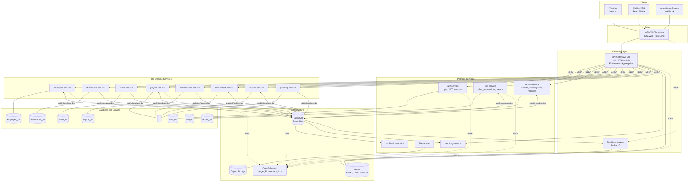

# 01 — Microservice Architecture & Technology Stack

---

## 1. Architectural Style: Domain-Based Microservices

### 1.1 The Decision

The system is built as a **set of independent services**, one per HR domain, each
with **its own database**, its own deployment cycle, and its own scaling.
Services communicate through **asynchronous events (RabbitMQ)** as the primary
path and **synchronous gRPC** only for reads that cannot be deferred.

### 1.2 Consequences to Be Managed, Not Ignored

Microservices move complexity out of code and into infrastructure and
operations. The four largest consequences for an HRIS domain, and how this
blueprint handles them:

| Consequence | Why it is hard in an HRIS | Handling |
|-------------|---------------------------|----------|
| **No ACID transactions across services** | Payroll needs employee + attendance + leave in one calculation | Saga with compensation + a data snapshot at calculation time (§4, doc 03 §5) |
| **Data duplicated across services** | Every service needs to know an employee's name and status | A local read replica (`employee_ref`) synchronised by events, not a cross-database JOIN (doc 02 §3) |
| **Consistency becomes eventual** | "Employee resigned" can be visible in HR but not yet in Payroll for a few seconds | A < 5 second propagation SLA + a validation gate before critical operations (§4.3) |
| **Debugging spread across 12 services** | One user click touches 5 services | Mandatory correlation IDs + OpenTelemetry distributed tracing from day one (§7) |

> A rule binding on the whole team: **no service may access another service's
> database**, under any circumstances, including "just for a report" and "just
> temporarily". Breaking it turns microservices into a distributed monolith —
> the worst architecture of the two. Enforcement is technical: one service's
> database credentials are never shared with another.

### 1.3 Architecture Diagram



---

## 2. Service Catalogue

### 2.1 Platform Services (mandatory, unrelated to subscription)

| Service | Responsibility | Database | Main events published |
|---------|---------------|----------|----------------------|
| `api-gateway` | Single entry point. JWT validation, `X-Tenant-ID` enforcement, entitlement checks, response aggregation for the UI, rate limiting | — (stateless) | — |
| `auth-service` | Login with `tenantCode + email + password`, token issue & rotation, sessions, password reset, account lockout | `auth_db` | `auth.user.logged_in`, `auth.session.revoked` |
| `iam-service` | Roles, permissions, menus, per-user grants, effective access resolution (see doc 05) | `iam_db` | `iam.access.changed`, `iam.role.assigned` |
| `tenant-service` | Tenant data, subscription plans, module activation/deactivation, quotas, tenant lifecycle | `tenant_db` | `tenant.provisioned`, `tenant.module.enabled`, `tenant.suspended` |
| `notification-service` | Email, push, WhatsApp, in-app notifications. Purely an event consumer | `notification_db` | `notification.sent` |
| `file-service` | Upload/download, presigned URLs, virus scanning, thumbnails. For purpose `ATTENDANCE_PHOTO`: EXIF stripping is mandatory + scheduled purge according to tenant retention (doc `10` §4) | `file_db` + S3 | `file.uploaded`, `file.processed`, `file.rejected` |
| `realtime-service` | WebSocket gateway, room management, fan-out | — (Redis) | — |
| `reporting-service` | Cross-domain read model, reports, Excel/PDF export, tenant & team dashboards | `reporting_db` (CQRS) | — |

### 2.1.1 Control Plane Services (separate from the tenant plane)

| Service | Responsibility | Database | Isolation note |
|---------|---------------|----------|----------------|
| `admin-gateway` | Entry point for `admin.hrms.id`. Mandatory MFA, IP allowlist, `hrms-admin` token audience validation | — | Does not accept tenant tokens |
| `platform-service` | Global dashboard, tenant & subscription management, platform metrics, support sessions | `platform_db` | **Holds no credentials to any domain service database.** Egress NetworkPolicy allows only `tenant-service`, `platform_db`, RabbitMQ, and monitoring |

A superuser is an entity in a different plane, not a user with more permissions.
The full design — including why `BYPASSRLS` is never used — is in document `07`.

### 2.2 HR Domain Services (mapped from reference features)

| Service | Reference module | Database | Load profile |
|---------|-----------------|----------|--------------|
| `employee-service` | Internal Relation (employee database) | `employee_db` | Low, read-heavy |
| `attendance-service` | Daily Presence | `attendance_db` | **Very write-heavy** |
| `leave-service` | Leave Calendar | `leave_db` | Medium |
| `payroll-service` | Wages & Salary | `payroll_db` | **CPU-heavy, periodic** |
| `performance-service` | Employee Performance | `performance_db` | Low, seasonal |
| `recruitment-service` | Employee Recruitment | `recruitment_db` | Medium |
| `relation-service` | Internal Relation (employee issues) | `relation_db` | Low, sensitive |
| `planning-service` | RACI/DACI Matrix, FTE Table, Development Plan | `planning_db` | Low |

### 2.2.1 Expansion Services (proposed; detail and priority in document `08`)

| Service | Modules provided | Database | Phase |
|---------|-----------------|----------|-------|
| — (extension of `employee-service`) | `contract-compliance` — fixed-term contract, certificate, and permit expiry reminders | `employee_db` | F2 |
| `claim-service` | `claim` (reimbursement) + `travel` (business travel) + `loan` (employee advances) | `claim_db` | F4 |
| `onboarding-service` | `onboarding` (joining & leaving, clearance) | `onboarding_db` | F5 |
| `asset-service` | `asset` (inventory, handover) | `asset_db` | F5 |
| `hse-service` | `hse` (health & safety: incidents, HIRADC, inspections) | `hse_db` | F6 |
| `training-service` | `training` (training history, certification) | `training_db` | F6 |
| — (extension of `attendance-service`) | `roster-planning` — advanced shift scheduling | `attendance_db` | Under review |

**Principle for adding a service:** a new service is created only when its domain
has its own lifecycle and its own language. If the data already lives in another
service and separating it only produces gRPC calls back and forth, choose an
extension — that is why `contract-compliance` and `roster-planning` are not
services of their own.

If every Group A and B proposal is built, the service count reaches **24**. That
crosses the threshold where the Platform/SRE ratio needs revisiting (document
`08`, §7.2).

**Justification for the service boundaries:** boundaries follow *bounded
contexts* and **scaling profiles**, not feature names.
`attendance-service` is separate because its write volume differs from the others
by two orders of magnitude (thousands of punches per minute versus dozens).
`payroll-service` is separate because its CPU load spikes (idle for 29 days, full
for one) so it must scale independently. Conversely, RACI/DACI, FTE, and the
Development Plan are merged into `planning-service` because all three share the
same concepts (activities, roles, targets) and none is large enough to stand
alone — splitting them would only add operational cost with no benefit.

### 2.3 Standard Anatomy of a Service

Every service has an identical structure so that developers can move between
services without relearning the layout.

```
services/payroll-service/
├── src/
│   ├── domain/                 # entities, value objects, pure business rules (no I/O)
│   ├── application/            # use cases, command/query handlers, sagas
│   ├── infrastructure/
│   │   ├── persistence/        # Prisma repositories, migrations
│   │   ├── messaging/          # outbox publisher, event consumers
│   │   ├── grpc/               # clients to other services
│   │   └── replica/            # read-only projections from other services' events
│   ├── presentation/
│   │   ├── http/               # REST controllers (called by the gateway)
│   │   └── grpc/               # gRPC server (called by other services)
│   └── main.ts
├── prisma/schema.prisma
├── proto/payroll.proto         # gRPC contract
├── contracts/events.ts         # schemas of published events (Zod)
├── Dockerfile
├── helm/
└── service.manifest.ts         # metadata: modules, permissions, menus, events
```

---

## 3. Inter-Service Communication

### 3.1 Choosing the Path

```
Need an answer NOW to continue the user's request?
├── YES → synchronous gRPC (with timeout, retry, circuit breaker)
│         Example: the gateway asking iam-service for effective permissions
└── NO  → asynchronous event via RabbitMQ
          Example: payroll telling notification that a payslip was issued
```

**The default is asynchronous.** Every gRPC call adds one failure point and one
latency penalty to the critical path. A synchronous call must be justified, not
assumed.

Only four synchronous gRPC calls are **permitted** in this design:

| Caller | Target | Why it cannot be asynchronous |
|--------|--------|------------------------------|
| `api-gateway` → `auth-service` | Session & token validation | Blocks the request |
| `api-gateway` → `iam-service` | Effective permissions & menus | Decides this request's permissions |
| `api-gateway` → `tenant-service` | Tenant status & active modules | Decides whether the request is allowed |
| `payroll-service` → `attendance-service` | Period attendance summary at calculation time | The data must be consistent at the point of calculation |

The first three are aggressively cached in Redis (TTL 60–300 seconds) with
event-based invalidation, so in practice the gateway rarely makes a real call.

### 3.2 gRPC Contract

```protobuf
// services/attendance-service/proto/attendance.proto
syntax = "proto3";
package attendance.v1;

service AttendanceQuery {
  // Called by payroll-service during calculation. Idempotent, read-only.
  rpc GetPeriodSummary (GetPeriodSummaryRequest) returns (GetPeriodSummaryResponse);
  rpc GetPeriodStatus  (GetPeriodStatusRequest)  returns (GetPeriodStatusResponse);
}

message GetPeriodSummaryRequest {
  string tenant_id    = 1;   // REQUIRED on every RPC; validated server-side
  string period_start = 2;   // ISO-8601
  string period_end   = 3;
  repeated string employee_ids = 4;  // empty = all active employees
  string correlation_id = 5;
}

message EmployeePeriodSummary {
  string employee_id       = 1;
  double working_days      = 2;
  double present_days      = 3;
  double absent_days       = 4;
  int32  late_minutes      = 5;
  int32  overtime_minutes  = 6;
  string computed_at       = 7;
}

message GetPeriodSummaryResponse {
  repeated EmployeePeriodSummary summaries = 1;
  bool   period_locked = 2;   // payroll refuses to run when false
  string snapshot_id   = 3;   // reference for audit and deterministic recalculation
}
```

### 3.3 Resilience of Synchronous Calls

Every gRPC client is wrapped in a resilience pattern. Without it, one slow
service drags the whole system down.

```typescript
// packages/shared/src/grpc/resilient-client.ts
export function createResilientClient<T>(opts: ClientOptions): T {
  const breaker = new CircuitBreaker(opts.call, {
    timeout: opts.timeoutMs ?? 3_000,       // hard limit per call
    errorThresholdPercentage: 50,           // open the circuit above 50% failures
    resetTimeout: 30_000,                   // try closing after 30 seconds
    volumeThreshold: 10,
  });

  breaker.fallback((req, err) => {
    metrics.increment('grpc.fallback', { service: opts.serviceName });
    if (opts.fallback) return opts.fallback(req, err);
    throw new ServiceUnavailableException(
      `${opts.serviceName} is unavailable. Please try again shortly.`);
  });

  breaker.on('open', () => {
    logger.error({ service: opts.serviceName }, 'circuit breaker OPEN');
    alerts.fire('CIRCUIT_OPEN', { service: opts.serviceName });
  });

  return withRetry(breaker, {
    attempts: 3,
    // Only retry errors that are safe to repeat. Retrying FAILED_PRECONDITION
    // just wastes resources, because the result will be identical.
    retryOn: [Status.UNAVAILABLE, Status.DEADLINE_EXCEEDED, Status.RESOURCE_EXHAUSTED],
    backoff: 'exponential-jitter',
  });
}
```

**Tiered timeout rule** — the caller's timeout must exceed the total timeout of
what it calls, otherwise the result is a confusing cascade of failures:

```
HTTP client (browser)       30 s
└── api-gateway             25 s
    └── payroll-service     20 s
        └── attendance gRPC  8 s
            └── DB query      5 s
```

### 3.4 Mandatory Context Propagation

Every inter-service call — gRPC or event — **must** carry five pieces of
metadata. An interceptor adds them automatically; the receiving service rejects
requests without them.

```typescript
// packages/shared/src/context/propagation.ts
export interface ServiceContext {
  tenantId:      string;   // X-Tenant-ID — the tenant discriminator system-wide
  correlationId: string;   // ties together the whole trace of one user action
  causationId:   string;   // ID of the message/request that directly triggered this
  actorId:       string;   // a user, or 'system'
  traceparent:   string;   // W3C Trace Context for OpenTelemetry
}

export const contextInterceptor: Interceptor = (opts, next) => {
  const ctx = ServiceContextStore.get();
  if (!ctx?.tenantId) {
    throw new Error('CONTEXT_MISSING: inter-service call without tenant context');
  }
  const meta = new Metadata();
  meta.set('x-tenant-id',      ctx.tenantId);
  meta.set('x-correlation-id', ctx.correlationId);
  meta.set('x-causation-id',   ctx.causationId);
  meta.set('x-actor-id',       ctx.actorId);
  meta.set('traceparent',      ctx.traceparent);
  return next(opts, meta);
};
```

---

## 4. Cross-Service Data Consistency

### 4.1 The Problem: Every Service Needs Employee Data

Ten services need an employee's name, staff number, and status. Without
cross-database JOINs there are three options — and only one is viable:

| Approach | Verdict |
|----------|---------|
| gRPC to `employee-service` every time a name is needed | **Rejected.** Showing 500 attendance rows triggers 500 calls; `employee-service` becomes a single point of failure for the whole system |
| A shared database for employee data | **Rejected.** Destroys service boundaries |
| **A local read replica synchronised by events** | **Chosen** |

### 4.2 The Read Replica Pattern

Each service holds an `employee_ref` table in its own database — containing
**only the fields it actually uses** — updated by events from
`employee-service`.

```sql
-- Exists in attendance_db, leave_db, payroll_db, etc. — each with its own version
CREATE TABLE employee_ref (
  employee_id     uuid PRIMARY KEY,
  tenant_id       uuid NOT NULL,
  employee_number text NOT NULL,
  full_name       text NOT NULL,
  org_unit_id     uuid,
  position_title  text,
  manager_id      uuid,
  state           text NOT NULL,          -- ACTIVE / RESIGNED / TERMINATED
  hire_date       date NOT NULL,
  termination_date date,

  -- Synchronisation metadata: the key to detecting a stale replica
  source_version  bigint NOT NULL,        -- version from employee-service
  synced_at       timestamptz NOT NULL DEFAULT now()
);
CREATE INDEX idx_employee_ref_tenant ON employee_ref (tenant_id, state);
CREATE INDEX idx_employee_ref_stale  ON employee_ref (synced_at);
```

```typescript
// services/payroll-service/src/infrastructure/replica/employee-replica.consumer.ts
@EventHandler(['employee.created', 'employee.updated', 'employee.terminated'])
export class EmployeeReplicaConsumer extends IdempotentConsumer<EmployeeChangedEvent> {
  readonly consumerName = 'payroll.employee-replica';

  protected async execute(e: EmployeeChangedEvent, tx: Prisma.TransactionClient) {
    await tx.$executeRaw`
      INSERT INTO employee_ref (employee_id, tenant_id, employee_number, full_name,
                                org_unit_id, position_title, manager_id, state,
                                hire_date, termination_date, source_version, synced_at)
      VALUES (${e.employeeId}::uuid, ${e.tenantId}::uuid, ${e.employeeNumber}, ${e.fullName},
              ${e.orgUnitId}::uuid, ${e.positionTitle}, ${e.managerId}::uuid, ${e.state},
              ${e.hireDate}::date, ${e.terminationDate}::date, ${e.version}, now())
      ON CONFLICT (employee_id) DO UPDATE SET
        employee_number  = EXCLUDED.employee_number,
        full_name        = EXCLUDED.full_name,
        org_unit_id      = EXCLUDED.org_unit_id,
        position_title   = EXCLUDED.position_title,
        manager_id       = EXCLUDED.manager_id,
        state            = EXCLUDED.state,
        termination_date = EXCLUDED.termination_date,
        source_version   = EXCLUDED.source_version,
        synced_at        = now()
      -- Events can arrive out of order. An old version must not overwrite a new one.
      WHERE employee_ref.source_version < EXCLUDED.source_version`;
  }
}
```

### 4.3 Handling Eventual Consistency Explicitly

A replica can be stale. For ordinary operations (showing a name in an attendance
list) a few seconds of lag means nothing. For critical operations (calculating
pay) a stale replica means paying someone who has resigned.

So **critical operations verify synchronously** while ordinary ones do not:

```typescript
// services/payroll-service/src/application/payroll-run.usecase.ts
async validateBeforeRun(tenantId: string, periodMonth: string) {
  // 1. Check overall replica freshness
  const staleness = await this.prisma.$queryRaw<[{ lag_seconds: number }]>`
    SELECT EXTRACT(EPOCH FROM (now() - MIN(synced_at)))::int AS lag_seconds
      FROM employee_ref WHERE tenant_id = ${tenantId}::uuid AND state = 'ACTIVE'`;

  if (staleness[0].lag_seconds > 300) {
    throw new PreconditionFailedException(
      'Employee data is not fully synchronised. Payroll is deferred until it is.');
  }

  // 2. Synchronous verification for the employees about to be paid — this must not be wrong
  const localIds = await this.repo.activeEmployeeIds(tenantId);
  const authoritative = await this.employeeClient.verifyActiveEmployees({
    tenantId, employeeIds: localIds, asOf: endOfMonth(periodMonth),
  });

  const drift = symmetricDifference(localIds, authoritative.activeIds);
  if (drift.length > 0) {
    // Not merely a warning: force reconciliation before continuing
    await this.reconcileReplica(tenantId, drift);
    throw new ConflictException({
      code: 'REPLICA_DRIFT',
      message: `${drift.length} employees are out of sync. The replica has been repaired; run again.`,
      affectedEmployees: drift,
    });
  }
}
```

### 4.4 Scheduled Reconciliation

Events can be lost even with an outbox — for instance because of a bug in a
consumer that acknowledges too early. So every service runs periodic
reconciliation:

```typescript
// Every night at 02:00 (with per-tenant jitter)
@Cron('0 2 * * *')
async reconcileEmployeeReplica() {
  for (const tenantId of await this.tenants.activeIds()) {
    // employee-service returns a checksum, not the whole dataset
    const upstream = await this.employeeClient.getChecksum({ tenantId });
    const local    = await this.computeLocalChecksum(tenantId);

    if (upstream.checksum !== local.checksum) {
      this.logger.warn({ tenantId }, 'replica drifted, running full resync');
      metrics.increment('replica.drift.detected', { service: 'payroll', tenant: tenantId });
      await this.fullResync(tenantId);       // paginated, batches of 500
    }
  }
}
```

A non-zero `replica.drift.detected` is a signal of a bug in the event path, not a
normal condition. Alert threshold: > 0 occurrences per week.

---

## 5. API Gateway & Subscription-Based Menu Ingestion

### 5.1 Gateway Responsibilities

```
Incoming request
  ├─ 1. Rate limit per IP and per tenant
  ├─ 2. Validate JWT (signature, expiry, `hrms-api` audience, active session)
  │      → a superuser token (aud `hrms-admin`) is structurally rejected here
  ├─ 3. Validate X-Tenant-ID against the token's tenant claim  → 403 on mismatch
  ├─ 4. Check tenant status (ACTIVE/SUSPENDED)                 → 403 if suspended
  ├─ 5. Check module entitlement for this route                → 402 if not subscribed
  ├─ 6. Check permission for this route                        → 403 if not permitted
  ├─ 7. Inject context (X-Tenant-ID, correlation, actor) into the target service
  └─ 8. Forward / aggregate the response
```

Steps 5 and 6 are the **core of the requirement**: the frontend renders only the
menus matching a subscription, but the real decision is made here. A frontend
modified by the user gains nothing.

### 5.2 Route → Module → Permission Map

```typescript
// services/api-gateway/src/routing/route-manifest.ts
export const ROUTE_MANIFEST: RouteRule[] = [
  // { route pattern, target service, module that must be subscribed, minimum permission }
  { method: 'GET',  path: '/api/employees',        service: 'employee',   module: 'core.organization', permission: 'org.employee.read.self' },
  { method: 'POST', path: '/api/employees',        service: 'employee',   module: 'core.organization', permission: 'org.employee.create' },
  { method: 'GET',  path: '/api/attendance/daily', service: 'attendance', module: 'attendance',        permission: 'attendance.record.read.self' },
  { method: 'POST', path: '/api/attendance/punch', service: 'attendance', module: 'attendance',        permission: 'attendance.punch.create' },
  { method: 'GET',  path: '/api/leave/requests',   service: 'leave',      module: 'leave',             permission: 'leave.request.read.self' },
  { method: 'POST', path: '/api/leave/requests/:id/approve', service: 'leave', module: 'leave',        permission: 'leave.request.approve' },
  { method: 'POST', path: '/api/payroll/runs',     service: 'payroll',    module: 'payroll',           permission: 'payroll.run.create' },
  { method: 'POST', path: '/api/payroll/runs/:id/approve', service: 'payroll', module: 'payroll',      permission: 'payroll.run.approve' },
  { method: 'GET',  path: '/api/payroll/payslips', service: 'payroll',    module: 'payroll',           permission: 'payroll.payslip.read.self' },
  { method: 'GET',  path: '/api/recruitment/jobs', service: 'recruitment',module: 'recruitment',       permission: 'recruitment.requisition.read' },

  // Dashboards: three different scopes, three different permissions (doc 07 §5.1)
  { method: 'GET',  path: '/api/dashboard/tenant', service: 'reporting', module: 'core.organization', permission: 'dashboard.tenant.view' },
  { method: 'GET',  path: '/api/dashboard/team',   service: 'reporting', module: 'core.organization', permission: 'dashboard.team.view' },
  { method: 'GET',  path: '/api/dashboard/me',     service: 'reporting', module: 'core.organization', permission: 'dashboard.self.view' },

  // ... every route is registered; a route without an entry here is DENIED by default
];
```

> **Default deny.** A route not in the manifest returns 404 rather than being
> forwarded. Adding a new endpoint without registering it here fails the
> integration tests — "forgot to protect the endpoint" is not an available
> failure mode.

### 5.3 Gateway Guard

```typescript
// services/api-gateway/src/guards/entitlement.guard.ts
@Injectable()
export class EntitlementGuard implements CanActivate {
  async canActivate(ctx: ExecutionContext): Promise<boolean> {
    const req  = ctx.switchToHttp().getRequest();
    const rule = matchRoute(ROUTE_MANIFEST, req.method, req.routerPath);
    if (!rule) throw new NotFoundException();

    const { tenantId, userId } = req.ctx;

    // Entitlement: does the tenant subscribe to this module?
    const subscription = await this.subscriptionCache.get(tenantId);   // Redis, TTL 60 s
    const mod = subscription.modules[rule.module];

    if (!mod?.enabled) {
      throw new PaymentRequiredException({
        code: 'MODULE_NOT_SUBSCRIBED',
        module: rule.module,
        message: `The ${rule.module} module is not part of your subscription.`,
        upgradeUrl: `/settings/subscription?highlight=${rule.module}`,
      });
    }
    if (mod.expiresAt && new Date(mod.expiresAt) < new Date()) {
      throw new PaymentRequiredException({ code: 'MODULE_EXPIRED', module: rule.module });
    }

    // Permission: is this user allowed?
    const access = await this.accessCache.get(tenantId, userId);       // from iam-service
    if (!access.permissions.includes(rule.permission)) {
      throw new ForbiddenException({ code: 'PERMISSION_DENIED', required: rule.permission });
    }

    req.ctx.entitlement = mod;
    return true;
  }
}
```

### 5.4 Bootstrap Endpoint for the Frontend

The frontend calls one endpoint on load and receives everything it needs to
render the shell.

```typescript
// GET /api/me/bootstrap
{
  "user": { "id": "...", "fullName": "Sari Wijaya", "employeeId": "...", "avatarUrl": null },
  "tenant": { "id": "...", "code": "ACME", "name": "PT Acme Indonesia",
              "timezone": "Asia/Jakarta", "logoUrl": "..." },
  "subscription": {
    "plan": "ADVANCED",
    "modules": [
      { "key": "core.organization", "enabled": true,  "expiresAt": null },
      { "key": "attendance",        "enabled": true,  "expiresAt": "2027-08-17T00:00:00Z" },
      { "key": "leave",             "enabled": true,  "expiresAt": "2027-08-17T00:00:00Z" },
      { "key": "performance",       "enabled": true,  "expiresAt": "2027-08-17T00:00:00Z" },
      { "key": "payroll",           "enabled": true,  "expiresAt": "2027-08-17T00:00:00Z" },
      { "key": "planning",          "enabled": true,  "expiresAt": "2027-08-17T00:00:00Z" },
      { "key": "relation",          "enabled": true,  "expiresAt": "2027-08-17T00:00:00Z" },
      { "key": "recruitment",       "enabled": false, "reason": "NOT_IN_PLAN" }
    ]
  },
  // The menu tree is already filtered: subscription x permission x per-user grant
  // (resolution follows doc 05, fn_effective_menus)
  "menus": [
    { "key": "dashboard", "label": "Dashboard", "icon": "Home", "path": "/", "children": [] },
    { "key": "attendance", "label": "Kehadiran", "icon": "Clock", "children": [
        { "key": "attendance.daily",  "label": "Presensi Harian", "path": "/attendance/daily" },
        { "key": "attendance.shifts", "label": "Jadwal Shift",    "path": "/attendance/shifts" }
    ]},
    { "key": "payroll", "label": "Penggajian", "icon": "Wallet", "children": [
        { "key": "payroll.runs",     "label": "Proses Payroll", "path": "/payroll/runs" },
        { "key": "payroll.payslips", "label": "Slip Gaji",      "path": "/payroll/payslips" }
    ]}
  ],
  // Modules not yet subscribed — sent SEPARATELY as an offer, not as menus
  "lockedModules": [
    { "key": "recruitment", "label": "Rekrutmen", "icon": "UserPlus",
      "teaser": "Kelola proses rekrutmen end-to-end", "upgradeUrl": "/settings/subscription" }
  ],
  "permissions": ["org.employee.read.all", "attendance.record.read.all", "payroll.run.create"],
  "accessVersion": 47   // for client-side cache invalidation
}
```

Separating `menus` from `lockedModules` is both a product and a security
decision: an unpurchased module stays visible as an offer (carrying the
reference product's tiering model into the application), but never sits inside
the active navigation structure, so no frontend code can mistakenly treat it as
reachable.

### 5.5 Consumption in the Frontend

```typescript
// apps/web/src/lib/access/access-provider.tsx
'use client';
export function AccessProvider({ children }: { children: ReactNode }) {
  const { data, isLoading } = useQuery({
    queryKey: ['bootstrap'],
    queryFn: () => api.get<Bootstrap>('/me/bootstrap'),
    staleTime: 5 * 60_000,
  });

  // Subscription or access changes are broadcast over WebSocket → reload bootstrap
  useRealtimeEvent(['tenant.subscription.changed', 'iam.access.changed'], () => {
    queryClient.invalidateQueries({ queryKey: ['bootstrap'] });
  });

  if (isLoading) return <AppSkeleton />;
  return <AccessContext.Provider value={data!}>{children}</AccessContext.Provider>;
}

// Dynamic module code loading: a Basic customer never downloads the Recruitment bundle
const MODULE_ROUTES: Record<string, () => Promise<any>> = {
  attendance:  () => import('@/modules/attendance'),
  leave:       () => import('@/modules/leave'),
  payroll:     () => import('@/modules/payroll'),
  performance: () => import('@/modules/performance'),
  recruitment: () => import('@/modules/recruitment'),
  relation:    () => import('@/modules/relation'),
  planning:    () => import('@/modules/planning'),
};

export function ModuleRoute({ moduleKey }: { moduleKey: string }) {
  const { subscription } = useAccess();
  const mod = subscription.modules.find((m) => m.key === moduleKey);

  // This is purely UX. The backend still refuses through EntitlementGuard.
  if (!mod?.enabled) return <ModuleUpsell moduleKey={moduleKey} />;

  const Remote = lazy(MODULE_ROUTES[moduleKey]);
  return (
    <Suspense fallback={<ModuleSkeleton />}>
      <ErrorBoundary fallback={<ModuleUnavailable moduleKey={moduleKey} />}>
        <Remote />
      </ErrorBoundary>
    </Suspense>
  );
}
```

> **A principle that must not be broken:** hiding a menu in the frontend is a
> convenience, not security. Every frontend control has a counterpart at the
> gateway. When they disagree, the gateway is right.

---

## 6. Technology Stack

### 6.1 Summary

| Layer | Choice | Version |
|-------|--------|---------|
| Language | TypeScript (strict) | 5.x |
| Frontend | Next.js (App Router) + React, packaged as a **PWA** | 15.x / 19.x |
| Service worker | Workbox | 7.x |
| Server state | TanStack Query | 5.x |
| UI | Tailwind CSS + shadcn/ui | 4.x |
| Data grid | AG Grid Community | 33.x |
| Service runtime | Node.js + NestJS (Fastify) | 22 LTS / 11.x |
| Internal RPC | gRPC + Protocol Buffers | — |
| External API | REST + OpenAPI 3.1 | — |
| ORM | Prisma | 6.x |
| Database | PostgreSQL (one logical DB per service) | 16 |
| Message broker | RabbitMQ (quorum queues) | 4.x |
| Cache / Lock / Pub-Sub | Redis | 7.x |
| Realtime | Socket.IO + Redis Streams adapter | 4.x |
| Object storage | S3-compatible / MinIO | — |
| Orchestration | Kubernetes | 1.30+ |
| Service mesh | **Not used in the early phases** (see §6.3) | — |
| Ingress | NGINX Ingress Controller | — |
| IaC | Terraform + Helm | — |
| CI/CD | GitHub Actions + Argo CD | — |
| Observability | OpenTelemetry, Jaeger, Prometheus, Grafana, Loki | — |

### 6.2 Justification of the Main Choices

**TypeScript across every service.** In a microservice architecture the biggest
gain is not productivity but **shared contracts**: the `@hrms/contracts` package
holds event schemas (Zod) and types generated from `.proto`, published as a
versioned npm package. When `employee-service` changes an event's shape,
consuming services fail to compile when they bump the package version —
integration mistakes are caught in CI, not in production at two in the morning.

**gRPC for internal communication.** Protobuf gives a machine-verifiable contract
and automatic breaking-change detection (`buf breaking`). Binary payloads are
~40% smaller and serialise far faster than JSON — significant for
`payroll-service` fetching a summary for 10,000 employees in one call.

**PostgreSQL, one logical database per service.** At early scale all databases
can live in one PostgreSQL cluster with separate *databases* and **a different
role per service**. Isolation is enforced by grants: `payroll_user` holds no
`GRANT` at all into `attendance_db`. This gives full logical isolation at the
infrastructure cost of a single cluster, and physical separation later needs only
a connection string change.

**RabbitMQ as the backbone.** In microservices the event bus is not a supplement
but the primary communication path. Quorum queues replicate to 3 nodes; publisher
confirms and manual acks give delivery guarantees; topic exchanges give per-tenant
and per-module routing. Kafka was considered and rejected: HRIS volumes (thousands
of events per minute) do not need it, while its operational cost is high for a
team already carrying 16 services.

**Progressive Web App for the tenant application.** `app.hrms.id` is packaged as
a PWA: installable to the home screen, partially functional offline, and able to
receive Web Push. This gives mobile reach from Phase 1 without waiting for a
native app, and narrows the React Native ESS scope to only the capabilities the
web genuinely lacks — a reliable offline queue, mock GPS detection, and iOS push.
The global dashboard (`admin.hrms.id`) is **deliberately not** a PWA: the control
plane uses the strictest CSP and needs no offline mode, so a service worker would
only add attack surface. Details, platform limits, and the web attendance trust
score adjustments are in document `11`.

**Kubernetes.** With 16 services, manual orchestration is unrealistic. K8s
provides service discovery (internal DNS), health checks, rolling updates,
autoscaling, and secret management. HPA is configured differently per service
according to its load profile: `attendance-service` scales on CPU and queue
depth, `payroll-service` on queue depth alone (because it is idle most of the
time).

### 6.3 Deliberately **Not** Used in the Early Phases

| Technology | Why deferred |
|------------|--------------|
| Service mesh (Istio/Linkerd) | mTLS, retries, and circuit breaking are already handled in the application layer. Adding a mesh early adds a failure domain nobody yet knows how to debug. Revisited in Phase 5. |
| Kafka | The volume does not require it; RabbitMQ suffices |
| GraphQL federation | A BFF gateway with manual aggregation is simpler and easier to cache for access patterns that are already known |
| Full CQRS everywhere | Only `reporting-service` applies CQRS. Applying it everywhere doubles complexity with no benefit |
| Event sourcing | Rejected. Auditing is already handled by `audit_logs`; event sourcing adds a large cognitive load for a domain that does not need arbitrary historical state reconstruction |

---

## 7. Observability: A Prerequisite, Not an Extra

In a monolith, `console.log` can carry you a long way. Across 16 services, a
system without distributed tracing is practically undebuggable. So observability
is built in Sprint 1, before the first domain service is written.

### 7.1 The Three Pillars

```typescript
// packages/shared/src/observability/setup.ts
export function setupObservability(serviceName: string) {
  const sdk = new NodeSDK({
    resource: new Resource({
      [SemanticResourceAttributes.SERVICE_NAME]: serviceName,
      [SemanticResourceAttributes.SERVICE_VERSION]: process.env.APP_VERSION,
      [SemanticResourceAttributes.DEPLOYMENT_ENVIRONMENT]: process.env.NODE_ENV,
    }),
    traceExporter: new OTLPTraceExporter({ url: process.env.OTEL_ENDPOINT }),
    instrumentations: [
      new HttpInstrumentation(), new GrpcInstrumentation(),
      new PgInstrumentation(),   new AmqplibInstrumentation(),
      new IORedisInstrumentation(),
    ],
  });
  sdk.start();

  // Every log line carries tenant and correlation — without it, logs from 16
  // services cannot be correlated at all
  logger.addHook((log) => {
    const ctx = ServiceContextStore.get();
    return { ...log, service: serviceName, tenantId: ctx?.tenantId,
             correlationId: ctx?.correlationId, traceId: trace.getActiveSpan()?.spanContext().traceId };
  });
}
```

### 7.2 Mandatory Metrics per Service

| Metric | Type | Purpose |
|--------|------|---------|
| `http_request_duration_seconds{service,route,status}` | Histogram | Latency SLO |
| `grpc_client_duration_seconds{caller,callee,method}` | Histogram | Detecting slow services |
| `circuit_breaker_state{service,target}` | Gauge | Detecting cascading failures |
| `event_publish_total{service,event_type}` | Counter | Production side |
| `event_consume_duration_seconds{service,event_type}` | Histogram | Consumption side |
| `outbox_pending_age_seconds{service}` | Gauge | Health of the event path |
| `replica_lag_seconds{service,replica}` | Gauge | Cross-service data freshness |
| `saga_step_total{saga,step,outcome}` | Counter | Health of distributed transactions |

### 7.3 Tiered Health Checks

```typescript
// Every service exposes three endpoints with different meanings
@Get('/health/live')     // Is the process alive? → K8s restarts on failure
liveness() { return { status: 'ok' }; }

@Get('/health/ready')    // Ready for traffic? → K8s removes it from the load balancer on failure
async readiness() {
  const checks = await Promise.allSettled([
    this.db.$queryRaw`SELECT 1`,
    this.amqp.checkConnection(),
    this.redis.ping(),
  ]);
  const failed = checks.filter((c) => c.status === 'rejected');
  if (failed.length) throw new ServiceUnavailableException({ failed: failed.length });
  return { status: 'ready' };
}

@Get('/health/deps')     // Human diagnostics; NOT used by K8s
async dependencies() {
  // A dead downstream dependency must not pull this service out of the load
  // balancer — circuit breakers already handle degradation. This is information only.
  return { employee: await this.probe('employee'), attendance: await this.probe('attendance') };
}
```

---

## 8. Deployment & Environments

### 8.1 Repository: Monorepo with Independent Deploys

One repository (`pnpm workspaces` + Turborepo) holds every service. Each service
has its own deploy pipeline, triggered only when its directory or a shared
package changes.

**Justification:** polyrepo for 16 services with one team means 16 CI pipelines
that must be kept in step, and shared contract changes spread across many PRs. A
monorepo keeps contract changes atomic while deploys stay independent — taking
the advantage of both.

```yaml
# .github/workflows/deploy-service.yml (abridged)
name: deploy
on:
  push:
    branches: [main]
jobs:
  changes:
    runs-on: ubuntu-latest
    outputs: { services: ${{ steps.filter.outputs.changes }} }
    steps:
      - uses: dorny/paths-filter@v3
        id: filter
        with:
          filters: |
            payroll:    ['services/payroll-service/**', 'packages/shared/**', 'packages/contracts/**']
            attendance: ['services/attendance-service/**', 'packages/shared/**', 'packages/contracts/**']
            employee:   ['services/employee-service/**', 'packages/shared/**', 'packages/contracts/**']
            # ...

  deploy:
    needs: changes
    if: ${{ needs.changes.outputs.services != '[]' }}
    strategy:
      matrix: { service: ${{ fromJSON(needs.changes.outputs.services) }} }
    runs-on: ubuntu-latest
    steps:
      - run: pnpm --filter ${{ matrix.service }}-service test
      - run: pnpm buf breaking --against '.git#branch=main'   # gRPC contracts must not break
      - run: pnpm migration:lint services/${{ matrix.service }}-service/prisma/migrations/**/migration.sql
      - run: pnpm migration:compat-check                     # new schema + previous code version
      - run: docker build -t $REGISTRY/${{ matrix.service }}:$SHA services/${{ matrix.service }}-service
      - run: docker push $REGISTRY/${{ matrix.service }}:$SHA
      - run: argocd app set ${{ matrix.service }} --helm-set image.tag=$SHA
```

### 8.2 Version Compatibility Between Services

In microservices, two versions of a service run side by side during a rolling
update. Therefore:

1. **gRPC contracts may only evolve additively.** `buf breaking` fails CI when a
   field is removed or its type changes.
2. **Events carry an explicit version.** A breaking change publishes `v2` and
   **both versions are published in parallel** for at least one release cycle.
3. **Database migrations are additive and non-destructive.** Add a column → dual
   write → backfill → read the new column → deprecation ladder. No `DROP TABLE`,
   `TRUNCATE`, `RENAME`, or `DROP DATABASE` in production; a column is released
   only through an archived procedure with two approvals. The full rules, safe
   `ALTER` recipes, and the migration linter are in document `09`.

> The consequence that makes this rule operationally valuable rather than merely
> tidy: **a schema that is always additive makes an application rollback always
> safe.** Deploy and migration become two things that can be reversed
> independently — a property that is very expensive to lose in an 18-service
> system.

### 8.3 Resources per Service (production baseline)

| Service | Replicas | CPU (req/limit) | Memory (req/limit) | Autoscale trigger |
|---------|----------|-----------------|--------------------|-------------------|
| `api-gateway` | 3–10 | 200m / 1000m | 256Mi / 512Mi | CPU 70% |
| `auth-service` | 2–4 | 100m / 500m | 256Mi / 512Mi | CPU 70% |
| `iam-service` | 2–4 | 100m / 500m | 256Mi / 512Mi | CPU 70% |
| `employee-service` | 2–4 | 200m / 1000m | 512Mi / 1Gi | CPU 70% |
| `attendance-service` | 3–12 | 300m / 1500m | 512Mi / 1Gi | CPU + queue depth |
| `leave-service` | 2–4 | 100m / 500m | 256Mi / 512Mi | CPU 70% |
| `payroll-service` | 2–8 | 500m / 2000m | 1Gi / 2Gi | Queue depth only |
| `realtime-service` | 3–8 | 200m / 800m | 512Mi / 1Gi | Connection count |
| `reporting-service` | 2–6 | 300m / 1500m | 1Gi / 2Gi | Queue depth |
| Others | 2 | 100m / 500m | 256Mi / 512Mi | CPU 70% |

### 8.4 Environments

| Environment | Infrastructure | Data |
|-------------|---------------|------|
| `local` | Docker Compose — every service + Postgres + RabbitMQ + Redis in one command | Synthetic |
| `dev` | K8s namespace, auto-deployed from `main` | Synthetic |
| `staging` | K8s namespace, a small-scale production replica | Anonymised |
| `production` | K8s, multi-AZ | Real |

Developer experience is a real risk in microservices: if running the system
locally takes 20 minutes and 16 GB of RAM, productivity collapses. So
`docker-compose.dev.yml` provides a mode where **the service being worked on runs
locally and the rest use registry images**, so a developer actively runs only 2–3
services.
