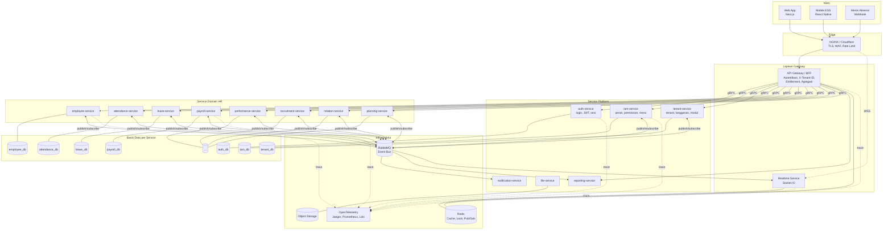

# 01 — Arsitektur Microservices & Tumpukan Teknologi

---

## 1. Gaya Arsitektur: Microservices Berbasis Domain

### 1.1 Keputusan

Sistem dibangun sebagai **kumpulan service independen**, satu service per domain HR, masing-masing dengan **basis data sendiri**, siklus deploy sendiri, dan skala sendiri. Komunikasi antar-service dilakukan melalui **event asinkron (RabbitMQ)** sebagai jalur utama dan **gRPC sinkron** hanya untuk pembacaan yang tidak dapat ditunda.

### 1.2 Konsekuensi yang Harus Dikelola, Bukan Diabaikan

Microservices memindahkan kompleksitas dari kode ke infrastruktur dan operasi. Empat konsekuensi terbesar untuk domain HRIS, beserta cara penanganannya di cetak biru ini:

| Konsekuensi | Mengapa berat di HRIS | Penanganan |
|-------------|----------------------|------------|
| **Tidak ada transaksi ACID lintas service** | Payroll butuh employee + attendance + leave dalam satu perhitungan | Saga dengan kompensasi + snapshot data pada saat kalkulasi (§4, dok. 03 §5) |
| **Data terduplikasi antar service** | Setiap service butuh tahu nama & status karyawan | Replika baca lokal (`employee_ref`) yang disinkronkan event, bukan JOIN lintas DB (dok. 02 §3) |
| **Konsistensi menjadi eventual** | "Karyawan resign" bisa terlihat di HR tapi belum di Payroll selama beberapa detik | Kontrak SLA propagasi < 5 detik + gerbang validasi sebelum operasi kritis (§4.3) |
| **Debugging tersebar di 12 service** | Satu klik pengguna menyentuh 5 service | Correlation ID wajib + distributed tracing OpenTelemetry sejak hari pertama (§7) |

> Aturan yang mengikat seluruh tim: **tidak ada service yang boleh mengakses basis data service lain**, dalam keadaan apa pun, termasuk "hanya untuk laporan" dan "hanya sementara". Pelanggaran aturan ini mengubah microservices menjadi monolit terdistribusi — bentuk arsitektur terburuk dari keduanya. Penegakannya bersifat teknis: kredensial basis data satu service tidak pernah dibagikan ke service lain.

### 1.3 Diagram Arsitektur



---

## 2. Katalog Service

### 2.1 Service Platform (wajib, tidak terkait langganan)

| Service | Tanggung jawab | Basis data | Publikasi event utama |
|---------|----------------|------------|----------------------|
| `api-gateway` | Titik masuk tunggal. Validasi JWT, penegakan `X-Tenant-ID`, pemeriksaan entitlement, agregasi respons untuk UI, rate limit | — (stateless) | — |
| `auth-service` | Login dengan `tenantCode + email + password`, penerbitan & rotasi token, sesi, reset password, kunci akun | `auth_db` | `auth.user.logged_in`, `auth.session.revoked` |
| `iam-service` | Peran, permission, menu, grant per-pengguna, resolusi akses efektif (lihat dok. 05) | `iam_db` | `iam.access.changed`, `iam.role.assigned` |
| `tenant-service` | Data tenant, paket langganan, aktivasi/penonaktifan modul, kuota, siklus hidup tenant | `tenant_db` | `tenant.provisioned`, `tenant.module.enabled`, `tenant.suspended` |
| `notification-service` | Email, push, WhatsApp, notifikasi dalam aplikasi. Murni konsumer event | `notification_db` | `notification.sent` |
| `file-service` | Unggah/unduh, presigned URL, pemindaian virus, thumbnail. Tujuan `ATTENDANCE_PHOTO`: penghapusan EXIF wajib + purge terjadwal sesuai retensi tenant (dok. `10` §4) | `file_db` + S3 | `file.uploaded`, `file.processed`, `file.rejected` |
| `realtime-service` | Gateway WebSocket, manajemen room, fanout | — (Redis) | — |
| `reporting-service` | Read model lintas domain, laporan, ekspor Excel/PDF, dashboard tenant & tim | `reporting_db` (CQRS) | — |

### 2.1.1 Service Control Plane (terpisah dari tenant plane)

| Service | Tanggung jawab | Basis data | Catatan isolasi |
|---------|----------------|------------|-----------------|
| `admin-gateway` | Titik masuk `admin.hrms.id`. MFA wajib, IP allowlist, validasi audience token `hrms-admin` | — | Tidak menerima token tenant |
| `platform-service` | Dashboard global, kelola tenant & langganan, metrik platform, support session | `platform_db` | **Tidak memiliki kredensial ke basis data service domain.** NetworkPolicy egress hanya mengizinkan `tenant-service`, `platform_db`, RabbitMQ, dan monitoring |

Superuser adalah entitas di bidang berbeda, bukan pengguna dengan izin lebih banyak. Rancangan lengkapnya — termasuk alasan mengapa `BYPASSRLS` tidak pernah dipakai — ada di dokumen `07`.

### 2.2 Service Domain HR (dipetakan dari fitur referensi)

| Service | Modul referensi | Basis data | Skala beban |
|---------|-----------------|------------|-------------|
| `employee-service` | Internal Relation (employee database) | `employee_db` | Rendah, banyak dibaca |
| `attendance-service` | Daily Presence | `attendance_db` | **Tulis sangat tinggi** |
| `leave-service` | Kalender Cuti | `leave_db` | Menengah |
| `payroll-service` | Wages & Salary | `payroll_db` | **CPU tinggi, periodik** |
| `performance-service` | Employee Performance | `performance_db` | Rendah, musiman |
| `recruitment-service` | Employee Recruitment | `recruitment_db` | Menengah |
| `relation-service` | Internal Relation (employee issues) | `relation_db` | Rendah, sensitif |
| `planning-service` | RACI/DACI Matrix, FTE Table, Development Plan | `planning_db` | Rendah |

### 2.2.1 Service Ekspansi (usulan; rincian & prioritas di dokumen `08`)

| Service | Modul yang disediakan | Basis data | Fase |
|---------|----------------------|------------|------|
| — (perluasan `employee-service`) | `contract-compliance` — pengingat berakhirnya PKWT, sertifikat, izin | `employee_db` | F2 |
| `claim-service` | `claim` (reimbursement) + `travel` (SPPD) + `loan` (kasbon) | `claim_db` | F4 |
| `onboarding-service` | `onboarding` (masuk & keluar, clearance) | `onboarding_db` | F5 |
| `asset-service` | `asset` (inventaris, serah terima) | `asset_db` | F5 |
| `hse-service` | `hse` (K3: insiden, HIRADC, inspeksi) | `hse_db` | F6 |
| `training-service` | `training` (riwayat pelatihan, sertifikasi) | `training_db` | F6 |
| — (perluasan `attendance-service`) | `roster-planning` — penjadwalan shift lanjutan | `attendance_db` | Ditinjau |

**Prinsip penambahan service:** service baru dibuat hanya bila domainnya memiliki siklus hidup dan bahasa sendiri. Bila datanya sudah ada di service lain dan pemisahan hanya menghasilkan panggilan gRPC bolak-balik, pilih perluasan — itulah alasan `contract-compliance` dan `roster-planning` tidak menjadi service tersendiri.

Bila seluruh usulan Kelompok A dan B dibangun, jumlah service menjadi **24**. Itu melewati ambang di mana rasio Platform/SRE perlu ditinjau ulang (dokumen `08`, §7.2).

**Justifikasi pembagian batas service:** batas ditarik mengikuti *bounded context* dan **profil skala**, bukan sekadar nama fitur. `attendance-service` dipisah karena volume tulisnya berbeda dua orde magnitudo dari service lain (ribuan punch per menit vs puluhan). `payroll-service` dipisah karena beban CPU-nya menyentak (idle 29 hari, penuh 1 hari) sehingga penskalaannya harus independen. Sebaliknya, RACI/DACI, FTE, dan Development Plan digabung ke dalam `planning-service` karena ketiganya berbagi konsep yang sama (aktivitas, peran, target) dan tidak ada satu pun yang cukup besar untuk berdiri sendiri — memecahnya hanya menambah biaya operasi tanpa manfaat.

### 2.3 Anatomi Standar Sebuah Service

Setiap service memiliki struktur identik agar developer dapat berpindah antar service tanpa mempelajari ulang tata letak.

```
services/payroll-service/
├── src/
│   ├── domain/                 # entitas, value object, aturan bisnis murni (tanpa I/O)
│   ├── application/            # use case, command/query handler, saga
│   ├── infrastructure/
│   │   ├── persistence/        # repository Prisma, migrasi
│   │   ├── messaging/          # publisher outbox, konsumer event
│   │   ├── grpc/               # klien ke service lain
│   │   └── replica/            # proyeksi read-only dari event service lain
│   ├── presentation/
│   │   ├── http/               # controller REST (dipanggil gateway)
│   │   └── grpc/               # server gRPC (dipanggil service lain)
│   └── main.ts
├── prisma/schema.prisma
├── proto/payroll.proto         # kontrak gRPC
├── contracts/events.ts         # skema event yang dipublikasikan (Zod)
├── Dockerfile
├── helm/
└── service.manifest.ts         # metadata: modul, permission, menu, event
```

---

## 3. Komunikasi Antar-Service

### 3.1 Aturan Pemilihan Jalur

```
Butuh jawaban SEKARANG untuk melanjutkan request pengguna?
├── YA  → gRPC sinkron (dengan timeout, retry, circuit breaker)
│         Contoh: gateway menanyakan permission efektif ke iam-service
└── TIDAK → Event asinkron via RabbitMQ
          Contoh: payroll memberi tahu notification bahwa slip terbit
```

**Default adalah asinkron.** Setiap panggilan gRPC menambah satu titik kegagalan dan satu penalti latensi ke jalur kritis. Panggilan sinkron harus dibenarkan, bukan diasumsikan.

Panggilan gRPC sinkron yang **diizinkan** dalam desain ini hanya empat:

| Pemanggil | Tujuan | Alasan tidak bisa asinkron |
|-----------|--------|---------------------------|
| `api-gateway` → `auth-service` | Validasi sesi & token | Blokir request |
| `api-gateway` → `iam-service` | Permission & menu efektif | Menentukan izin request ini |
| `api-gateway` → `tenant-service` | Status tenant & modul aktif | Menentukan boleh/tidaknya request |
| `payroll-service` → `attendance-service` | Rekap absensi periode saat kalkulasi | Data harus konsisten pada titik hitung |

Ketiga panggilan pertama di-cache agresif di Redis (TTL 60–300 detik) dengan invalidasi berbasis event, sehingga dalam praktik gateway jarang benar-benar memanggil.

### 3.2 Kontrak gRPC

```protobuf
// services/attendance-service/proto/attendance.proto
syntax = "proto3";
package attendance.v1;

service AttendanceQuery {
  // Dipanggil payroll-service saat kalkulasi. Idempoten, read-only.
  rpc GetPeriodSummary (GetPeriodSummaryRequest) returns (GetPeriodSummaryResponse);
  rpc GetPeriodStatus  (GetPeriodStatusRequest)  returns (GetPeriodStatusResponse);
}

message GetPeriodSummaryRequest {
  string tenant_id    = 1;   // WAJIB pada setiap RPC; divalidasi server
  string period_start = 2;   // ISO-8601
  string period_end   = 3;
  repeated string employee_ids = 4;  // kosong = semua karyawan aktif
  string correlation_id = 5;
}

message EmployeePeriodSummary {
  string employee_id       = 1;
  double working_days      = 2;
  double present_days      = 3;
  double absent_days       = 4;
  int32  late_minutes      = 5;
  int32  overtime_minutes  = 6;
  string computed_at       = 7;
}

message GetPeriodSummaryResponse {
  repeated EmployeePeriodSummary summaries = 1;
  bool   period_locked = 2;   // payroll menolak berjalan bila false
  string snapshot_id   = 3;   // referensi untuk audit & rekalkulasi deterministik
}
```

### 3.3 Ketahanan Panggilan Sinkron

Setiap klien gRPC dibungkus pola resiliensi. Tanpa ini, satu service lambat akan menyeret seluruh sistem.

```typescript
// packages/shared/src/grpc/resilient-client.ts
export function createResilientClient<T>(opts: ClientOptions): T {
  const breaker = new CircuitBreaker(opts.call, {
    timeout: opts.timeoutMs ?? 3_000,       // batas keras per panggilan
    errorThresholdPercentage: 50,           // buka sirkuit bila > 50% gagal
    resetTimeout: 30_000,                   // coba tutup setelah 30 detik
    volumeThreshold: 10,
  });

  breaker.fallback((req, err) => {
    metrics.increment('grpc.fallback', { service: opts.serviceName });
    if (opts.fallback) return opts.fallback(req, err);
    throw new ServiceUnavailableException(
      `${opts.serviceName} tidak tersedia. Silakan coba beberapa saat lagi.`);
  });

  breaker.on('open', () => {
    logger.error({ service: opts.serviceName }, 'circuit breaker TERBUKA');
    alerts.fire('CIRCUIT_OPEN', { service: opts.serviceName });
  });

  return withRetry(breaker, {
    attempts: 3,
    // Hanya retry kesalahan yang aman diulang. Retry pada FAILED_PRECONDITION
    // hanya membuang sumber daya karena hasilnya pasti sama.
    retryOn: [Status.UNAVAILABLE, Status.DEADLINE_EXCEEDED, Status.RESOURCE_EXHAUSTED],
    backoff: 'exponential-jitter',
  });
}
```

**Aturan timeout berjenjang** — timeout pemanggil harus lebih besar dari total timeout yang dipanggil, jika tidak akan terjadi kegagalan berantai yang membingungkan:

```
Klien HTTP (browser)        30 dtk
└── api-gateway             25 dtk
    └── payroll-service     20 dtk
        └── attendance gRPC  8 dtk
            └── query DB     5 dtk
```

### 3.4 Propagasi Konteks Wajib

Setiap panggilan antar-service — gRPC maupun event — **wajib** membawa lima metadata. Interceptor menambahkannya otomatis; service yang menerima menolak request tanpa metadata ini.

```typescript
// packages/shared/src/context/propagation.ts
export interface ServiceContext {
  tenantId:      string;   // X-Tenant-ID — pembeda tenant di seluruh sistem
  correlationId: string;   // menyatukan seluruh jejak satu aksi pengguna
  causationId:   string;   // ID pesan/request yang langsung memicu ini
  actorId:       string;   // pengguna atau 'system'
  traceparent:   string;   // W3C Trace Context untuk OpenTelemetry
}

export const contextInterceptor: Interceptor = (opts, next) => {
  const ctx = ServiceContextStore.get();
  if (!ctx?.tenantId) {
    throw new Error('CONTEXT_MISSING: panggilan antar-service tanpa tenant context');
  }
  const meta = new Metadata();
  meta.set('x-tenant-id',     ctx.tenantId);
  meta.set('x-correlation-id', ctx.correlationId);
  meta.set('x-causation-id',   ctx.causationId);
  meta.set('x-actor-id',       ctx.actorId);
  meta.set('traceparent',      ctx.traceparent);
  return next(opts, meta);
};
```

---

## 4. Konsistensi Data Lintas Service

### 4.1 Masalah: Setiap Service Butuh Data Karyawan

Sepuluh service membutuhkan nama, nomor induk, dan status karyawan. Tanpa JOIN lintas basis data, ada tiga pilihan — dan hanya satu yang layak:

| Pendekatan | Verdict |
|------------|---------|
| gRPC ke `employee-service` setiap kali butuh nama | **Ditolak.** Menampilkan 500 baris absensi memicu 500 panggilan; `employee-service` menjadi titik kegagalan tunggal seluruh sistem |
| Basis data bersama untuk data karyawan | **Ditolak.** Menghancurkan batas service |
| **Replika baca lokal yang disinkronkan event** | **Dipilih** |

### 4.2 Pola Replika Baca

Setiap service memiliki tabel `employee_ref` di basis datanya sendiri — berisi **hanya field yang benar-benar dipakainya**, diperbarui oleh event dari `employee-service`.

```sql
-- Ada di attendance_db, leave_db, payroll_db, dst. — masing-masing versinya sendiri
CREATE TABLE employee_ref (
  employee_id     uuid PRIMARY KEY,
  tenant_id       uuid NOT NULL,
  employee_number text NOT NULL,
  full_name       text NOT NULL,
  org_unit_id     uuid,
  position_title  text,
  manager_id      uuid,
  state           text NOT NULL,          -- ACTIVE / RESIGNED / TERMINATED
  hire_date       date NOT NULL,
  termination_date date,

  -- Metadata sinkronisasi: kunci untuk mendeteksi replika basi
  source_version  bigint NOT NULL,        -- versi dari employee-service
  synced_at       timestamptz NOT NULL DEFAULT now()
);
CREATE INDEX idx_employee_ref_tenant ON employee_ref (tenant_id, state);
CREATE INDEX idx_employee_ref_stale  ON employee_ref (synced_at);
```

```typescript
// services/payroll-service/src/infrastructure/replica/employee-replica.consumer.ts
@EventHandler(['employee.created', 'employee.updated', 'employee.terminated'])
export class EmployeeReplicaConsumer extends IdempotentConsumer<EmployeeChangedEvent> {
  readonly consumerName = 'payroll.employee-replica';

  protected async execute(e: EmployeeChangedEvent, tx: Prisma.TransactionClient) {
    await tx.$executeRaw`
      INSERT INTO employee_ref (employee_id, tenant_id, employee_number, full_name,
                                org_unit_id, position_title, manager_id, state,
                                hire_date, termination_date, source_version, synced_at)
      VALUES (${e.employeeId}::uuid, ${e.tenantId}::uuid, ${e.employeeNumber}, ${e.fullName},
              ${e.orgUnitId}::uuid, ${e.positionTitle}, ${e.managerId}::uuid, ${e.state},
              ${e.hireDate}::date, ${e.terminationDate}::date, ${e.version}, now())
      ON CONFLICT (employee_id) DO UPDATE SET
        employee_number  = EXCLUDED.employee_number,
        full_name        = EXCLUDED.full_name,
        org_unit_id      = EXCLUDED.org_unit_id,
        position_title   = EXCLUDED.position_title,
        manager_id       = EXCLUDED.manager_id,
        state            = EXCLUDED.state,
        termination_date = EXCLUDED.termination_date,
        source_version   = EXCLUDED.source_version,
        synced_at        = now()
      -- Event bisa tiba tidak berurutan. Versi lama tidak boleh menimpa versi baru.
      WHERE employee_ref.source_version < EXCLUDED.source_version`;
  }
}
```

### 4.3 Menangani Eventual Consistency Secara Eksplisit

Replika bisa basi. Untuk operasi biasa (menampilkan nama di daftar absensi), keterlambatan beberapa detik tidak berarti. Untuk operasi kritis (menghitung gaji), replika basi berarti membayar orang yang sudah resign.

Karena itu **operasi kritis melakukan verifikasi sinkron**, sedangkan operasi biasa tidak:

```typescript
// services/payroll-service/src/application/payroll-run.usecase.ts
async validateBeforeRun(tenantId: string, periodMonth: string) {
  // 1. Periksa kesegaran replika secara umum
  const staleness = await this.prisma.$queryRaw<[{ lag_seconds: number }]>`
    SELECT EXTRACT(EPOCH FROM (now() - MIN(synced_at)))::int AS lag_seconds
      FROM employee_ref WHERE tenant_id = ${tenantId}::uuid AND state = 'ACTIVE'`;

  if (staleness[0].lag_seconds > 300) {
    throw new PreconditionFailedException(
      'Data karyawan belum tersinkronisasi penuh. Payroll ditunda hingga sinkronisasi selesai.');
  }

  // 2. Verifikasi sinkron untuk karyawan yang akan dibayar — tidak boleh salah
  const localIds = await this.repo.activeEmployeeIds(tenantId);
  const authoritative = await this.employeeClient.verifyActiveEmployees({
    tenantId, employeeIds: localIds, asOf: endOfMonth(periodMonth),
  });

  const drift = symmetricDifference(localIds, authoritative.activeIds);
  if (drift.length > 0) {
    // Bukan sekadar peringatan: paksa rekonsiliasi sebelum melanjutkan
    await this.reconcileReplica(tenantId, drift);
    throw new ConflictException({
      code: 'REPLICA_DRIFT',
      message: `${drift.length} karyawan tidak sinkron. Replika telah diperbaiki, silakan jalankan ulang.`,
      affectedEmployees: drift,
    });
  }
}
```

### 4.4 Rekonsiliasi Terjadwal

Event bisa hilang meskipun sudah ada outbox — misalnya karena bug pada konsumer yang mengirim ack terlalu dini. Karena itu setiap service menjalankan rekonsiliasi berkala:

```typescript
// Setiap malam pukul 02:00 (dengan jitter per tenant)
@Cron('0 2 * * *')
async reconcileEmployeeReplica() {
  for (const tenantId of await this.tenants.activeIds()) {
    // employee-service memberi checksum, bukan seluruh data
    const upstream = await this.employeeClient.getChecksum({ tenantId });
    const local    = await this.computeLocalChecksum(tenantId);

    if (upstream.checksum !== local.checksum) {
      this.logger.warn({ tenantId }, 'replika menyimpang, sinkronisasi penuh dijalankan');
      metrics.increment('replica.drift.detected', { service: 'payroll', tenant: tenantId });
      await this.fullResync(tenantId);       // paginasi, batch 500
    }
  }
}
```

Metrik `replica.drift.detected` yang tidak nol adalah sinyal bug pada jalur event, bukan kondisi normal. Ambang alert: > 0 kejadian per minggu.

---

## 5. API Gateway & Ingest Menu Berbasis Langganan

### 5.1 Tanggung Jawab Gateway

```
Request masuk
  ├─ 1. Rate limit per IP dan per tenant
  ├─ 2. Validasi JWT (tanda tangan, kedaluwarsa, audience `hrms-api`, sesi aktif)
  │      → token superuser (aud `hrms-admin`) ditolak di sini secara struktural
  ├─ 3. Validasi X-Tenant-ID vs klaim tenant di token  → 403 bila berbeda
  ├─ 4. Cek status tenant (ACTIVE/SUSPENDED)           → 403 bila ditangguhkan
  ├─ 5. Cek entitlement modul untuk route ini          → 402 bila belum berlangganan
  ├─ 6. Cek permission untuk route ini                 → 403 bila tidak berizin
  ├─ 7. Injeksi konteks (X-Tenant-ID, correlation, actor) ke service tujuan
  └─ 8. Teruskan / agregasi respons
```

Langkah 5 dan 6 adalah **inti dari permintaan Anda**: frontend hanya merender menu sesuai langganan, tetapi keputusan sesungguhnya dibuat di sini. Frontend yang dimodifikasi pengguna tidak mendapatkan apa pun.

### 5.2 Peta Route → Modul → Permission

```typescript
// services/api-gateway/src/routing/route-manifest.ts
export const ROUTE_MANIFEST: RouteRule[] = [
  // { pola route, service tujuan, modul yang harus dilanggan, permission minimum }
  { method: 'GET',  path: '/api/employees',        service: 'employee',   module: 'core.organization', permission: 'org.employee.read.self' },
  { method: 'POST', path: '/api/employees',        service: 'employee',   module: 'core.organization', permission: 'org.employee.create' },
  { method: 'GET',  path: '/api/attendance/daily', service: 'attendance', module: 'attendance',        permission: 'attendance.record.read.self' },
  { method: 'POST', path: '/api/attendance/punch', service: 'attendance', module: 'attendance',        permission: 'attendance.punch.create' },
  { method: 'GET',  path: '/api/leave/requests',   service: 'leave',      module: 'leave',             permission: 'leave.request.read.self' },
  { method: 'POST', path: '/api/leave/requests/:id/approve', service: 'leave', module: 'leave',        permission: 'leave.request.approve' },
  { method: 'POST', path: '/api/payroll/runs',     service: 'payroll',    module: 'payroll',           permission: 'payroll.run.create' },
  { method: 'POST', path: '/api/payroll/runs/:id/approve', service: 'payroll', module: 'payroll',      permission: 'payroll.run.approve' },
  { method: 'GET',  path: '/api/payroll/payslips', service: 'payroll',    module: 'payroll',           permission: 'payroll.payslip.read.self' },
  { method: 'GET',  path: '/api/recruitment/jobs', service: 'recruitment',module: 'recruitment',       permission: 'recruitment.requisition.read' },

  // Dashboard: tiga cakupan berbeda, tiga permission berbeda (dok. 07 §5.1)
  { method: 'GET',  path: '/api/dashboard/tenant', service: 'reporting', module: 'core.organization', permission: 'dashboard.tenant.view' },
  { method: 'GET',  path: '/api/dashboard/team',   service: 'reporting', module: 'core.organization', permission: 'dashboard.team.view' },
  { method: 'GET',  path: '/api/dashboard/me',     service: 'reporting', module: 'core.organization', permission: 'dashboard.self.view' },

  // ... seluruh route terdaftar; route tanpa entri di sini DITOLAK secara default
];
```

> **Default deny.** Route yang tidak terdaftar di manifest mengembalikan 404, bukan diteruskan. Menambahkan endpoint baru tanpa mendaftarkannya di sini akan gagal di uji integrasi — "lupa melindungi endpoint" bukan mode kegagalan yang tersedia.

### 5.3 Guard Gateway

```typescript
// services/api-gateway/src/guards/entitlement.guard.ts
@Injectable()
export class EntitlementGuard implements CanActivate {
  async canActivate(ctx: ExecutionContext): Promise<boolean> {
    const req  = ctx.switchToHttp().getRequest();
    const rule = matchRoute(ROUTE_MANIFEST, req.method, req.routerPath);
    if (!rule) throw new NotFoundException();

    const { tenantId, userId } = req.ctx;

    // Entitlement: apakah tenant berlangganan modul ini?
    const subscription = await this.subscriptionCache.get(tenantId);   // Redis, TTL 60 dtk
    const mod = subscription.modules[rule.module];

    if (!mod?.enabled) {
      throw new PaymentRequiredException({
        code: 'MODULE_NOT_SUBSCRIBED',
        module: rule.module,
        message: `Modul ${rule.module} belum termasuk dalam paket langganan Anda.`,
        upgradeUrl: `/settings/subscription?highlight=${rule.module}`,
      });
    }
    if (mod.expiresAt && new Date(mod.expiresAt) < new Date()) {
      throw new PaymentRequiredException({ code: 'MODULE_EXPIRED', module: rule.module });
    }

    // Permission: apakah pengguna ini berizin?
    const access = await this.accessCache.get(tenantId, userId);       // dari iam-service
    if (!access.permissions.includes(rule.permission)) {
      throw new ForbiddenException({ code: 'PERMISSION_DENIED', required: rule.permission });
    }

    req.ctx.entitlement = mod;
    return true;
  }
}
```

### 5.4 Endpoint Bootstrap untuk Frontend

Frontend memanggil satu endpoint saat memuat aplikasi dan menerima seluruh yang dibutuhkan untuk merender shell.

```typescript
// GET /api/me/bootstrap
{
  "user": { "id": "...", "fullName": "Sari Wijaya", "employeeId": "...", "avatarUrl": null },
  "tenant": { "id": "...", "code": "ACME", "name": "PT Acme Indonesia",
              "timezone": "Asia/Jakarta", "logoUrl": "..." },
  "subscription": {
    "plan": "ADVANCED",
    "modules": [
      { "key": "core.organization", "enabled": true,  "expiresAt": null },
      { "key": "attendance",        "enabled": true,  "expiresAt": "2027-08-17T00:00:00Z" },
      { "key": "leave",             "enabled": true,  "expiresAt": "2027-08-17T00:00:00Z" },
      { "key": "performance",       "enabled": true,  "expiresAt": "2027-08-17T00:00:00Z" },
      { "key": "payroll",           "enabled": true,  "expiresAt": "2027-08-17T00:00:00Z" },
      { "key": "planning",          "enabled": true,  "expiresAt": "2027-08-17T00:00:00Z" },
      { "key": "relation",          "enabled": true,  "expiresAt": "2027-08-17T00:00:00Z" },
      { "key": "recruitment",       "enabled": false, "reason": "NOT_IN_PLAN" }
    ]
  },
  // Pohon menu sudah difilter: langganan × permission × grant per-pengguna
  // (resolusi mengikuti dok. 05, fn_effective_menus)
  "menus": [
    { "key": "dashboard", "label": "Dashboard", "icon": "Home", "path": "/", "children": [] },
    { "key": "attendance", "label": "Kehadiran", "icon": "Clock", "children": [
        { "key": "attendance.daily",  "label": "Presensi Harian", "path": "/attendance/daily" },
        { "key": "attendance.shifts", "label": "Jadwal Shift",    "path": "/attendance/shifts" }
    ]},
    { "key": "payroll", "label": "Penggajian", "icon": "Wallet", "children": [
        { "key": "payroll.runs",     "label": "Proses Payroll", "path": "/payroll/runs" },
        { "key": "payroll.payslips", "label": "Slip Gaji",      "path": "/payroll/payslips" }
    ]}
  ],
  // Menu modul yang belum dilanggan — dikirim TERPISAH sebagai penawaran, bukan sebagai menu
  "lockedModules": [
    { "key": "recruitment", "label": "Rekrutmen", "icon": "UserPlus",
      "teaser": "Kelola proses rekrutmen end-to-end", "upgradeUrl": "/settings/subscription" }
  ],
  "permissions": ["org.employee.read.all", "attendance.record.read.all", "payroll.run.create"],
  "accessVersion": 47   // untuk invalidasi cache di klien
}
```

Memisahkan `menus` dari `lockedModules` adalah keputusan produk sekaligus keamanan: modul yang belum dibeli tetap terlihat sebagai penawaran (memindahkan model tiering produk referensi ke dalam aplikasi), tetapi tidak pernah berada dalam struktur navigasi aktif sehingga tidak ada kode frontend yang keliru memperlakukannya sebagai dapat diakses.

### 5.5 Konsumsi di Frontend

```typescript
// apps/web/src/lib/access/access-provider.tsx
'use client';
export function AccessProvider({ children }: { children: ReactNode }) {
  const { data, isLoading } = useQuery({
    queryKey: ['bootstrap'],
    queryFn: () => api.get<Bootstrap>('/me/bootstrap'),
    staleTime: 5 * 60_000,
  });

  // Perubahan langganan atau hak akses disiarkan lewat WebSocket → muat ulang bootstrap
  useRealtimeEvent(['tenant.subscription.changed', 'iam.access.changed'], () => {
    queryClient.invalidateQueries({ queryKey: ['bootstrap'] });
  });

  if (isLoading) return <AppSkeleton />;
  return <AccessContext.Provider value={data!}>{children}</AccessContext.Provider>;
}

// Pemuatan kode modul secara dinamis: pelanggan Basic tidak mengunduh bundel Recruitment
const MODULE_ROUTES: Record<string, () => Promise<any>> = {
  attendance:  () => import('@/modules/attendance'),
  leave:       () => import('@/modules/leave'),
  payroll:     () => import('@/modules/payroll'),
  performance: () => import('@/modules/performance'),
  recruitment: () => import('@/modules/recruitment'),
  relation:    () => import('@/modules/relation'),
  planning:    () => import('@/modules/planning'),
};

export function ModuleRoute({ moduleKey }: { moduleKey: string }) {
  const { subscription } = useAccess();
  const mod = subscription.modules.find((m) => m.key === moduleKey);

  // Ini semata-mata UX. Backend tetap menolak lewat EntitlementGuard.
  if (!mod?.enabled) return <ModuleUpsell moduleKey={moduleKey} />;

  const Remote = lazy(MODULE_ROUTES[moduleKey]);
  return (
    <Suspense fallback={<ModuleSkeleton />}>
      <ErrorBoundary fallback={<ModuleUnavailable moduleKey={moduleKey} />}>
        <Remote />
      </ErrorBoundary>
    </Suspense>
  );
}
```

> **Prinsip yang tidak boleh dilanggar:** penyembunyian menu di frontend adalah kenyamanan, bukan keamanan. Setiap kontrol di frontend memiliki pasangannya di gateway. Bila keduanya berbeda, gateway yang benar.

---

## 6. Tumpukan Teknologi

### 6.1 Ringkasan

| Lapisan | Pilihan | Versi |
|---------|---------|-------|
| Bahasa | TypeScript (strict) | 5.x |
| Frontend | Next.js (App Router) + React, dikemas sebagai **PWA** | 15.x / 19.x |
| Service worker | Workbox | 7.x |
| State server | TanStack Query | 5.x |
| UI | Tailwind CSS + shadcn/ui | 4.x |
| Grid data | AG Grid Community | 33.x |
| Runtime service | Node.js + NestJS (Fastify) | 22 LTS / 11.x |
| RPC internal | gRPC + Protocol Buffers | — |
| API eksternal | REST + OpenAPI 3.1 | — |
| ORM | Prisma | 6.x |
| Basis data | PostgreSQL (satu DB logis per service) | 16 |
| Message broker | RabbitMQ (quorum queue) | 4.x |
| Cache / Lock / Pub-Sub | Redis | 7.x |
| Realtime | Socket.IO + adapter Redis Streams | 4.x |
| Object storage | S3-compatible / MinIO | — |
| Orkestrasi | Kubernetes | 1.30+ |
| Service mesh | **Tidak dipakai di fase awal** (lihat §6.3) | — |
| Ingress | NGINX Ingress Controller | — |
| IaC | Terraform + Helm | — |
| CI/CD | GitHub Actions + Argo CD | — |
| Observabilitas | OpenTelemetry, Jaeger, Prometheus, Grafana, Loki | — |

### 6.2 Justifikasi Pilihan Utama

**TypeScript untuk seluruh service.** Pada arsitektur microservices, keuntungan terbesarnya bukan produktivitas melainkan **kontrak bersama**: paket `@hrms/contracts` berisi skema event (Zod) dan tipe hasil generate dari `.proto` dipublikasikan sebagai paket npm berversi. Ketika `employee-service` mengubah bentuk event, service konsumen gagal dikompilasi saat menaikkan versi paket — kesalahan integrasi tertangkap di CI, bukan di produksi pukul dua pagi.

**gRPC untuk komunikasi internal.** Protobuf memberi kontrak yang dapat diverifikasi mesin dan deteksi *breaking change* otomatis (`buf breaking`). Payload biner ~40% lebih kecil dan serialisasi jauh lebih cepat dari JSON — signifikan pada `payroll-service` yang mengambil rekap 10.000 karyawan dalam satu panggilan.

**PostgreSQL, satu basis data logis per service.** Untuk skala awal, semua basis data dapat berada pada satu klaster PostgreSQL dengan *database* terpisah dan **peran (role) berbeda per service**. Isolasi ditegakkan hak akses: `payroll_user` tidak memiliki `GRANT` apa pun ke `attendance_db`. Ini memberi isolasi logis penuh dengan biaya infrastruktur satu klaster, dan pemisahan fisik nanti hanya memerlukan perubahan connection string.

**RabbitMQ sebagai tulang punggung.** Pada microservices, event bus bukan pelengkap melainkan jalur komunikasi utama. Quorum queue memberi replikasi ke 3 node; publisher confirms dan manual ack memberi jaminan pengiriman; topic exchange memberi routing per tenant dan per modul. Kafka dipertimbangkan tetapi ditolak: volume HRIS (ribuan event per menit) tidak membutuhkannya, sementara biaya operasionalnya tinggi untuk tim yang sudah menanggung beban 16 service.

**Progressive Web App untuk aplikasi tenant.** `app.hrms.id` dikemas sebagai PWA: dapat dipasang ke layar utama, berfungsi terbatas saat luring, dan menerima Web Push. Ini memberi jangkauan seluler sejak Fase 1 tanpa menunggu aplikasi native, sekaligus menyempitkan lingkup ESS React Native menjadi hanya kemampuan yang benar-benar tidak tersedia di web — antrean luring andal, deteksi mock GPS, dan push iOS. Dashboard global (`admin.hrms.id`) **sengaja tidak** dijadikan PWA: control plane memakai CSP paling ketat dan tidak membutuhkan mode luring, sehingga service worker hanya menambah permukaan serangan. Rincian, batas platform, dan penyesuaian skor kepercayaan presensi web ada di dokumen `11`.

**Kubernetes.** Dengan 16 service, orkestrasi manual tidak realistis. K8s memberi service discovery (DNS internal), health check, rolling update, autoscaling, dan manajemen rahasia. HPA dikonfigurasi berbeda per service sesuai profil beban: `attendance-service` menskala pada CPU dan panjang antrean, `payroll-service` pada panjang antrean saja (karena idle sebagian besar waktu).

### 6.3 Yang Sengaja **Tidak** Dipakai di Fase Awal

| Teknologi | Alasan ditunda |
|-----------|----------------|
| Service mesh (Istio/Linkerd) | mTLS, retry, dan circuit breaker sudah ditangani di lapisan aplikasi. Menambah mesh di awal berarti menambah bidang kegagalan yang belum ada yang paham cara men-debug-nya. Ditinjau ulang di Fase 5. |
| Kafka | Volume tidak membutuhkannya; RabbitMQ cukup |
| GraphQL federation | Gateway BFF dengan agregasi manual lebih sederhana dan lebih mudah di-cache untuk pola akses yang sudah diketahui |
| CQRS penuh di semua service | Hanya `reporting-service` yang menerapkan CQRS. Menerapkannya di semua tempat menggandakan kompleksitas tanpa manfaat |
| Event sourcing | Ditolak. Audit sudah ditangani `audit_logs`; event sourcing menambah beban kognitif besar untuk domain yang tidak membutuhkan rekonstruksi state historis arbitrer |

---

## 7. Observabilitas: Prasyarat, Bukan Pelengkap

Pada monolit, `console.log` bisa cukup lama. Pada 16 service, sistem tanpa distributed tracing praktis tidak dapat di-debug. Karena itu observabilitas dibangun di Sprint 1, sebelum service domain pertama ditulis.

### 7.1 Tiga Pilar

```typescript
// packages/shared/src/observability/setup.ts
export function setupObservability(serviceName: string) {
  const sdk = new NodeSDK({
    resource: new Resource({
      [SemanticResourceAttributes.SERVICE_NAME]: serviceName,
      [SemanticResourceAttributes.SERVICE_VERSION]: process.env.APP_VERSION,
      [SemanticResourceAttributes.DEPLOYMENT_ENVIRONMENT]: process.env.NODE_ENV,
    }),
    traceExporter: new OTLPTraceExporter({ url: process.env.OTEL_ENDPOINT }),
    instrumentations: [
      new HttpInstrumentation(), new GrpcInstrumentation(),
      new PgInstrumentation(),   new AmqplibInstrumentation(),
      new IORedisInstrumentation(),
    ],
  });
  sdk.start();

  // Setiap log baris membawa tenant & correlation — tanpa ini, log 16 service tidak dapat dikorelasikan
  logger.addHook((log) => {
    const ctx = ServiceContextStore.get();
    return { ...log, service: serviceName, tenantId: ctx?.tenantId,
             correlationId: ctx?.correlationId, traceId: trace.getActiveSpan()?.spanContext().traceId };
  });
}
```

### 7.2 Metrik Wajib per Service

| Metrik | Tipe | Kegunaan |
|--------|------|----------|
| `http_request_duration_seconds{service,route,status}` | Histogram | SLO latensi |
| `grpc_client_duration_seconds{caller,callee,method}` | Histogram | Deteksi service lambat |
| `circuit_breaker_state{service,target}` | Gauge | Deteksi kegagalan berantai |
| `event_publish_total{service,event_type}` | Counter | Sisi produksi |
| `event_consume_duration_seconds{service,event_type}` | Histogram | Sisi konsumsi |
| `outbox_pending_age_seconds{service}` | Gauge | Kesehatan jalur event |
| `replica_lag_seconds{service,replica}` | Gauge | Kesegaran data lintas service |
| `saga_step_total{saga,step,outcome}` | Counter | Kesehatan transaksi terdistribusi |

### 7.3 Health Check Berjenjang

```typescript
// Setiap service mengekspos tiga endpoint dengan makna berbeda
@Get('/health/live')     // Proses hidup? → K8s restart bila gagal
liveness() { return { status: 'ok' }; }

@Get('/health/ready')    // Siap menerima traffic? → K8s cabut dari load balancer bila gagal
async readiness() {
  const checks = await Promise.allSettled([
    this.db.$queryRaw`SELECT 1`,
    this.amqp.checkConnection(),
    this.redis.ping(),
  ]);
  const failed = checks.filter((c) => c.status === 'rejected');
  if (failed.length) throw new ServiceUnavailableException({ failed: failed.length });
  return { status: 'ready' };
}

@Get('/health/deps')     // Diagnostik untuk manusia; TIDAK dipakai K8s
async dependencies() {
  // Dependensi hilir yang mati tidak boleh membuat service ini dicabut dari LB —
  // circuit breaker sudah menangani degradasi. Ini hanya informasi.
  return { employee: await this.probe('employee'), attendance: await this.probe('attendance') };
}
```

---

## 8. Deployment & Lingkungan

### 8.1 Repositori: Monorepo dengan Deploy Terpisah

Satu repositori (`pnpm workspaces` + Turborepo) berisi seluruh service. Setiap service memiliki pipeline deploy sendiri yang terpicu hanya bila direktorinya atau paket bersama berubah.

**Justifikasi:** polyrepo untuk 16 service dengan satu tim berarti 16 pipeline CI yang harus disinkronkan dan perubahan kontrak bersama yang tersebar di banyak PR. Monorepo mempertahankan perubahan atomik pada kontrak sekaligus deploy independen — mengambil keuntungan keduanya.

```yaml
# .github/workflows/deploy-service.yml (ringkas)
name: deploy
on:
  push:
    branches: [main]
jobs:
  changes:
    runs-on: ubuntu-latest
    outputs: { services: ${{ steps.filter.outputs.changes }} }
    steps:
      - uses: dorny/paths-filter@v3
        id: filter
        with:
          filters: |
            payroll:    ['services/payroll-service/**', 'packages/shared/**', 'packages/contracts/**']
            attendance: ['services/attendance-service/**', 'packages/shared/**', 'packages/contracts/**']
            employee:   ['services/employee-service/**', 'packages/shared/**', 'packages/contracts/**']
            # ...

  deploy:
    needs: changes
    if: ${{ needs.changes.outputs.services != '[]' }}
    strategy:
      matrix: { service: ${{ fromJSON(needs.changes.outputs.services) }} }
    runs-on: ubuntu-latest
    steps:
      - run: pnpm --filter ${{ matrix.service }}-service test
      - run: pnpm buf breaking --against '.git#branch=main'   # kontrak gRPC tidak boleh rusak
      - run: pnpm migration:lint services/${{ matrix.service }}-service/prisma/migrations/**/migration.sql
      - run: pnpm migration:compat-check                     # skema baru + kode versi sebelumnya
      - run: docker build -t $REGISTRY/${{ matrix.service }}:$SHA services/${{ matrix.service }}-service
      - run: docker push $REGISTRY/${{ matrix.service }}:$SHA
      - run: argocd app set ${{ matrix.service }} --helm-set image.tag=$SHA
```

### 8.2 Kompatibilitas Versi Antar-Service

Pada microservices, dua versi service berjalan bersamaan selama rolling update. Karena itu:

1. **Kontrak gRPC hanya boleh berkembang secara aditif.** `buf breaking` menggagalkan CI bila field dihapus atau tipenya berubah.
2. **Event menggunakan versi eksplisit.** Perubahan yang merusak menerbitkan `v2` dan **kedua versi diterbitkan paralel** minimal satu siklus rilis.
3. **Migrasi basis data bersifat aditif dan non-destruktif.** Tambah kolom → tulis ganda → backfill → baca kolom baru → tangga deprekasi. Tidak ada `DROP TABLE`, `TRUNCATE`, `RENAME`, atau `DROP DATABASE` di produksi; pelepasan kolom hanya lewat prosedur berarsip dengan dua persetujuan. Aturan lengkap, resep `ALTER` aman, dan linter migrasi ada di dokumen `09`.

> Konsekuensi yang membuat aturan ini bernilai operasional, bukan sekadar kerapian: **skema yang selalu aditif membuat rollback aplikasi selalu aman.** Deploy dan migrasi menjadi dua hal yang dapat dibalik secara independen — properti yang sangat mahal harganya bila hilang pada sistem 18 service.

### 8.3 Sumber Daya per Service (baseline produksi)

| Service | Replika | CPU (req/limit) | Memori (req/limit) | Pemicu autoscale |
|---------|---------|-----------------|--------------------|------------------|
| `api-gateway` | 3–10 | 200m / 1000m | 256Mi / 512Mi | CPU 70% |
| `auth-service` | 2–4 | 100m / 500m | 256Mi / 512Mi | CPU 70% |
| `iam-service` | 2–4 | 100m / 500m | 256Mi / 512Mi | CPU 70% |
| `employee-service` | 2–4 | 200m / 1000m | 512Mi / 1Gi | CPU 70% |
| `attendance-service` | 3–12 | 300m / 1500m | 512Mi / 1Gi | CPU + panjang antrean |
| `leave-service` | 2–4 | 100m / 500m | 256Mi / 512Mi | CPU 70% |
| `payroll-service` | 2–8 | 500m / 2000m | 1Gi / 2Gi | Panjang antrean saja |
| `realtime-service` | 3–8 | 200m / 800m | 512Mi / 1Gi | Jumlah koneksi |
| `reporting-service` | 2–6 | 300m / 1500m | 1Gi / 2Gi | Panjang antrean |
| Lainnya | 2 | 100m / 500m | 256Mi / 512Mi | CPU 70% |

### 8.4 Lingkungan

| Lingkungan | Infrastruktur | Data |
|------------|---------------|------|
| `local` | Docker Compose — seluruh service + Postgres + RabbitMQ + Redis dalam satu perintah | Sintetis |
| `dev` | K8s namespace, auto-deploy dari `main` | Sintetis |
| `staging` | K8s namespace, replika produksi berskala kecil | Anonimisasi |
| `production` | K8s, multi-AZ | Nyata |

Pengalaman developer adalah risiko nyata pada microservices: bila menjalankan sistem secara lokal memakan 20 menit dan 16 GB RAM, produktivitas runtuh. Karena itu `docker-compose.dev.yml` menyediakan mode **"service yang sedang dikerjakan berjalan lokal, sisanya memakai image dari registry"**, sehingga developer hanya menjalankan 2–3 service secara aktif.
