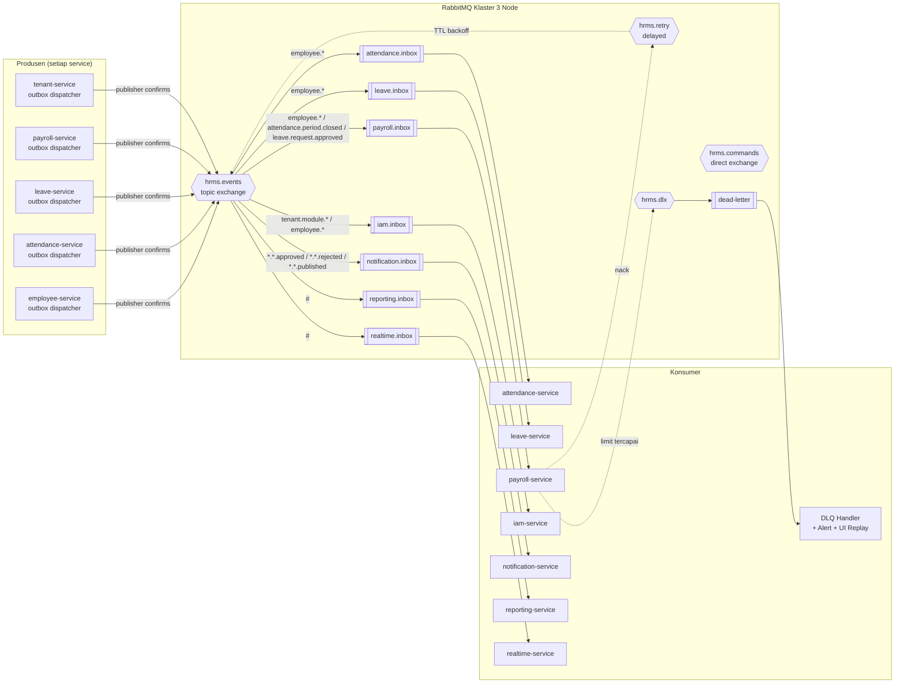
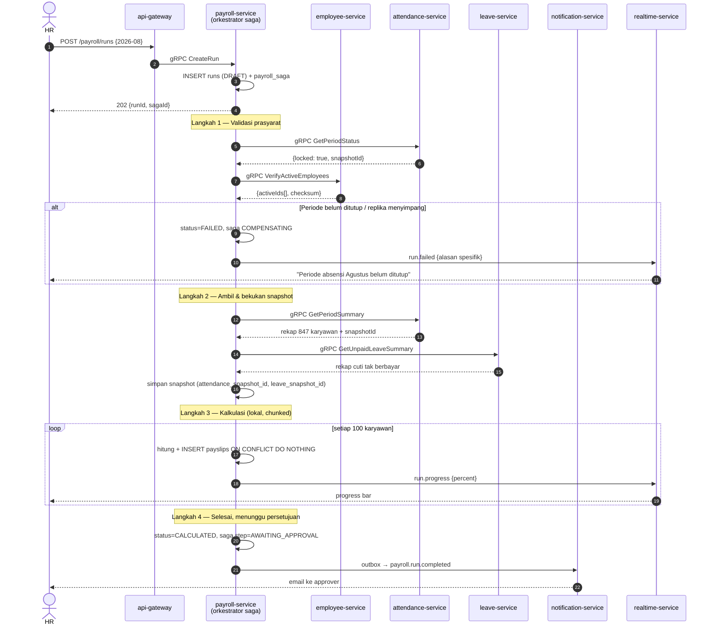
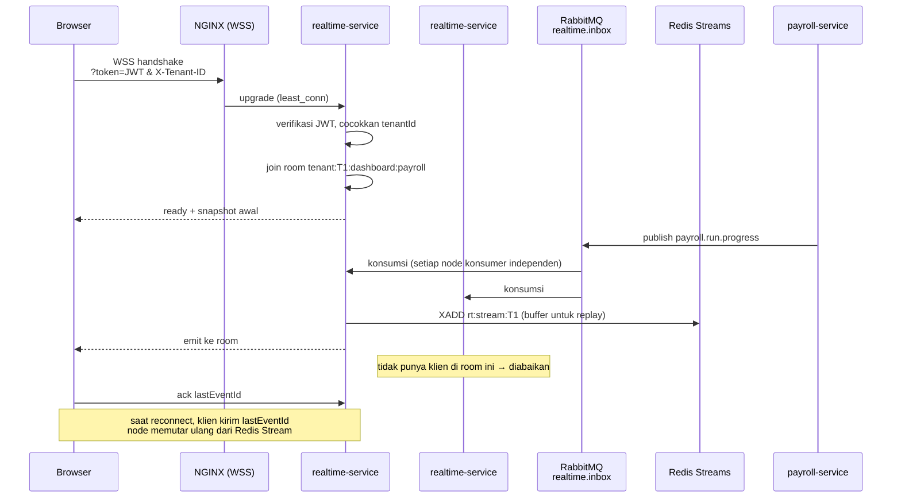

# 03 — Event Bus, Saga, WebSocket & Konkurensi Terdistribusi

---

## 1. Peran Message Queue dalam Arsitektur Microservices

Pada monolit, message queue adalah pelengkap untuk pekerjaan berat. Pada microservices, ia adalah **tulang punggung komunikasi**. Kegagalan broker bukan berarti "job tertunda" melainkan "service berhenti saling berbicara".

Konsekuensinya:
- RabbitMQ berjalan sebagai klaster 3 node dengan **quorum queue** (replikasi ke mayoritas node).
- Setiap service memiliki **outbox sendiri** — tidak ada outbox terpusat yang menjadi titik kegagalan tunggal.
- Setiap konsumer **wajib idempoten** — jaminan pengiriman adalah *at-least-once*, bukan *exactly-once*.

### 1.1 Topologi



### 1.2 Konvensi & Definisi

Format routing key: `{domain}.{agregat}.{peristiwa}` — misalnya `employee.employee.terminated`, `attendance.period.closed`.

```typescript
// packages/shared/src/messaging/topology.ts
export const TOPOLOGY = {
  exchanges: {
    events:   { name: 'hrms.events',   type: 'topic',  durable: true },
    commands: { name: 'hrms.commands', type: 'direct', durable: true },
    retry:    { name: 'hrms.retry',    type: 'topic',  durable: true },
    dlx:      { name: 'hrms.dlx',      type: 'topic',  durable: true },
  },
  queues: {
    'payroll.inbox': {
      type: 'quorum',
      bindings: [
        'employee.employee.created', 'employee.employee.updated', 'employee.employee.terminated',
        'attendance.period.closed',
        'leave.request.approved', 'leave.request.cancelled',
        'tenant.module.disabled',
      ],
      args: { 'x-queue-type': 'quorum', 'x-dead-letter-exchange': 'hrms.dlx', 'x-delivery-limit': 5 },
      prefetch: 20,
    },
    'attendance.inbox': {
      type: 'quorum',
      bindings: ['employee.employee.*', 'leave.request.approved', 'leave.request.cancelled'],
      args: { 'x-queue-type': 'quorum', 'x-dead-letter-exchange': 'hrms.dlx', 'x-delivery-limit': 5 },
      prefetch: 50,
    },
    'reporting.inbox': {
      type: 'quorum',
      bindings: ['#'],                                  // proyeksi mendengarkan semuanya
      args: { 'x-queue-type': 'quorum', 'x-dead-letter-exchange': 'hrms.dlx' },
      prefetch: 100,
    },
    'realtime.inbox': {
      type: 'classic',                                  // boleh hilang: hanya push UI
      bindings: ['#'],
      args: { 'x-message-ttl': 60_000, 'x-max-length': 100_000 },
      prefetch: 200,
    },
  },
} as const;
```

> `realtime.inbox` sengaja memakai classic queue dengan TTL 60 detik. Notifikasi UI yang sudah lewat satu menit tidak lagi berguna; menyimpannya secara durable hanya membebani broker.

### 1.3 Transactional Outbox per Service

Masalah yang dipecahkan: menulis ke basis data lalu mempublikasikan ke broker sebagai dua operasi terpisah punya dua mode kegagalan — data tersimpan tanpa event terkirim (service lain tidak pernah tahu), atau event terkirim tanpa data tersimpan (service lain memproses peristiwa hantu). Pada microservices, keduanya berarti data antar-service menyimpang permanen.

```typescript
// packages/shared/src/messaging/outbox.ts
export class Outbox {
  /** Dipanggil DI DALAM transaksi bisnis. Tidak menyentuh jaringan. */
  static async emit(tx: Prisma.TransactionClient, event: DomainEvent): Promise<void> {
    const ctx = ServiceContextStore.get();
    await tx.outboxEvent.create({
      data: {
        tenantId:      event.tenantId,
        aggregateType: event.aggregateType,
        aggregateId:   event.aggregateId,
        eventType:     event.type,
        eventVersion:  event.version ?? 1,
        payload:       event.payload as Prisma.JsonObject,
        metadata: {
          correlationId: ctx?.correlationId,
          causationId:   ctx?.causationId,
          traceparent:   ctx?.traceparent,
          actorId:       ctx?.actorId ?? 'system',
          sourceService: process.env.SERVICE_NAME,
          emittedAt:     new Date().toISOString(),
        },
      },
    });
  }
}
```

Contoh pemakaian di `employee-service`:

```typescript
// services/employee-service/src/application/terminate-employee.usecase.ts
await withTenant(prisma, tenantId, async (tx) => {
  const updated = await tx.$queryRaw<Employee[]>`
    UPDATE employees
       SET state = 'TERMINATED', termination_date = ${cmd.date}::date,
           termination_reason = ${cmd.reason}, version = version + 1, updated_at = now()
     WHERE id = ${cmd.employeeId}::uuid AND version = ${cmd.expectedVersion}
    RETURNING *`;
  if (!updated.length) throw new ConflictError('STALE_VERSION');

  // Event ikut commit/rollback bersama data → atomik dalam basis data ini
  await Outbox.emit(tx, {
    tenantId,
    type: 'employee.employee.terminated',
    aggregateType: 'Employee',
    aggregateId: cmd.employeeId,
    payload: {
      employeeId: cmd.employeeId,
      employeeNumber: updated[0].employee_number,
      terminationDate: cmd.date,
      reason: cmd.reason,
      version: updated[0].version,     // konsumer memakai ini untuk urutan
    },
  });
});
```

Dispatcher berjalan sebagai proses terpisah di setiap service:

```typescript
// packages/shared/src/messaging/outbox-dispatcher.ts
async dispatchBatch(): Promise<number> {
  return this.prisma.$transaction(async (tx) => {
    // SKIP LOCKED: banyak replika service dapat menjalankan dispatcher tanpa duplikasi
    const rows = await tx.$queryRaw<OutboxRow[]>`
      SELECT * FROM outbox_events
       WHERE status = 'PENDING' AND available_at <= now()
       ORDER BY id LIMIT 200
       FOR UPDATE SKIP LOCKED`;
    if (!rows.length) return 0;

    for (const row of rows) {
      try {
        await this.amqp.publish('hrms.events', row.event_type,
          { id: row.id, type: row.event_type, tenantId: row.tenant_id,
            payload: row.payload, metadata: row.metadata },
          {
            messageId:   row.id,                    // kunci idempotensi konsumer
            persistent:  true,
            contentType: 'application/json',
            headers: {
              'x-tenant-id':     row.tenant_id,     // X-Tenant-ID mengalir sampai ke antrean
              'x-correlation-id': row.metadata.correlationId,
              'x-source-service': row.metadata.sourceService,
              'x-event-version':  row.event_version,
              traceparent:        row.metadata.traceparent,
            },
          });
        await tx.$executeRaw`
          UPDATE outbox_events SET status='PUBLISHED', published_at=now() WHERE id=${row.id}::uuid`;
      } catch (err) {
        const attempts = row.attempts + 1;
        const backoff  = Math.min(2 ** attempts, 300);
        await tx.$executeRaw`
          UPDATE outbox_events
             SET attempts=${attempts},
                 available_at = now() + (${backoff} || ' seconds')::interval,
                 status = CASE WHEN ${attempts} >= 10 THEN 'FAILED'::outbox_status ELSE status END,
                 last_error = ${String(err).slice(0, 500)}
           WHERE id=${row.id}::uuid`;
      }
    }
    return rows.length;
  });
}
```

### 1.4 Konsumer Idempoten

```typescript
// packages/shared/src/messaging/idempotent-consumer.ts
export abstract class IdempotentConsumer<T> {
  abstract readonly consumerName: string;
  protected abstract execute(payload: T, tx: Prisma.TransactionClient): Promise<void>;

  async handle(msg: ConsumeMessage): Promise<void> {
    const messageId = msg.properties.messageId as string;
    const tenantId  = msg.properties.headers['x-tenant-id'] as string;

    // Validasi konteks sebelum apa pun. Pesan tanpa tenant valid langsung ke DLQ.
    if (!isUuid(tenantId)) {
      this.securityLog.error({ messageId, event: 'MESSAGE_WITHOUT_TENANT' });
      return this.channel.nack(msg, false, false);
    }

    const body = JSON.parse(msg.content.toString());
    if (body.tenantId && body.tenantId !== tenantId) {
      this.securityLog.error({ messageId, event: 'MESSAGE_TENANT_MISMATCH' });
      return this.channel.nack(msg, false, false);
    }

    await ServiceContextStore.run(
      { tenantId, correlationId: msg.properties.headers['x-correlation-id'],
        causationId: messageId, actorId: 'system',
        traceparent: msg.properties.headers.traceparent },
      async () => {
        await withTenant(this.prisma, tenantId, async (tx) => {
          const claimed = await tx.$executeRaw`
            INSERT INTO processed_messages (consumer, message_id)
            VALUES (${this.consumerName}, ${messageId}::uuid)
            ON CONFLICT DO NOTHING`;

          if (claimed === 0) return;         // sudah pernah diproses → lewati

          await this.execute(body.payload, tx);
          // Efek bisnis + catatan idempotensi commit bersamaan.
          // Gagal di execute() → rollback keduanya → pesan aman di-retry.
        });
      });

    this.channel.ack(msg);
  }
}
```

### 1.5 Retry, Dead Letter, dan Klasifikasi Kesalahan

```typescript
export function classify(err: unknown): 'RETRYABLE' | 'FATAL' {
  if (err instanceof Prisma.PrismaClientKnownRequestError) {
    if (err.code === '40001') return 'RETRYABLE';   // serialization failure
    if (err.code === '40P01') return 'RETRYABLE';   // deadlock
    if (err.code === '23505') return 'FATAL';       // unique violation → data memang duplikat
    if (err.code === '23503') return 'FATAL';       // FK violation
    if (err.code === '23514') return 'FATAL';       // check violation → aturan bisnis dilanggar
  }
  if (err instanceof ZodError)               return 'FATAL';       // kontrak event dilanggar
  if (err instanceof BusinessRuleError)      return 'FATAL';
  if (err instanceof ServiceUnavailableError) return 'RETRYABLE';  // service hilir mati
  if (err instanceof TimeoutError)           return 'RETRYABLE';
  return 'RETRYABLE';
}
```

| Jenis | Jalur | Batas |
|-------|-------|-------|
| Sementara | Retry dalam konsumer + jitter | 3× / 5 detik |
| Kegagalan proses | `hrms.retry` dengan TTL berjenjang | 1 mnt → 5 mnt → 30 mnt → 2 jam → 12 jam |
| Permanen | Langsung DLQ | — |
| DLQ | Alert + UI admin untuk pemutaran ulang manual | Retensi 30 hari |

### 1.6 Katalog Event Lintas Service

| Event | Produsen | Konsumen | Fungsi |
|-------|----------|----------|--------|
| `tenant.provisioned` | tenant | iam, employee, notification | Seed peran & data awal |
| `tenant.module.enabled` | tenant | iam, gateway-cache, realtime | Menu & permission modul aktif |
| `tenant.module.disabled` | tenant | iam, gateway-cache, semua domain | Cabut izin, hentikan job |
| `tenant.suspended` | tenant | semua | Hentikan operasi tulis |
| `employee.employee.created` | employee | attendance, leave, payroll, performance, planning, reporting | Isi replika `employee_ref` |
| `employee.employee.updated` | employee | idem | Perbarui replika |
| `employee.employee.terminated` | employee | payroll (final settlement), leave (hanguskan saldo), attendance, iam (nonaktifkan user) | Offboarding lintas domain |
| `employee.org_unit.changed` | employee | reporting, planning | Perbarui hierarki |
| `attendance.punch.recorded` | attendance | reporting, realtime | Dashboard langsung. **Payload tidak membawa koordinat mentah maupun rujukan foto** — hanya status, lokasi kerja, dan tanda (dok. `10` PR8) |
| `attendance.punch.flagged` | attendance | notification (inbox HR), realtime | Presensi masuk antrean tinjauan |
| `attendance.punch.reviewed` | attendance | reporting, notification | Hasil tinjauan; memicu hitung ulang harian bila ditolak |
| `attendance.photo.purged` | file | attendance | Foto terhapus sesuai retensi; catatan presensi tetap |
| `attendance.daily.computed` | attendance | reporting, realtime | Rekap harian |
| `attendance.period.closed` | attendance | **payroll (gerbang utama)**, reporting | Payroll boleh berjalan |
| `leave.request.submitted` | leave | notification, realtime | Inbox approver |
| `leave.request.approved` | leave | attendance (tandai hari cuti), payroll, reporting, notification | Sinkronisasi cuti |
| `leave.balance.changed` | leave | reporting, realtime | Widget saldo |
| `payroll.run.progress` | payroll | realtime | Progress bar |
| `payroll.run.completed` | payroll | notification, reporting, realtime | Selesai hitung |
| `payroll.payslip.published` | payroll | notification (email/ESS) | Distribusi slip |
| `recruitment.candidate.hired` | recruitment | **employee (buat karyawan)**, notification | Konversi kandidat |
| `iam.access.changed` | iam | gateway-cache, realtime | Menu & izin berubah |

### 1.7 Kontrak Event Terversi

```typescript
// packages/contracts/src/events/employee.v1.ts
import { z } from 'zod';

export const EmployeeTerminatedV1 = z.object({
  eventType:    z.literal('employee.employee.terminated'),
  eventVersion: z.literal(1),
  tenantId:     z.string().uuid(),
  employeeId:   z.string().uuid(),
  employeeNumber: z.string(),
  terminationDate: z.string().date(),
  reason:       z.string(),
  version:      z.number().int().positive(),   // urutan replika
});
export type EmployeeTerminatedV1 = z.infer<typeof EmployeeTerminatedV1>;

// Konsumer memvalidasi sebelum memproses. Payload tidak sesuai kontrak = FATAL, bukan retry.
export function parseEvent<T extends z.ZodTypeAny>(schema: T, raw: unknown): z.infer<T> {
  const result = schema.safeParse(raw);
  if (!result.success) {
    throw new ContractViolationError(
      `Event tidak sesuai kontrak: ${result.error.issues.map((i) => i.path.join('.')).join(', ')}`);
  }
  return result.data;
}
```

**Aturan evolusi:** menambah field opsional tetap `v1`. Menghapus atau mengubah arti field wajib menerbitkan `v2` dan **menerbitkan kedua versi paralel** minimal satu siklus rilis. Ini adalah penerapan prinsip yang sama dengan migrasi skema (dokumen `09`): aditif dulu, versi lama dihentikan hanya setelah terbukti nol konsumsi selama 14 hari — bukan setelah diasumsikan tidak dipakai. Paket `@hrms/contracts` diberi versi semver; menaikkan major memaksa setiap service konsumen memperbarui dan gagal dikompilasi bila belum siap.

---

## 2. Saga: Transaksi Lintas Service

Inilah harga terbesar microservices di domain HRIS. Tanpa transaksi ACID lintas service, operasi yang menyentuh beberapa domain harus dikelola sebagai rangkaian langkah dengan **kompensasi** bila gagal di tengah.

### 2.1 Saga Payroll Run (orkestrasi)

Payroll dipilih sebagai orkestrasi (bukan koreografi) karena langkahnya berurutan ketat, punya titik keputusan manusia, dan kegagalannya harus dapat dijelaskan kepada pengguna.



### 2.2 Implementasi Orkestrator

```typescript
// services/payroll-service/src/application/payroll-run.saga.ts
export class PayrollRunSaga {
  private readonly steps: SagaStep[] = [
    {
      name: 'VALIDATE_PRECONDITIONS',
      execute: async (s) => {
        const period = await this.attendanceClient.getPeriodStatus({
          tenantId: s.tenantId, periodMonth: s.periodMonth });
        if (!period.locked) {
          throw new SagaAbort('ATTENDANCE_PERIOD_NOT_CLOSED',
            `Periode absensi ${s.periodMonth} belum ditutup. Tutup periode terlebih dahulu.`);
        }
        const verify = await this.employeeClient.verifyActiveEmployees({
          tenantId: s.tenantId, asOf: endOfMonth(s.periodMonth) });
        const drift = await this.detectReplicaDrift(s.tenantId, verify);
        if (drift.length) {
          await this.resyncReplica(s.tenantId, drift);
          throw new SagaRetry('REPLICA_DRIFT',
            `${drift.length} data karyawan tidak sinkron dan telah diperbaiki. Jalankan ulang.`);
        }
        return { periodId: period.periodId, employeeIds: verify.activeIds };
      },
      compensate: async () => { /* read-only, tidak ada yang perlu dibatalkan */ },
    },
    {
      name: 'FREEZE_SNAPSHOTS',
      execute: async (s, prev) => {
        const att = await this.attendanceClient.getPeriodSummary({
          tenantId: s.tenantId, periodStart: s.periodStart, periodEnd: s.periodEnd,
          employeeIds: prev.employeeIds });
        const lv = await this.leaveClient.getUnpaidLeaveSummary({
          tenantId: s.tenantId, periodStart: s.periodStart, periodEnd: s.periodEnd });

        await this.repo.saveSnapshots(s.runId, att, lv);
        return { attendanceSnapshotId: att.snapshotId, leaveSnapshotId: lv.snapshotId };
      },
      compensate: async (s) => { await this.repo.clearSnapshots(s.runId); },
    },
    {
      name: 'CALCULATE',
      execute: async (s) => {
        // Advisory lock: hanya satu kalkulasi per (tenant, periode) meski ada 8 replika worker
        await this.calculator.run(s.runId, s.tenantId, {
          onProgress: (p) => this.realtime.publish(
            `tenant:${s.tenantId}:payroll:${s.runId}`, { type: 'payroll.run.progress', data: p }),
        });
      },
      // Kompensasi kalkulasi: hapus slip yang sudah terbentuk.
      // Aman karena slip belum dipublikasikan ke karyawan pada tahap ini.
      compensate: async (s) => {
        await this.repo.deletePayslips(s.runId);
        await this.repo.updateRunStatus(s.runId, 'DRAFT');
      },
    },
    {
      name: 'AWAIT_APPROVAL',
      execute: async (s) => {
        await this.repo.updateRunStatus(s.runId, 'PENDING_APPROVAL');
        return { awaitingHuman: true };     // saga berhenti; dilanjutkan oleh aksi pengguna
      },
      compensate: async (s) => { await this.repo.updateRunStatus(s.runId, 'CALCULATED'); },
    },
  ];

  async run(sagaId: string) {
    const state = await this.repo.loadSaga(sagaId);
    try {
      for (const step of this.steps.slice(state.completedSteps.length)) {
        const result = await this.executeWithTimeout(step, state);
        if (result?.awaitingHuman) {
          await this.repo.pauseSaga(sagaId, step.name);
          return;
        }
        await this.repo.markStepDone(sagaId, step.name, result);
      }
      await this.repo.completeSaga(sagaId);
    } catch (err) {
      if (err instanceof SagaRetry) {
        await this.repo.scheduleRetry(sagaId, err.backoffMs ?? 60_000);
        return;
      }
      await this.compensate(sagaId, err);
    }
  }

  private async compensate(sagaId: string, cause: unknown) {
    const state = await this.repo.loadSaga(sagaId);
    await this.repo.updateSagaStatus(sagaId, 'COMPENSATING');

    // Kompensasi berjalan MUNDUR dari langkah terakhir yang berhasil
    for (const stepName of [...state.completedSteps].reverse()) {
      const step = this.steps.find((s) => s.name === stepName)!;
      try {
        await step.compensate(state);
        await this.repo.markCompensated(sagaId, stepName);
      } catch (compErr) {
        // Kompensasi yang gagal adalah keadaan paling berbahaya:
        // sistem tertinggal dalam kondisi tidak konsisten dan butuh manusia.
        await this.repo.updateSagaStatus(sagaId, 'COMPENSATION_FAILED');
        await this.alerts.critical('SAGA_COMPENSATION_FAILED', { sagaId, stepName, compErr });
        throw compErr;
      }
    }
    await this.repo.updateSagaStatus(sagaId, 'FAILED');
    await this.realtime.publish(`tenant:${state.tenantId}:payroll:${state.runId}`, {
      type: 'payroll.run.failed',
      data: { reason: cause instanceof SagaAbort ? cause.userMessage : 'Terjadi kesalahan sistem' },
    });
  }
}
```

### 2.3 Saga Kandidat Menjadi Karyawan (koreografi)

Alur ini sederhana dan tidak punya titik keputusan bercabang, sehingga koreografi (setiap service bereaksi terhadap event) lebih ringan daripada orkestrator:

```
recruitment: application → HIRED
  └─ publish recruitment.candidate.hired

employee: konsumsi recruitment.candidate.hired
  ├─ buat employees + employee_positions
  └─ publish employee.employee.created

auth: konsumsi employee.employee.created
  ├─ buat users dengan password sementara
  └─ publish auth.user.created

iam: konsumsi auth.user.created
  └─ beri peran EMPLOYEE

leave: konsumsi employee.employee.created
  └─ buat leave_balances tahun berjalan (prorata dari hire_date)

notification: konsumsi auth.user.created
  └─ kirim email undangan + password sementara

recruitment: konsumsi employee.employee.created
  └─ isi applications.hired_employee_id, requisitions.filled_count += 1
```

**Kompensasi pada koreografi** ditangani dengan event pembatalan: bila `employee-service` gagal membuat karyawan, ia menerbitkan `employee.creation.failed`, yang dikonsumsi `recruitment-service` untuk mengembalikan status lamaran ke `OFFER` beserta catatan alasan.

### 2.4 Saga yang Macet

Saga bisa berhenti karena service mati di tengah langkah. Pemantau berkala mendeteksinya:

```typescript
@Cron('*/2 * * * *')
async detectStuckSagas() {
  const stuck = await this.prisma.$queryRaw<Saga[]>`
    SELECT * FROM payroll_saga
     WHERE status = 'RUNNING' AND timeout_at < now()
     LIMIT 50`;

  for (const saga of stuck) {
    this.logger.error({ sagaId: saga.id, step: saga.current_step }, 'saga melewati batas waktu');
    metrics.increment('saga.timeout', { saga: 'payroll', step: saga.current_step });

    if (saga.current_step === 'AWAIT_APPROVAL') continue;   // menunggu manusia itu wajar

    // Langkah bersifat idempoten, jadi aman dijalankan ulang
    await this.sagaRunner.resume(saga.id);
  }
}
```

Metrik `saga.timeout` yang tidak nol adalah sinyal ada service yang tidak stabil, bukan kondisi normal.

---

## 3. WebSocket untuk Dashboard

### 3.1 Topologi

Masalah inti pada microservices: event dihasilkan di 10 service berbeda, sementara koneksi WebSocket pengguna dipegang oleh salah satu dari beberapa node `realtime-service`. Tidak ada service produsen yang tahu — dan tidak boleh tahu — di node mana pengguna terhubung.



### 3.2 Struktur Room

```
/realtime                                     namespace tunggal
  tenant:{tenantId}                                     siaran tingkat perusahaan
  tenant:{tenantId}:dashboard:attendance                widget kehadiran
  tenant:{tenantId}:dashboard:leave                     kalender cuti
  tenant:{tenantId}:dashboard:payroll                   ringkasan biaya SDM
  tenant:{tenantId}:org:{orgUnitId}                     manajer unit tertentu
  tenant:{tenantId}:payroll:{runId}                     progres run
  tenant:{tenantId}:import:{batchId}                    progres impor Excel
  user:{userId}                                         notifikasi pribadi, inbox approval

/realtime-admin                               namespace TERPISAH untuk control plane
  platform:overview                                     KPI platform
  platform:health                                       kesehatan sistem, DLQ, saga
  platform:alerts                                       peringatan yang perlu tindakan
  platform:tenant:{tenantId}                            status satu tenant (metadata saja)
```

> Kedua namespace dipisahkan berdasarkan **audience token**: `/realtime` hanya menerima token `aud: hrms-api`, `/realtime-admin` hanya menerima `aud: hrms-admin` dengan klaim `mfa: true`. Token tenant secara struktural tidak dapat memasuki namespace admin, dan sebaliknya. Rinciannya di dokumen `07`, §8.

**Aturan yang tidak boleh dilanggar:** keanggotaan room selalu diturunkan dari klaim token di sisi server. Klien boleh *meminta* berlangganan kanal; `realtime-service` yang memutuskan apakah izin dan langganan modulnya terpenuhi.

### 3.3 Gateway Realtime

```typescript
// services/realtime-service/src/realtime.gateway.ts
@WebSocketGateway({
  namespace: '/realtime',
  transports: ['websocket', 'polling'],      // polling = jaring pengaman proxy korporat
  cors: { origin: env.ALLOWED_ORIGINS, credentials: true },
  pingInterval: 25_000, pingTimeout: 20_000, maxHttpBufferSize: 1e6,
})
export class RealtimeGateway implements OnGatewayConnection, OnGatewayDisconnect {
  @WebSocketServer() server: Server;

  async handleConnection(client: Socket) {
    try {
      const token    = client.handshake.auth?.token;
      const tenantId = client.handshake.auth?.tenantId;          // X-Tenant-ID versi WebSocket
      const claims   = await this.jwt.verify(token);

      // Aturan yang sama dengan gateway HTTP: header/handshake harus cocok dengan token
      if (tenantId && tenantId !== claims.tenantId) {
        this.securityLog.warn({ event: 'WS_TENANT_MISMATCH', tokenTenant: claims.tenantId,
                                claimedTenant: tenantId, ip: client.handshake.address });
        client.emit('error', { code: 'TENANT_MISMATCH' });
        return client.disconnect(true);
      }

      // Ambil akses efektif dari iam-service & entitlement dari tenant-service (keduanya di-cache)
      const [access, subscription] = await Promise.all([
        this.iamClient.getEffectiveAccess({ tenantId: claims.tenantId, userId: claims.sub }),
        this.tenantClient.getSubscription({ tenantId: claims.tenantId }),
      ]);

      client.data.ctx = {
        userId: claims.sub, tenantId: claims.tenantId, employeeId: claims.employeeId,
        permissions: new Set(access.permissions),
        modules: new Set(subscription.modules.filter((m) => m.enabled).map((m) => m.key)),
        orgUnitScope: access.orgUnitIds,
        accessVersion: access.version,
      };

      const conns = await this.redis.incr(`ws:conn:${claims.sub}`);
      await this.redis.expire(`ws:conn:${claims.sub}`, 3600);
      if (conns > 8) { client.emit('error', { code: 'TOO_MANY_CONNECTIONS' }); return client.disconnect(true); }

      await client.join(`tenant:${claims.tenantId}`);
      await client.join(`user:${claims.sub}`);
      client.emit('ready', { serverTime: new Date().toISOString(),
                             availableChannels: this.channelsFor(client.data.ctx) });
    } catch {
      client.emit('error', { code: 'UNAUTHORIZED' });
      client.disconnect(true);
    }
  }

  @SubscribeMessage('subscribe')
  async onSubscribe(@ConnectedSocket() client: Socket,
                    @MessageBody() body: { channel: string; lastEventId?: string }) {
    const ctx    = client.data.ctx;
    const parsed = ChannelSchema.safeParse(body.channel);
    if (!parsed.success) return { ok: false, error: 'INVALID_CHANNEL' };

    const rule = CHANNEL_RULES[parsed.data.kind];
    if (!ctx.modules.has(rule.module))         return { ok: false, error: 'MODULE_NOT_SUBSCRIBED' };
    if (!ctx.permissions.has(rule.permission)) return { ok: false, error: 'FORBIDDEN' };
    if (parsed.data.orgUnitId && !ctx.orgUnitScope.includes(parsed.data.orgUnitId)
        && !ctx.permissions.has(`${rule.module}.read.all`)) {
      return { ok: false, error: 'OUT_OF_SCOPE' };
    }

    const room = `tenant:${ctx.tenantId}:${parsed.data.path}`;
    await client.join(room);

    // Snapshot dari reporting-service, lalu hanya delta
    const snapshot = await this.reportingClient.getSnapshot({
      tenantId: ctx.tenantId, channel: parsed.data.path });
    client.emit('snapshot', { channel: body.channel, data: snapshot.data, eventId: snapshot.eventId });

    if (body.lastEventId) {
      const missed = await this.streams.replay(ctx.tenantId, body.lastEventId, 500);
      for (const ev of missed) client.emit('event', ev);
    }
    return { ok: true };
  }

  async handleDisconnect(client: Socket) {
    if (client.data.ctx) await this.redis.decr(`ws:conn:${client.data.ctx.userId}`);
  }
}
```

### 3.4 Jembatan Event → WebSocket

```typescript
// services/realtime-service/src/event-bridge.consumer.ts
// Setiap node realtime-service adalah konsumer INDEPENDEN (queue eksklusif per node),
// bukan consumer group — karena klien untuk suatu room bisa berada di node mana pun.
@Injectable()
export class EventBridgeConsumer implements OnModuleInit {
  async onModuleInit() {
    const queueName = `realtime.inbox.${process.env.POD_NAME}`;
    await this.channel.assertQueue(queueName, {
      exclusive: true, autoDelete: true,         // hilang saat pod mati
      arguments: { 'x-message-ttl': 60_000, 'x-max-length': 50_000 },
    });
    await this.channel.bindQueue(queueName, 'hrms.events', '#');

    await this.channel.consume(queueName, async (msg) => {
      const tenantId = msg.properties.headers['x-tenant-id'];
      const body     = JSON.parse(msg.content.toString());

      const mapping = EVENT_TO_ROOM[body.type];
      if (!mapping) return this.channel.ack(msg);   // event ini tidak relevan untuk UI

      for (const room of mapping.rooms(tenantId, body.payload)) {
        // Socket.IO hanya mengirim ke soket yang benar-benar ada di room pada node ini
        this.coalescer.emit(room, { type: body.type, data: mapping.project(body.payload) });
      }
      this.channel.ack(msg);
    });
  }
}

// Peredam badai: 500 punch per detik menjadi ~4 pesan per detik per room
class EventCoalescer {
  private buffer = new Map<string, RealtimeEvent[]>();

  emit(room: string, event: RealtimeEvent) {
    const list = this.buffer.get(room) ?? [];
    list.push(event);
    this.buffer.set(room, list);
    if (!this.timers.has(room)) {
      this.timers.set(room, setTimeout(() => this.flush(room), 250));
    }
  }

  private flush(room: string) {
    const events = this.buffer.get(room) ?? [];
    this.buffer.delete(room);
    this.timers.delete(room);
    if (events.length === 1) this.server.to(room).emit('event', events[0]);
    else if (events.length > 1) this.server.to(room).emit('events', { batch: events });
  }
}
```

### 3.5 Klien

```typescript
// apps/web/src/lib/realtime/use-realtime-channel.ts
export function useRealtimeChannel<T>(channel: string, initial: T) {
  const [state, setState]   = useState<T>(initial);
  const [status, setStatus] = useState<'connecting'|'live'|'reconnecting'|'offline'>('connecting');
  const lastEventId = useRef<string>();

  useEffect(() => {
    const socket = getSocket();     // singleton; satu koneksi untuk seluruh aplikasi
    const subscribe = () => socket.emit('subscribe', { channel, lastEventId: lastEventId.current });

    socket.on('connect', () => { setStatus('live'); subscribe(); });
    socket.on('snapshot', (m) => {
      if (m.channel !== channel) return;
      setState(m.data); lastEventId.current = m.eventId; setStatus('live');
    });
    socket.on('event',  (ev) => { lastEventId.current = ev.eventId; setState((p) => applyDelta(p, ev)); });
    socket.on('events', (b)  => { setState((p) => b.batch.reduce(applyDelta, p)); });
    socket.on('disconnect', () => setStatus('reconnecting'));
    socket.io.on('reconnect_failed', () => setStatus('offline'));

    if (socket.connected) subscribe();
    return () => { socket.emit('unsubscribe', { channel }); socket.off('snapshot'); socket.off('event'); };
  }, [channel]);

  return { state, status };
}
```

**Degradasi berjenjang:**
```
1. WebSocket           → latensi < 100 ms
2. HTTP long-polling   → latensi < 1 dtk        (fallback Socket.IO otomatis)
3. Polling REST 30 dtk → banner "Mode pembaruan lambat"
```
Dashboard tidak boleh berhenti berfungsi tanpa WebSocket — real-time adalah peningkatan, bukan prasyarat.

### 3.6 Penskalaan

| Aspek | Keputusan |
|-------|-----------|
| Sticky session | Tidak perlu untuk transport `websocket`; diperlukan untuk fallback polling → `ip_hash` di NGINX |
| Kapasitas | 10.000 koneksi per pod; `worker_connections` dan `ulimit -n` dinaikkan |
| Backpressure | Bila `client.conn.writableLength > 1 MB`, hentikan delta dan paksa snapshot ulang saat pulih |
| Token kedaluwarsa | Timer per soket mengirim `token_expiring` 60 dtk sebelum `exp`; putuskan bila tidak diperbarui |
| Perubahan akses | Event `iam.access.changed` memicu klien memuat ulang `/me/bootstrap`; bila izin dicabut, soket dipaksa berlangganan ulang |

```nginx
upstream realtime {
    least_conn;
    server realtime-1:3001 max_fails=2 fail_timeout=10s;
    server realtime-2:3001 max_fails=2 fail_timeout=10s;
    keepalive 64;
}
server {
    listen 443 ssl http2;
    location /realtime {
        proxy_pass         http://realtime;
        proxy_http_version 1.1;
        proxy_set_header   Upgrade    $http_upgrade;
        proxy_set_header   Connection "upgrade";
        proxy_set_header   X-Tenant-Id $http_x_tenant_id;
        proxy_read_timeout 3600s;
        proxy_send_timeout 3600s;
        proxy_buffering    off;
    }
}
```

---

## 4. Penanganan Konkurensi

### 4.1 Persetujuan Cuti Bersamaan

Karyawan bersisa 2 hari cuti mengajukan dua permohonan 2 hari; dua manajer menyetujui bersamaan. Seluruh operasi ini berada **dalam satu service** (`leave-service`), sehingga penanganannya memakai transaksi basis data biasa — inilah alasan batas service ditarik sedemikian rupa sehingga saldo cuti dan persetujuannya tidak terpisah.

```typescript
// services/leave-service/src/application/approve-leave.usecase.ts
async approve(cmd: ApproveLeaveCommand) {
  return withTenant(this.prisma, cmd.tenantId, async (tx) => {
    // Lapis 1 — pessimistic row lock; transaksi kedua MENUNGGU di sini
    const [balance] = await tx.$queryRaw<Balance[]>`
      SELECT id, available_days FROM leave_balances
       WHERE employee_id = ${cmd.employeeId}::uuid
         AND leave_type_id = ${cmd.leaveTypeId}::uuid
         AND period_year = ${cmd.year}
       FOR UPDATE`;
    if (!balance) throw new BusinessRuleError('BALANCE_NOT_FOUND');

    // Lapis 2 — validasi membaca nilai pasca-lock
    if (Number(balance.available_days) < cmd.days) {
      throw new BusinessRuleError(
        `Saldo cuti tidak mencukupi: tersisa ${balance.available_days} hari, diminta ${cmd.days} hari`);
    }

    // Lapis 3 — optimistic guard; cegah double-approve dari dua tab
    const updated = await tx.$executeRaw`
      UPDATE leave_requests SET status='APPROVED', decided_at=now(), version=version+1
       WHERE id=${cmd.requestId}::uuid AND status='PENDING' AND version=${cmd.expectedVersion}`;
    if (updated === 0) throw new ConflictError('REQUEST_ALREADY_DECIDED');

    // Lapis 4 — mutasi saldo + ledger
    await tx.$executeRaw`
      UPDATE leave_balances
         SET pending_days = pending_days - ${cmd.days}, used_days = used_days + ${cmd.days},
             version = version + 1
       WHERE id = ${balance.id}::uuid`;
    // Lapis 5 — CHECK chk_no_negative_balance: jaring pengaman terakhir di basis data

    await tx.balanceLedger.create({ data: { tenantId: cmd.tenantId, balanceId: balance.id,
      entryType: 'CONSUME', days: -cmd.days, referenceType: 'LEAVE_REQUEST',
      referenceId: cmd.requestId, createdBy: cmd.approverId }});

    // Lapis 6 — event ke attendance & payroll ikut commit
    await Outbox.emit(tx, { tenantId: cmd.tenantId, type: 'leave.request.approved',
      aggregateType: 'LeaveRequest', aggregateId: cmd.requestId,
      payload: { requestId: cmd.requestId, employeeId: cmd.employeeId, days: cmd.days,
                 period: cmd.period, affectsPayroll: cmd.affectsPayroll }});
  });
}
```

### 4.2 Payroll Dijalankan Ganda

```typescript
// Lapis 1 — Idempotency-Key di gateway
@Post('/payroll/runs') @UseGuards(IdempotencyGuard)

// Lapis 2 — Unique partial index (dok. 02 §9):
//   uq_run_active ON runs (tenant_id, period_month, run_type) WHERE status <> 'CANCELLED'
//   → INSERT kedua gagal 23505 → dikonversi 409 Conflict

// Lapis 3 — Advisory lock transaksional; melindungi proses, bukan satu baris
const lockKey = hashInt64(`payroll:${tenantId}:${periodMonth}`);
const [{ acquired }] = await tx.$queryRaw<[{acquired: boolean}]>`
  SELECT pg_try_advisory_xact_lock(${lockKey}) AS acquired`;
if (!acquired) throw new ConcurrencyError('PAYROLL_ALREADY_RUNNING');
// Lock terlepas otomatis saat transaksi berakhir, termasuk saat pod mati —
// tidak meninggalkan lock yatim seperti lock berbasis Redis.

// Lapis 4 — state machine ketat
const ALLOWED: Record<RunStatus, RunStatus[]> = {
  DRAFT:            ['VALIDATING','CANCELLED'],
  VALIDATING:       ['CALCULATING','FAILED'],
  CALCULATING:      ['CALCULATED','FAILED'],
  CALCULATED:       ['PENDING_APPROVAL','CALCULATING','CANCELLED'],
  PENDING_APPROVAL: ['APPROVED','CALCULATED','CANCELLED'],
  APPROVED:         ['PAID','CANCELLED'],
  PAID:             [],                      // terminal
  FAILED:           ['VALIDATING','CANCELLED'],
  CANCELLED:        [],
};

// Lapis 5 — idempotensi per baris; worker yang melanjutkan setelah crash melewati yang sudah jadi
await tx.$executeRaw`INSERT INTO payslips (...) VALUES (...) ON CONFLICT (run_id, employee_id) DO NOTHING`;
```

### 4.3 Duplikasi Punch dari Mesin Absensi

Mesin fingerprint kehilangan jaringan lalu mengirim ulang batch 500 punch.

```typescript
await tx.$executeRaw`
  INSERT INTO punch_logs (tenant_id, employee_id, punched_at, work_date, punch_type, source, device_id, raw_payload)
  SELECT * FROM unnest(${tenantIds}::uuid[], ${employeeIds}::uuid[], ${punchedAts}::timestamptz[],
                       ${workDates}::date[], ${types}::punch_type[], ${sources}::punch_source[],
                       ${deviceIds}::text[], ${payloads}::jsonb[])
  ON CONFLICT (tenant_id, dedupe_key) DO NOTHING`;
```
Ditambah *dedupe window* aplikasi: dua punch `IN` dari karyawan sama dalam 60 detik dianggap satu (jari ditempel dua kali).

### 4.4 Event Tiba Tidak Berurutan

Khas microservices dan tidak ada padanannya di monolit: `employee.updated` (versi 5) bisa tiba **sebelum** `employee.updated` (versi 4) karena melewati jalur retry berbeda.

```sql
-- Solusi: penjaga versi pada setiap upsert replika
INSERT INTO employee_ref (...) VALUES (...)
ON CONFLICT (employee_id) DO UPDATE SET
  full_name = EXCLUDED.full_name, state = EXCLUDED.state,
  source_version = EXCLUDED.source_version, synced_at = now()
WHERE employee_ref.source_version < EXCLUDED.source_version;   -- versi lama diabaikan
```

### 4.5 Perhitungan Ulang Absensi Bentrok

Koreksi manual HR dan batch terjadwal menyentuh `daily_records` yang sama:

```sql
INSERT INTO daily_records (...) VALUES (...)
ON CONFLICT (tenant_id, employee_id, work_date) DO UPDATE
SET worked_minutes = EXCLUDED.worked_minutes, status = EXCLUDED.status,
    computed_at = now(), computed_by = EXCLUDED.computed_by, version = daily_records.version + 1
WHERE daily_records.is_locked = false                        -- periode tertutup tidak berubah otomatis
  AND daily_records.computed_at < EXCLUDED.computed_at       -- tolak hasil basi
  AND daily_records.computed_by <> 'hr_manual_override';     -- koreksi manual mengalahkan batch
```

### 4.6 Suntingan Bersamaan Data Master

```typescript
const affected = await tx.$executeRaw`
  UPDATE employees SET full_name=${dto.fullName}, phone=${dto.phone},
         version = version + 1, updated_at = now()
   WHERE id = ${id}::uuid AND version = ${dto.version}`;

if (affected === 0) {
  const current = await tx.employee.findUnique({ where: { id } });
  throw new ConflictException({
    code: 'STALE_VERSION',
    message: 'Data telah diubah pengguna lain saat Anda menyunting.',
    currentVersion: current.version,
    conflictingFields: diff(dto, current),   // UI menampilkan perbandingan berdampingan
  });
}
```
Ditambah presence indicator via room `tenant:{id}:entity:employee:{employeeId}` — mencegah konflik lebih baik daripada menyelesaikannya.

### 4.7 Deadlock

1. **Urutan penguncian seragam** dalam satu service, ditetapkan sebagai standar tim.
2. **Retry otomatis** untuk `40001` dan `40P01`.
3. **Panggilan jaringan dilarang di dalam transaksi basis data** — aturan yang jauh lebih kritis pada microservices, karena panggilan gRPC ke service lambat akan menahan lock basis data selama detik-detik berharga.

```typescript
export async function withRetry<T>(fn: () => Promise<T>, maxAttempts = 3): Promise<T> {
  let lastErr: unknown;
  for (let attempt = 1; attempt <= maxAttempts; attempt++) {
    try { return await fn(); }
    catch (err) {
      lastErr = err;
      const code = (err as any)?.code ?? (err as any)?.meta?.code;
      if (code !== '40001' && code !== '40P01') throw err;
      await sleep(Math.min(50 * 2 ** attempt, 1_000) + Math.random() * 50);
      metrics.increment('db.transaction.retry', { code, attempt });
    }
  }
  throw lastErr;
}
```

### 4.8 Ringkasan Matriks

| Skenario | Mekanisme utama | Jaring pengaman | Lokasi |
|----------|-----------------|-----------------|--------|
| Cuti bersamaan | `SELECT … FOR UPDATE` | `CHECK` saldo ≥ 0 + `EXCLUDE` tumpang tindih | leave-service |
| Payroll ganda | Idempotency key + advisory lock | Unique partial index | payroll-service |
| Punch duplikat | Dedupe window aplikasi | Unique index `dedupe_key` | attendance-service |
| Event tak berurutan | Penjaga `source_version` | `WHERE version <` pada upsert | semua replika |
| Recompute bentrok | Penjaga `computed_at` | `ON CONFLICT … WHERE` | attendance-service |
| Lost update master | Optimistic `version` | — | semua service |
| Event ganda | Outbox + `messageId` | `processed_messages` PK | semua konsumer |
| Saga gagal di tengah | Kompensasi mundur | Pemantau saga macet | orkestrator |
| Deadlock | Urutan lock seragam | Deteksi PostgreSQL | semua service |

---

## 5. Observabilitas Sistem Terdistribusi

Sistem event-driven dengan 16 service gagal secara senyap. Instrumentasi bukan opsional.

### 5.1 Trace Menembus Semua Batas

```typescript
// Satu klik pengguna menghasilkan satu trace yang menembus HTTP → gRPC → outbox → MQ → worker → WS
await channel.publish(exchange, routingKey, buffer, {
  messageId: event.id,
  headers: {
    ...propagation.inject(context.active(), {}),   // traceparent W3C
    'x-tenant-id':      event.tenantId,
    'x-correlation-id': ctx.correlationId,
    'x-source-service': process.env.SERVICE_NAME,
  },
});
```

### 5.2 Metrik & Ambang Alert

| Metrik | Ambang | Arti |
|--------|--------|------|
| `outbox_pending_age_seconds{service}` p99 | > 60 dtk | Dispatcher tersendat atau broker tidak sehat |
| `rabbitmq_queue_depth{queue}` | > 5.000 | Konsumer lebih lambat dari produsen |
| `dlq_messages_total` | > 0 | **Selalu** perlu investigasi manusia |
| `replica_lag_seconds{service}` p95 | > 30 dtk | Data lintas service mulai menyimpang |
| `replica_drift_detected_total` | > 0/minggu | Ada bug pada jalur event |
| `saga_timeout_total` | > 0 | Service tidak stabil di tengah saga |
| `saga_compensation_failed_total` | > 0 | **Kritis** — sistem tertinggal tidak konsisten |
| `circuit_breaker_state{target}` = open | > 0 | Service hilir mati |
| `grpc_client_duration_seconds{callee}` p95 | > 1 dtk | Service hilir melambat |
| `ws_emit_latency_seconds` p95 | > 2 dtk | SLA real-time terlanggar |
| `event_consume_lag_seconds{service}` | > 120 dtk | Perlu penambahan replika |

### 5.3 Dashboard Wajib

1. **Peta Aliran Event** — produksi vs konsumsi per event type, per service. Ketimpangan berarti event hilang atau menumpuk.
2. **Kesehatan Antrean** — kedalaman, laju konsumsi, umur DLQ.
3. **Kesehatan Replika** — lag dan drift per service.
4. **Peta Ketergantungan Service** — dihasilkan dari data trace; menunjukkan siapa memanggil siapa dan latensinya.
5. **Papan Saga** — saga berjalan, macet, dan gagal kompensasi.
6. **Sesi Real-time** — koneksi per node, ukuran room, latensi emit.
