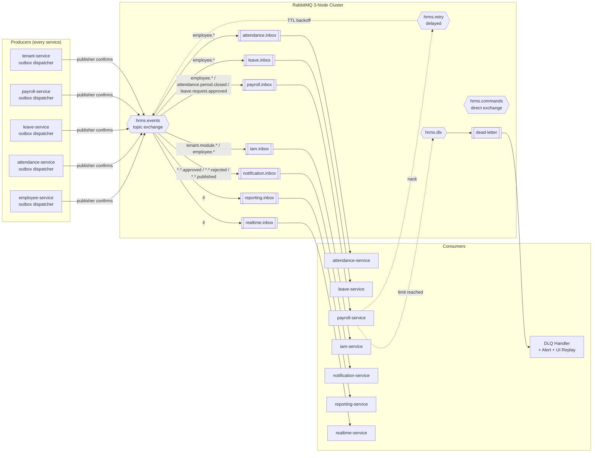
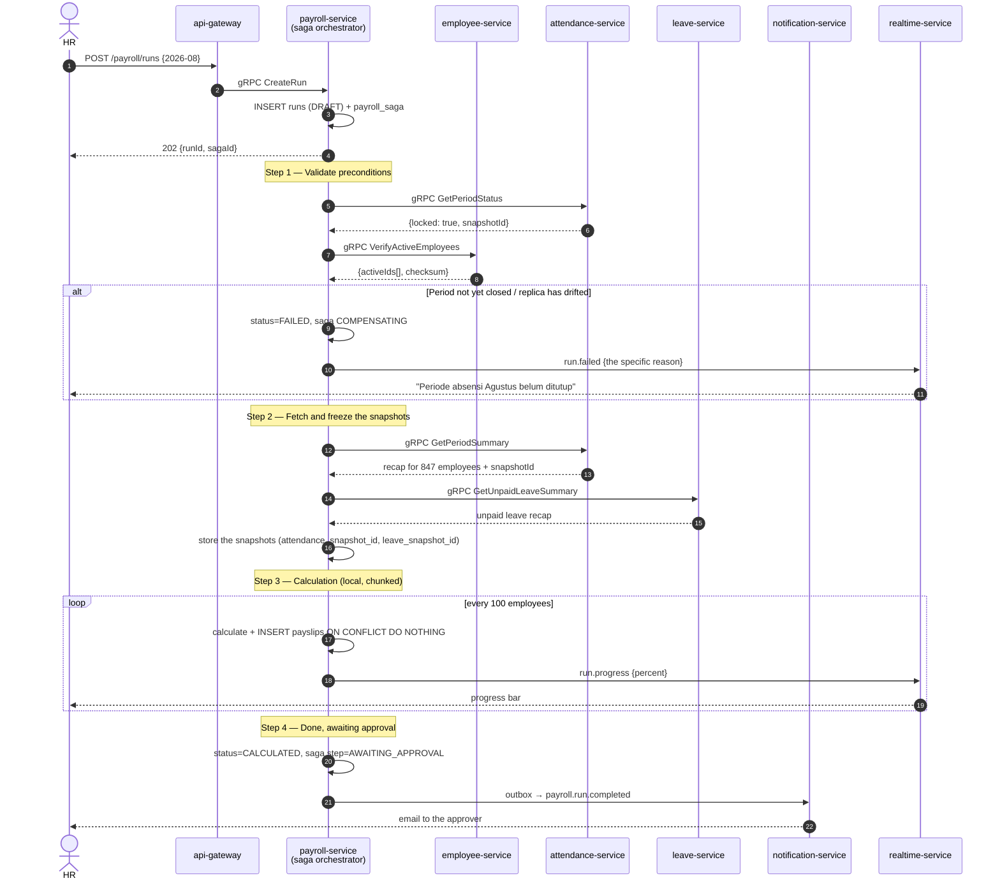
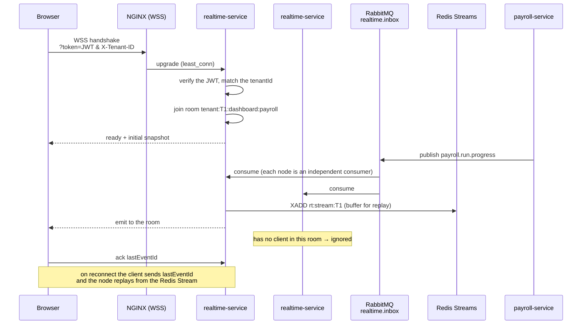

# 03 — Event Bus, Saga, WebSocket & Distributed Concurrency

---

## 1. The Role of the Message Queue in a Microservices Architecture

In a monolith the message queue is an accessory for heavy work. In microservices it is the **backbone of communication**. A broker failure does not mean "jobs are delayed", it means "the services have stopped talking to each other".

The consequences:
- RabbitMQ runs as a 3-node cluster with **quorum queues** (replicated to a majority of nodes).
- Every service owns **its own outbox** — there is no central outbox to become a single point of failure.
- Every consumer **must be idempotent** — the delivery guarantee is *at-least-once*, not *exactly-once*.

### 1.1 Topology



### 1.2 Conventions & Definitions

Routing key format: `{domain}.{aggregate}.{event}` — for example `employee.employee.terminated`, `attendance.period.closed`.

```typescript
// packages/shared/src/messaging/topology.ts
export const TOPOLOGY = {
  exchanges: {
    events:   { name: 'hrms.events',   type: 'topic',  durable: true },
    commands: { name: 'hrms.commands', type: 'direct', durable: true },
    retry:    { name: 'hrms.retry',    type: 'topic',  durable: true },
    dlx:      { name: 'hrms.dlx',      type: 'topic',  durable: true },
  },
  queues: {
    'payroll.inbox': {
      type: 'quorum',
      bindings: [
        'employee.employee.created', 'employee.employee.updated', 'employee.employee.terminated',
        'attendance.period.closed',
        'leave.request.approved', 'leave.request.cancelled',
        'tenant.module.disabled',
      ],
      args: { 'x-queue-type': 'quorum', 'x-dead-letter-exchange': 'hrms.dlx', 'x-delivery-limit': 5 },
      prefetch: 20,
    },
    'attendance.inbox': {
      type: 'quorum',
      bindings: ['employee.employee.*', 'leave.request.approved', 'leave.request.cancelled'],
      args: { 'x-queue-type': 'quorum', 'x-dead-letter-exchange': 'hrms.dlx', 'x-delivery-limit': 5 },
      prefetch: 50,
    },
    'reporting.inbox': {
      type: 'quorum',
      bindings: ['#'],                                  // the projection listens to everything
      args: { 'x-queue-type': 'quorum', 'x-dead-letter-exchange': 'hrms.dlx' },
      prefetch: 100,
    },
    'realtime.inbox': {
      type: 'classic',                                  // may be lost: UI push only
      bindings: ['#'],
      args: { 'x-message-ttl': 60_000, 'x-max-length': 100_000 },
      prefetch: 200,
    },
  },
} as const;
```

> `realtime.inbox` deliberately uses a classic queue with a 60-second TTL. A UI notification that is already a minute old is no longer useful; storing it durably only burdens the broker.

### 1.3 A Transactional Outbox per Service

The problem it solves: writing to the database and then publishing to the broker as two separate operations has two failure modes — the data is saved but the event never leaves (other services never find out), or the event is sent but the data is not saved (other services process a ghost event). In microservices, both mean the data across services diverges permanently.

```typescript
// packages/shared/src/messaging/outbox.ts
export class Outbox {
  /** Called INSIDE the business transaction. Touches no network. */
  static async emit(tx: Prisma.TransactionClient, event: DomainEvent): Promise<void> {
    const ctx = ServiceContextStore.get();
    await tx.outboxEvent.create({
      data: {
        tenantId:      event.tenantId,
        aggregateType: event.aggregateType,
        aggregateId:   event.aggregateId,
        eventType:     event.type,
        eventVersion:  event.version ?? 1,
        payload:       event.payload as Prisma.JsonObject,
        metadata: {
          correlationId: ctx?.correlationId,
          causationId:   ctx?.causationId,
          traceparent:   ctx?.traceparent,
          actorId:       ctx?.actorId ?? 'system',
          sourceService: process.env.SERVICE_NAME,
          emittedAt:     new Date().toISOString(),
        },
      },
    });
  }
}
```

Example use in `employee-service`:

```typescript
// services/employee-service/src/application/terminate-employee.usecase.ts
await withTenant(prisma, tenantId, async (tx) => {
  const updated = await tx.$queryRaw<Employee[]>`
    UPDATE employees
       SET state = 'TERMINATED', termination_date = ${cmd.date}::date,
           termination_reason = ${cmd.reason}, version = version + 1, updated_at = now()
     WHERE id = ${cmd.employeeId}::uuid AND version = ${cmd.expectedVersion}
    RETURNING *`;
  if (!updated.length) throw new ConflictError('STALE_VERSION');

  // The event commits or rolls back together with the data → atomic within this database
  await Outbox.emit(tx, {
    tenantId,
    type: 'employee.employee.terminated',
    aggregateType: 'Employee',
    aggregateId: cmd.employeeId,
    payload: {
      employeeId: cmd.employeeId,
      employeeNumber: updated[0].employee_number,
      terminationDate: cmd.date,
      reason: cmd.reason,
      version: updated[0].version,     // consumers use this for ordering
    },
  });
});
```

The dispatcher runs as a separate process inside every service:

```typescript
// packages/shared/src/messaging/outbox-dispatcher.ts
async dispatchBatch(): Promise<number> {
  return this.prisma.$transaction(async (tx) => {
    // SKIP LOCKED: many service replicas can run the dispatcher without duplication
    const rows = await tx.$queryRaw<OutboxRow[]>`
      SELECT * FROM outbox_events
       WHERE status = 'PENDING' AND available_at <= now()
       ORDER BY id LIMIT 200
       FOR UPDATE SKIP LOCKED`;
    if (!rows.length) return 0;

    for (const row of rows) {
      try {
        await this.amqp.publish('hrms.events', row.event_type,
          { id: row.id, type: row.event_type, tenantId: row.tenant_id,
            payload: row.payload, metadata: row.metadata },
          {
            messageId:   row.id,                    // the consumer's idempotency key
            persistent:  true,
            contentType: 'application/json',
            headers: {
              'x-tenant-id':     row.tenant_id,     // X-Tenant-ID flows all the way into the queue
              'x-correlation-id': row.metadata.correlationId,
              'x-source-service': row.metadata.sourceService,
              'x-event-version':  row.event_version,
              traceparent:        row.metadata.traceparent,
            },
          });
        await tx.$executeRaw`
          UPDATE outbox_events SET status='PUBLISHED', published_at=now() WHERE id=${row.id}::uuid`;
      } catch (err) {
        const attempts = row.attempts + 1;
        const backoff  = Math.min(2 ** attempts, 300);
        await tx.$executeRaw`
          UPDATE outbox_events
             SET attempts=${attempts},
                 available_at = now() + (${backoff} || ' seconds')::interval,
                 status = CASE WHEN ${attempts} >= 10 THEN 'FAILED'::outbox_status ELSE status END,
                 last_error = ${String(err).slice(0, 500)}
           WHERE id=${row.id}::uuid`;
      }
    }
    return rows.length;
  });
}
```

### 1.4 Idempotent Consumers

```typescript
// packages/shared/src/messaging/idempotent-consumer.ts
export abstract class IdempotentConsumer<T> {
  abstract readonly consumerName: string;
  protected abstract execute(payload: T, tx: Prisma.TransactionClient): Promise<void>;

  async handle(msg: ConsumeMessage): Promise<void> {
    const messageId = msg.properties.messageId as string;
    const tenantId  = msg.properties.headers['x-tenant-id'] as string;

    // Validate the context before anything else. A message without a valid tenant goes straight to the DLQ.
    if (!isUuid(tenantId)) {
      this.securityLog.error({ messageId, event: 'MESSAGE_WITHOUT_TENANT' });
      return this.channel.nack(msg, false, false);
    }

    const body = JSON.parse(msg.content.toString());
    if (body.tenantId && body.tenantId !== tenantId) {
      this.securityLog.error({ messageId, event: 'MESSAGE_TENANT_MISMATCH' });
      return this.channel.nack(msg, false, false);
    }

    await ServiceContextStore.run(
      { tenantId, correlationId: msg.properties.headers['x-correlation-id'],
        causationId: messageId, actorId: 'system',
        traceparent: msg.properties.headers.traceparent },
      async () => {
        await withTenant(this.prisma, tenantId, async (tx) => {
          const claimed = await tx.$executeRaw`
            INSERT INTO processed_messages (consumer, message_id)
            VALUES (${this.consumerName}, ${messageId}::uuid)
            ON CONFLICT DO NOTHING`;

          if (claimed === 0) return;         // already processed → skip

          await this.execute(body.payload, tx);
          // The business effect and the idempotency record commit together.
          // A failure inside execute() rolls back both → the message is safe to retry.
        });
      });

    this.channel.ack(msg);
  }
}
```

### 1.5 Retry, Dead Letter, and Error Classification

```typescript
export function classify(err: unknown): 'RETRYABLE' | 'FATAL' {
  if (err instanceof Prisma.PrismaClientKnownRequestError) {
    if (err.code === '40001') return 'RETRYABLE';   // serialization failure
    if (err.code === '40P01') return 'RETRYABLE';   // deadlock
    if (err.code === '23505') return 'FATAL';       // unique violation → the data really is a duplicate
    if (err.code === '23503') return 'FATAL';       // FK violation
    if (err.code === '23514') return 'FATAL';       // check violation → a business rule was broken
  }
  if (err instanceof ZodError)               return 'FATAL';       // the event contract was violated
  if (err instanceof BusinessRuleError)      return 'FATAL';
  if (err instanceof ServiceUnavailableError) return 'RETRYABLE';  // a downstream service is down
  if (err instanceof TimeoutError)           return 'RETRYABLE';
  return 'RETRYABLE';
}
```

| Kind | Path | Limit |
|------|------|-------|
| Transient | Retry inside the consumer with jitter | 3× / 5 seconds |
| Process failure | `hrms.retry` with tiered TTLs | 1 min → 5 min → 30 min → 2 h → 12 h |
| Permanent | Straight to the DLQ | — |
| DLQ | Alert + an admin UI for manual replay | 30-day retention |

### 1.6 Cross-Service Event Catalogue

| Event | Producer | Consumers | Function |
|-------|----------|-----------|----------|
| `tenant.provisioned` | tenant | iam, employee, notification | Seed roles and initial data |
| `tenant.module.enabled` | tenant | iam, gateway-cache, realtime | The module's menu and permissions become active |
| `tenant.module.disabled` | tenant | iam, gateway-cache, every domain | Revoke permissions, stop jobs |
| `tenant.suspended` | tenant | all | Halt write operations |
| `employee.employee.created` | employee | attendance, leave, payroll, performance, planning, reporting | Populate the `employee_ref` replica |
| `employee.employee.updated` | employee | as above | Update the replica |
| `employee.employee.terminated` | employee | payroll (final settlement), leave (forfeit balance), attendance, iam (deactivate the user) | Cross-domain offboarding |
| `employee.org_unit.changed` | employee | reporting, planning | Update the hierarchy |
| `attendance.punch.recorded` | attendance | reporting, realtime | Live dashboard. **The payload carries neither raw coordinates nor a photo reference** — only the status, the work site, and the flags (doc. `10` PR8) |
| `attendance.punch.flagged` | attendance | notification (HR inbox), realtime | The punch entered the review queue |
| `attendance.punch.reviewed` | attendance | reporting, notification | The review outcome; triggers a daily recompute if rejected |
| `attendance.photo.purged` | file | attendance | The photo was deleted per retention; the attendance record remains |
| `attendance.daily.computed` | attendance | reporting, realtime | Daily recap |
| `attendance.period.closed` | attendance | **payroll (the main gate)**, reporting | Payroll is allowed to run |
| `leave.request.submitted` | leave | notification, realtime | Approver inbox |
| `leave.request.approved` | leave | attendance (mark the leave days), payroll, reporting, notification | Leave synchronisation |
| `leave.balance.changed` | leave | reporting, realtime | Balance widget |
| `payroll.run.progress` | payroll | realtime | Progress bar |
| `payroll.run.completed` | payroll | notification, reporting, realtime | Calculation finished |
| `payroll.payslip.published` | payroll | notification (email/ESS) | Payslip distribution |
| `recruitment.candidate.hired` | recruitment | **employee (create the employee)**, notification | Candidate conversion |
| `iam.access.changed` | iam | gateway-cache, realtime | Menus and permissions changed |

### 1.7 Versioned Event Contracts

```typescript
// packages/contracts/src/events/employee.v1.ts
import { z } from 'zod';

export const EmployeeTerminatedV1 = z.object({
  eventType:    z.literal('employee.employee.terminated'),
  eventVersion: z.literal(1),
  tenantId:     z.string().uuid(),
  employeeId:   z.string().uuid(),
  employeeNumber: z.string(),
  terminationDate: z.string().date(),
  reason:       z.string(),
  version:      z.number().int().positive(),   // replica ordering
});
export type EmployeeTerminatedV1 = z.infer<typeof EmployeeTerminatedV1>;

// Consumers validate before processing. A payload that breaks the contract is FATAL, not a retry.
export function parseEvent<T extends z.ZodTypeAny>(schema: T, raw: unknown): z.infer<T> {
  const result = schema.safeParse(raw);
  if (!result.success) {
    throw new ContractViolationError(
      `Event tidak sesuai kontrak: ${result.error.issues.map((i) => i.path.join('.')).join(', ')}`);
  }
  return result.data;
}
```

**The evolution rule:** adding an optional field keeps it at `v1`. Removing a required field, or changing its meaning, requires publishing `v2` and **publishing both versions in parallel** for at least one release cycle. This is the same principle applied to schema migrations (document `09`): additive first, and the old version is retired only after it has been proven to have zero consumption for 14 days — not after it was assumed to be unused. The `@hrms/contracts` package is semver-versioned; raising the major forces every consuming service to update, and fails compilation where it is not ready.

---

## 2. Sagas: Transactions Across Services

This is the largest price microservices charge in an HRIS domain. Without ACID transactions across services, an operation touching several domains has to be run as a sequence of steps with **compensation** when it fails halfway.

### 2.1 The Payroll Run Saga (orchestration)

Payroll is orchestrated rather than choreographed because its steps are strictly sequential, it has a human decision point, and its failures have to be explainable to the user.



### 2.2 The Orchestrator Implementation

```typescript
// services/payroll-service/src/application/payroll-run.saga.ts
export class PayrollRunSaga {
  private readonly steps: SagaStep[] = [
    {
      name: 'VALIDATE_PRECONDITIONS',
      execute: async (s) => {
        const period = await this.attendanceClient.getPeriodStatus({
          tenantId: s.tenantId, periodMonth: s.periodMonth });
        if (!period.locked) {
          throw new SagaAbort('ATTENDANCE_PERIOD_NOT_CLOSED',
            `Periode absensi ${s.periodMonth} belum ditutup. Tutup periode terlebih dahulu.`);
        }
        const verify = await this.employeeClient.verifyActiveEmployees({
          tenantId: s.tenantId, asOf: endOfMonth(s.periodMonth) });
        const drift = await this.detectReplicaDrift(s.tenantId, verify);
        if (drift.length) {
          await this.resyncReplica(s.tenantId, drift);
          throw new SagaRetry('REPLICA_DRIFT',
            `${drift.length} data karyawan tidak sinkron dan telah diperbaiki. Jalankan ulang.`);
        }
        return { periodId: period.periodId, employeeIds: verify.activeIds };
      },
      compensate: async () => { /* read-only, nothing to undo */ },
    },
    {
      name: 'FREEZE_SNAPSHOTS',
      execute: async (s, prev) => {
        const att = await this.attendanceClient.getPeriodSummary({
          tenantId: s.tenantId, periodStart: s.periodStart, periodEnd: s.periodEnd,
          employeeIds: prev.employeeIds });
        const lv = await this.leaveClient.getUnpaidLeaveSummary({
          tenantId: s.tenantId, periodStart: s.periodStart, periodEnd: s.periodEnd });

        await this.repo.saveSnapshots(s.runId, att, lv);
        return { attendanceSnapshotId: att.snapshotId, leaveSnapshotId: lv.snapshotId };
      },
      compensate: async (s) => { await this.repo.clearSnapshots(s.runId); },
    },
    {
      name: 'CALCULATE',
      execute: async (s) => {
        // Advisory lock: only one calculation per (tenant, period) even with 8 worker replicas
        await this.calculator.run(s.runId, s.tenantId, {
          onProgress: (p) => this.realtime.publish(
            `tenant:${s.tenantId}:payroll:${s.runId}`, { type: 'payroll.run.progress', data: p }),
        });
      },
      // Compensating a calculation: delete the payslips already produced.
      // Safe, because at this stage the payslips have not been published to employees.
      compensate: async (s) => {
        await this.repo.deletePayslips(s.runId);
        await this.repo.updateRunStatus(s.runId, 'DRAFT');
      },
    },
    {
      name: 'AWAIT_APPROVAL',
      execute: async (s) => {
        await this.repo.updateRunStatus(s.runId, 'PENDING_APPROVAL');
        return { awaitingHuman: true };     // the saga halts; a user action resumes it
      },
      compensate: async (s) => { await this.repo.updateRunStatus(s.runId, 'CALCULATED'); },
    },
  ];

  async run(sagaId: string) {
    const state = await this.repo.loadSaga(sagaId);
    try {
      for (const step of this.steps.slice(state.completedSteps.length)) {
        const result = await this.executeWithTimeout(step, state);
        if (result?.awaitingHuman) {
          await this.repo.pauseSaga(sagaId, step.name);
          return;
        }
        await this.repo.markStepDone(sagaId, step.name, result);
      }
      await this.repo.completeSaga(sagaId);
    } catch (err) {
      if (err instanceof SagaRetry) {
        await this.repo.scheduleRetry(sagaId, err.backoffMs ?? 60_000);
        return;
      }
      await this.compensate(sagaId, err);
    }
  }

  private async compensate(sagaId: string, cause: unknown) {
    const state = await this.repo.loadSaga(sagaId);
    await this.repo.updateSagaStatus(sagaId, 'COMPENSATING');

    // Compensation runs BACKWARDS from the last step that succeeded
    for (const stepName of [...state.completedSteps].reverse()) {
      const step = this.steps.find((s) => s.name === stepName)!;
      try {
        await step.compensate(state);
        await this.repo.markCompensated(sagaId, stepName);
      } catch (compErr) {
        // A failed compensation is the most dangerous state of all:
        // the system is left inconsistent and needs a human.
        await this.repo.updateSagaStatus(sagaId, 'COMPENSATION_FAILED');
        await this.alerts.critical('SAGA_COMPENSATION_FAILED', { sagaId, stepName, compErr });
        throw compErr;
      }
    }
    await this.repo.updateSagaStatus(sagaId, 'FAILED');
    await this.realtime.publish(`tenant:${state.tenantId}:payroll:${state.runId}`, {
      type: 'payroll.run.failed',
      data: { reason: cause instanceof SagaAbort ? cause.userMessage : 'Terjadi kesalahan sistem' },
    });
  }
}
```

### 2.3 The Candidate-Becomes-Employee Saga (choreography)

This flow is simple and has no branching decision point, so choreography (every service reacting to events) is lighter than an orchestrator:

```
recruitment: application → HIRED
  └─ publish recruitment.candidate.hired

employee: consume recruitment.candidate.hired
  ├─ create employees + employee_positions
  └─ publish employee.employee.created

auth: consume employee.employee.created
  ├─ create users with a temporary password
  └─ publish auth.user.created

iam: consume auth.user.created
  └─ grant the EMPLOYEE role

leave: consume employee.employee.created
  └─ create this year's leave_balances (prorated from hire_date)

notification: consume auth.user.created
  └─ send the invitation email plus the temporary password

recruitment: consume employee.employee.created
  └─ fill in applications.hired_employee_id, requisitions.filled_count += 1
```

**Compensation under choreography** is handled with cancellation events: if `employee-service` fails to create the employee it publishes `employee.creation.failed`, which `recruitment-service` consumes to move the application back to `OFFER` along with a note explaining why.

### 2.4 Stuck Sagas

A saga can stall because a service dies mid-step. A periodic monitor detects it:

```typescript
@Cron('*/2 * * * *')
async detectStuckSagas() {
  const stuck = await this.prisma.$queryRaw<Saga[]>`
    SELECT * FROM payroll_saga
     WHERE status = 'RUNNING' AND timeout_at < now()
     LIMIT 50`;

  for (const saga of stuck) {
    this.logger.error({ sagaId: saga.id, step: saga.current_step }, 'saga passed its deadline');
    metrics.increment('saga.timeout', { saga: 'payroll', step: saga.current_step });

    if (saga.current_step === 'AWAIT_APPROVAL') continue;   // waiting on a human is normal

    // The steps are idempotent, so re-running is safe
    await this.sagaRunner.resume(saga.id);
  }
}
```

A non-zero `saga.timeout` metric is a signal that some service is unstable, not a normal condition.

---

## 3. WebSockets for the Dashboard

### 3.1 Topology

The core problem in microservices: events are produced in 10 different services, while a user's WebSocket connection is held by one of several `realtime-service` nodes. No producing service knows — and must not need to know — which node the user is connected to.



### 3.2 Room Structure

```
/realtime                                     a single namespace
  tenant:{tenantId}                                     company-wide broadcast
  tenant:{tenantId}:dashboard:attendance                attendance widget
  tenant:{tenantId}:dashboard:leave                     leave calendar
  tenant:{tenantId}:dashboard:payroll                   HR cost summary
  tenant:{tenantId}:org:{orgUnitId}                     a particular unit's manager
  tenant:{tenantId}:payroll:{runId}                     run progress
  tenant:{tenantId}:import:{batchId}                    Excel import progress
  user:{userId}                                         personal notifications, approval inbox

/realtime-admin                               a SEPARATE namespace for the control plane
  platform:overview                                     platform KPIs
  platform:health                                       system health, DLQ, sagas
  platform:alerts                                       alerts that need action
  platform:tenant:{tenantId}                            one tenant's status (metadata only)
```

> The two namespaces are separated by **token audience**: `/realtime` accepts only `aud: hrms-api` tokens, `/realtime-admin` only `aud: hrms-admin` tokens carrying the `mfa: true` claim. A tenant token structurally cannot enter the admin namespace, and vice versa. The details are in document `07`, §8.

**A rule that must not be broken:** room membership is always derived from the token claims on the server side. A client may *ask* to subscribe to a channel; `realtime-service` decides whether its permissions and module subscription allow it.

### 3.3 The Realtime Gateway

```typescript
// services/realtime-service/src/realtime.gateway.ts
@WebSocketGateway({
  namespace: '/realtime',
  transports: ['websocket', 'polling'],      // polling = the safety net for corporate proxies
  cors: { origin: env.ALLOWED_ORIGINS, credentials: true },
  pingInterval: 25_000, pingTimeout: 20_000, maxHttpBufferSize: 1e6,
})
export class RealtimeGateway implements OnGatewayConnection, OnGatewayDisconnect {
  @WebSocketServer() server: Server;

  async handleConnection(client: Socket) {
    try {
      const token    = client.handshake.auth?.token;
      const tenantId = client.handshake.auth?.tenantId;          // the WebSocket flavour of X-Tenant-ID
      const claims   = await this.jwt.verify(token);

      // Same rule as the HTTP gateway: the header/handshake must match the token
      if (tenantId && tenantId !== claims.tenantId) {
        this.securityLog.warn({ event: 'WS_TENANT_MISMATCH', tokenTenant: claims.tenantId,
                                claimedTenant: tenantId, ip: client.handshake.address });
        client.emit('error', { code: 'TENANT_MISMATCH' });
        return client.disconnect(true);
      }

      // Fetch effective access from iam-service and entitlement from tenant-service (both cached)
      const [access, subscription] = await Promise.all([
        this.iamClient.getEffectiveAccess({ tenantId: claims.tenantId, userId: claims.sub }),
        this.tenantClient.getSubscription({ tenantId: claims.tenantId }),
      ]);

      client.data.ctx = {
        userId: claims.sub, tenantId: claims.tenantId, employeeId: claims.employeeId,
        permissions: new Set(access.permissions),
        modules: new Set(subscription.modules.filter((m) => m.enabled).map((m) => m.key)),
        orgUnitScope: access.orgUnitIds,
        accessVersion: access.version,
      };

      const conns = await this.redis.incr(`ws:conn:${claims.sub}`);
      await this.redis.expire(`ws:conn:${claims.sub}`, 3600);
      if (conns > 8) { client.emit('error', { code: 'TOO_MANY_CONNECTIONS' }); return client.disconnect(true); }

      await client.join(`tenant:${claims.tenantId}`);
      await client.join(`user:${claims.sub}`);
      client.emit('ready', { serverTime: new Date().toISOString(),
                             availableChannels: this.channelsFor(client.data.ctx) });
    } catch {
      client.emit('error', { code: 'UNAUTHORIZED' });
      client.disconnect(true);
    }
  }

  @SubscribeMessage('subscribe')
  async onSubscribe(@ConnectedSocket() client: Socket,
                    @MessageBody() body: { channel: string; lastEventId?: string }) {
    const ctx    = client.data.ctx;
    const parsed = ChannelSchema.safeParse(body.channel);
    if (!parsed.success) return { ok: false, error: 'INVALID_CHANNEL' };

    const rule = CHANNEL_RULES[parsed.data.kind];
    if (!ctx.modules.has(rule.module))         return { ok: false, error: 'MODULE_NOT_SUBSCRIBED' };
    if (!ctx.permissions.has(rule.permission)) return { ok: false, error: 'FORBIDDEN' };
    if (parsed.data.orgUnitId && !ctx.orgUnitScope.includes(parsed.data.orgUnitId)
        && !ctx.permissions.has(`${rule.module}.read.all`)) {
      return { ok: false, error: 'OUT_OF_SCOPE' };
    }

    const room = `tenant:${ctx.tenantId}:${parsed.data.path}`;
    await client.join(room);

    // A snapshot from reporting-service, and only deltas after that
    const snapshot = await this.reportingClient.getSnapshot({
      tenantId: ctx.tenantId, channel: parsed.data.path });
    client.emit('snapshot', { channel: body.channel, data: snapshot.data, eventId: snapshot.eventId });

    if (body.lastEventId) {
      const missed = await this.streams.replay(ctx.tenantId, body.lastEventId, 500);
      for (const ev of missed) client.emit('event', ev);
    }
    return { ok: true };
  }

  async handleDisconnect(client: Socket) {
    if (client.data.ctx) await this.redis.decr(`ws:conn:${client.data.ctx.userId}`);
  }
}
```

### 3.4 The Event → WebSocket Bridge

```typescript
// services/realtime-service/src/event-bridge.consumer.ts
// Every realtime-service node is an INDEPENDENT consumer (an exclusive queue per node),
// not a consumer group — because the clients for a room may live on any node.
@Injectable()
export class EventBridgeConsumer implements OnModuleInit {
  async onModuleInit() {
    const queueName = `realtime.inbox.${process.env.POD_NAME}`;
    await this.channel.assertQueue(queueName, {
      exclusive: true, autoDelete: true,         // disappears when the pod dies
      arguments: { 'x-message-ttl': 60_000, 'x-max-length': 50_000 },
    });
    await this.channel.bindQueue(queueName, 'hrms.events', '#');

    await this.channel.consume(queueName, async (msg) => {
      const tenantId = msg.properties.headers['x-tenant-id'];
      const body     = JSON.parse(msg.content.toString());

      const mapping = EVENT_TO_ROOM[body.type];
      if (!mapping) return this.channel.ack(msg);   // this event is not relevant to the UI

      for (const room of mapping.rooms(tenantId, body.payload)) {
        // Socket.IO only sends to sockets that are actually in the room on this node
        this.coalescer.emit(room, { type: body.type, data: mapping.project(body.payload) });
      }
      this.channel.ack(msg);
    });
  }
}

// Storm damper: 500 punches per second become ~4 messages per second per room
class EventCoalescer {
  private buffer = new Map<string, RealtimeEvent[]>();

  emit(room: string, event: RealtimeEvent) {
    const list = this.buffer.get(room) ?? [];
    list.push(event);
    this.buffer.set(room, list);
    if (!this.timers.has(room)) {
      this.timers.set(room, setTimeout(() => this.flush(room), 250));
    }
  }

  private flush(room: string) {
    const events = this.buffer.get(room) ?? [];
    this.buffer.delete(room);
    this.timers.delete(room);
    if (events.length === 1) this.server.to(room).emit('event', events[0]);
    else if (events.length > 1) this.server.to(room).emit('events', { batch: events });
  }
}
```

### 3.5 The Client

```typescript
// apps/web/src/lib/realtime/use-realtime-channel.ts
export function useRealtimeChannel<T>(channel: string, initial: T) {
  const [state, setState]   = useState<T>(initial);
  const [status, setStatus] = useState<'connecting'|'live'|'reconnecting'|'offline'>('connecting');
  const lastEventId = useRef<string>();

  useEffect(() => {
    const socket = getSocket();     // a singleton; one connection for the whole application
    const subscribe = () => socket.emit('subscribe', { channel, lastEventId: lastEventId.current });

    socket.on('connect', () => { setStatus('live'); subscribe(); });
    socket.on('snapshot', (m) => {
      if (m.channel !== channel) return;
      setState(m.data); lastEventId.current = m.eventId; setStatus('live');
    });
    socket.on('event',  (ev) => { lastEventId.current = ev.eventId; setState((p) => applyDelta(p, ev)); });
    socket.on('events', (b)  => { setState((p) => b.batch.reduce(applyDelta, p)); });
    socket.on('disconnect', () => setStatus('reconnecting'));
    socket.io.on('reconnect_failed', () => setStatus('offline'));

    if (socket.connected) subscribe();
    return () => { socket.emit('unsubscribe', { channel }); socket.off('snapshot'); socket.off('event'); };
  }, [channel]);

  return { state, status };
}
```

**Graded degradation:**
```
1. WebSocket           → latency < 100 ms
2. HTTP long-polling   → latency < 1 s          (Socket.IO falls back automatically)
3. REST polling, 30 s  → a "Mode pembaruan lambat" banner
```
The dashboard must not stop working without WebSockets — real time is an enhancement, not a prerequisite.

### 3.6 Scaling

| Aspect | Decision |
|--------|----------|
| Sticky sessions | Not needed for the `websocket` transport; needed for the polling fallback → `ip_hash` in NGINX |
| Capacity | 10,000 connections per pod; `worker_connections` and `ulimit -n` are raised |
| Backpressure | When `client.conn.writableLength > 1 MB`, stop the deltas and force a fresh snapshot on recovery |
| Token expiry | A per-socket timer sends `token_expiring` 60 s before `exp`; disconnect if it is not renewed |
| Access changes | An `iam.access.changed` event makes the client reload `/me/bootstrap`; if a permission was revoked, the socket is forced to re-subscribe |

```nginx
upstream realtime {
    least_conn;
    server realtime-1:3001 max_fails=2 fail_timeout=10s;
    server realtime-2:3001 max_fails=2 fail_timeout=10s;
    keepalive 64;
}
server {
    listen 443 ssl http2;
    location /realtime {
        proxy_pass         http://realtime;
        proxy_http_version 1.1;
        proxy_set_header   Upgrade    $http_upgrade;
        proxy_set_header   Connection "upgrade";
        proxy_set_header   X-Tenant-Id $http_x_tenant_id;
        proxy_read_timeout 3600s;
        proxy_send_timeout 3600s;
        proxy_buffering    off;
    }
}
```

---

## 4. Handling Concurrency

### 4.1 Simultaneous Leave Approvals

An employee with 2 days of leave left files two 2-day requests; two managers approve at the same moment. This whole operation sits **inside one service** (`leave-service`), so it is handled with an ordinary database transaction — which is precisely why the service boundary was drawn so that the leave balance and its approvals are never separated.

```typescript
// services/leave-service/src/application/approve-leave.usecase.ts
async approve(cmd: ApproveLeaveCommand) {
  return withTenant(this.prisma, cmd.tenantId, async (tx) => {
    // Layer 1 — a pessimistic row lock; the second transaction WAITS here
    const [balance] = await tx.$queryRaw<Balance[]>`
      SELECT id, available_days FROM leave_balances
       WHERE employee_id = ${cmd.employeeId}::uuid
         AND leave_type_id = ${cmd.leaveTypeId}::uuid
         AND period_year = ${cmd.year}
       FOR UPDATE`;
    if (!balance) throw new BusinessRuleError('BALANCE_NOT_FOUND');

    // Layer 2 — validation reads the post-lock value
    if (Number(balance.available_days) < cmd.days) {
      throw new BusinessRuleError(
        `Saldo cuti tidak mencukupi: tersisa ${balance.available_days} hari, diminta ${cmd.days} hari`);
    }

    // Layer 3 — an optimistic guard; stops a double approval from two tabs
    const updated = await tx.$executeRaw`
      UPDATE leave_requests SET status='APPROVED', decided_at=now(), version=version+1
       WHERE id=${cmd.requestId}::uuid AND status='PENDING' AND version=${cmd.expectedVersion}`;
    if (updated === 0) throw new ConflictError('REQUEST_ALREADY_DECIDED');

    // Layer 4 — mutate the balance and the ledger
    await tx.$executeRaw`
      UPDATE leave_balances
         SET pending_days = pending_days - ${cmd.days}, used_days = used_days + ${cmd.days},
             version = version + 1
       WHERE id = ${balance.id}::uuid`;
    // Layer 5 — the chk_no_negative_balance CHECK: the last safety net, in the database

    await tx.balanceLedger.create({ data: { tenantId: cmd.tenantId, balanceId: balance.id,
      entryType: 'CONSUME', days: -cmd.days, referenceType: 'LEAVE_REQUEST',
      referenceId: cmd.requestId, createdBy: cmd.approverId }});

    // Layer 6 — the event to attendance and payroll commits along with it
    await Outbox.emit(tx, { tenantId: cmd.tenantId, type: 'leave.request.approved',
      aggregateType: 'LeaveRequest', aggregateId: cmd.requestId,
      payload: { requestId: cmd.requestId, employeeId: cmd.employeeId, days: cmd.days,
                 period: cmd.period, affectsPayroll: cmd.affectsPayroll }});
  });
}
```

### 4.2 Payroll Run Twice

```typescript
// Layer 1 — an Idempotency-Key at the gateway
@Post('/payroll/runs') @UseGuards(IdempotencyGuard)

// Layer 2 — a unique partial index (doc. 02 §9):
//   uq_run_active ON runs (tenant_id, period_month, run_type) WHERE status <> 'CANCELLED'
//   → the second INSERT fails with 23505 → converted to 409 Conflict

// Layer 3 — a transactional advisory lock; it protects the process, not a single row
const lockKey = hashInt64(`payroll:${tenantId}:${periodMonth}`);
const [{ acquired }] = await tx.$queryRaw<[{acquired: boolean}]>`
  SELECT pg_try_advisory_xact_lock(${lockKey}) AS acquired`;
if (!acquired) throw new ConcurrencyError('PAYROLL_ALREADY_RUNNING');
// The lock releases automatically when the transaction ends, including when the pod dies —
// it leaves no orphaned lock behind, the way a Redis-based lock does.

// Layer 4 — a strict state machine
const ALLOWED: Record<RunStatus, RunStatus[]> = {
  DRAFT:            ['VALIDATING','CANCELLED'],
  VALIDATING:       ['CALCULATING','FAILED'],
  CALCULATING:      ['CALCULATED','FAILED'],
  CALCULATED:       ['PENDING_APPROVAL','CALCULATING','CANCELLED'],
  PENDING_APPROVAL: ['APPROVED','CALCULATED','CANCELLED'],
  APPROVED:         ['PAID','CANCELLED'],
  PAID:             [],                      // terminal
  FAILED:           ['VALIDATING','CANCELLED'],
  CANCELLED:        [],
};

// Layer 5 — per-row idempotency; a worker resuming after a crash skips what is already done
await tx.$executeRaw`INSERT INTO payslips (...) VALUES (...) ON CONFLICT (run_id, employee_id) DO NOTHING`;
```

### 4.3 Duplicate Punches from an Attendance Machine

A fingerprint machine loses its network connection and then re-sends a batch of 500 punches.

```typescript
await tx.$executeRaw`
  INSERT INTO punch_logs (tenant_id, employee_id, punched_at, work_date, punch_type, source, device_id, raw_payload)
  SELECT * FROM unnest(${tenantIds}::uuid[], ${employeeIds}::uuid[], ${punchedAts}::timestamptz[],
                       ${workDates}::date[], ${types}::punch_type[], ${sources}::punch_source[],
                       ${deviceIds}::text[], ${payloads}::jsonb[])
  ON CONFLICT (tenant_id, dedupe_key) DO NOTHING`;
```
Plus an application-level *dedupe window*: two `IN` punches from the same employee within 60 seconds count as one (a finger placed on the reader twice).

### 4.4 Events Arriving Out of Order

Characteristic of microservices, with no equivalent in a monolith: `employee.updated` (version 5) can arrive **before** `employee.updated` (version 4) because it went through a different retry path.

```sql
-- The fix: a version guard on every replica upsert
INSERT INTO employee_ref (...) VALUES (...)
ON CONFLICT (employee_id) DO UPDATE SET
  full_name = EXCLUDED.full_name, state = EXCLUDED.state,
  source_version = EXCLUDED.source_version, synced_at = now()
WHERE employee_ref.source_version < EXCLUDED.source_version;   -- an older version is ignored
```

### 4.5 Colliding Attendance Recomputations

A manual HR correction and the scheduled batch touch the same `daily_records` row:

```sql
INSERT INTO daily_records (...) VALUES (...)
ON CONFLICT (tenant_id, employee_id, work_date) DO UPDATE
SET worked_minutes = EXCLUDED.worked_minutes, status = EXCLUDED.status,
    computed_at = now(), computed_by = EXCLUDED.computed_by, version = daily_records.version + 1
WHERE daily_records.is_locked = false                        -- a closed period does not change automatically
  AND daily_records.computed_at < EXCLUDED.computed_at       -- reject a stale result
  AND daily_records.computed_by <> 'hr_manual_override';     -- a manual correction beats the batch
```

### 4.6 Concurrent Edits to Master Data

```typescript
const affected = await tx.$executeRaw`
  UPDATE employees SET full_name=${dto.fullName}, phone=${dto.phone},
         version = version + 1, updated_at = now()
   WHERE id = ${id}::uuid AND version = ${dto.version}`;

if (affected === 0) {
  const current = await tx.employee.findUnique({ where: { id } });
  throw new ConflictException({
    code: 'STALE_VERSION',
    message: 'Data telah diubah pengguna lain saat Anda menyunting.',
    currentVersion: current.version,
    conflictingFields: diff(dto, current),   // the UI shows a side-by-side comparison
  });
}
```
Plus a presence indicator through the `tenant:{id}:entity:employee:{employeeId}` room — preventing a conflict beats resolving one.

### 4.7 Deadlocks

1. **A uniform lock ordering** within a service, established as a team standard.
2. **Automatic retries** for `40001` and `40P01`.
3. **No network calls inside a database transaction** — a rule that is far more critical under microservices, because a gRPC call to a slow service holds a database lock for precious seconds.

```typescript
export async function withRetry<T>(fn: () => Promise<T>, maxAttempts = 3): Promise<T> {
  let lastErr: unknown;
  for (let attempt = 1; attempt <= maxAttempts; attempt++) {
    try { return await fn(); }
    catch (err) {
      lastErr = err;
      const code = (err as any)?.code ?? (err as any)?.meta?.code;
      if (code !== '40001' && code !== '40P01') throw err;
      await sleep(Math.min(50 * 2 ** attempt, 1_000) + Math.random() * 50);
      metrics.increment('db.transaction.retry', { code, attempt });
    }
  }
  throw lastErr;
}
```

### 4.8 Matrix Summary

| Scenario | Primary mechanism | Safety net | Location |
|----------|-------------------|------------|----------|
| Simultaneous leave | `SELECT … FOR UPDATE` | `CHECK` balance ≥ 0 + an `EXCLUDE` on overlap | leave-service |
| Double payroll | Idempotency key + advisory lock | Unique partial index | payroll-service |
| Duplicate punches | Application dedupe window | Unique index on `dedupe_key` | attendance-service |
| Out-of-order events | `source_version` guard | `WHERE version <` on the upsert | every replica |
| Colliding recompute | `computed_at` guard | `ON CONFLICT … WHERE` | attendance-service |
| Lost update on master data | Optimistic `version` | — | every service |
| Duplicate events | Outbox + `messageId` | `processed_messages` PK | every consumer |
| Saga failing halfway | Backwards compensation | Stuck-saga monitor | the orchestrator |
| Deadlock | Uniform lock ordering | PostgreSQL detection | every service |

---

## 5. Observability in a Distributed System

An event-driven system with 16 services fails silently. Instrumentation is not optional.

### 5.1 Traces That Cross Every Boundary

```typescript
// One user click produces one trace crossing HTTP → gRPC → outbox → MQ → worker → WS
await channel.publish(exchange, routingKey, buffer, {
  messageId: event.id,
  headers: {
    ...propagation.inject(context.active(), {}),   // W3C traceparent
    'x-tenant-id':      event.tenantId,
    'x-correlation-id': ctx.correlationId,
    'x-source-service': process.env.SERVICE_NAME,
  },
});
```

### 5.2 Metrics & Alert Thresholds

| Metric | Threshold | Meaning |
|--------|-----------|---------|
| `outbox_pending_age_seconds{service}` p99 | > 60 s | The dispatcher is stalling or the broker is unhealthy |
| `rabbitmq_queue_depth{queue}` | > 5,000 | Consumers are slower than producers |
| `dlq_messages_total` | > 0 | **Always** needs human investigation |
| `replica_lag_seconds{service}` p95 | > 30 s | Cross-service data is starting to diverge |
| `replica_drift_detected_total` | > 0/week | There is a bug on the event path |
| `saga_timeout_total` | > 0 | A service is unstable mid-saga |
| `saga_compensation_failed_total` | > 0 | **Critical** — the system is left inconsistent |
| `circuit_breaker_state{target}` = open | > 0 | A downstream service is down |
| `grpc_client_duration_seconds{callee}` p95 | > 1 s | A downstream service is slowing down |
| `ws_emit_latency_seconds` p95 | > 2 s | The real-time SLA is breached |
| `event_consume_lag_seconds{service}` | > 120 s | More replicas are needed |

### 5.3 Mandatory Dashboards

1. **Event Flow Map** — production vs consumption per event type, per service. An imbalance means events are being lost or piling up.
2. **Queue Health** — depth, consumption rate, DLQ age.
3. **Replica Health** — lag and drift per service.
4. **Service Dependency Map** — generated from trace data; shows who calls whom and at what latency.
5. **Saga Board** — sagas running, stuck, and failed to compensate.
6. **Real-time Sessions** — connections per node, room sizes, emit latency.
