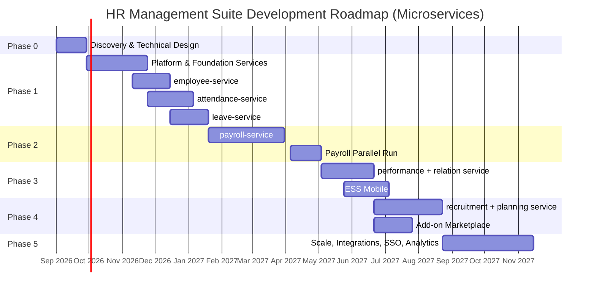

# 04 — Development Phases, Team, and Risk Management

---

## 1. Roadmap Philosophy

Four rules bind the planning:

1. **Every phase produces something a real customer uses.** There is no "build infrastructure only" phase running two months with no visible output.
2. **Service order follows user value, not technical convenience.** Attendance and Leave come first because both are daily pain; Payroll follows because it depends on both and a miscalculation is fatal.
3. **The distributed foundation is built before the first domain service.** The outbox, idempotency, the saga runner, tracing, RLS, and the gateway are cross-cutting. Fitting them after 12 services exist means rewriting 12 services.
4. **The cost of microservices is paid up front.** Phase 1 is longer than a monolithic approach would be, because a *platform* has to be built first. This is not waste — it is a consequence of the chosen architecture, and hiding it in the estimate only turns it into a delay later.

---

## 2. Phase Map



**Total to GA with coverage equivalent to the reference product's Ultimate plan: ± 14.5 months.**

---

## 3. Phase 0 — Discovery & Technical Design (4 weeks)

### Goal
Remove the largest uncertainties before any production code is written. In a microservices architecture those uncertainties sit in two places: the payroll business rules, and **whether 16 services are operationally viable for a team this size**.

### Activities

| Activity | Output |
|----------|--------|
| Interview 8–12 HR practitioners (including users of the reference Excel product) | AS-IS process map, ranked list of pain points |
| Collect real artefacts: payroll Excel files, fingerprint machine export formats, leave policies | Business rule catalogue |
| Regulatory study: PPh21 under the TER scheme, BPJS, the Labour Law, the Personal Data Protection Act | Compliance matrix |
| **Cross-domain event storming** | Final service boundaries, event catalogue, first gRPC contracts |
| Technical spikes | See below |
| System design & contract finalisation | Documents 01–06 agreed |

**Event storming** is a new activity that becomes critical in microservices: a wrong service boundary is the most expensive mistake in this architecture, and it is far cheaper to fix on a whiteboard than after the code is written.

### Mandatory Spikes

| Spike | Question | Pass criterion |
|-------|----------|----------------|
| S1 — Payroll calculation | Can Node.js compute 1,000 employees × 20 components in under 3 minutes? | Achieved, or the decision to use a Go engine is taken now |
| S2 — WebSocket fan-out | Do 3 realtime nodes hold up at 5,000 connections + 500 events/s? | p95 emit latency < 2 s |
| S3 — RLS overhead | What penalty does RLS impose on a 10-million-row table? | Overhead < 15% |
| S4 — Excel import | Are 5,000 rows validated and committed in under 60 s with per-row error reporting? | Achieved |
| S5 — PPh21 accuracy | Does it match 30 test cases taken from real payslips? | 30/30 exact to the rupiah |
| S6 — `SET LOCAL` + PgBouncer | Is it safe under transaction pooling at 500 rps? | Zero context leaks in 1 million transactions |
| **S7 — gRPC chain latency** | What does gateway → 3 services → DB cost compared with a direct call? | Added p95 < 80 ms |
| **S8 — Saga & compensation** | Does compensation run correctly when a service is killed mid-saga? | 100% of sagas end consistent or alerted |
| **S9 — Local developer experience** | How long, and how much RAM, does it take to run the system on a laptop? | < 5 minutes, < 8 GB, and a "3 services locally" mode that works |

> **S9 is the spike most often skipped and most often destroys productivity.** If a developer needs 20 minutes and 16 GB of RAM to run the system, they will stop running integration tests locally, and quality collapses quietly. This gate matters as much as S5.

### Phase 0 Definition of Done
- [ ] Documents 01–06 reviewed and approved by technical and business stakeholders
- [ ] Nine spikes passed, or each produced a written architectural decision
- [ ] Final service boundaries agreed along with the cross-service event catalogue
- [ ] 30 payroll test cases documented with their expected results
- [ ] Repository, CI, the `dev` K8s cluster, and basic observability all running

---

## 4. Phase 1 — Platform, Control Plane & the First Three Domain Services (16 weeks)

### 4.1 Sprints 1–2: The Distributed Platform Foundation

No domain service starts before this is finished. Every service is built on top of it.

- Monorepo (pnpm + Turborepo), service template, scaffold generator
- `@hrms/shared`: `ServiceContext`, `withTenant`, the outbox, `IdempotentConsumer`, fault-tolerant gRPC clients, the saga runner
- `@hrms/contracts`: Zod event schemas plus generated protobuf types, published as a versioned package
- RabbitMQ topology, DLQ, replay UI
- End-to-end OpenTelemetry: HTTP → gRPC → outbox → MQ → consumer
- K8s cluster, Helm chart templates, Argo CD, default-deny NetworkPolicy
- CI pipeline: tests, `buf breaking`, tenant isolation tests, database boundary tests
- **Non-destructive migration tooling** (document `09`): the SQL linter, a runner with `lock_timeout` + retry, the batched backfill framework, the `deprecated_columns` catalogue, schema drift detection
- `docker-compose.dev.yml` with a "this service local, the rest from the registry" mode

### 4.2 Sprints 3–5: Platform Services & the Control Plane

- `tenant-service`: tenants, plans, modules, entitlement, lifecycle, the provisioning saga
- `auth-service`: `tenantCode + email + password` login, JWT, sessions, refresh rotation, account locking, password reset
- `iam-service`: roles, permissions, menus, per-user grants (the implementation of document `05`), effective access resolution
- `api-gateway`: `ROUTE_MANIFEST`, `X-Tenant-ID` vs token validation, `EntitlementGuard`, `PermissionGuard`, `/me/bootstrap`
- A basic `notification-service` (email)
- `file-service` (S3/MinIO, presigned URLs)
- Frontend shell: login, a dynamic sidebar built from the bootstrap, route guarding, the upsell page for a locked module
- **PWA** (document `11`): manifest and icons, a Workbox service worker, a caching strategy per data type, cache separation per tenant and user, a full wipe on logout, a controlled update flow plus `X-Min-Client-Version` negotiation, performance budgets as a CI gate

**Control plane (document `07`):**
- `platform_db`, `platform-service`, `admin-gateway` on the `admin.hrms.id` domain
- Superuser authentication: password + mandatory TOTP (enforced by a DB constraint), IP allowlist, 8-hour sessions, every action audited including reads
- A separate `apps/admin` application: a basic global dashboard (tenant list, KPIs, system health)
- The `tenant_metrics_daily` and `tenant_health` projections built from aggregate events
- An egress NetworkPolicy for `platform-service` plus a plane-separation test as a CI gate

**Tenant dashboard:**
- The `rpt_tenant_dashboard` and `rpt_team_dashboard` read models
- Three scopes: the tenant dashboard (`TENANT_OWNER`/`HR_ADMIN`), the team dashboard (`DEPT_HEAD`/`LINE_MANAGER`), the ESS home page (`EMPLOYEE`)
- Widget assembly from the intersection of subscription × permission

### 4.3 Sprints 5–7: `employee-service`

- Employee CRUD with an Excel-like grid (AG Grid), search, saved filters
- Organisational structure (ltree), positions, period-based assignments, employment contracts
- Employee documents, PII encryption, permission-based masking
- **The Excel import wizard** — the migration path for customers of the reference product
- Publishing `employee.*` events plus a checksum endpoint for replica reconciliation

### 4.4 Sprints 6–9: `attendance-service`

- Shift master data, scheduling, the holiday calendar
- Punch ingestion: manual upload, REST, machine webhook, web/mobile punching
- **The PWA offline attendance queue** (document `11` §6): IndexedDB, layered sync triggers, the iOS durability warning, the installation guide
- **Attendance evidence** (document `10`): capturing coordinates plus a selfie, the camera and location permission flow, `work_sites` + a Haversine geofence, layered trust scoring, the HR review queue, the photo pipeline (presign → strip EXIF → thumbnail → 90-day retention), Tier 1 face detection, the Personal Data Protection Act consent screen
- The `employee_ref` replica consumer plus scheduled reconciliation
- The daily calculation engine, manual correction with an audit trail
- Period closing + `period_snapshots` + the `GetPeriodSummary` gRPC call
- `realtime-service` + **the first real-time dashboard**
- `reporting-service` + the `rpt_daily_attendance` projection

### 4.5 Sprints 8–10: `leave-service`

- Leave types, accrual policies, annual balance creation
- Submission plus a multi-step approval flow
- A team/department leave calendar with real-time updates
- The balance movement ledger plus the carry-over expiry job
- Full concurrency handling (doc. 03, §4.1)
- A two-way consumer relationship with `attendance-service`

### 4.6 Phase 1 Definition of Done

**Functional**
- [ ] A new company registers, imports 500 employees from Excel, and sees the dashboard in under 30 minutes
- [ ] Attendance arrives automatically from the fingerprint machine; the dashboard updates in under 2 seconds
- [ ] **Mobile punching captures coordinates plus a photo; a punch outside the geofence is still recorded and flagged, never lost**
- [ ] **A denied camera/location permission is handled per tenant policy without breaking the app**
- [ ] **A flagged punch enters the HR review queue — neither silently accepted nor automatically rejected**
- [ ] **EXIF is stripped from every photo; photos past their retention are deleted automatically while the attendance record stays intact**
- [ ] **The PWA is installable; Lighthouse PWA 100, Performance ≥ 90 on the mobile profile**
- [ ] **Offline punches from the browser are stored and sent when back online, with no duplicates even if the flush runs twice**
- [ ] **Payroll, dashboard, and confidential-case endpoints never enter Cache Storage — verified by an automated test**
- [ ] **The cache and the push subscription are fully wiped on logout; user A's data cannot be read by user B on the same device**
- [ ] **Tokens are never stored in Cache Storage or IndexedDB**
- [ ] **The PWA tests run on both Chromium and WebKit**
- [ ] The leave flow runs from submission through approval; the balance is deducted accurately
- [ ] The sidebar shows only subscribed modules; endpoints of other modules refuse with 402

**Technical — general**
- [ ] Test coverage: ≥ 80% of the domain layer, ≥ 60% overall
- [ ] Concurrency test: 50 simultaneous leave approvals against a 2-day balance → exactly 1 succeeds
- [ ] Load test: 500 concurrent users, p95 < 400 ms end to end through the gateway
- [ ] Restore-from-backup tested and documented for every service database

**Technical — migrations**
- [ ] **The migration linter blocks `DROP TABLE`, `TRUNCATE`, `RENAME`, and non-concurrent `CREATE INDEX`**
- [ ] **Every migration is idempotent: running it three times in a row still succeeds**
- [ ] **The backward-compatibility test passes: the new schema plus the previous code version stays healthy**
- [ ] **Timing test on a 5-million-row table: no lock held longer than 2 seconds**
- [ ] **The backfill framework is proven to pause, resume, and re-run without corrupting data**
- [ ] **Schema drift detection runs daily and reports zero differences**

**Technical — microservices-specific**
- [ ] **100% of `tenant_id` tables are protected by RLS in every service, verified in CI**
- [ ] **The `TENANT_MISMATCH` test passes: a header that differs from the token is always rejected**
- [ ] **The database boundary test passes: one service's credentials cannot reach another service's database**
- [ ] **Zero gateway routes without an entry in `ROUTE_MANIFEST`**
- [ ] **Killing `employee-service` does not stop `attendance-service`** (graceful degradation, an explicit chaos test)
- [ ] **Replica lag p95 < 30 seconds; drift is detected and corrected automatically**
- [ ] **An end-to-end trace is visible in Jaeger for one user action touching 4 services**
- [ ] **Version compatibility test: two service versions run side by side without failure**

**Technical — control plane separation**
- [ ] **A superuser token (`aud: hrms-admin`) is rejected by `api-gateway`; a tenant token is rejected by `admin-gateway`**
- [ ] **`platform-service` is proven unable to connect to any domain service database**
- [ ] **`platform_db` has not a single column containing personal data, verified in CI**
- [ ] **A superuser account without MFA cannot be activated (refused by a database constraint)**
- [ ] **`EMPLOYEE` is denied the tenant dashboard; `LINE_MANAGER` receives no cost widget**
- [ ] **Aggregates covering fewer than 5 subjects are hidden on the global dashboard**

**Operational**
- [ ] Grafana dashboards for event flow, queue health, replica health, and the saga board
- [ ] DLQ and `saga_compensation_failed` alerts wired to PagerDuty
- [ ] Runbooks for the 7 most likely incidents: broker down, service unresponsive, queue backlog, replica drift, stuck saga, DB connections exhausted, realtime gateway down

### 4.7 Closed Beta Release Criteria
5–10 pilot companies (20–200 employees). Success metric: ≥ 70% of pilots still active after 4 weeks.

---

## 5. Phase 2 — `payroll-service` (10 weeks + 4 weeks parallel run)

The riskiest phase. A payroll error is not a bug — it is a trust incident that is rarely recoverable.

### 5.1 Scope
- Configurable salary components (fixed, formula, percentage, per day/hour)
- A per-employee salary structure with period-based history
- A sandboxed rule engine for formulas — **no `eval()`**, an allowlisted expression parser
- PPh21 under the TER scheme plus the December annual calculation, PTKP, gross/gross-up/net
- BPJS Ketenagakerjaan (JHT, JP, JKK, JKM) and Kesehatan with wage ceilings
- Proration for mid-month joiners and leavers, overtime per the Kepmenaker formula
- THR and bonuses as a separate `run_type`
- **The complete payroll run saga** with compensation (doc. 03, §2)
- PDF payslips, ESS/email distribution, bank export (BCA, Mandiri, BNI, BRI)
- Reports: periodic tax filing, the BPJS recap, the accounting journal

### 5.2 A Quality Strategy of Its Own

| Layer | Approach |
|-------|----------|
| Unit tests | Every component tested in isolation against the Phase 0 case table |
| Property tests | Net pay is never negative; the payslip line total equals the header; recalculation is deterministic |
| Golden regression tests | 30 cases from real payslips run on every commit; a one-rupiah deviation fails the build |
| **Snapshot determinism test** | Recalculating from the same `attendance_snapshot_id` must give an identical result even if the upstream data changed |
| **Saga test** | Every step is force-killed; the system must end up consistent or alerted |
| **Parallel run (4 weeks)** | Pilots run payroll in both the old **and** the new system; release only after 3 identical cycles |
| Audit trail | `calculation_trace` stores every step — when an employee disputes their pay, HR shows the breakdown instead of arguing |

### 5.2b The PWA Capabilities That Accompany This Phase

Web Push plus subscriptions, and the tiered notification path in `notification-service`: web push → native push (when the app is installed) → email → WhatsApp for anything urgent. The tiered path is necessary because Web Push is unreliable on iOS unless the PWA has been installed to the Home Screen (document `11` §7).

### 5.3 The Expansion Module That Accompanies This Phase

**`contract-compliance`** (document `08`, A5) — an extension of `employee-service`, not a new service. Tracking the validity of fixed-term contracts, certificates, and work permits with tiered reminders at 90, 30, and 7 days out.

It sits here because its complexity is small (± 2 person-months), its data already exists, and the work does not touch the payroll critical path. Its value is easy to explain to a buyer: one fixed-term contract that lapses into a permanent one is a permanent legal loss exceeding a year's subscription.

### 5.4 Definition of Done
- [ ] 3 parallel payroll cycles identical to the old system down to the rupiah
- [ ] 1,000 employees in under 3 minutes; 10,000 employees in under 20 minutes
- [ ] Running the same run twice produces exactly one run
- [ ] Killing `payroll-service` mid-calculation → another pod continues, with no duplicate payslips
- [ ] A saga failure at any step ends in a clean state and is explained to the user
- [ ] A payslip is visible only to its owner and to holders of `payroll.payslip.read.all`, tested with a cross-tenant token
- [ ] Tax regulation changes are applied through configuration, without a redeploy
- [ ] MFA is available for roles with payroll access

---

## 6. Phase 3 — `performance-service`, `relation-service`, ESS Mobile (7 + 6 weeks)

### Scope
- **performance-service**: appraisal cycles, weighted KPIs, self plus manager assessment, calibration, the 9-box grid
- **relation-service**: employee cases, warning letters SP1–SP3 with validity periods, confidential grievances with a per-case ACL and audited reads
- **ESS Mobile** (React Native) — **scope narrowed after the PWA**: only the capabilities the web cannot provide, namely a reliable offline queue, mock-GPS and rooted-device detection, dependable iOS push, and the native camera. The general ESS needs (request leave, view a payslip, the directory) have been served by the PWA since Phase 1 and are not rebuilt.
- The native app's target users narrow to field workers, sales, and tenants with strict compliance requirements (document `11` §2.4)
- Time consistency validation for offline punches, Wi-Fi SSID verification as a cross-signal, and a screen where an employee sees their own evidence history
- The full `notification-service`: email, push, WhatsApp Business API

### Design note
`relation-service` handles the most sensitive data in the system (harassment allegations, disciplinary sanctions). It uses an **explicit per-case ACL** rather than roles alone, and **every read** is logged — including reads by administrators.

### Definition of Done
- [ ] The ESS app passes App Store and Play Store review
- [ ] Offline attendance is stored locally and synced when the network returns, with no duplicates (`dedupe_key`)
- [ ] Device clock manipulation on an offline punch is detected through uptime validation
- [ ] An employee can see all of their own attendance evidence, photos and map included
- [ ] A confidential case does not appear in search, reports, or exports for an unauthorised user

---

## 7. Phase 4 — `recruitment-service`, `planning-service`, Marketplace (9 weeks)

### Scope
- **recruitment-service**: headcount requisitions, the careers portal, the candidate pipeline (kanban), interview scheduling, scorecards, offers, **the candidate → employee conversion saga**
- **planning-service**: the RACI/DACI matrix, the FTE table, development plans (the 70-20-10 IDP model)
- **Add-on marketplace**: an in-app module catalogue, self-service activation, a 14-day trial, billing integration

### Why the Marketplace Matters
This is the full realisation of the subscription model and, at the same time, the move of the reference product's tiering (Basic/Advanced/Ultimate) into the product itself. A customer who started with Attendance alone can enable Payroll with one click — no migration, no involvement from the technical team. Technically the activation only writes one row into `tenant_modules` and publishes `tenant.module.enabled`; the rest of the system adjusts through events.

### The Expansion Module That Accompanies This Phase

**`claim-service`** (document `08`, A2 + A4) — one service providing three modules: reimbursement, business travel, and employee cash advances/loans. All three share the same shape (submission → approval → financial settlement through payroll), so building them consecutively inside one service is far cheaper than separately.

It sits alongside the marketplace because the two reinforce each other: a new module gives the marketplace something to sell, and the marketplace gives the new module a distribution path. Reimbursement is also the only module almost every employee touches every month — the strongest retention driver on the list.

### Definition of Done
- [ ] A module can be enabled and disabled from the UI with no deploy and no downtime
- [ ] Disabling a module hides its menu and refuses its API, but **the data stays intact** and returns when it is re-enabled
- [ ] A subscription change is reflected in the UI within 10 seconds without logging in again

---

## 8. Phase 5 — Scale, Integrations, SSO, Analytics (12 weeks)

- **SSO/OIDC & SAML** (deferred from the early phases): Azure AD, Google Workspace, SCIM provisioning
- Mandatory MFA for sensitive roles
- Accounting (Accurate, Jurnal, Xero) and ERP integrations
- Additional attendance machine connectors (Solution, Fingerspot, ZKTeco, Hikvision)
- Advanced analytics: turnover prediction, cost-to-hire, pay gap analysis
- A read replica per service for heavy reporting load
- **A fresh evaluation of a service mesh** — if the number of services and the team size justify it by then
- ISO 27001 / SOC 2 Type I certification
- A siloed deployment option for enterprise and state-owned customers

### The Expansion Modules That Accompany This Phase

**`onboarding-service` + `asset-service`** (document `08`, A1 + B2) — built as a pair because they reinforce each other: offboarding clearance without an asset list is just an empty checklist.

Onboarding is the module with the highest stickiness in the whole catalogue. Once a company's onboarding process runs in the system, moving it means changing how a dozen people across departments work.

---

## 8b. Phase 6 — Industry Add-ons (12 weeks, a separate team)

**`hse-service`** (document `08`, A3) and **`training-service`** (B1).

This phase runs as a **separate track with a small dedicated team**, not loaded onto the core team. There are two reasons: occupational health and safety is the domain furthest from HR competence and needs an OHS expert of its own, and the buyer is different (the safety officer, not HR).

The justification for prioritising it despite not being a classic HR module: the vendor's distribution channel is already an HSE community, which makes its customer acquisition cost the lowest of every proposal on the list.

**Precondition for starting:** an OHS expert is already engaged, and the concept is validated with at least 3 manufacturing companies. Without both, this phase is deferred — not run on assumptions.

---

## 9. Team Structure

### 9.1 Composition per Phase

| Role | P0 | P1 | P2 | P3 | P4 | P5 |
|------|----|----|----|----|----|----|
| Tech Lead / Architect | 1 | 1 | 1 | 1 | 1 | 1 |
| Backend Engineer | 2 | 5 | 5 | 4 | 4 | 4 |
| Frontend Engineer | 1 | 3 | 2 | 3 | 3 | 2 |
| Mobile Engineer | – | – | – | 2 | 1 | 1 |
| **Platform / DevOps / SRE** | 1 | **2** | **2** | **2** | **2** | **2** |
| QA Engineer | 1 | 2 | 3 | 2 | 2 | 1 |
| Product Manager | 1 | 1 | 1 | 1 | 1 | 1 |
| UI/UX Designer | 1 | 1 | 1 | 1 | 1 | 0.5 |
| **HR Domain Expert** | 1 | 0.5 | **1** | 0.5 | 0.5 | 0.5 |
| **Total FTE** | **8** | **14.5** | **15** | **15.5** | **14.5** | **12** |

> **Two roles that must not be cut.**
> **Two full-time Platform/SRE people** — on a monolith one person is enough; across 16 services with K8s, an event bus, and distributed tracing, one person becomes both a bottleneck and a single point of knowledge failure.
> **The HR domain expert** — the PPh21, proration, and overtime rules are too nuanced for an engineer to interpret from a document. In Phase 2 this role returns to full time.

### 9.2 Service Ownership

Every service has a *code owner* responsible for its gRPC and event contracts. A change to `@hrms/contracts` requires approval from two service owners — a mechanism that makes a contract change a conscious decision rather than a side effect.

---

## 10. Estimates

| Phase | Duration | FTE | Person-months |
|-------|----------|-----|---------------|
| P0 — Discovery & design | 4 wk | 8 | 8.0 |
| P1 — Platform + control plane + PWA + employee + attendance + leave | 17 wk | 15 | 63.8 |
| P2 — Payroll (+ parallel run) + contract-compliance | 14 wk | 15 | 54.5 |
| P3 — Performance + Relation + native ESS (narrowed scope) | 12 wk | 14.5 | 43.5 |
| P4 — Recruitment + Planning + Marketplace + claim-service | 10 wk | 14.5 | 40.6 |
| P5 — Scale, SSO, integrations + onboarding & asset | 12 wk | 12 | 45.0 |
| P6 — Industry add-ons (HSE, training) | 12 wk | separate team | 8.0 |
| **Total** | **±80 wk** | — | **±267 person-months** |

Add a 20% buffer for uncertainty (pilot findings, regulatory change, technical debt) → **±320 person-months**.

The PWA adds ± 4 person-months in Phase 1 but saves ± 5 in Phase 3 because it replaces most of the native ESS scope. The net is a slight decrease, with far wider user reach from Phase 1 onwards.

The figures above already include the shortlist of five expansion modules (document `08`, §4.1) at ± 27 person-months. The remaining groups B and C are not counted and will be reviewed against real usage data.

### 10.1 Comparison with the Monolithic Option

Architectural cost transparency, so the decision can still be re-evaluated if conditions change:

| | Modular monolith | Microservices |
|---|---|---|
| Duration to GA | ±13.5 months | ±14.5 months |
| Person-months (including buffer) | ±215 | ±322 |
| Difference | — | **+36%** |
| Monthly infrastructure cost (100 tenants) | ±1× | ±2.2× |
| Minimum viable team size | 8–10 | 13–15 |
| Time to scale one domain independently | Not possible | Minutes |
| Time to split a domain out later | 4–8 weeks | Already split |
| Blast radius of one bug | The whole system | One service |

The 36% difference is the price of failure isolation, independent scaling, and per-service deployment freedom. That difference is reasonable when the target scale and team structure support it; it becomes expensive if the team shrinks below 12 people.

---

## 11. Risk Register

| # | Risk | Prob. | Impact | Mitigation |
|---|------|-------|--------|------------|
| R1 | Payroll calculations are inaccurate | Medium | **Critical** | Golden regression tests, a 3-cycle parallel run, a full-time HR expert in P2, `calculation_trace` |
| R2 | Tax/BPJS regulations change during development | High | Medium | `statutory_configs` versioned with a `daterange`, not hard-coded logic |
| R3 | Customer Excel data migration is a mess | High | Medium | Staging, per-row validation, preview, a correctable error report |
| R4 | Cross-tenant data leak | Low | **Critical** | RLS per service, cross-tenant CI tests, `NOBYPASSRLS`, penetration testing |
| R5 | Node.js is too slow for payroll at scale | Medium | High | Spike S1; aggregation pushed into SQL; the escalation to a Go service is already mapped |
| R6 | Low adoption because the UI feels more complicated than Excel | High | High | An Excel-like grid, clipboard copy-paste, `.xlsx` export in every module, usability testing every sprint |
| R7 | Dependence on a single HR domain expert | Medium | High | Business rules documented as executable test cases, not spoken knowledge |
| R8 | Attendance machine format mismatch | High | Low | A per-vendor adapter plus a generic CSV/Excel import as the fallback |
| R9 | A personal data security incident (Personal Data Protection Act) | Low | **Critical** | PII encryption, minimisation, scheduled retention, access auditing, a 72-hour incident response |
| **R10** | **Service boundaries drawn wrongly; every feature change touches 4 services** | **Medium** | **High** | Event storming in P0; the "services per PR" metric is watched — if it is consistently > 2, the boundaries are reviewed |
| **R11** | **Data across services diverges (replica drift)** | **Medium** | **High** | The `source_version` guard, daily checksum reconciliation, a sync verification before payroll, a drift metric |
| **R12** | **A saga fails to compensate; the system is left inconsistent** | Low | **Critical** | Idempotent compensation, the stuck-saga monitor, a `saga_compensation_failed` alert to PagerDuty, a documented manual recovery procedure |
| **R13** | **The operational load of 16 services exceeds team capacity** | **High** | **High** | 2 FTE Platform/SRE, service templates, scaffold tooling, a runbook per incident, spike S9 for DX |
| **R14** | **Cascading failure: one slow service drags down the whole system** | Medium | High | Circuit breakers, tiered timeouts, bulkheads, chaos testing in P1 |
| **R15** | **`X-Tenant-ID` is trusted without token verification somewhere** | Medium | **Critical** | Centralised middleware, default-deny NetworkPolicy, the `TENANT_MISMATCH` test as a CI gate |
| R16 | A stale entitlement cache after a cancellation | Medium | Medium | Event-based invalidation plus a 60-second TTL |
| R17 | A noisy neighbour between tenants | Medium | High | Fair scheduling, tiered rate limits, `statement_timeout` |
| R18 | Without MFA, one leaked password opens all HR data | Medium | High | Account locking, refresh token reuse detection, new-device notification; MFA in P2 |
| R19 | A tenant purge is triggered accidentally | Low | **Critical** | Preconditions of `CHURNED` + a completed export + 2 approvals |
| **R20** | **Superuser credentials leak → access to all customer data** | Low | **Catastrophic** | Mandatory MFA, IP allowlist, 8-hour sessions, a notification on every login; most importantly, the superuser holds no credentials to any domain database |
| **R21** | **Someone adds `BYPASSRLS` "to make support easier"** | **Medium** | **Catastrophic** | A CI test verifies no role has `BYPASSRLS`; an egress NetworkPolicy blocks the path; an architecture review is mandatory for `platform-service` |
| **R22** | **Personal data seeps into `platform_db`** | Medium | High | A CI gate checks for forbidden column names; review is mandatory for `platform_db` migrations |
| R23 | Aggregates reveal individuals in a small tenant | Medium | Medium | An anonymity threshold of 5 subjects at the query layer |
| R24 | A support session is abused | Low | **Critical** | Tenant consent required, PSOD-03, read-only by default, sensitive modules excluded, a post-session report |
| **R26** | **Expanding breadth ahead of depth — many modules, all half-baked** | **High** | **High** | The 5-module shortlist; an explicit gate: the next module does not start until adoption of the previous one exceeds 30% |
| R27 | Compliance modules become permanent maintenance debt | High | Medium | Reporting formats as versioned configuration, not code; built only with a committed ongoing resource |
| R28 | OHS/HSE is built without a domain expert | Medium | High | A hard precondition before Phase 6 begins |
| R29 | The service count (24) exceeds the team's operational capacity | Medium | High | A review threshold at 20 services; prefer extending existing services; Platform/SRE may rise to 3 FTE |
| R30 | An old module fails when a new module is not subscribed | Medium | Medium | Principle P3 is tested explicitly: event consumers tolerate an event that never arrives |
| **R32** | **Schema bloat: dead columns accumulate because of the non-destructive policy** | **High** | Medium | The deprecation ladder with scheduled removal; a quarterly review of the `deprecated_columns` catalogue |
| R33 | A migration locks a table during peak hours | Medium | High | Mandatory `lock_timeout`, tiered retry, timing tests in CI, deploy windows outside working hours |
| R34 | A backfill floods the production database | Medium | High | Batched, throttled, and auto-paused when DB CPU exceeds 70% |
| R36 | `employee_ref` consumers are forgotten when the contract changes | Medium | High | A CI gate on `@hrms/contracts` changes; a mandatory consumer checklist in the PR |
| R37 | The production schema is changed by hand, outside a migration | Medium | High | Daily drift detection; production DDL credentials belong to the migration runner alone |
| **R39** | **Mock GPS evades detection; the customer believes the system is spoof-proof** | **High** | High | The capability limits are stated explicitly in the sales material; scoring plus human review, not an absolute claim |
| R41 | Employees refuse permissions en masse because they feel surveilled | Medium | High | An honest explanation screen, no background location, 90-day retention, employee access to their own data |
| R43 | Poor indoor GPS produces many false flags | **High** | Medium | A per-tenant accuracy threshold, context in the review UI, Wi-Fi/IP verification as an alternative |
| R44 | Location data is used for surveillance beyond its original purpose | Medium | **High** | `reporting-service` never receives raw coordinates; photo access is audited; a written policy |
| R45 | Face matching is built without a legal review of biometric data | Medium | **Critical** | Not started without a Personal Data Protection Act review and separate explicit consent |
| **R47** | **Web punching is assumed to be as strong as native, while mock GPS goes undetected in a browser** | **High** | High | An automatic `WEB_UNVERIFIED_DEVICE` flag, a lower score, office IP verification, the `FALLBACK_ONLY` policy; stated explicitly to the customer |
| R48 | The offline punch queue is lost on iOS (7-day storage eviction) | Medium | High | `navigator.storage.persist()`, an explicit warning to the user, a nudge to install to the Home Screen |
| R50 | One user's data is read by another on a shared device through the cache | Low | **Critical** | Cache keys per tenant and user, a full wipe on logout, a leak test as a CI gate |
| R51 | Low PWA installation adoption on iOS | **High** | Medium | An in-app installation guide, shortcuts; some iOS users will stay in browser mode regardless |
| R52 | Web Push does not arrive on iOS | High | Medium | The tiered path push → email → WhatsApp; an important notification never relies on push alone |

> R20 through R24 are the risks that arrive together with the control plane. R21 deserves special attention: its probability is medium because the operational pressure to "make support easier" will recur throughout the system's life, and it has to be refused every time.

> R10 through R14 are risks that **do not exist** in a monolithic architecture. That is the true cost of this decision — not only the extra person-months, but five new categories of failure that must be actively monitored for the life of the system.

---

## 12. Success Metrics

### Technical

| Metric | P1 target | GA target |
|--------|-----------|-----------|
| Availability | 99.5% | 99.9% |
| p95 API latency (end to end through the gateway) | < 500 ms | < 400 ms |
| p95 real-time push latency | < 3 s | < 2 s |
| Gateway overhead (p95) | < 100 ms | < 60 ms |
| Replica lag (p95) | < 60 s | < 30 s |
| Replica drift detected | < 2/week | 0 |
| Sagas that failed to compensate | 0 | 0 |
| Messages in the DLQ per week | < 20 | < 5 |
| Deploy failure rate | < 15% | < 5% |
| Migrations holding a lock > 2 seconds | 0 | 0 |
| Schema drift detected | 0 | 0 |
| Deprecated columns still read after `READ_STOPPED` | 0 | 0 |
| Lighthouse PWA / Performance (mobile) | 100 / ≥ 90 | 100 / ≥ 90 |
| LCP p75 on slow 4G | < 3 s | < 2.5 s |
| Data leaks between users on a shared device | **0** | **0** |
| Punches with complete evidence (location + photo) | ≥ 85% | ≥ 90% |
| Punches entering the review queue | < 12% | < 8% |
| Photos past retention that are not yet deleted | 0 | 0 |
| MTTR | < 4 h | < 1 h |
| Cross-tenant leak incidents | **0** | **0** |
| Superuser access to tenant data without an approved support session | **0** | **0** |
| Active superuser accounts without MFA | **0** | **0** |
| Personal data columns in `platform_db` | 0 | 0 |
| RLS coverage | 100% | 100% |
| Domain layer test coverage | ≥ 80% | ≥ 85% |
| Services touched per PR (median) | ≤ 2 | ≤ 2 |

### Product

| Metric | Target |
|--------|--------|
| Time to first value (registration → a dashboard with data in it) | < 30 minutes |
| Pilot retention at week 4 | ≥ 70% |
| Average active modules per tenant | ≥ 3 |
| Trial → paid conversion | ≥ 25% |
| Support tickets per tenant per month | < 2 |
| Payroll disputes per 1,000 payslips | < 1 |

---

## 13. Migration Strategy for Reference-Product Customers

Existing users of the Excel product are the most promising early adopters — they have already bought, they understand the category, and they have felt its limits.

```
Stage 1 — Import   : upload the Excel workbook already in use. The system recognises the
                     reference product's sheet structure (Daily Presence, Leave Calendar, and
                     so on) and maps the columns automatically. The user only confirms.
Stage 2 — Parallel : for one full month the user works in both systems. The system shows an
                     automatic comparison: "The August attendance recap matches 100%".
Stage 3 — Cutover  : Excel becomes a read-only archive. .xlsx export stays available forever —
                     the user has to feel their data is not being held hostage.
Stage 4 — Expansion: once comfortable with the core modules, offer add-ons through the marketplace.
```

**The migration incentive:** an owner of an Excel product licence receives subscription credit equal to what they paid. That turns the old purchase into a reason to move rather than a reason to stay.

---

## 14. Blueprint Summary

| Aspect | Decision |
|--------|----------|
| Architecture | Microservices — 8 platform services + 8 domain services + 2 control plane services, database per service |
| Two planes | The control plane (`admin.hrms.id`, superusers, metadata and aggregates) is entirely separate from the tenant plane (`app.hrms.id`, business data). A superuser never bypasses RLS |
| Dashboards | Global (superuser, 5 platform roles), tenant (`TENANT_OWNER`/`HR_ADMIN`), team (`DEPT_HEAD`/`LINE_MANAGER`), ESS home (`EMPLOYEE`) |
| Communication | Asynchronous events (RabbitMQ) by default; synchronous gRPC only on 4 critical paths |
| Consistency | A transactional outbox per service, idempotent consumers, read replicas with a version guard, sagas with compensation |
| Multitenancy | Shared schema + `tenant_id` + RLS; `X-Tenant-ID` as the request discriminator, **validated against the token claims** |
| Authentication | A standalone `auth-service`: `tenantCode + email + password`, a 15-minute JWT, rotating refresh with theft detection. SSO/OIDC deferred to Phase 5 |
| Authorisation | Roles + permissions + menus + per-user grants (doc. 05); enforced at the gateway, not in the frontend |
| Subscriptions | The frontend renders the menu from `/me/bootstrap`; the `EntitlementGuard` at the gateway is the real enforcer |
| Frontend | Next.js 15, React 19, AG Grid, dynamic module bundle loading according to the subscription. Packaged as a **PWA**: installable, limited offline, Web Push. `admin.hrms.id` is deliberately not a PWA (doc. `11`) |
| Database | PostgreSQL 16 per service: RLS, `daterange` + `EXCLUDE`, partitioning, `NUMERIC` for money |
| Attendance | Coordinates plus a selfie with explicit consent; a Haversine geofence; layered trust scoring with human review; an offline queue; 90-day photo retention (doc. `10`) |
| Migrations | Non-destructive and additive. No `DROP`/`RENAME`/`TRUNCATE` in production; column removal goes through a deprecation ladder with a 90-day archive plus 2 approvals. Enforced by the SQL linter in CI (doc. `09`) |
| Real time | Socket.IO + Redis Streams; snapshot and delta; a 250 ms storm damper; degradation to polling |
| Concurrency | `FOR UPDATE`, advisory locks, an optimistic `version`, unique partial indexes, `CHECK`, the `source_version` guard |
| Infrastructure | Kubernetes, Argo CD, default-deny NetworkPolicy, OpenTelemetry + Jaeger + Prometheus + Loki |
| Expansion modules | A shortlist of 5 modules (contracts, claims, onboarding, travel/cash advance, OHS) — document `08` |
| Timeline | ±14.5 months to core GA; ±18 months including the expansion modules. ±317 person-months including the buffer |
