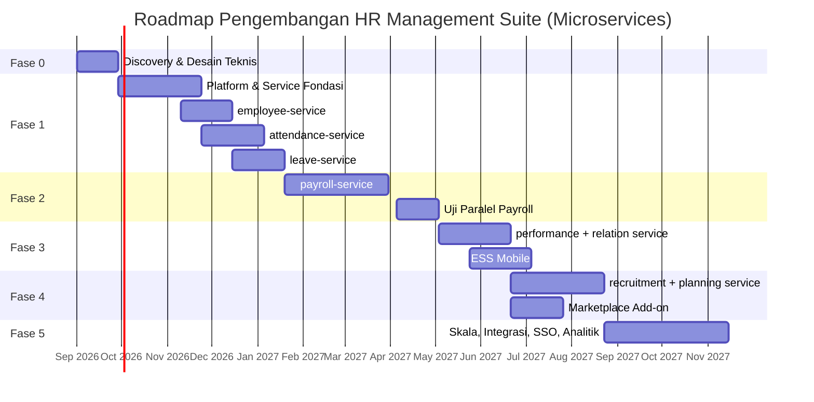

# 04 — Fase Pengembangan, Tim, dan Manajemen Risiko

---

## 1. Filosofi Roadmap

Empat aturan yang mengikat perencanaan:

1. **Setiap fase menghasilkan sesuatu yang dipakai pelanggan nyata.** Tidak ada fase "membangun infrastruktur saja" selama dua bulan tanpa keluaran terlihat.
2. **Urutan service mengikuti nilai bagi pengguna, bukan kemudahan teknis.** Attendance dan Leave lebih dulu karena keduanya nyeri harian; Payroll menyusul karena ia bergantung pada keduanya dan salah hitung berakibat fatal.
3. **Fondasi terdistribusi dibangun sebelum service domain pertama.** Outbox, idempotensi, saga runner, tracing, RLS, dan gateway adalah lintas-potong. Memasangnya setelah 12 service jadi berarti menulis ulang 12 service.
4. **Biaya microservices dibayar di muka.** Fase 1 lebih panjang dibanding pendekatan monolitik karena harus membangun *platform* dulu. Ini bukan pemborosan — ini konsekuensi arsitektur yang dipilih, dan menyembunyikannya dalam estimasi hanya akan menjadi keterlambatan di kemudian hari.

---

## 2. Peta Fase



**Total menuju GA dengan cakupan setara Paket Ultimate referensi: ± 14,5 bulan.**

---

## 3. Fase 0 — Discovery & Desain Teknis (4 minggu)

### Tujuan
Menghilangkan ketidakpastian terbesar sebelum menulis kode produksi. Pada arsitektur microservices, ketidakpastian itu ada di dua tempat: aturan bisnis payroll, dan **kelayakan operasional 16 service dengan tim sebesar ini**.

### Aktivitas

| Aktivitas | Keluaran |
|-----------|----------|
| Wawancara 8–12 praktisi HR (termasuk pengguna produk Excel referensi) | Peta proses AS-IS, daftar nyeri berperingkat |
| Pengumpulan artefak nyata: file Excel payroll, format ekspor mesin fingerprint, kebijakan cuti | Katalog aturan bisnis |
| Studi regulasi: PPh21 skema TER, BPJS, UU Ketenagakerjaan, UU PDP | Matriks kepatuhan |
| **Event storming lintas domain** | Batas service final, katalog event, kontrak gRPC awal |
| Spike teknis | Lihat di bawah |
| Desain sistem & finalisasi kontrak | Dokumen 01–06 disepakati |

**Event storming** adalah aktivitas baru yang menjadi kritis pada microservices: batas service yang salah adalah kesalahan paling mahal dalam arsitektur ini, dan jauh lebih murah diperbaiki di papan tulis daripada setelah kode ditulis.

### Spike Wajib

| Spike | Pertanyaan | Kriteria lulus |
|-------|-----------|----------------|
| S1 — Kalkulasi payroll | Node.js menghitung 1.000 karyawan × 20 komponen < 3 menit? | Tercapai, atau keputusan mesin Go diambil sekarang |
| S2 — Fanout WebSocket | 3 node realtime bertahan pada 5.000 koneksi + 500 event/dtk? | p95 latensi emit < 2 dtk |
| S3 — Overhead RLS | Penalti RLS pada tabel 10 juta baris? | Overhead < 15% |
| S4 — Impor Excel | 5.000 baris divalidasi & di-commit < 60 dtk dengan laporan galat per baris? | Tercapai |
| S5 — Akurasi PPh21 | Cocok dengan 30 kasus uji dari slip gaji nyata? | 30/30 tepat sampai satuan rupiah |
| S6 — `SET LOCAL` + PgBouncer | Aman pada transaction pooling di 500 rps? | Nol kebocoran konteks dalam 1 juta transaksi |
| **S7 — Latensi rantai gRPC** | Berapa overhead gateway → 3 service → DB dibanding panggilan langsung? | Tambahan p95 < 80 ms |
| **S8 — Saga & kompensasi** | Kompensasi berjalan benar saat service dimatikan paksa di tengah saga? | 100% saga berakhir konsisten atau teralarm |
| **S9 — Pengalaman developer lokal** | Berapa lama & berapa RAM untuk menjalankan sistem di laptop? | < 5 menit, < 8 GB, mode "3 service lokal" berfungsi |

> **S9 adalah spike yang paling sering dilewatkan dan paling sering menghancurkan produktivitas.** Bila developer butuh 20 menit dan 16 GB RAM untuk menjalankan sistem, mereka akan berhenti menjalankan tes integrasi secara lokal, dan kualitas runtuh diam-diam. Gerbang ini sama pentingnya dengan S5.

### Definition of Done Fase 0
- [ ] Dokumen 01–06 direview dan disetujui pemangku kepentingan teknis & bisnis
- [ ] Sembilan spike lulus atau menghasilkan keputusan arsitektural tertulis
- [ ] Batas service final beserta katalog event lintas service disepakati
- [ ] 30 kasus uji payroll terdokumentasi dengan hasil yang diharapkan
- [ ] Repositori, CI, klaster K8s `dev`, dan observabilitas dasar berjalan

---

## 4. Fase 1 — Platform, Control Plane & Tiga Service Domain Pertama (16 minggu)

### 4.1 Sprint 1–2: Fondasi Platform Terdistribusi

Tidak ada service domain yang dimulai sebelum ini selesai. Semua service dibangun di atasnya.

- Monorepo (pnpm + Turborepo), template service, generator scaffold
- `@hrms/shared`: `ServiceContext`, `withTenant`, outbox, `IdempotentConsumer`, klien gRPC tahan gangguan, saga runner
- `@hrms/contracts`: skema event Zod + tipe hasil generate protobuf, dipublikasikan sebagai paket berversi
- Topologi RabbitMQ, DLQ, UI pemutaran ulang
- OpenTelemetry end-to-end: HTTP → gRPC → outbox → MQ → konsumer
- Klaster K8s, Helm chart template, Argo CD, NetworkPolicy default-deny
- Pipeline CI: uji, `buf breaking`, uji isolasi tenant, uji batas basis data
- **Perkakas migrasi non-destruktif** (dokumen `09`): linter SQL, runner dengan `lock_timeout` + retry, kerangka backfill berbatch, katalog `deprecated_columns`, deteksi schema drift
- `docker-compose.dev.yml` dengan mode "service aktif lokal, sisanya dari registry"

### 4.2 Sprint 3–5: Service Platform & Control Plane

- `tenant-service`: tenant, paket, modul, entitlement, siklus hidup, saga provisioning
- `auth-service`: login `tenantCode + email + password`, JWT, sesi, rotasi refresh, kunci akun, reset password
- `iam-service`: peran, permission, menu, grant per-pengguna (implementasi dokumen `05`), resolusi akses efektif
- `api-gateway`: `ROUTE_MANIFEST`, validasi `X-Tenant-ID` vs token, `EntitlementGuard`, `PermissionGuard`, `/me/bootstrap`
- `notification-service` dasar (email)
- `file-service` (S3/MinIO, presigned URL)
- Shell frontend: login, sidebar dinamis dari bootstrap, penjagaan rute, halaman upsell modul terkunci
- **PWA** (dokumen `11`): manifest & ikon, service worker Workbox, strategi caching per jenis data, pemisahan cache per tenant & pengguna, pembersihan total saat logout, alur pembaruan terkendali + negosiasi `X-Min-Client-Version`, anggaran performa sebagai gerbang CI

**Control plane (dokumen `07`):**
- `platform_db`, `platform-service`, `admin-gateway` di domain `admin.hrms.id`
- Autentikasi superuser: password + TOTP wajib (ditegakkan constraint DB), IP allowlist, sesi 8 jam, audit setiap aksi termasuk pembacaan
- Aplikasi `apps/admin` terpisah: dashboard global dasar (daftar tenant, KPI, kesehatan sistem)
- Proyeksi `tenant_metrics_daily` dan `tenant_health` dari event agregat
- NetworkPolicy egress `platform-service` + uji pemisahan bidang sebagai gerbang CI

**Dashboard tenant:**
- Read model `rpt_tenant_dashboard` dan `rpt_team_dashboard`
- Tiga cakupan: dashboard tenant (`TENANT_OWNER`/`HR_ADMIN`), dashboard tim (`DEPT_HEAD`/`LINE_MANAGER`), beranda ESS (`EMPLOYEE`)
- Perakitan widget dari irisan langganan × permission

### 4.3 Sprint 5–7: `employee-service`

- CRUD karyawan dengan grid mirip Excel (AG Grid), pencarian, filter tersimpan
- Struktur organisasi (ltree), jabatan, penempatan berbasis periode, kontrak kerja
- Dokumen karyawan, enkripsi PII, masking berbasis izin
- **Wizard impor Excel** — jalur migrasi bagi pelanggan produk referensi
- Penerbitan event `employee.*` + endpoint checksum untuk rekonsiliasi replika

### 4.4 Sprint 6–9: `attendance-service`

- Master shift, penjadwalan, kalender hari libur
- Ingesti punch: unggah manual, REST, webhook mesin, absen web/mobile
- **Antrean presensi luring PWA** (dokumen `11` §6): IndexedDB, pemicu sinkronisasi berlapis, peringatan durabilitas iOS, panduan instalasi
- **Bukti presensi** (dokumen `10`): penangkapan koordinat + foto swafoto, alur izin kamera & lokasi, `work_sites` + geofence Haversine, penilaian kepercayaan berlapis, antrean tinjauan HR, pipeline foto (presign → hapus EXIF → thumbnail → retensi 90 hari), deteksi wajah Tingkat 1, layar persetujuan UU PDP
- Konsumer replika `employee_ref` + rekonsiliasi terjadwal
- Mesin kalkulasi harian, koreksi manual dengan audit
- Penutupan periode + `period_snapshots` + gRPC `GetPeriodSummary`
- `realtime-service` + **dashboard real-time pertama**
- `reporting-service` + proyeksi `rpt_daily_attendance`

### 4.5 Sprint 8–10: `leave-service`

- Jenis cuti, kebijakan akrual, pembentukan saldo tahunan
- Pengajuan + alur persetujuan multi-langkah
- Kalender cuti tim/departemen dengan pembaruan real-time
- Buku besar mutasi saldo + job kedaluwarsa carry-over
- Penanganan konkurensi lengkap (dok. 03, §4.1)
- Konsumer dua arah dengan `attendance-service`

### 4.6 Definition of Done Fase 1

**Fungsional**
- [ ] Perusahaan baru mendaftar, mengimpor 500 karyawan dari Excel, melihat dashboard dalam < 30 menit
- [ ] Absensi masuk otomatis dari mesin fingerprint; dashboard diperbarui < 2 detik
- [ ] **Presensi mobile menangkap koordinat + foto; di luar geofence tetap tercatat dan ditandai, tidak hilang**
- [ ] **Penolakan izin kamera/lokasi ditangani sesuai kebijakan tenant tanpa aplikasi rusak**
- [ ] **Presensi bertanda masuk antrean tinjauan HR, bukan diterima diam-diam maupun ditolak otomatis**
- [ ] **EXIF terhapus dari setiap foto; foto melewati retensi terhapus otomatis, catatan presensi tetap utuh**
- [ ] **PWA dapat dipasang; Lighthouse PWA 100, Performance ≥ 90 pada profil mobile**
- [ ] **Presensi luring dari browser tersimpan dan terkirim saat online, tanpa duplikat meski flush dijalankan dua kali**
- [ ] **Endpoint payroll, dashboard, dan kasus rahasia tidak pernah masuk Cache Storage — diverifikasi uji otomatis**
- [ ] **Cache dan langganan push terhapus total saat logout; data pengguna A tidak terbaca pengguna B di perangkat sama**
- [ ] **Token tidak pernah tersimpan di Cache Storage maupun IndexedDB**
- [ ] **Uji PWA dijalankan pada Chromium dan WebKit**
- [ ] Alur cuti berjalan dari pengajuan sampai persetujuan; saldo terpotong akurat
- [ ] Sidebar hanya menampilkan modul yang dilanggan; endpoint modul lain menolak dengan 402

**Teknis — umum**
- [ ] Cakupan tes: ≥ 80% lapisan domain, ≥ 60% keseluruhan
- [ ] Uji konkurensi: 50 persetujuan cuti simultan pada saldo 2 hari → tepat 1 berhasil
- [ ] Uji beban: 500 pengguna bersamaan, p95 < 400 ms end-to-end melalui gateway
- [ ] Restore dari backup diuji dan terdokumentasi untuk setiap basis data service

**Teknis — migrasi**
- [ ] **Linter migrasi memblokir `DROP TABLE`, `TRUNCATE`, `RENAME`, `CREATE INDEX` non-concurrent**
- [ ] **Setiap migrasi idempoten: dijalankan tiga kali berturut-turut tetap berhasil**
- [ ] **Uji kompatibilitas mundur lulus: skema baru + kode versi sebelumnya tetap sehat**
- [ ] **Uji timing pada tabel 5 juta baris: tidak ada lock > 2 detik**
- [ ] **Kerangka backfill terbukti dapat dijeda, dilanjutkan, dan dijalankan ulang tanpa merusak data**
- [ ] **Deteksi schema drift berjalan harian dan melaporkan nol selisih**

**Teknis — khas microservices**
- [ ] **100% tabel ber-`tenant_id` terlindungi RLS di setiap service, diverifikasi CI**
- [ ] **Uji `TENANT_MISMATCH` lulus: header berbeda dari token selalu ditolak**
- [ ] **Uji batas basis data lulus: kredensial satu service tidak dapat menjangkau basis data lain**
- [ ] **Nol route gateway tanpa entri di `ROUTE_MANIFEST`**
- [ ] **Mematikan `employee-service` tidak menghentikan `attendance-service`** (degradasi anggun, uji chaos eksplisit)
- [ ] **Replica lag p95 < 30 detik; drift terdeteksi otomatis dan terkoreksi**
- [ ] **Trace end-to-end terlihat di Jaeger untuk satu aksi pengguna yang menyentuh 4 service**
- [ ] **Uji kompatibilitas versi: dua versi service berjalan bersamaan tanpa kegagalan**

**Teknis — pemisahan control plane**
- [ ] **Token superuser (`aud: hrms-admin`) ditolak `api-gateway`; token tenant ditolak `admin-gateway`**
- [ ] **`platform-service` terbukti tidak dapat terhubung ke basis data service domain mana pun**
- [ ] **`platform_db` tidak memiliki satu pun kolom berisi data pribadi, diverifikasi CI**
- [ ] **Akun superuser tanpa MFA tidak dapat diaktifkan (ditolak constraint basis data)**
- [ ] **`EMPLOYEE` ditolak mengakses dashboard tenant; `LINE_MANAGER` tidak menerima widget biaya**
- [ ] **Agregat dari kurang dari 5 subjek disembunyikan di dashboard global**

**Operasional**
- [ ] Dashboard Grafana untuk aliran event, kesehatan antrean, kesehatan replika, papan saga
- [ ] Alert DLQ dan `saga_compensation_failed` terhubung ke PagerDuty
- [ ] Runbook untuk 7 insiden paling mungkin: broker turun, service tidak responsif, antrean menumpuk, replika menyimpang, saga macet, koneksi DB habis, gateway realtime turun

### 4.7 Kriteria Rilis Beta Tertutup
5–10 perusahaan pilot (20–200 karyawan). Metrik keberhasilan: ≥ 70% pilot masih aktif setelah 4 minggu.

---

## 5. Fase 2 — `payroll-service` (10 minggu + 4 minggu uji paralel)

Fase paling berisiko. Kesalahan payroll bukan bug — ia insiden kepercayaan yang jarang bisa dipulihkan.

### 5.1 Lingkup
- Komponen gaji yang dapat dikonfigurasi (tetap, formula, persentase, per hari/jam)
- Struktur gaji per karyawan dengan riwayat berbasis periode
- Rule engine terkurung untuk formula — **tanpa `eval()`**, parser ekspresi berdaftar-izin
- PPh21 skema TER + perhitungan tahunan Desember, PTKP, gross/gross-up/nett
- BPJS Ketenagakerjaan (JHT, JP, JKK, JKM) & Kesehatan dengan batas atas upah
- Prorata masuk/keluar tengah bulan, lembur sesuai formula Kepmenaker
- THR & bonus sebagai `run_type` terpisah
- **Saga payroll run lengkap** dengan kompensasi (dok. 03, §2)
- Slip gaji PDF, distribusi ESS/email, ekspor bank (BCA, Mandiri, BNI, BRI)
- Laporan: SPT masa, rekap BPJS, jurnal akuntansi

### 5.2 Strategi Kualitas Khusus

| Lapisan | Pendekatan |
|---------|-----------|
| Uji unit | Setiap komponen diuji terisolasi terhadap tabel kasus Fase 0 |
| Uji properti | Gaji bersih tidak pernah negatif; total baris slip = header; hitung ulang deterministik |
| Uji regresi emas | 30 kasus dari slip nyata dijalankan setiap commit; deviasi 1 rupiah menggagalkan build |
| **Uji determinisme snapshot** | Rekalkulasi dari `attendance_snapshot_id` yang sama harus memberi hasil identik meski data hulu berubah |
| **Uji saga** | Setiap langkah dimatikan paksa; sistem harus berakhir konsisten atau teralarm |
| **Uji paralel (4 minggu)** | Pilot menjalankan payroll di sistem lama **dan** baru; rilis hanya setelah 3 siklus identik |
| Jejak audit | `calculation_trace` menyimpan setiap langkah — saat karyawan menyanggah gajinya, HR menunjukkan rincian, bukan berdebat |

### 5.2b Kemampuan PWA yang Menyertai Fase Ini

Web Push + langganan, dan jalur notifikasi berjenjang di `notification-service`: push web → push native (bila aplikasi terpasang) → email → WhatsApp untuk hal mendesak. Jalur berjenjang diperlukan karena Web Push tidak andal di iOS kecuali PWA sudah dipasang ke Layar Utama (dokumen `11` §7).

### 5.3 Modul Ekspansi yang Menyertai Fase Ini

**`contract-compliance`** (dokumen `08`, A5) — perluasan `employee-service`, bukan service baru. Pelacakan masa berlaku PKWT, sertifikat, dan izin kerja dengan pengingat berjenjang H-90/H-30/H-7.

Ditempatkan di sini karena kompleksitasnya kecil (± 2 person-month), datanya sudah ada, dan pengerjaannya tidak menyentuh jalur kritis payroll. Nilainya mudah dijelaskan ke pembeli: satu PKWT yang lolos menjadi PKWTT adalah kerugian hukum permanen yang melebihi biaya langganan setahun.

### 5.4 Definition of Done
- [ ] 3 siklus payroll paralel identik dengan sistem lama sampai satuan rupiah
- [ ] 1.000 karyawan < 3 menit; 10.000 karyawan < 20 menit
- [ ] Menjalankan run yang sama dua kali menghasilkan tepat satu run
- [ ] Mematikan `payroll-service` di tengah kalkulasi → dilanjutkan pod lain tanpa slip ganda
- [ ] Kegagalan saga di langkah mana pun berakhir dalam keadaan bersih dan terjelaskan ke pengguna
- [ ] Slip hanya terlihat pemiliknya dan pemegang `payroll.payslip.read.all`, diuji dengan token lintas-tenant
- [ ] Perubahan regulasi pajak diterapkan lewat konfigurasi, tanpa deploy ulang
- [ ] MFA tersedia untuk peran dengan akses payroll

---

## 6. Fase 3 — `performance-service`, `relation-service`, ESS Mobile (7 + 6 minggu)

### Lingkup
- **performance-service**: siklus penilaian, KPI berbobot, penilaian diri + atasan, kalibrasi, 9-box grid
- **relation-service**: kasus karyawan, SP1–SP3 dengan masa berlaku, grievance rahasia dengan ACL per kasus dan audit pembacaan
- **ESS Mobile** (React Native) — **lingkup menyempit setelah PWA**: hanya kemampuan yang tidak tersedia di web, yaitu antrean luring yang andal, deteksi mock GPS & perangkat root, push iOS yang dapat diandalkan, dan kamera native. Kebutuhan ESS umum (ajukan cuti, lihat slip gaji, direktori) sudah dilayani PWA sejak Fase 1 dan tidak dibangun ulang.
- Target pengguna aplikasi native menyempit menjadi pekerja lapangan, sales, dan tenant dengan kepatuhan ketat (dokumen `11` §2.4)
- Validasi konsistensi waktu presensi luring, verifikasi SSID Wi-Fi sebagai sinyal silang, layar riwayat bukti milik karyawan sendiri
- **notification-service** lengkap: email, push, WhatsApp Business API

### Catatan desain
`relation-service` menangani data paling sensitif dalam sistem (tuduhan pelecehan, sanksi disipliner). Service ini memakai **ACL eksplisit per kasus**, bukan sekadar peran, dan **setiap pembacaan** dicatat — termasuk pembacaan oleh administrator.

### Definition of Done
- [ ] Aplikasi ESS lolos review App Store & Play Store
- [ ] Absensi luring tersimpan lokal dan tersinkron saat jaringan pulih, tanpa duplikat (`dedupe_key`)
- [ ] Manipulasi jam perangkat pada presensi luring terdeteksi lewat validasi uptime
- [ ] Karyawan dapat melihat seluruh bukti presensi dirinya sendiri, termasuk foto dan peta
- [ ] Kasus rahasia tidak muncul dalam pencarian, laporan, atau ekspor bagi pengguna tak berwenang

---

## 7. Fase 4 — `recruitment-service`, `planning-service`, Marketplace (9 minggu)

### Lingkup
- **recruitment-service**: permintaan tenaga kerja, portal karier, pipeline kandidat (kanban), penjadwalan wawancara, scorecard, penawaran, **saga konversi kandidat → karyawan**
- **planning-service**: RACI/DACI Matrix, FTE Table, Development Plan (IDP model 70-20-10)
- **Marketplace add-on**: katalog modul dalam aplikasi, aktivasi mandiri, uji coba 14 hari, integrasi penagihan

### Signifikansi Marketplace
Ini realisasi penuh model langganan sekaligus pemindahan tiering produk referensi (Basic/Advanced/Ultimate) ke dalam produk. Pelanggan yang semula hanya memakai Attendance dapat mengaktifkan Payroll dengan satu klik — tanpa migrasi, tanpa keterlibatan tim teknis. Secara teknis, aktivasi hanya menulis satu baris di `tenant_modules` dan menerbitkan `tenant.module.enabled`; seluruh sistem menyesuaikan lewat event.

### Modul Ekspansi yang Menyertai Fase Ini

**`claim-service`** (dokumen `08`, A2 + A4) — satu service yang menyediakan tiga modul: reimbursement, SPPD, dan kasbon/pinjaman karyawan. Ketiganya berbagi bentuk yang sama (pengajuan → persetujuan → penyelesaian finansial lewat payroll), sehingga membangunnya berurutan dalam satu service jauh lebih murah daripada terpisah.

Ditempatkan bersamaan marketplace karena keduanya saling menguatkan: modul baru memberi marketplace sesuatu untuk dijual, dan marketplace memberi modul baru jalur distribusi. Reimbursement juga satu-satunya modul yang disentuh hampir seluruh karyawan setiap bulan — pendorong retensi terkuat dalam daftar.

### Definition of Done
- [ ] Modul dapat diaktifkan & dinonaktifkan dari UI tanpa deploy dan tanpa downtime
- [ ] Menonaktifkan modul menyembunyikan menu dan menolak API-nya, tetapi **data tetap utuh** dan pulih saat diaktifkan kembali
- [ ] Perubahan langganan tercermin di UI < 10 detik tanpa login ulang

---

## 8. Fase 5 — Skala, Integrasi, SSO, Analitik (12 minggu)

- **SSO/OIDC & SAML** (ditunda dari fase awal): Azure AD, Google Workspace, SCIM provisioning
- MFA wajib untuk peran sensitif
- Integrasi akuntansi (Accurate, Jurnal, Xero) dan ERP
- Konektor mesin absensi tambahan (Solution, Fingerspot, ZKTeco, Hikvision)
- Analitik lanjutan: prediksi turnover, cost-to-hire, analisis kesenjangan gaji
- Read replica per service untuk beban laporan berat
- **Evaluasi ulang service mesh** — bila jumlah service dan tim sudah membenarkannya
- Sertifikasi ISO 27001 / SOC 2 Type I
- Opsi deployment silo untuk pelanggan enterprise & BUMN

### Modul Ekspansi yang Menyertai Fase Ini

**`onboarding-service` + `asset-service`** (dokumen `08`, A1 + B2) — dibangun berpasangan karena saling menguatkan: clearance offboarding tanpa daftar aset hanyalah checklist kosong.

Onboarding adalah modul dengan kelekatan tertinggi dalam seluruh katalog. Begitu proses onboarding perusahaan berjalan di sistem, memindahkannya berarti mengubah cara kerja belasan orang lintas departemen.

---

## 8b. Fase 6 — Add-on Industri (12 minggu, tim terpisah)

**`hse-service`** (dokumen `08`, A3) dan **`training-service`** (B1).

Fase ini dijalankan sebagai **jalur terpisah dengan tim kecil khusus**, bukan dibebankan ke tim inti. Alasannya dua: K3 adalah domain terjauh dari kompetensi HR dan membutuhkan ahli K3 tersendiri, dan pembelinya berbeda (petugas K3, bukan HR).

Justifikasi memprioritaskannya meski bukan modul HR klasik: kanal distribusi penjual sudah berupa komunitas HSE, sehingga biaya akuisisi pelanggannya paling rendah di antara seluruh usulan.

**Prasyarat memulai:** ahli K3 sudah terlibat, dan konsep tervalidasi dengan minimal 3 perusahaan manufaktur. Tanpa keduanya, fase ini ditunda — bukan dijalankan dengan asumsi.

---

## 9. Struktur Tim

### 9.1 Komposisi per Fase

| Peran | F0 | F1 | F2 | F3 | F4 | F5 |
|-------|----|----|----|----|----|----|
| Tech Lead / Arsitek | 1 | 1 | 1 | 1 | 1 | 1 |
| Backend Engineer | 2 | 5 | 5 | 4 | 4 | 4 |
| Frontend Engineer | 1 | 3 | 2 | 3 | 3 | 2 |
| Mobile Engineer | – | – | – | 2 | 1 | 1 |
| **Platform / DevOps / SRE** | 1 | **2** | **2** | **2** | **2** | **2** |
| QA Engineer | 1 | 2 | 3 | 2 | 2 | 1 |
| Product Manager | 1 | 1 | 1 | 1 | 1 | 1 |
| UI/UX Designer | 1 | 1 | 1 | 1 | 1 | 0,5 |
| **HR Domain Expert** | 1 | 0,5 | **1** | 0,5 | 0,5 | 0,5 |
| **Total FTE** | **8** | **14,5** | **15** | **15,5** | **14,5** | **12** |

> **Dua peran yang tidak boleh dipangkas.**
> **Platform/SRE 2 orang penuh waktu** — pada monolit satu orang cukup; pada 16 service dengan K8s, event bus, dan tracing terdistribusi, satu orang menjadi hambatan sekaligus titik kegagalan tunggal pengetahuan.
> **HR Domain Expert** — aturan PPh21, prorata, dan lembur terlalu bernuansa untuk ditafsirkan engineer dari dokumen. Pada Fase 2 peran ini kembali penuh waktu.

### 9.2 Kepemilikan Service

Setiap service memiliki *code owner* yang bertanggung jawab atas kontrak gRPC dan event-nya. Perubahan pada `@hrms/contracts` memerlukan persetujuan dua pemilik service — mekanisme yang membuat perubahan kontrak menjadi keputusan sadar, bukan efek samping.

---

## 10. Estimasi

| Fase | Durasi | FTE | Person-month |
|------|--------|-----|--------------|
| F0 — Discovery & desain | 4 mgg | 8 | 8,0 |
| F1 — Platform + control plane + PWA + employee + attendance + leave | 17 mgg | 15 | 63,8 |
| F2 — Payroll (+ uji paralel) + contract-compliance | 14 mgg | 15 | 54,5 |
| F3 — Performance + Relation + ESS native (lingkup menyempit) | 12 mgg | 14,5 | 43,5 |
| F4 — Recruitment + Planning + Marketplace + claim-service | 10 mgg | 14,5 | 40,6 |
| F5 — Skala, SSO, integrasi + onboarding & asset | 12 mgg | 12 | 45,0 |
| F6 — Add-on industri (HSE, training) | 12 mgg | tim terpisah | 8,0 |
| **Total** | **±80 mgg** | — | **±267 person-month** |

Tambahkan buffer 20% untuk ketidakpastian (temuan pilot, perubahan regulasi, utang teknis) → **±320 person-month**.

PWA menambah ± 4 person-month di Fase 1 tetapi menghemat ± 5 di Fase 3 karena menggantikan sebagian besar lingkup ESS native. Bersihnya sedikit menurun, dengan jangkauan pengguna yang jauh lebih luas sejak Fase 1.

Angka di atas sudah termasuk daftar pendek lima modul ekspansi (dokumen `08`, §4.1) sebesar ± 27 person-month. Kelompok B dan C lainnya belum dihitung dan ditinjau ulang berdasarkan data penggunaan nyata.

### 10.1 Perbandingan dengan Opsi Monolitik

Transparansi biaya arsitektur, agar keputusan tetap dapat dievaluasi ulang bila kondisi berubah:

| | Modular monolith | Microservices |
|---|---|---|
| Durasi menuju GA | ±13,5 bulan | ±14,5 bulan |
| Person-month (termasuk buffer) | ±215 | ±322 |
| Selisih | — | **+36%** |
| Biaya infrastruktur bulanan (100 tenant) | ±1× | ±2,2× |
| Ukuran tim minimum yang layak | 8–10 | 13–15 |
| Waktu skala satu domain secara independen | Tidak bisa | Menit |
| Waktu memecah domain nanti | 4–8 minggu | Sudah terpecah |
| Radius kegagalan satu bug | Seluruh sistem | Satu service |

Selisih 36% adalah harga dari isolasi kegagalan, skala independen, dan kebebasan deploy per service. Selisih itu wajar bila target skala dan struktur tim mendukungnya; ia menjadi mahal bila tim menyusut di bawah 12 orang.

---

## 11. Registrasi Risiko

| # | Risiko | Prob. | Dampak | Mitigasi |
|---|--------|-------|--------|----------|
| R1 | Perhitungan payroll tidak akurat | Sedang | **Kritis** | Uji regresi emas, uji paralel 3 siklus, HR expert penuh waktu di F2, `calculation_trace` |
| R2 | Perubahan regulasi pajak/BPJS saat pengembangan | Tinggi | Sedang | `statutory_configs` berversi dengan `daterange`, bukan logika ter-hardcode |
| R3 | Migrasi data Excel pelanggan berantakan | Tinggi | Sedang | Staging, validasi per baris, pratinjau, laporan galat yang dapat diperbaiki |
| R4 | Kebocoran data lintas tenant | Rendah | **Kritis** | RLS per service, uji CI lintas-tenant, `NOBYPASSRLS`, penetration test |
| R5 | Node.js terlalu lambat untuk payroll skala besar | Sedang | Tinggi | Spike S1; agregasi didorong ke SQL; eskalasi ke service Go sudah dipetakan |
| R6 | Adopsi rendah karena UI terasa lebih rumit dari Excel | Tinggi | Tinggi | Grid ala Excel, copy-paste clipboard, ekspor `.xlsx` di setiap modul, uji kegunaan tiap sprint |
| R7 | Ketergantungan pada satu HR domain expert | Sedang | Tinggi | Aturan bisnis didokumentasikan sebagai kasus uji yang dieksekusi, bukan pengetahuan lisan |
| R8 | Ketidakcocokan format mesin absensi | Tinggi | Rendah | Adapter per vendor + impor CSV/Excel generik sebagai cadangan |
| R9 | Insiden keamanan data pribadi (UU PDP) | Rendah | **Kritis** | Enkripsi PII, minimisasi, retensi terjadwal, audit akses, tanggap insiden 72 jam |
| **R10** | **Batas service salah ditarik; perubahan fitur selalu menyentuh 4 service** | **Sedang** | **Tinggi** | Event storming di F0; metrik "jumlah service per PR" dipantau — bila konsisten > 2, batas ditinjau ulang |
| **R11** | **Data antar-service menyimpang (replica drift)** | **Sedang** | **Tinggi** | Penjaga `source_version`, rekonsiliasi checksum harian, verifikasi sinkron sebelum payroll, metrik drift |
| **R12** | **Saga gagal berkompensasi; sistem tertinggal tidak konsisten** | Rendah | **Kritis** | Kompensasi idempoten, pemantau saga macet, alert `saga_compensation_failed` ke PagerDuty, prosedur pemulihan manual terdokumentasi |
| **R13** | **Beban operasional 16 service melampaui kapasitas tim** | **Tinggi** | **Tinggi** | Platform/SRE 2 FTE, template service, tooling scaffold, runbook per insiden, spike S9 untuk DX |
| **R14** | **Kegagalan berantai: satu service lambat menyeret seluruh sistem** | Sedang | Tinggi | Circuit breaker, timeout berjenjang, bulkhead, uji chaos di F1 |
| **R15** | **`X-Tenant-ID` dipercaya tanpa verifikasi token di suatu jalur** | Sedang | **Kritis** | Middleware terpusat, NetworkPolicy default-deny, uji `TENANT_MISMATCH` sebagai gerbang CI |
| R16 | Cache entitlement basi setelah berhenti berlangganan | Sedang | Sedang | Invalidasi berbasis event + TTL 60 dtk |
| R17 | Noisy neighbor antar tenant | Sedang | Tinggi | Penjadwalan adil, rate limit berjenjang, `statement_timeout` |
| R18 | Tanpa MFA, satu kata sandi bocor membuka seluruh data HR | Sedang | Tinggi | Kunci akun, deteksi penggunaan ulang refresh token, notifikasi perangkat baru; MFA di F2 |
| R19 | Purge tenant terpicu tidak sengaja | Rendah | **Kritis** | Prasyarat `CHURNED` + ekspor selesai + 2 persetujuan |
| **R20** | **Kredensial superuser bocor → akses seluruh data pelanggan** | Rendah | **Katastrofik** | MFA wajib, IP allowlist, sesi 8 jam, notifikasi setiap login; terpenting: superuser tidak memiliki kredensial ke basis data domain |
| **R21** | **Seseorang menambahkan `BYPASSRLS` "demi kemudahan dukungan"** | **Sedang** | **Katastrofik** | Uji CI memverifikasi tidak ada peran `BYPASSRLS`; NetworkPolicy egress memblokir jalur; review arsitektur wajib untuk `platform-service` |
| **R22** | **Data pribadi merembes ke `platform_db`** | Sedang | Tinggi | Gerbang CI memeriksa nama kolom terlarang; review wajib untuk migrasi `platform_db` |
| R23 | Agregat mengungkap individu pada tenant kecil | Sedang | Sedang | Ambang anonimitas 5 subjek di lapisan query |
| R24 | Support session disalahgunakan | Rendah | **Kritis** | Persetujuan tenant wajib, PSOD-03, baca-saja default, modul sensitif dikecualikan, laporan pasca-sesi |
| **R26** | **Ekspansi lingkup mendahului kedalaman — banyak modul, semuanya setengah matang** | **Tinggi** | **Tinggi** | Daftar pendek 5 modul; gerbang eksplisit: modul berikutnya tidak dimulai sebelum adopsi modul sebelumnya > 30% |
| R27 | Modul kepatuhan menjadi utang pemeliharaan permanen | Tinggi | Sedang | Format pelaporan sebagai konfigurasi berversi, bukan kode; hanya dibangun dengan komitmen sumber daya berjalan |
| R28 | K3/HSE dibangun tanpa ahli domain | Sedang | Tinggi | Prasyarat keras sebelum Fase 6 dimulai |
| R29 | Jumlah service (24) melewati kapasitas operasi tim | Sedang | Tinggi | Ambang peninjauan pada 20 service; utamakan perluasan service lama; kemungkinan Platform/SRE naik ke 3 FTE |
| R30 | Modul lama gagal saat modul baru tidak dilanggan | Sedang | Sedang | Prinsip P3 diuji eksplisit: konsumen event toleran terhadap event yang tidak pernah datang |
| **R32** | **Skema membengkak: kolom mati menumpuk karena kebijakan non-destruktif** | **Tinggi** | Sedang | Tangga deprekasi dengan pelepasan terjadwal; tinjauan katalog `deprecated_columns` tiap kuartal |
| R33 | Migrasi memblokir tabel di jam sibuk | Sedang | Tinggi | `lock_timeout` wajib, retry berjenjang, uji timing di CI, jendela deploy di luar jam kerja |
| R34 | Backfill membanjiri basis data produksi | Sedang | Tinggi | Berbatch, ter-throttle, jeda otomatis saat CPU DB > 70% |
| R36 | Konsumen `employee_ref` lupa disesuaikan saat kontrak berubah | Sedang | Tinggi | Gerbang CI pada perubahan `@hrms/contracts`; checklist konsumen wajib di PR |
| R37 | Skema produksi diubah manual di luar migrasi | Sedang | Tinggi | Deteksi drift harian; kredensial DDL produksi hanya dimiliki runner migrasi |
| **R39** | **Mock GPS lolos deteksi; pelanggan mengira sistem antipalsu** | **Tinggi** | Tinggi | Batas kemampuan dinyatakan eksplisit dalam materi penjualan; skor + tinjauan manusia, bukan klaim mutlak |
| R41 | Karyawan menolak izin massal karena merasa diawasi | Sedang | Tinggi | Layar penjelasan jujur, tanpa lokasi latar belakang, retensi 90 hari, akses karyawan ke datanya sendiri |
| R43 | GPS buruk di dalam gedung menghasilkan banyak tanda palsu | **Tinggi** | Sedang | Ambang akurasi per tenant, konteks di UI tinjauan, verifikasi Wi-Fi/IP sebagai alternatif |
| R44 | Data lokasi dipakai untuk pengawasan di luar tujuan awal | Sedang | **Tinggi** | `reporting-service` tidak menerima koordinat mentah; akses foto teraudit; kebijakan tertulis |
| R45 | Pencocokan wajah dibangun tanpa kajian hukum data biometrik | Sedang | **Kritis** | Tidak dimulai tanpa kajian UU PDP dan persetujuan eksplisit terpisah |
| **R47** | **Presensi web dianggap sekuat native padahal mock GPS tidak terdeteksi di browser** | **Tinggi** | Tinggi | Tanda `WEB_UNVERIFIED_DEVICE` otomatis, skor lebih rendah, verifikasi IP kantor, kebijakan `FALLBACK_ONLY`; dinyatakan eksplisit ke pelanggan |
| R48 | Antrean presensi luring hilang di iOS (penghapusan penyimpanan 7 hari) | Sedang | Tinggi | `navigator.storage.persist()`, peringatan eksplisit ke pengguna, dorongan pasang ke Layar Utama |
| R50 | Data pengguna terbaca pengguna lain di perangkat bersama lewat cache | Rendah | **Kritis** | Kunci cache per tenant & pengguna, pembersihan total saat logout, uji kebocoran sebagai gerbang CI |
| R51 | Adopsi instalasi PWA rendah di iOS | **Tinggi** | Sedang | Panduan instalasi dalam aplikasi, pintasan; sebagian pengguna iOS akan tetap memakai mode browser |
| R52 | Web Push tidak sampai di iOS | Tinggi | Sedang | Jalur berjenjang push → email → WhatsApp; notifikasi penting tidak pernah hanya mengandalkan push |

> R20 sampai R24 adalah risiko yang muncul bersama control plane. R21 patut diperhatikan khusus: probabilitasnya sedang karena tekanan operasional untuk "mempermudah dukungan" akan muncul berulang kali sepanjang umur sistem, dan setiap kali harus ditolak.

> R10 sampai R14 adalah risiko yang **tidak ada** pada arsitektur monolitik. Itulah biaya sesungguhnya dari keputusan ini — bukan hanya person-month tambahan, melainkan lima kategori kegagalan baru yang harus dipantau secara aktif sepanjang umur sistem.

---

## 12. Metrik Keberhasilan

### Teknis

| Metrik | Target F1 | Target GA |
|--------|-----------|-----------|
| Ketersediaan | 99,5% | 99,9% |
| p95 latensi API (end-to-end lewat gateway) | < 500 ms | < 400 ms |
| p95 latensi push real-time | < 3 dtk | < 2 dtk |
| Overhead gateway (p95) | < 100 ms | < 60 ms |
| Replica lag (p95) | < 60 dtk | < 30 dtk |
| Replica drift terdeteksi | < 2/minggu | 0 |
| Saga gagal kompensasi | 0 | 0 |
| Pesan di DLQ per minggu | < 20 | < 5 |
| Tingkat kegagalan deploy | < 15% | < 5% |
| Migrasi dengan lock > 2 detik | 0 | 0 |
| Schema drift terdeteksi | 0 | 0 |
| Kolom deprecated masih terbaca setelah `READ_STOPPED` | 0 | 0 |
| Lighthouse PWA / Performance (mobile) | 100 / ≥ 90 | 100 / ≥ 90 |
| LCP p75 pada 4G lambat | < 3 dtk | < 2,5 dtk |
| Kebocoran data antar pengguna di perangkat bersama | **0** | **0** |
| Presensi dengan bukti lengkap (lokasi + foto) | ≥ 85% | ≥ 90% |
| Presensi masuk antrean tinjauan | < 12% | < 8% |
| Foto melewati retensi yang belum terhapus | 0 | 0 |
| MTTR | < 4 jam | < 1 jam |
| Insiden kebocoran lintas-tenant | **0** | **0** |
| Akses superuser ke data tenant tanpa support session disetujui | **0** | **0** |
| Akun superuser aktif tanpa MFA | **0** | **0** |
| Kolom data pribadi di `platform_db` | 0 | 0 |
| Cakupan RLS | 100% | 100% |
| Cakupan tes lapisan domain | ≥ 80% | ≥ 85% |
| Jumlah service tersentuh per PR (median) | ≤ 2 | ≤ 2 |

### Produk

| Metrik | Target |
|--------|--------|
| Waktu ke nilai pertama (registrasi → dashboard berisi data) | < 30 menit |
| Retensi pilot minggu ke-4 | ≥ 70% |
| Rata-rata modul aktif per tenant | ≥ 3 |
| Konversi uji coba → berbayar | ≥ 25% |
| Tiket dukungan per tenant per bulan | < 2 |
| Sengketa payroll per 1.000 slip | < 1 |

---

## 13. Strategi Migrasi Pelanggan Produk Referensi

Pengguna eksisting produk Excel adalah kelompok pengadopsi awal paling menjanjikan — mereka sudah membeli, memahami kategorinya, dan merasakan batasnya.

```
Tahap 1 — Impor    : unggah workbook Excel yang sudah dipakai. Sistem mengenali struktur
                     sheet produk referensi (Daily Presence, Kalender Cuti, dst.) dan
                     memetakan kolom otomatis. Pengguna hanya mengonfirmasi.
Tahap 2 — Paralel  : selama 1 bulan penuh, pengguna bekerja di kedua sistem. Sistem
                     menampilkan pembandingan otomatis: "Rekap absensi Agustus cocok 100%".
Tahap 3 — Peralihan: Excel menjadi arsip baca-saja. Ekspor .xlsx tetap tersedia selamanya —
                     pengguna harus merasa datanya tidak tersandera.
Tahap 4 — Ekspansi : setelah nyaman dengan modul dasar, tawarkan add-on lewat marketplace.
```

**Insentif migrasi:** pemilik lisensi produk Excel mendapat kredit langganan senilai harga pembelian mereka. Ini mengubah pembelian lama menjadi alasan untuk berpindah, bukan alasan untuk bertahan.

---

## 14. Ringkasan Cetak Biru

| Aspek | Keputusan |
|-------|-----------|
| Arsitektur | Microservices — 8 service platform + 8 service domain + 2 service control plane, database-per-service |
| Dua bidang | Control plane (`admin.hrms.id`, superuser, metadata & agregat) terpisah total dari tenant plane (`app.hrms.id`, data bisnis). Superuser tidak pernah mem-bypass RLS |
| Dashboard | Global (superuser, 5 peran platform), tenant (`TENANT_OWNER`/`HR_ADMIN`), tim (`DEPT_HEAD`/`LINE_MANAGER`), beranda ESS (`EMPLOYEE`) |
| Komunikasi | Event asinkron (RabbitMQ) sebagai default; gRPC sinkron hanya untuk 4 jalur kritis |
| Konsistensi | Transactional outbox per service, konsumer idempoten, replika baca dengan penjaga versi, saga dengan kompensasi |
| Multitenancy | Shared schema + `tenant_id` + RLS; `X-Tenant-ID` sebagai pembeda request, **divalidasi terhadap klaim token** |
| Autentikasi | `auth-service` mandiri: `tenantCode + email + password`, JWT 15 menit, refresh rotasi dengan deteksi pencurian. SSO/OIDC ditunda ke Fase 5 |
| Otorisasi | Peran + permission + menu + grant per-pengguna (dok. 05); ditegakkan di gateway, bukan di frontend |
| Langganan | Frontend merender menu dari `/me/bootstrap`; `EntitlementGuard` di gateway adalah penegak sesungguhnya |
| Frontend | Next.js 15, React 19, AG Grid, pemuatan bundel modul dinamis sesuai langganan. Dikemas sebagai **PWA**: dapat dipasang, luring terbatas, Web Push. `admin.hrms.id` sengaja bukan PWA (dok. `11`) |
| Basis data | PostgreSQL 16 per service: RLS, `daterange` + `EXCLUDE`, partisi, `NUMERIC` untuk uang |
| Presensi | Koordinat + foto swafoto dengan izin eksplisit; geofence Haversine; skor kepercayaan berlapis dengan tinjauan manusia; antrean luring; retensi foto 90 hari (dok. `10`) |
| Migrasi | Non-destruktif dan aditif. Tanpa `DROP`/`RENAME`/`TRUNCATE` di produksi; pelepasan kolom lewat tangga deprekasi berarsip 90 hari + 2 persetujuan. Ditegakkan linter SQL di CI (dok. `09`) |
| Realtime | Socket.IO + Redis Streams; snapshot & delta; peredam badai 250 ms; degradasi ke polling |
| Konkurensi | `FOR UPDATE`, advisory lock, optimistic `version`, unique partial index, `CHECK`, penjaga `source_version` |
| Infrastruktur | Kubernetes, Argo CD, NetworkPolicy default-deny, OpenTelemetry + Jaeger + Prometheus + Loki |
| Modul ekspansi | Daftar pendek 5 modul (kontrak, klaim, onboarding, SPPD/kasbon, K3) — dokumen `08` |
| Timeline | ±14,5 bulan menuju GA inti; ±18 bulan termasuk modul ekspansi. ±317 person-month termasuk buffer |
