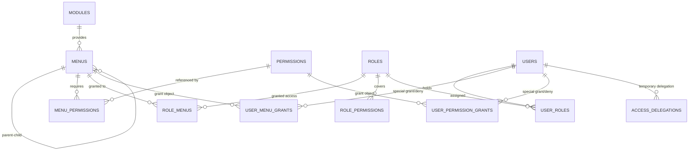

# 05 — Dynamic Roles, Menus & Special Access (Per-User Grants)

This document complements `01-Architecture-Tech-Stack.md` (§4 Security Architecture) and `02-Database-Modelling.md` (§4 the `core` schema).

---

## 1. The Problem Being Solved

The requirement: access is determined not only by role, but can also be granted **directly to a particular user for a particular menu**.

Real situations from HR operations:

| Situation | Why roles alone are not enough |
|-----------|-------------------------------|
| A Finance staff member needs to see the *Payroll Report* menu only, not the whole Payroll module | Creating a new "Finance Payroll Viewer" role for one person makes the role list explode |
| A Production Manager acts as head of department for 3 weeks | This needs **time-bounded** access, not a permanent role change |
| An HR Admin must not see the *Employee Issues* menu because of a conflict of interest | This needs a specific **revocation** without demoting their role |
| An external auditor needs read access to 2 menus for the duration of an audit | A temporary role risks being forgotten and never revoked |

The common mistake is adding a new role every time an exception appears. After a year the tenant has 40 roles nobody can tell apart. The solution is **roles as the base + per-user grant/deny as a thin layer above them**, with a validity period and a recorded reason.

---

## 2. Separating the Concepts: Menu vs Permission

This is the most important design decision in this document.

| Concept | Role | Enforced at | If it is wrong |
|---------|------|-------------|----------------|
| **Permission** (`payroll.run.approve`) | Controls the **action** — may the user invoke this operation | Backend guard + query filter | A real security hole |
| **Menu** (`/payroll/runs`) | Controls **navigation** — does this entry appear in the sidebar | Frontend rendering + server-side resolution | Only a UX mess |

**The rule that binds them:**

> A menu is **never** the source of truth for security. A menu always **points at** one or more permissions. Hiding a menu without revoking the permission is not security — it only hides a button while the endpoint stays open to anyone who knows the URL.

The consequences:
- Granting someone access to a menu **automatically grants the permissions that menu requires** (this can be disabled deliberately with a flag).
- Revoking a permission **automatically hides** the menus that depend on it.
- A menu whose permissions are not satisfied is never rendered, even if it was explicitly granted.

---

## 3. Data Modelling

### 3.1 Relationship Diagram



### 3.2 DDL

```sql
-- =====================================================================
-- 10_dynamic_access.sql  (the core schema)
-- =====================================================================

-- ---------------------------------------------------------------------
-- MENU: hierarchical, registered by modules, customisable per tenant
-- ---------------------------------------------------------------------
CREATE TYPE core.menu_type AS ENUM ('GROUP','ITEM','ACTION','DIVIDER','EXTERNAL');

CREATE TABLE core.menus (
  id            uuid PRIMARY KEY DEFAULT core.uuid_v7(),
  -- NULL = a built-in system menu (global, from the module manifest)
  -- set   = a custom menu belonging to a particular tenant
  tenant_id     uuid REFERENCES core.tenants(id) ON DELETE CASCADE,
  module_key    text NOT NULL REFERENCES core.modules(key) ON DELETE CASCADE,
  parent_id     uuid REFERENCES core.menus(id) ON DELETE CASCADE,

  key           text NOT NULL,               -- 'payroll.runs', 'payroll.reports.tax'
  path          ltree NOT NULL,              -- 'payroll.runs' → fast subtree queries
  type          core.menu_type NOT NULL DEFAULT 'ITEM',

  label         text NOT NULL,               -- default label (id-ID)
  label_i18n    jsonb NOT NULL DEFAULT '{}'::jsonb,
  icon          text,
  route         text,                        -- '/payroll/runs'; NULL for GROUP/DIVIDER
  badge_source  text,                        -- 'leave.pending_approvals' → a dynamic numeric badge

  sort_order    smallint NOT NULL DEFAULT 0,
  is_visible    boolean NOT NULL DEFAULT true,   -- a tenant can hide it without revoking permissions
  is_system     boolean NOT NULL DEFAULT false,  -- a core menu; a tenant may not delete it
  -- true  = shown to every authenticated user (e.g. Dashboard, My Profile)
  -- false = must pass access evaluation
  is_public     boolean NOT NULL DEFAULT false,

  metadata      jsonb NOT NULL DEFAULT '{}'::jsonb,
  version       integer NOT NULL DEFAULT 1,
  created_at    timestamptz NOT NULL DEFAULT now(),
  updated_at    timestamptz NOT NULL DEFAULT now(),

  UNIQUE (COALESCE(tenant_id, '00000000-0000-0000-0000-000000000000'::uuid), key),
  CONSTRAINT chk_route_required
    CHECK ( (type IN ('ITEM','ACTION','EXTERNAL') AND route IS NOT NULL)
         OR (type IN ('GROUP','DIVIDER')) ),
  CONSTRAINT chk_no_self_parent CHECK (parent_id IS DISTINCT FROM id)
);
CREATE INDEX idx_menus_path   ON core.menus USING gist (path);
CREATE INDEX idx_menus_module ON core.menus (module_key) WHERE is_visible;
CREATE INDEX idx_menus_parent ON core.menus (parent_id, sort_order);

-- Menu → the permissions it requires (many-to-many)
CREATE TABLE core.menu_permissions (
  menu_id        uuid NOT NULL REFERENCES core.menus(id) ON DELETE CASCADE,
  permission_key text NOT NULL REFERENCES core.permissions(key) ON DELETE CASCADE,
  -- ANY  : holding any one of the permissions is enough (the default, and the common case)
  -- ALL  : every permission must be held
  requirement    text NOT NULL DEFAULT 'ANY' CHECK (requirement IN ('ANY','ALL')),
  PRIMARY KEY (menu_id, permission_key)
);

-- ---------------------------------------------------------------------
-- LAYER 1: ROLE-based access
-- ---------------------------------------------------------------------
CREATE TABLE core.role_menus (
  role_id     uuid NOT NULL REFERENCES core.roles(id) ON DELETE CASCADE,
  menu_id     uuid NOT NULL REFERENCES core.menus(id) ON DELETE CASCADE,
  tenant_id   uuid NOT NULL REFERENCES core.tenants(id) ON DELETE CASCADE,
  -- When true, revoking this menu from the role revokes the whole submenu too
  cascade_children boolean NOT NULL DEFAULT true,
  granted_by  uuid REFERENCES core.users(id),
  granted_at  timestamptz NOT NULL DEFAULT now(),
  PRIMARY KEY (role_id, menu_id)
);
CREATE INDEX idx_role_menus_tenant ON core.role_menus (tenant_id, role_id);

-- ---------------------------------------------------------------------
-- LAYER 2: PER-USER GRANT / DENY  ← the heart of the feature request
-- ---------------------------------------------------------------------
CREATE TYPE core.grant_effect AS ENUM ('GRANT','DENY');

CREATE TABLE core.user_menu_grants (
  id            uuid PRIMARY KEY DEFAULT core.uuid_v7(),
  tenant_id     uuid NOT NULL REFERENCES core.tenants(id) ON DELETE CASCADE,
  user_id       uuid NOT NULL REFERENCES core.users(id) ON DELETE CASCADE,
  menu_id       uuid NOT NULL REFERENCES core.menus(id) ON DELETE CASCADE,

  effect        core.grant_effect NOT NULL DEFAULT 'GRANT',

  -- true  : granting this menu also grants the permissions it requires
  --         (the default behaviour — without it the menu appears but the API refuses)
  -- false : show the menu only; permissions must come from a role
  --         (used when an admin deliberately wants visibility separated from permission)
  include_permissions boolean NOT NULL DEFAULT true,

  cascade_children boolean NOT NULL DEFAULT false,  -- also applies to submenus

  -- Validity period: the key to temporary access (acting roles, auditors, projects)
  valid_period  tstzrange NOT NULL DEFAULT tstzrange(now(), NULL, '[)'),

  -- A data scope restriction (ABAC) specific to this grant.
  -- Example: {"org_unit_ids": ["..."], "read_only": true}
  scope         jsonb NOT NULL DEFAULT '{}'::jsonb,

  reason        text NOT NULL,               -- MANDATORY: a grant without a reason becomes audit debt
  ticket_ref    text,                        -- ticket/approval number
  granted_by    uuid NOT NULL REFERENCES core.users(id),
  granted_at    timestamptz NOT NULL DEFAULT now(),
  revoked_by    uuid REFERENCES core.users(id),
  revoked_at    timestamptz,
  revoke_reason text,

  -- A user may hold only one active grant per menu per effect,
  -- and the periods must not overlap.
  CONSTRAINT excl_user_menu_grant_overlap EXCLUDE USING gist (
    user_id WITH =,
    menu_id WITH =,
    effect  WITH =,
    valid_period WITH &&
  ) WHERE (revoked_at IS NULL)
);
CREATE INDEX idx_user_menu_grants_active
  ON core.user_menu_grants (tenant_id, user_id)
  WHERE revoked_at IS NULL;
CREATE INDEX idx_user_menu_grants_expiry
  ON core.user_menu_grants (upper(valid_period))
  WHERE revoked_at IS NULL AND upper(valid_period) IS NOT NULL;

-- Direct permission grants (bypassing menus entirely) — for API/integration access
CREATE TABLE core.user_permission_grants (
  id             uuid PRIMARY KEY DEFAULT core.uuid_v7(),
  tenant_id      uuid NOT NULL REFERENCES core.tenants(id) ON DELETE CASCADE,
  user_id        uuid NOT NULL REFERENCES core.users(id) ON DELETE CASCADE,
  permission_key text NOT NULL REFERENCES core.permissions(key) ON DELETE CASCADE,
  effect         core.grant_effect NOT NULL DEFAULT 'GRANT',
  valid_period   tstzrange NOT NULL DEFAULT tstzrange(now(), NULL, '[)'),
  scope          jsonb NOT NULL DEFAULT '{}'::jsonb,
  source         text NOT NULL DEFAULT 'MANUAL',  -- MANUAL / MENU_GRANT / DELEGATION
  source_ref     uuid,                            -- the user_menu_grants id when derived
  reason         text NOT NULL,
  granted_by     uuid NOT NULL REFERENCES core.users(id),
  granted_at     timestamptz NOT NULL DEFAULT now(),
  revoked_at     timestamptz,
  CONSTRAINT excl_user_perm_grant_overlap EXCLUDE USING gist (
    user_id WITH =, permission_key WITH =, effect WITH =, valid_period WITH &&
  ) WHERE (revoked_at IS NULL)
);
CREATE INDEX idx_user_perm_grants_active
  ON core.user_permission_grants (tenant_id, user_id) WHERE revoked_at IS NULL;

-- ---------------------------------------------------------------------
-- LAYER 3: DELEGATION (acting roles) — borrowing someone else's access temporarily
-- ---------------------------------------------------------------------
CREATE TABLE core.access_delegations (
  id             uuid PRIMARY KEY DEFAULT core.uuid_v7(),
  tenant_id      uuid NOT NULL REFERENCES core.tenants(id) ON DELETE CASCADE,
  delegator_id   uuid NOT NULL REFERENCES core.users(id) ON DELETE CASCADE,
  delegate_id    uuid NOT NULL REFERENCES core.users(id) ON DELETE CASCADE,
  -- NULL = all of the delegator's access; set = only the listed menus
  menu_ids       uuid[] NOT NULL DEFAULT '{}',
  valid_period   tstzrange NOT NULL,
  reason         text NOT NULL,
  status         text NOT NULL DEFAULT 'ACTIVE' CHECK (status IN ('ACTIVE','REVOKED','EXPIRED')),
  approved_by    uuid REFERENCES core.users(id),
  created_at     timestamptz NOT NULL DEFAULT now(),
  CONSTRAINT chk_no_self_delegation CHECK (delegator_id <> delegate_id)
);
CREATE INDEX idx_delegations_active
  ON core.access_delegations (tenant_id, delegate_id)
  WHERE status = 'ACTIVE';

-- ---------------------------------------------------------------------
-- Cache version: incremented whenever access changes → targeted invalidation
-- ---------------------------------------------------------------------
CREATE TABLE core.access_versions (
  tenant_id   uuid NOT NULL REFERENCES core.tenants(id) ON DELETE CASCADE,
  user_id     uuid REFERENCES core.users(id) ON DELETE CASCADE,  -- NULL = the tenant-wide version
  version     bigint NOT NULL DEFAULT 1,
  updated_at  timestamptz NOT NULL DEFAULT now(),
  PRIMARY KEY (tenant_id, COALESCE(user_id, '00000000-0000-0000-0000-000000000000'::uuid))
);
```

> **A note on `reason` being `NOT NULL`:** this is not a formality. A special grant is an exception to the role model, and exceptions without an explanation pile up until nobody dares revoke them. Forcing a reason at the schema level is what makes a periodic *access review* possible at all.

---

## 4. Precedence Rules (Effective Access Resolution)

The order of evaluation, from the most decisive:

```
1. The module is not licensed to the tenant → NO ACCESS (not shown, API returns 402)
2. Menu is_visible = false (tenant)         → NOT SHOWN (the permission still applies to the API)
3. An explicit, active DENY on the user     → DENIED    ← beats every GRANT
4. Menu is_public = true                    → ALLOWED
5. An explicit, active GRANT on the user    → ALLOWED
6. An active delegation covering this menu  → ALLOWED
7. One of the user's roles grants the menu  → ALLOWED
8. Otherwise                                → DENIED (default deny)
```

**Why DENY beats GRANT:** revoking access is almost always motivated by compliance or a conflict of interest (for instance, an HR Admin must not see a disciplinary case concerning themselves). A security rule that another rule can override is not a rule.

**How parent and child menus interact:** a `GROUP` menu appears when **at least one of its children** is accessible. Conversely, a `DENY` on a parent with `cascade_children = true` closes the entire subtree.

### 4.1 The Resolution Function in PostgreSQL

Putting resolution in the database gives one shared source of truth for the API, the workers, and audit reports alike.

```sql
CREATE OR REPLACE FUNCTION core.fn_effective_permissions(p_user_id uuid)
RETURNS TABLE (permission_key text, scope jsonb, source text) AS $$
WITH ctx AS (
  SELECT u.id AS user_id, u.tenant_id FROM core.users u WHERE u.id = p_user_id AND u.is_active
),
licensed AS (
  SELECT tm.module_key
  FROM core.tenant_modules tm, ctx
  WHERE tm.tenant_id = ctx.tenant_id
    AND tm.enabled
    AND (tm.expires_at IS NULL OR tm.expires_at > now())
),
-- (a) from roles
from_roles AS (
  SELECT rp.permission_key, '{}'::jsonb AS scope, 'ROLE' AS source
  FROM core.user_roles ur
  JOIN core.role_permissions rp ON rp.role_id = ur.role_id
  WHERE ur.user_id = p_user_id
),
-- (b) from menus granted to a role (the menu's implicit permissions)
from_role_menus AS (
  SELECT mp.permission_key, '{}'::jsonb AS scope, 'ROLE_MENU' AS source
  FROM core.user_roles ur
  JOIN core.role_menus rm    ON rm.role_id = ur.role_id
  JOIN core.menu_permissions mp ON mp.menu_id = rm.menu_id
  WHERE ur.user_id = p_user_id
),
-- (c) from per-user menu grants (include_permissions = true)
from_user_menus AS (
  SELECT mp.permission_key, g.scope, 'USER_MENU_GRANT' AS source
  FROM core.user_menu_grants g
  JOIN core.menus m ON m.id = g.menu_id
  -- cascade: include submenus when asked to
  JOIN core.menus target
    ON target.id = m.id
    OR (g.cascade_children AND target.path <@ m.path)
  JOIN core.menu_permissions mp ON mp.menu_id = target.id
  WHERE g.user_id = p_user_id
    AND g.effect = 'GRANT'
    AND g.include_permissions
    AND g.revoked_at IS NULL
    AND g.valid_period @> now()
),
-- (d) from direct permission grants
from_user_perms AS (
  SELECT pg.permission_key, pg.scope, 'USER_PERM_GRANT' AS source
  FROM core.user_permission_grants pg
  WHERE pg.user_id = p_user_id
    AND pg.effect = 'GRANT'
    AND pg.revoked_at IS NULL
    AND pg.valid_period @> now()
),
-- (e) from an active delegation: inherit the delegator's permissions
from_delegation AS (
  SELECT ep.permission_key,
         jsonb_build_object('delegated_from', d.delegator_id) || ep.scope AS scope,
         'DELEGATION' AS source
  FROM core.access_delegations d
  CROSS JOIN LATERAL core.fn_effective_permissions_base(d.delegator_id) ep
  WHERE d.delegate_id = p_user_id
    AND d.status = 'ACTIVE'
    AND d.valid_period @> now()
),
granted AS (
  SELECT * FROM from_roles
  UNION ALL SELECT * FROM from_role_menus
  UNION ALL SELECT * FROM from_user_menus
  UNION ALL SELECT * FROM from_user_perms
  UNION ALL SELECT * FROM from_delegation
),
-- Explicit DENY: evaluated last and wins absolutely
denied AS (
  SELECT pg.permission_key
  FROM core.user_permission_grants pg
  WHERE pg.user_id = p_user_id AND pg.effect = 'DENY'
    AND pg.revoked_at IS NULL AND pg.valid_period @> now()
  UNION
  SELECT mp.permission_key
  FROM core.user_menu_grants g
  JOIN core.menus m ON m.id = g.menu_id
  JOIN core.menus target
    ON target.id = m.id OR (g.cascade_children AND target.path <@ m.path)
  JOIN core.menu_permissions mp ON mp.menu_id = target.id
  WHERE g.user_id = p_user_id AND g.effect = 'DENY'
    AND g.revoked_at IS NULL AND g.valid_period @> now()
)
SELECT g.permission_key,
       -- the most permissive scope wins when a permission comes from several sources
       jsonb_agg(DISTINCT g.scope) FILTER (WHERE g.scope <> '{}'::jsonb) AS scope,
       string_agg(DISTINCT g.source, ',') AS source
FROM granted g
JOIN core.permissions p ON p.key = g.permission_key
JOIN licensed l         ON l.module_key = p.module_key       -- the module licence gate
WHERE g.permission_key NOT IN (SELECT permission_key FROM denied)
GROUP BY g.permission_key;
$$ LANGUAGE sql STABLE SECURITY DEFINER;
```

> `fn_effective_permissions_base` is the variant without the delegation branch — it prevents infinite recursion when A delegates to B and B delegates to A. Chained delegation is deliberately unsupported: access that has changed hands twice can no longer be accounted for.

### 4.2 Building the Effective Menu Tree

```sql
CREATE OR REPLACE FUNCTION core.fn_effective_menus(p_user_id uuid)
RETURNS TABLE (
  menu_id uuid, parent_id uuid, key text, label text, icon text,
  route text, type core.menu_type, sort_order smallint,
  badge_source text, access_source text
) AS $$
WITH ctx AS (SELECT tenant_id FROM core.users WHERE id = p_user_id),
perms AS (SELECT permission_key FROM core.fn_effective_permissions(p_user_id)),
licensed AS (
  SELECT tm.module_key FROM core.tenant_modules tm, ctx
  WHERE tm.tenant_id = ctx.tenant_id AND tm.enabled
    AND (tm.expires_at IS NULL OR tm.expires_at > now())
),
-- built-in system menus plus the tenant's overrides (the override wins)
visible_menus AS (
  SELECT DISTINCT ON (m.key) m.*
  FROM core.menus m, ctx
  WHERE (m.tenant_id IS NULL OR m.tenant_id = ctx.tenant_id)
    AND m.is_visible
    AND m.module_key IN (SELECT module_key FROM licensed)
  ORDER BY m.key, m.tenant_id NULLS LAST      -- the tenant's own row takes priority
),
denied_menus AS (
  SELECT target.id
  FROM core.user_menu_grants g
  JOIN core.menus m ON m.id = g.menu_id
  JOIN core.menus target
    ON target.id = m.id OR (g.cascade_children AND target.path <@ m.path)
  WHERE g.user_id = p_user_id AND g.effect = 'DENY'
    AND g.revoked_at IS NULL AND g.valid_period @> now()
),
granted_menus AS (
  SELECT target.id, 'USER_GRANT' AS src
  FROM core.user_menu_grants g
  JOIN core.menus m ON m.id = g.menu_id
  JOIN core.menus target
    ON target.id = m.id OR (g.cascade_children AND target.path <@ m.path)
  WHERE g.user_id = p_user_id AND g.effect = 'GRANT'
    AND g.revoked_at IS NULL AND g.valid_period @> now()
  UNION
  SELECT rm.menu_id, 'ROLE' FROM core.user_roles ur
  JOIN core.role_menus rm ON rm.role_id = ur.role_id
  WHERE ur.user_id = p_user_id
  UNION
  SELECT unnest(d.menu_ids), 'DELEGATION' FROM core.access_delegations d
  WHERE d.delegate_id = p_user_id AND d.status = 'ACTIVE' AND d.valid_period @> now()
),
-- A menu is accessible when: it is public, OR it was granted AND its permissions are satisfied
accessible AS (
  SELECT vm.*,
         COALESCE(gm.src, CASE WHEN vm.is_public THEN 'PUBLIC' END) AS access_source
  FROM visible_menus vm
  LEFT JOIN granted_menus gm ON gm.id = vm.id
  WHERE vm.id NOT IN (SELECT id FROM denied_menus)
    AND (vm.is_public OR gm.id IS NOT NULL)
    AND (
      -- GROUP/DIVIDER need no permission; their eligibility comes from their children
      vm.type IN ('GROUP','DIVIDER')
      OR NOT EXISTS (SELECT 1 FROM core.menu_permissions mp WHERE mp.menu_id = vm.id)
      OR EXISTS (
        SELECT 1 FROM core.menu_permissions mp
        WHERE mp.menu_id = vm.id AND mp.requirement = 'ANY'
          AND mp.permission_key IN (SELECT permission_key FROM perms))
      OR (
        NOT EXISTS (SELECT 1 FROM core.menu_permissions mp
                    WHERE mp.menu_id = vm.id AND mp.requirement = 'ALL'
                      AND mp.permission_key NOT IN (SELECT permission_key FROM perms))
        AND EXISTS (SELECT 1 FROM core.menu_permissions mp
                    WHERE mp.menu_id = vm.id AND mp.requirement = 'ALL'))
    )
),
-- Drop any GROUP left empty once its children were filtered out
pruned AS (
  SELECT a.* FROM accessible a
  WHERE a.type <> 'GROUP'
     OR EXISTS (SELECT 1 FROM accessible c WHERE c.path <@ a.path AND c.id <> a.id
                                             AND c.type <> 'GROUP')
)
SELECT id, parent_id, key, label, icon, route, type, sort_order, badge_source, access_source
FROM pruned
ORDER BY path, sort_order;
$$ LANGUAGE sql STABLE SECURITY DEFINER;
```

The `access_source` column is deliberately returned to the frontend. The UI can show a small marker on a menu that came from a special grant or a delegation — the user knows why they see something a teammate does not, and an admin can trace it without opening the logs.

---

## 5. Backend Implementation

### 5.1 A Resolver with a Versioned Cache

```typescript
// packages/core/kernel/src/authz/access-resolver.service.ts
@Injectable()
export class AccessResolver {
  private readonly TTL = 300; // seconds

  constructor(
    private readonly prisma: PrismaService,
    private readonly redis: RedisService,
  ) {}

  async resolve(tenantId: string, userId: string): Promise<EffectiveAccess> {
    const version  = await this.versionOf(tenantId, userId);
    const cacheKey = `access:${tenantId}:${userId}:v${version}`;

    const cached = await this.redis.get(cacheKey);
    if (cached) return JSON.parse(cached);

    const access = await withTenant(this.prisma, tenantId, async (tx) => {
      const [permissions, menus] = await Promise.all([
        tx.$queryRaw<PermRow[]>`SELECT * FROM core.fn_effective_permissions(${userId}::uuid)`,
        tx.$queryRaw<MenuRow[]>`SELECT * FROM core.fn_effective_menus(${userId}::uuid)`,
      ]);
      return {
        version,
        permissions: permissions.map((p) => p.permission_key),
        scopes: Object.fromEntries(permissions.map((p) => [p.permission_key, p.scope])),
        menuTree: buildTree(menus),
        routeIndex: Object.fromEntries(
          menus.filter((m) => m.route).map((m) => [m.route!, m.menu_id]),
        ),
        resolvedAt: new Date().toISOString(),
      };
    });

    await this.redis.setex(cacheKey, this.TTL, JSON.stringify(access));
    return access;
  }

  /** Bump the version → every old cache entry becomes unreachable without deleting them one by one */
  private async versionOf(tenantId: string, userId: string): Promise<number> {
    const key = `access:ver:${tenantId}:${userId}`;
    const hit = await this.redis.get(key);
    if (hit) return Number(hit);

    const [row] = await this.prisma.$queryRaw<[{ version: bigint }]>`
      SELECT GREATEST(
        COALESCE((SELECT version FROM core.access_versions
                   WHERE tenant_id = ${tenantId}::uuid AND user_id = ${userId}::uuid), 1),
        COALESCE((SELECT version FROM core.access_versions
                   WHERE tenant_id = ${tenantId}::uuid AND user_id IS NULL), 1)
      ) AS version`;
    await this.redis.setex(key, 60, String(row.version));
    return Number(row.version);
  }
}
```

### 5.2 The Permission Guard

```typescript
// packages/core/kernel/src/authz/permission.guard.ts
@Injectable()
export class PermissionGuard implements CanActivate {
  constructor(
    private readonly reflector: Reflector,
    private readonly resolver: AccessResolver,
  ) {}

  async canActivate(ctx: ExecutionContext): Promise<boolean> {
    const required = this.reflector.getAllAndMerge<string[]>(
      PERMISSION_KEY, [ctx.getHandler(), ctx.getClass()],
    );
    if (required.length === 0) return true;

    const req = ctx.switchToHttp().getRequest();
    const { tenantId, userId } = req.auth;

    const access = await this.resolver.resolve(tenantId, userId);
    const missing = required.filter((p) => !access.permissions.includes(p));

    if (missing.length > 0) {
      // The error message names the missing permission — it speeds up support triage
      // and leaks nothing that was not already implied by the endpoint itself.
      throw new ForbiddenException({
        code: 'MISSING_PERMISSION',
        message: `Akses ditolak. Izin yang dibutuhkan: ${missing.join(', ')}`,
        missing,
      });
    }

    // The scopes are injected into the request for the query layer to use (ABAC)
    req.accessScopes = access.scopes;
    return true;
  }
}

// Usage
@Controller('payroll/runs')
@RequiresModule('payroll')
export class PayrollRunController {
  @Post()
  @RequiresPermission('payroll.run.create')
  create(@Body() dto: CreateRunDto) { /* ... */ }

  @Post(':id/approve')
  @RequiresPermission('payroll.run.approve')
  approve(@Param('id') id: string) { /* ... */ }
}
```

### 5.3 Access Changes Are Transactional + Invalidating

This is the fragile point: if the cache is not invalidated, a revocation does not take effect until the TTL expires — a five-minute window that is unacceptable for a security-motivated revocation.

```typescript
// packages/core/kernel/src/authz/access-admin.service.ts
@Injectable()
export class AccessAdminService {
  async grantMenuToUser(cmd: GrantMenuCommand): Promise<void> {
    await withTenant(this.prisma, cmd.tenantId, async (tx) => {
      // 1. Validate: an admin must not grant access they do not hold themselves
      //    (this prevents privilege escalation through the grant feature)
      const adminAccess = await this.resolver.resolve(cmd.tenantId, cmd.grantedBy);
      const menuPerms   = await tx.menuPermission.findMany({ where: { menuId: cmd.menuId } });
      const escalation  = menuPerms
        .map((p) => p.permissionKey)
        .filter((p) => !adminAccess.permissions.includes(p));

      if (escalation.length > 0 && !adminAccess.permissions.includes('iam.grant.any')) {
        throw new ForbiddenException({
          code: 'PRIVILEGE_ESCALATION_BLOCKED',
          message: `Anda tidak dapat memberikan izin yang tidak Anda miliki: ${escalation.join(', ')}`,
        });
      }

      // 2. Store the grant
      const grant = await tx.userMenuGrant.create({
        data: {
          tenantId: cmd.tenantId, userId: cmd.userId, menuId: cmd.menuId,
          effect: cmd.effect, includePermissions: cmd.includePermissions ?? true,
          cascadeChildren: cmd.cascadeChildren ?? false,
          validPeriod: buildRange(cmd.validFrom, cmd.validUntil),
          scope: cmd.scope ?? {}, reason: cmd.reason, ticketRef: cmd.ticketRef,
          grantedBy: cmd.grantedBy,
        },
      });

      // 3. Bump the access version → this user's entire cache falls away instantly
      await tx.$executeRaw`
        INSERT INTO core.access_versions (tenant_id, user_id, version)
        VALUES (${cmd.tenantId}::uuid, ${cmd.userId}::uuid, 2)
        ON CONFLICT (tenant_id, COALESCE(user_id, '00000000-0000-0000-0000-000000000000'::uuid))
        DO UPDATE SET version = core.access_versions.version + 1, updated_at = now()`;

      // 4. Event: triggers the Redis cache deletion plus a real-time push to active sessions
      await OutboxPublisher.emit(tx, {
        tenantId: cmd.tenantId, type: 'iam.access.changed',
        aggregateType: 'UserMenuGrant', aggregateId: grant.id,
        payload: { userId: cmd.userId, menuId: cmd.menuId, effect: cmd.effect },
        actorId: cmd.grantedBy,
      });
      // The audit entry is recorded automatically by the core.fn_audit() trigger
    });
  }
}
```

The event consumer deletes the cache keys and notifies the client:

```typescript
// apps/worker/src/consumers/access-changed.consumer.ts
export class AccessChangedConsumer extends IdempotentConsumer<AccessChangedPayload> {
  readonly consumerName = 'access-changed';

  protected async execute(payload: AccessChangedPayload) {
    await this.redis.del(`access:ver:${payload.tenantId}:${payload.userId}`);
    const pattern = `access:${payload.tenantId}:${payload.userId}:v*`;
    for await (const keys of this.redis.scanStream({ match: pattern, count: 100 })) {
      if (keys.length) await this.redis.del(...keys);
    }

    // Push to active sessions: the sidebar updates without needing a logout
    await this.realtimeBus.publish(`user:${payload.userId}`, {
      type: 'iam.access.changed',
      data: { reason: payload.effect === 'DENY' ? 'REVOKED' : 'GRANTED' },
    });
  }
}
```

### 5.4 Automatic Expiry

```typescript
// A scheduler every 5 minutes — a temporary grant has to actually end
@Cron('*/5 * * * *')
async expireGrants() {
  const expired = await this.prisma.$queryRaw<{ user_id: string; tenant_id: string }[]>`
    WITH e AS (
      UPDATE core.user_menu_grants
         SET revoked_at = now(), revoke_reason = 'AUTO_EXPIRED'
       WHERE revoked_at IS NULL
         AND upper(valid_period) IS NOT NULL
         AND upper(valid_period) <= now()
      RETURNING tenant_id, user_id
    ), d AS (
      UPDATE core.access_delegations SET status = 'EXPIRED'
       WHERE status = 'ACTIVE' AND upper(valid_period) <= now()
      RETURNING tenant_id, delegate_id AS user_id
    )
    SELECT * FROM e UNION SELECT * FROM d`;

  for (const row of dedupe(expired)) {
    await this.accessAdmin.bumpVersionAndNotify(row.tenant_id, row.user_id);
  }
}
```

---

## 6. Frontend Implementation

### 6.1 The Access Provider & Dynamic Sidebar

```tsx
// apps/web/src/lib/access/access-provider.tsx
'use client';

export function AccessProvider({ children }: { children: React.ReactNode }) {
  const { data, refetch } = useQuery({
    queryKey: ['me', 'access'],
    queryFn: () => api.get<EffectiveAccess>('/me/access'),
    staleTime: 5 * 60_000,
  });

  // An access change applies immediately, without a logout
  useEffect(() => {
    const socket = getSocket();
    const onChange = (ev: { type: string }) => {
      if (ev.type !== 'iam.access.changed') return;
      refetch();
      toast.info('Hak akses Anda diperbarui.');
    };
    socket.on('event', onChange);
    return () => { socket.off('event', onChange); };
  }, [refetch]);

  const value = useMemo(() => ({
    permissions: new Set(data?.permissions ?? []),
    menuTree: data?.menuTree ?? [],
    can: (perm: string) => data?.permissions.includes(perm) ?? false,
    canAny: (perms: string[]) => perms.some((p) => data?.permissions.includes(p)),
    canAll: (perms: string[]) => perms.every((p) => data?.permissions.includes(p)),
  }), [data]);

  return <AccessContext.Provider value={value}>{children}</AccessContext.Provider>;
}

// A wrapper component for conditional UI elements
export function Can({ perm, any, children, fallback = null }: CanProps) {
  const { can, canAny } = useAccess();
  const allowed = any ? canAny(any) : can(perm!);
  return <>{allowed ? children : fallback}</>;
}
```

```tsx
// apps/web/src/components/layout/dynamic-sidebar.tsx
export function DynamicSidebar() {
  const { menuTree } = useAccess();
  const pathname = usePathname();

  const render = (nodes: MenuNode[], depth = 0) => nodes.map((node) => {
    if (node.type === 'DIVIDER') return <Separator key={node.id} className="my-2" />;

    if (node.type === 'GROUP') {
      return (
        <Collapsible key={node.id} defaultOpen={isAncestorOf(node, pathname)}>
          <CollapsibleTrigger className="flex w-full items-center gap-2 px-3 py-2">
            <Icon name={node.icon} className="size-4" />
            <span className="flex-1 text-left text-sm font-medium">{node.label}</span>
            <ChevronDown className="size-4 transition-transform" />
          </CollapsibleTrigger>
          <CollapsibleContent className="ml-3 border-l pl-2">
            {render(node.children ?? [], depth + 1)}
          </CollapsibleContent>
        </Collapsible>
      );
    }

    return (
      <Link key={node.id} href={node.route!} data-active={pathname === node.route}
            className="flex items-center gap-2 rounded px-3 py-2 text-sm data-[active=true]:bg-accent">
        <Icon name={node.icon} className="size-4" />
        <span className="flex-1">{node.label}</span>
        {node.badgeSource && <MenuBadge source={node.badgeSource} />}
        {/* A transparency marker: this menu came from special access, not from a role */}
        {node.accessSource === 'USER_GRANT' && (
          <Tooltip content="Akses khusus yang diberikan kepada Anda">
            <KeyRound className="size-3 text-amber-500" />
          </Tooltip>
        )}
        {node.accessSource === 'DELEGATION' && (
          <Tooltip content="Akses delegasi sementara">
            <UserCheck className="size-3 text-blue-500" />
          </Tooltip>
        )}
      </Link>
    );
  });

  return <nav className="flex flex-col gap-0.5 p-2">{render(menuTree)}</nav>;
}
```

### 6.2 Route Guarding

A clean sidebar is not enough — a user can type the URL directly.

```tsx
// apps/web/src/middleware.ts (the server path, before the page renders)
export async function middleware(req: NextRequest) {
  const session = await getSession(req);
  if (!session) return NextResponse.redirect(new URL('/login', req.url));

  const access = await fetchAccess(session);          // cached per request
  const route  = matchRoute(req.nextUrl.pathname, access.routeIndex);

  if (route && !access.allowedRoutes.includes(route)) {
    return NextResponse.rewrite(new URL('/403', req.url));
  }
  return NextResponse.next();
}
```

> This remains a **convenience layer**, not security. The real enforcement lives in the backend's `PermissionGuard`. The middleware only stops a user from seeing an empty page whose data fails to load.

---

## 7. The Administration Interface

### 7.1 The Role × Menu Matrix

The `/settings/access/roles` page shows a grid: rows are menus (as a tree), columns are roles, cells are checkboxes. Saving produces one batch mutation, not one request per cell.

```
Menu                          | HR Admin | Manager | Employee | Finance
------------------------------|----------|---------|----------|--------
▼ Payroll                     |    ☑     |    ☐    |    ☐     |   ☑
    Payroll Run               |    ☑     |    ☐    |    ☐     |   ☐
    Komponen Gaji             |    ☑     |    ☐    |    ☐     |   ☐
    Laporan Payroll           |    ☑     |    ☐    |    ☐     |   ☑
    Slip Gaji Saya            |    ☑     |    ☑    |    ☑     |   ☑
▼ Absensi                     |    ☑     |    ☑    |    ☑     |   ☐
    ...
```

### 7.2 The Per-User Special Access Panel

The `/settings/access/users/:id` page shows three sections:

1. **Access from roles** — a read-only list of menus labelled with the role they came from.
2. **Special access** — a grant/deny table with columns: menu, effect, valid until, reason, granted by, revoke action.
3. **Effective access preview** — the final result once every precedence rule has been applied, with an explanation per row:

```
Laporan Payroll   ✓ DIIZINKAN   ← GRANT khusus (berlaku s.d. 30 Sep 2026)
                                  Alasan: "Audit internal Q3" · oleh: Rina · Tiket: SEC-1204
Employee Issues   ✗ DITOLAK     ← DENY khusus mengalahkan akses dari peran "HR Admin"
                                  Alasan: "Konflik kepentingan — kasus terkait ybs"
Payroll Run       ✓ DIIZINKAN   ← Peran "HR Admin"
```

The **"Test as this user"** feature calls `fn_effective_menus` for the target user and renders the sidebar they would see — the fastest way to answer the support question "why can't I see menu X".

### 7.3 API Endpoints

```
GET    /me/access                              # the current user's effective access
GET    /admin/menus                            # the menu tree (built-in + tenant custom)
POST   /admin/menus                            # create a custom menu
PATCH  /admin/menus/:id                        # change label, order, visibility
GET    /admin/roles/:id/menus                  # the menus belonging to a role
PUT    /admin/roles/:id/menus                  # save the role matrix in a batch
GET    /admin/users/:id/access                 # effective access plus where each part came from
POST   /admin/users/:id/menu-grants            # give special access (GRANT/DENY)
DELETE /admin/users/:id/menu-grants/:grantId   # revoke special access
POST   /admin/users/:id/delegations            # create a temporary delegation
GET    /admin/access/review                    # the grant list for periodic review
GET    /admin/access/audit?userId=&from=&to=   # the access change history
```

---

## 8. Periodic Access Review

Special grants tend to accumulate. Without a review process the system slowly drifts back to "everyone is an admin".

```sql
-- The report for the quarterly review
CREATE OR REPLACE VIEW core.v_access_review AS
SELECT
  g.tenant_id,
  u.full_name          AS user_name,
  m.label              AS menu_label,
  g.effect,
  g.reason,
  g.ticket_ref,
  gb.full_name         AS granted_by_name,
  g.granted_at,
  upper(g.valid_period) AS expires_at,
  CASE
    WHEN upper(g.valid_period) IS NULL THEN 'PERMANEN'
    WHEN upper(g.valid_period) < now() + interval '7 days' THEN 'SEGERA BERAKHIR'
    ELSE 'AKTIF'
  END AS status,
  age(now(), g.granted_at) AS age,
  -- A permanent grant older than 90 days must be reviewed again
  (upper(g.valid_period) IS NULL AND g.granted_at < now() - interval '90 days') AS needs_review
FROM core.user_menu_grants g
JOIN core.users u  ON u.id = g.user_id
JOIN core.menus m  ON m.id = g.menu_id
JOIN core.users gb ON gb.id = g.granted_by
WHERE g.revoked_at IS NULL;
```

**The recommended policy** (configurable per tenant):
- A grant with no end date triggers a reminder to whoever granted it after 90 days.
- A grant created by a user who has since been deactivated is automatically flagged for review.
- A quarterly report goes to the tenant owner listing every active special access.

---

## 9. Security Considerations

| Risk | Mitigation |
|------|------------|
| **Privilege escalation** — an admin grants themselves a permission they do not hold | Validation in `grantMenuToUser`: only a holder of `iam.grant.any` may grant beyond their own permissions |
| **Eternal grants** — temporary access that is never revoked | The expiry scheduler + the review report + the 90-day reminder |
| A menu is hidden but the API is open | A menu is always tied to permissions; the backend guard is the real enforcer |
| A stale cache after a revocation | The access version is bumped inside the same transaction → the old cache is instantly unreachable |
| An untraceable delegation chain | Chained delegation is refused; `fn_effective_permissions_base` breaks the recursion |
| A cross-tenant grant | Every table carries `tenant_id` with RLS enabled (doc. 02, §4.1) |
| Untracked access changes | The `core.fn_audit()` trigger on `user_menu_grants`, `role_menus`, and `user_permission_grants` |

```sql
CREATE TRIGGER trg_audit_user_menu_grants
  AFTER INSERT OR UPDATE OR DELETE ON core.user_menu_grants
  FOR EACH ROW EXECUTE FUNCTION core.fn_audit();
CREATE TRIGGER trg_audit_role_menus
  AFTER INSERT OR UPDATE OR DELETE ON core.role_menus
  FOR EACH ROW EXECUTE FUNCTION core.fn_audit();
CREATE TRIGGER trg_audit_user_perm_grants
  AFTER INSERT OR UPDATE OR DELETE ON core.user_permission_grants
  FOR EACH ROW EXECUTE FUNCTION core.fn_audit();
```

---

## 10. Integration with the Module Manifest

Menus are registered by a module at activation time, which keeps add-ons plug-and-play. This extends the `module.manifest.ts` from document `01`, §2.1:

```typescript
export default defineModule({
  key: 'payroll',
  // ...
  menus: [
    { key: 'payroll',              type: 'GROUP', label: 'Payroll', icon: 'Wallet', sortOrder: 40 },
    { key: 'payroll.runs',         type: 'ITEM',  parent: 'payroll',
      label: 'Payroll Run',        route: '/payroll/runs',
      permissions: [{ key: 'payroll.run.create', requirement: 'ANY' }] },
    { key: 'payroll.components',   type: 'ITEM',  parent: 'payroll',
      label: 'Komponen Gaji',      route: '/payroll/components',
      permissions: [{ key: 'payroll.component.manage', requirement: 'ANY' }] },
    { key: 'payroll.reports',      type: 'ITEM',  parent: 'payroll',
      label: 'Laporan Payroll',    route: '/payroll/reports',
      permissions: [{ key: 'payroll.report.read', requirement: 'ANY' }] },
    { key: 'payroll.my-payslip',   type: 'ITEM',  parent: 'payroll',
      label: 'Slip Gaji Saya',     route: '/payroll/my-payslip',
      permissions: [{ key: 'payroll.payslip.read.self', requirement: 'ANY' }] },
  ],

  // The default roles seeded when the module is enabled; the tenant is free to change them afterwards
  defaultRoleMenus: {
    HR_ADMIN: ['payroll', 'payroll.runs', 'payroll.components', 'payroll.reports', 'payroll.my-payslip'],
    EMPLOYEE: ['payroll', 'payroll.my-payslip'],
    LINE_MANAGER: ['payroll', 'payroll.my-payslip'],
  },

  onEnable: async (ctx) => {
    await ctx.runMigrations();
    await ctx.registerMenus();           // upsert into core.menus + menu_permissions
    await ctx.seedDefaultRoleMenus();    // only for roles the tenant has not customised
  },

  onDisable: async (ctx) => {
    await ctx.hideMenus();               // is_visible = false; the menu rows and grants are NOT deleted
    await ctx.bumpAccessVersionForTenant();
  },
});
```

> **`onDisable` deletes neither menus nor grants.** If a tenant turns off the Payroll module and turns it back on six months later, their entire role configuration and special access come back intact. Deleting it would force them to configure everything from scratch — the sort of experience that makes people reluctant to try an add-on at all.

---

## 11. Roadmap Impact

This feature belongs to **Phase 1, Sprints 1–2** as part of the platform foundation, not as a later addition. The reason is the same one that puts the outbox and RLS at the start: the access model is cross-cutting. Fitting it after 12 modules exist means tearing open guards and navigation in 12 places.

Additional Phase 1 estimate: **+2 backend person-weeks, +1.5 frontend person-weeks** (the admin matrix and the special access panel are dense UI).

**Additional Phase 1 Definition of Done:**
- [ ] Revoking a user's access takes effect in under 5 seconds on a session that is currently active (no logout)
- [ ] A special `DENY` is proven to beat access coming from a role (automated test)
- [ ] A time-bounded grant really does end on time (tested with the clock moved forward)
- [ ] An admin without `iam.grant.any` cannot grant a permission they do not hold (privilege escalation test)
- [ ] A menu belonging to a module whose licence has ended does not appear, and its API refuses with 402
- [ ] Every access change produces a row in `core.audit_logs`

---

## 12. Adapting to the Microservices Architecture

This document was written assuming a single `core` schema in a single database. After the decision to move to microservices (document `01`), the whole model above still holds semantically, with the five adjustments below.

### 12.1 A New Home: `iam-service`

All of `core.menus`, `core.menu_permissions`, `core.role_menus`, `core.user_menu_grants`, `core.user_permission_grants`, `core.access_delegations`, and `core.access_versions` move into **`iam_db`**, the database owned by `iam-service`. The `core.` prefix is replaced by the `public` schema inside that database.

`fn_effective_permissions` and `fn_effective_menus` remain PostgreSQL functions and keep running inside the database — which is an advantage, because access resolution is a JOIN-heavy operation and is cheaper to run in the database engine than in the application layer.

### 12.2 Cross-Service References Become Soft References

| Original reference | Adjustment |
|--------------------|------------|
| `core.users(id)` | `user_id uuid` with no FK — users belong to `auth-service` in `auth_db` |
| `core.tenants(id)` | `tenant_id uuid` with no FK — tenants belong to `tenant-service` |
| `core.tenant_modules` | Replaced by the `tenant_module_ref` replica table in `iam_db`, synced by the `tenant.module.enabled` / `tenant.module.disabled` events |
| `core.modules(key)` | `module_key text` with no FK — the module catalogue belongs to `tenant-service` |

The join to `core.tenant_modules` inside `fn_effective_permissions` is redirected to `tenant_module_ref`. The semantics are identical — **a subscription still beats a role** — but it does not cross the service boundary.

```sql
-- Before (monolith)
AND p.module_key IN (SELECT module_key FROM core.tenant_modules
                      WHERE tenant_id = p_tenant_id AND enabled)

-- After (iam-service)
AND p.module_key IN (SELECT module_key FROM tenant_module_ref
                      WHERE tenant_id = p_tenant_id AND enabled
                        AND (expires_at IS NULL OR expires_at > now()))
```

### 12.3 Enforcement Moves to the Gateway

The permission guard that sat on each module's controller in §5.2 now lives in the **`api-gateway`**, as part of the `ROUTE_MANIFEST` (document `01`, §5.2). The gateway calls `iam-service` over gRPC to obtain effective access and caches it in Redis.

Domain services do **not** check permissions independently to decide allow/deny — that is the gateway's job. What a domain service does keep doing is **data-level filtering** (ABAC): `payroll-service` receives the `employeeId` and `permissions` context from the gateway and then decides whose payslips come back.

This division matters: if every service re-checked permissions, one access rule change would have to be deployed to 8 services.

### 12.4 The Versioned Cache Becomes Cross-Process

The `access_versions` mechanism from §5.1 is still used, but its cache now lives in a shared Redis read by `api-gateway`, `realtime-service`, and the domain services.

```
An access change in iam-service
  ├─ bump access_versions.version for the tenant/user concerned
  ├─ Outbox.emit('iam.access.changed')
  └─ RabbitMQ fanout
       ├─ api-gateway      → invalidate the Redis cache for that user
       ├─ realtime-service → force sockets to re-subscribe and reload the bootstrap
       └─ frontend (via WS) → invalidateQueries(['bootstrap']) → the sidebar updates
```

The propagation target stays what the DoD in §11 says: **under 5 seconds on an active session, without a logout**.

### 12.5 The Endpoints Move Behind the Gateway

The endpoints in §7.3 are now served by the gateway under an `/api` prefix, and all of them require an `X-Tenant-ID` header validated against the token claims (document `06`, §2):

```
GET    /api/me/bootstrap                     replaces /me/access — and carries the tenant,
                                             subscription, and lockedModules data too
GET    /api/iam/menus                        the menu tree for administration
GET    /api/iam/roles/:id/menus              the role × menu matrix
PUT    /api/iam/roles/:id/menus              save the matrix
GET    /api/iam/users/:id/access             the per-user special access panel
POST   /api/iam/users/:id/menu-grants        grant/revoke menu access
POST   /api/iam/users/:id/permission-grants  grant/revoke a permission
GET    /api/iam/access-review                the periodic access review report
```

### 12.6 What Does Not Change

The following parts apply exactly as written, with no adjustment:

- Separating the menu and permission concepts (§2) — it becomes more important still, because the frontend now renders the menu from `/me/bootstrap` while the real enforcement sits at the gateway
- The access resolution precedence rules (§4)
- The logic of `fn_effective_permissions` and `fn_effective_menus` (§4.1–4.2)
- The automatic expiry of time-bounded grants (§5.4)
- The administration interface (§7) and the periodic access review (§8)
- The security considerations (§9), including the prohibition on privilege escalation
- The `onDisable` behaviour that preserves menus and grants (§10)

### 12.7 Dashboard Permissions & Home Page Scopes

The dashboard is not one menu with one permission but three different scopes (document `07`, §5.1). All three are registered as separate permissions and mapped onto a single menu entry:

```sql
INSERT INTO permissions (key, module_key, service_name, resource, action, scope, description) VALUES
  ('dashboard.tenant.view', 'core.organization', 'reporting', 'dashboard', 'view', 'all',
   'Melihat dashboard seluruh perusahaan'),
  ('dashboard.team.view',   'core.organization', 'reporting', 'dashboard', 'view', 'team',
   'Melihat dashboard unit/tim sendiri'),
  ('dashboard.self.view',   'core.organization', 'reporting', 'dashboard', 'view', 'self',
   'Melihat beranda pribadi');

-- One menu entry, three alternative permissions.
-- fn_effective_menus shows the menu when ANY ONE is satisfied;
-- the backend decides which data scope comes back.
INSERT INTO menu_permissions (menu_key, permission_key, requirement) VALUES
  ('dashboard', 'dashboard.tenant.view', 'ANY'),
  ('dashboard', 'dashboard.team.view',   'ANY'),
  ('dashboard', 'dashboard.self.view',   'ANY');
```

The mapping onto the default roles:

| Role | Dashboard permission | The page they see |
|------|---------------------|-------------------|
| `TENANT_OWNER` | `dashboard.tenant.view` | The company dashboard |
| `HR_ADMIN` | `dashboard.tenant.view` | The company dashboard |
| `DEPT_HEAD` | `dashboard.team.view` | The unit dashboard |
| `LINE_MANAGER` | `dashboard.team.view` | The team dashboard |
| `EMPLOYEE` | `dashboard.self.view` | The ESS home page |

> The per-user grant mechanism in this document applies in full here. A concrete example: a Finance Manager who is not part of HR can be given `dashboard.tenant.view` specifically and time-bounded for the budgeting period, without changing their role and without creating a new one.

**An important note:** the platform roles (`PLATFORM_OWNER`, `PLATFORM_ADMIN`, and so on) **do not live in this `roles` table**. Superuser roles live in `platform_db` as a completely separate `platform_role` enum (document `07`, §3.1). Combining the two in one role table would open the possibility of someone granting a platform role to a tenant user through the tenant administration interface — exactly the kind of privilege escalation §9 forbids.


### 12.8 Consistency with the Non-Destructive Migration Policy

The `onDisable` behaviour described in §10 — hiding menus and revoking permissions without touching data — is not merely a product choice; it is rule M4 from document `09` in action: no data deletion in production.

The practical consequences:

| Action | What happens to the data |
|--------|-------------------------|
| A module is disabled | `menus.is_visible = false`, and its permissions drop out of resolution. Tables, rows, per-user grants, and configuration all **stay intact** |
| A module is re-enabled | The menus reappear, the permissions return, and all historical data is available exactly as before |
| A tenant deletes a role | `roles.deleted_at` is filled in; `user_roles` is preserved so the access review history stays readable |
| A per-user grant expires | The row remains with `revoked_at` set — the trail of who once had what access is audit evidence |

A tenant that re-enables a module six months later finds their entire configuration intact. This is also why the `onEnable` migration has to be idempotent (`IF NOT EXISTS`, `ON CONFLICT DO NOTHING`): it will run again against a database whose tables already exist and already hold data.
