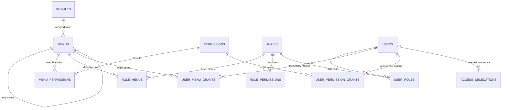

# 05 — Dynamic Role, Menu & Hak Akses Khusus (Per-User Grant)

Dokumen ini melengkapi `01-Arsitektur-TechStack.md` (§4 Arsitektur Keamanan) dan `02-Database-Modelling.md` (§4 Skema `core`).

---

## 1. Masalah yang Diselesaikan

Kebutuhan: akses tidak hanya ditentukan peran, tetapi juga dapat diberikan **langsung ke pengguna tertentu untuk menu tertentu**.

Contoh nyata di operasional HR:

| Situasi | Mengapa peran saja tidak cukup |
|---------|-------------------------------|
| Staf Finance perlu melihat menu *Payroll Report* saja, bukan seluruh modul Payroll | Membuat peran baru "Finance Payroll Viewer" untuk satu orang membuat daftar peran meledak |
| Manajer Produksi menjadi PJS Kepala Departemen selama 3 minggu | Butuh akses **berbatas waktu**, bukan perubahan peran permanen |
| Seorang HR Admin tidak boleh melihat menu *Employee Issues* karena konflik kepentingan | Butuh **pencabutan** akses spesifik tanpa menurunkan perannya |
| Auditor eksternal butuh akses baca 2 menu selama masa audit | Peran sementara berisiko lupa dicabut |

Kesalahan umum: menambah peran baru setiap kali ada pengecualian. Setelah setahun, tenant memiliki 40 peran yang tidak seorang pun memahami perbedaannya. Solusinya adalah **peran sebagai basis + grant/deny per pengguna sebagai lapisan tipis di atasnya**, dengan masa berlaku dan alasan yang tercatat.

---

## 2. Pemisahan Konsep: Menu vs Permission

Ini keputusan desain paling penting dalam dokumen ini.

| Konsep | Peran | Ditegakkan di | Bila salah |
|--------|-------|---------------|------------|
| **Permission** (`payroll.run.approve`) | Kontrol **aksi** — apakah pengguna boleh memanggil operasi ini | Backend guard + query filter | Celah keamanan nyata |
| **Menu** (`/payroll/runs`) | Kontrol **navigasi** — apakah entri ini muncul di sidebar | Frontend rendering + resolusi server | Hanya kekacauan UX |

**Aturan yang mengikat keduanya:**

> Menu **tidak pernah** menjadi sumber kebenaran keamanan. Menu selalu **menunjuk** ke satu atau lebih permission. Menyembunyikan menu tanpa mencabut permission bukan keamanan — itu hanya menyembunyikan tombol, sementara endpoint tetap terbuka bagi siapa pun yang tahu URL-nya.

Konsekuensinya:
- Memberi seseorang akses ke sebuah menu **otomatis memberikan permission yang dibutuhkan menu itu** (dapat dinonaktifkan secara sadar lewat flag).
- Mencabut permission **otomatis menyembunyikan** menu yang bergantung padanya.
- Menu tanpa permission yang terpenuhi tidak akan pernah dirender, sekalipun secara eksplisit di-grant.

---

## 3. Pemodelan Data

### 3.1 Diagram Relasi



### 3.2 DDL

```sql
-- =====================================================================
-- 10_dynamic_access.sql  (skema core)
-- =====================================================================

-- ---------------------------------------------------------------------
-- MENU: hierarkis, didaftarkan modul, dapat dikustomisasi per tenant
-- ---------------------------------------------------------------------
CREATE TYPE core.menu_type AS ENUM ('GROUP','ITEM','ACTION','DIVIDER','EXTERNAL');

CREATE TABLE core.menus (
  id            uuid PRIMARY KEY DEFAULT core.uuid_v7(),
  -- NULL = menu bawaan sistem (global, dari manifest modul)
  -- terisi = menu kustom milik tenant tertentu
  tenant_id     uuid REFERENCES core.tenants(id) ON DELETE CASCADE,
  module_key    text NOT NULL REFERENCES core.modules(key) ON DELETE CASCADE,
  parent_id     uuid REFERENCES core.menus(id) ON DELETE CASCADE,

  key           text NOT NULL,               -- 'payroll.runs', 'payroll.reports.tax'
  path          ltree NOT NULL,              -- 'payroll.runs' → query subtree cepat
  type          core.menu_type NOT NULL DEFAULT 'ITEM',

  label         text NOT NULL,               -- label default (id-ID)
  label_i18n    jsonb NOT NULL DEFAULT '{}'::jsonb,
  icon          text,
  route         text,                        -- '/payroll/runs'; NULL untuk GROUP/DIVIDER
  badge_source  text,                        -- 'leave.pending_approvals' → badge angka dinamis

  sort_order    smallint NOT NULL DEFAULT 0,
  is_visible    boolean NOT NULL DEFAULT true,   -- tenant bisa menyembunyikan tanpa mencabut izin
  is_system     boolean NOT NULL DEFAULT false,  -- menu inti, tidak boleh dihapus tenant
  -- true  = tampil untuk semua pengguna terautentikasi (mis. Dashboard, Profil Saya)
  -- false = wajib lolos evaluasi akses
  is_public     boolean NOT NULL DEFAULT false,

  metadata      jsonb NOT NULL DEFAULT '{}'::jsonb,
  version       integer NOT NULL DEFAULT 1,
  created_at    timestamptz NOT NULL DEFAULT now(),
  updated_at    timestamptz NOT NULL DEFAULT now(),

  UNIQUE (COALESCE(tenant_id, '00000000-0000-0000-0000-000000000000'::uuid), key),
  CONSTRAINT chk_route_required
    CHECK ( (type IN ('ITEM','ACTION','EXTERNAL') AND route IS NOT NULL)
         OR (type IN ('GROUP','DIVIDER')) ),
  CONSTRAINT chk_no_self_parent CHECK (parent_id IS DISTINCT FROM id)
);
CREATE INDEX idx_menus_path   ON core.menus USING gist (path);
CREATE INDEX idx_menus_module ON core.menus (module_key) WHERE is_visible;
CREATE INDEX idx_menus_parent ON core.menus (parent_id, sort_order);

-- Menu → permission yang dibutuhkan (many-to-many)
CREATE TABLE core.menu_permissions (
  menu_id        uuid NOT NULL REFERENCES core.menus(id) ON DELETE CASCADE,
  permission_key text NOT NULL REFERENCES core.permissions(key) ON DELETE CASCADE,
  -- ANY  : cukup salah satu permission dimiliki (default, kasus paling umum)
  -- ALL  : semua permission harus dimiliki
  requirement    text NOT NULL DEFAULT 'ANY' CHECK (requirement IN ('ANY','ALL')),
  PRIMARY KEY (menu_id, permission_key)
);

-- ---------------------------------------------------------------------
-- LAPIS 1: akses berbasis PERAN
-- ---------------------------------------------------------------------
CREATE TABLE core.role_menus (
  role_id     uuid NOT NULL REFERENCES core.roles(id) ON DELETE CASCADE,
  menu_id     uuid NOT NULL REFERENCES core.menus(id) ON DELETE CASCADE,
  tenant_id   uuid NOT NULL REFERENCES core.tenants(id) ON DELETE CASCADE,
  -- Bila true, mencabut menu ini dari peran juga mencabut seluruh submenu
  cascade_children boolean NOT NULL DEFAULT true,
  granted_by  uuid REFERENCES core.users(id),
  granted_at  timestamptz NOT NULL DEFAULT now(),
  PRIMARY KEY (role_id, menu_id)
);
CREATE INDEX idx_role_menus_tenant ON core.role_menus (tenant_id, role_id);

-- ---------------------------------------------------------------------
-- LAPIS 2: GRANT / DENY KHUSUS PER PENGGUNA  ← inti permintaan fitur
-- ---------------------------------------------------------------------
CREATE TYPE core.grant_effect AS ENUM ('GRANT','DENY');

CREATE TABLE core.user_menu_grants (
  id            uuid PRIMARY KEY DEFAULT core.uuid_v7(),
  tenant_id     uuid NOT NULL REFERENCES core.tenants(id) ON DELETE CASCADE,
  user_id       uuid NOT NULL REFERENCES core.users(id) ON DELETE CASCADE,
  menu_id       uuid NOT NULL REFERENCES core.menus(id) ON DELETE CASCADE,

  effect        core.grant_effect NOT NULL DEFAULT 'GRANT',

  -- true  : grant menu ini sekaligus memberikan permission yang dibutuhkannya
  --         (perilaku default — tanpa ini, menu tampil tapi API menolak)
  -- false : hanya menampilkan menu; permission harus datang dari peran
  --         (dipakai bila admin sengaja ingin memisahkan visibilitas dari izin)
  include_permissions boolean NOT NULL DEFAULT true,

  cascade_children boolean NOT NULL DEFAULT false,  -- berlaku juga untuk submenu

  -- Masa berlaku: kunci untuk akses sementara (PJS, auditor, proyek)
  valid_period  tstzrange NOT NULL DEFAULT tstzrange(now(), NULL, '[)'),

  -- Pembatasan cakupan data (ABAC) khusus untuk grant ini.
  -- Contoh: {"org_unit_ids": ["..."], "read_only": true}
  scope         jsonb NOT NULL DEFAULT '{}'::jsonb,

  reason        text NOT NULL,               -- WAJIB: grant tanpa alasan menjadi utang audit
  ticket_ref    text,                        -- nomor tiket/persetujuan
  granted_by    uuid NOT NULL REFERENCES core.users(id),
  granted_at    timestamptz NOT NULL DEFAULT now(),
  revoked_by    uuid REFERENCES core.users(id),
  revoked_at    timestamptz,
  revoke_reason text,

  -- Satu pengguna hanya boleh punya satu grant aktif per menu per efek,
  -- dan periodenya tidak boleh tumpang tindih.
  CONSTRAINT excl_user_menu_grant_overlap EXCLUDE USING gist (
    user_id WITH =,
    menu_id WITH =,
    effect  WITH =,
    valid_period WITH &&
  ) WHERE (revoked_at IS NULL)
);
CREATE INDEX idx_user_menu_grants_active
  ON core.user_menu_grants (tenant_id, user_id)
  WHERE revoked_at IS NULL;
CREATE INDEX idx_user_menu_grants_expiry
  ON core.user_menu_grants (upper(valid_period))
  WHERE revoked_at IS NULL AND upper(valid_period) IS NOT NULL;

-- Grant permission langsung (tanpa lewat menu) — untuk akses API/integrasi
CREATE TABLE core.user_permission_grants (
  id             uuid PRIMARY KEY DEFAULT core.uuid_v7(),
  tenant_id      uuid NOT NULL REFERENCES core.tenants(id) ON DELETE CASCADE,
  user_id        uuid NOT NULL REFERENCES core.users(id) ON DELETE CASCADE,
  permission_key text NOT NULL REFERENCES core.permissions(key) ON DELETE CASCADE,
  effect         core.grant_effect NOT NULL DEFAULT 'GRANT',
  valid_period   tstzrange NOT NULL DEFAULT tstzrange(now(), NULL, '[)'),
  scope          jsonb NOT NULL DEFAULT '{}'::jsonb,
  source         text NOT NULL DEFAULT 'MANUAL',  -- MANUAL / MENU_GRANT / DELEGATION
  source_ref     uuid,                            -- id user_menu_grants bila turunan
  reason         text NOT NULL,
  granted_by     uuid NOT NULL REFERENCES core.users(id),
  granted_at     timestamptz NOT NULL DEFAULT now(),
  revoked_at     timestamptz,
  CONSTRAINT excl_user_perm_grant_overlap EXCLUDE USING gist (
    user_id WITH =, permission_key WITH =, effect WITH =, valid_period WITH &&
  ) WHERE (revoked_at IS NULL)
);
CREATE INDEX idx_user_perm_grants_active
  ON core.user_permission_grants (tenant_id, user_id) WHERE revoked_at IS NULL;

-- ---------------------------------------------------------------------
-- LAPIS 3: DELEGASI (PJS / acting) — meminjam akses orang lain sementara
-- ---------------------------------------------------------------------
CREATE TABLE core.access_delegations (
  id             uuid PRIMARY KEY DEFAULT core.uuid_v7(),
  tenant_id      uuid NOT NULL REFERENCES core.tenants(id) ON DELETE CASCADE,
  delegator_id   uuid NOT NULL REFERENCES core.users(id) ON DELETE CASCADE,
  delegate_id    uuid NOT NULL REFERENCES core.users(id) ON DELETE CASCADE,
  -- NULL = seluruh akses delegator; terisi = hanya menu tertentu
  menu_ids       uuid[] NOT NULL DEFAULT '{}',
  valid_period   tstzrange NOT NULL,
  reason         text NOT NULL,
  status         text NOT NULL DEFAULT 'ACTIVE' CHECK (status IN ('ACTIVE','REVOKED','EXPIRED')),
  approved_by    uuid REFERENCES core.users(id),
  created_at     timestamptz NOT NULL DEFAULT now(),
  CONSTRAINT chk_no_self_delegation CHECK (delegator_id <> delegate_id)
);
CREATE INDEX idx_delegations_active
  ON core.access_delegations (tenant_id, delegate_id)
  WHERE status = 'ACTIVE';

-- ---------------------------------------------------------------------
-- Versi cache: dinaikkan setiap kali akses berubah → invalidasi terarah
-- ---------------------------------------------------------------------
CREATE TABLE core.access_versions (
  tenant_id   uuid NOT NULL REFERENCES core.tenants(id) ON DELETE CASCADE,
  user_id     uuid REFERENCES core.users(id) ON DELETE CASCADE,  -- NULL = versi tenant
  version     bigint NOT NULL DEFAULT 1,
  updated_at  timestamptz NOT NULL DEFAULT now(),
  PRIMARY KEY (tenant_id, COALESCE(user_id, '00000000-0000-0000-0000-000000000000'::uuid))
);
```

> **Catatan tentang `reason` yang `NOT NULL`:** ini bukan formalitas. Grant khusus adalah pengecualian terhadap model peran, dan pengecualian tanpa penjelasan akan menumpuk sampai tidak ada yang berani mencabutnya. Memaksa alasan pada tingkat skema membuat tinjauan akses berkala (*access review*) menjadi mungkin.

---

## 4. Aturan Presedensi (Resolusi Akses Efektif)

Urutan evaluasi, dari yang paling menentukan:

```
1. Modul tidak dilisensi tenant           → TIDAK ADA AKSES (tidak muncul, API 402)
2. Menu is_visible = false (tenant)       → TIDAK TAMPIL (permission tetap berlaku untuk API)
3. DENY eksplisit pada pengguna (aktif)   → DITOLAK   ← mengalahkan semua GRANT
4. Menu is_public = true                  → DIIZINKAN
5. GRANT eksplisit pada pengguna (aktif)  → DIIZINKAN
6. Delegasi aktif yang mencakup menu ini  → DIIZINKAN
7. Salah satu peran pengguna memberi menu → DIIZINKAN
8. Selain itu                             → DITOLAK (default deny)
```

**Mengapa DENY mengalahkan GRANT:** pencabutan akses hampir selalu bermotif kepatuhan atau konflik kepentingan (misalnya HR Admin tidak boleh melihat kasus disipliner dirinya sendiri). Aturan keamanan yang dapat dibatalkan oleh aturan lain bukanlah aturan.

**Interaksi menu-induk dan anak:** sebuah menu `GROUP` tampil bila **minimal satu anaknya** dapat diakses. Sebaliknya, `DENY` pada induk dengan `cascade_children = true` menutup seluruh subtree.

### 4.1 Fungsi Resolusi di PostgreSQL

Menempatkan resolusi di basis data memberi satu sumber kebenaran yang sama untuk API, worker, dan laporan audit.

```sql
CREATE OR REPLACE FUNCTION core.fn_effective_permissions(p_user_id uuid)
RETURNS TABLE (permission_key text, scope jsonb, source text) AS $$
WITH ctx AS (
  SELECT u.id AS user_id, u.tenant_id FROM core.users u WHERE u.id = p_user_id AND u.is_active
),
licensed AS (
  SELECT tm.module_key
  FROM core.tenant_modules tm, ctx
  WHERE tm.tenant_id = ctx.tenant_id
    AND tm.enabled
    AND (tm.expires_at IS NULL OR tm.expires_at > now())
),
-- (a) dari peran
from_roles AS (
  SELECT rp.permission_key, '{}'::jsonb AS scope, 'ROLE' AS source
  FROM core.user_roles ur
  JOIN core.role_permissions rp ON rp.role_id = ur.role_id
  WHERE ur.user_id = p_user_id
),
-- (b) dari menu yang di-grant ke peran (permission implisit menu)
from_role_menus AS (
  SELECT mp.permission_key, '{}'::jsonb AS scope, 'ROLE_MENU' AS source
  FROM core.user_roles ur
  JOIN core.role_menus rm    ON rm.role_id = ur.role_id
  JOIN core.menu_permissions mp ON mp.menu_id = rm.menu_id
  WHERE ur.user_id = p_user_id
),
-- (c) dari grant menu khusus pengguna (include_permissions = true)
from_user_menus AS (
  SELECT mp.permission_key, g.scope, 'USER_MENU_GRANT' AS source
  FROM core.user_menu_grants g
  JOIN core.menus m ON m.id = g.menu_id
  -- cascade: ikut sertakan submenu bila diminta
  JOIN core.menus target
    ON target.id = m.id
    OR (g.cascade_children AND target.path <@ m.path)
  JOIN core.menu_permissions mp ON mp.menu_id = target.id
  WHERE g.user_id = p_user_id
    AND g.effect = 'GRANT'
    AND g.include_permissions
    AND g.revoked_at IS NULL
    AND g.valid_period @> now()
),
-- (d) dari grant permission langsung
from_user_perms AS (
  SELECT pg.permission_key, pg.scope, 'USER_PERM_GRANT' AS source
  FROM core.user_permission_grants pg
  WHERE pg.user_id = p_user_id
    AND pg.effect = 'GRANT'
    AND pg.revoked_at IS NULL
    AND pg.valid_period @> now()
),
-- (e) dari delegasi aktif: warisi permission delegator
from_delegation AS (
  SELECT ep.permission_key,
         jsonb_build_object('delegated_from', d.delegator_id) || ep.scope AS scope,
         'DELEGATION' AS source
  FROM core.access_delegations d
  CROSS JOIN LATERAL core.fn_effective_permissions_base(d.delegator_id) ep
  WHERE d.delegate_id = p_user_id
    AND d.status = 'ACTIVE'
    AND d.valid_period @> now()
),
granted AS (
  SELECT * FROM from_roles
  UNION ALL SELECT * FROM from_role_menus
  UNION ALL SELECT * FROM from_user_menus
  UNION ALL SELECT * FROM from_user_perms
  UNION ALL SELECT * FROM from_delegation
),
-- DENY eksplisit: dievaluasi paling akhir dan menang mutlak
denied AS (
  SELECT pg.permission_key
  FROM core.user_permission_grants pg
  WHERE pg.user_id = p_user_id AND pg.effect = 'DENY'
    AND pg.revoked_at IS NULL AND pg.valid_period @> now()
  UNION
  SELECT mp.permission_key
  FROM core.user_menu_grants g
  JOIN core.menus m ON m.id = g.menu_id
  JOIN core.menus target
    ON target.id = m.id OR (g.cascade_children AND target.path <@ m.path)
  JOIN core.menu_permissions mp ON mp.menu_id = target.id
  WHERE g.user_id = p_user_id AND g.effect = 'DENY'
    AND g.revoked_at IS NULL AND g.valid_period @> now()
)
SELECT g.permission_key,
       -- scope paling permisif menang bila permission datang dari beberapa sumber
       jsonb_agg(DISTINCT g.scope) FILTER (WHERE g.scope <> '{}'::jsonb) AS scope,
       string_agg(DISTINCT g.source, ',') AS source
FROM granted g
JOIN core.permissions p ON p.key = g.permission_key
JOIN licensed l         ON l.module_key = p.module_key       -- gerbang lisensi modul
WHERE g.permission_key NOT IN (SELECT permission_key FROM denied)
GROUP BY g.permission_key;
$$ LANGUAGE sql STABLE SECURITY DEFINER;
```

> `fn_effective_permissions_base` adalah varian tanpa cabang delegasi — mencegah rekursi tak berujung bila A mendelegasikan ke B dan B ke A. Delegasi berantai memang sengaja tidak didukung: akses yang berpindah dua tangan tidak lagi dapat dipertanggungjawabkan.

### 4.2 Membangun Pohon Menu Efektif

```sql
CREATE OR REPLACE FUNCTION core.fn_effective_menus(p_user_id uuid)
RETURNS TABLE (
  menu_id uuid, parent_id uuid, key text, label text, icon text,
  route text, type core.menu_type, sort_order smallint,
  badge_source text, access_source text
) AS $$
WITH ctx AS (SELECT tenant_id FROM core.users WHERE id = p_user_id),
perms AS (SELECT permission_key FROM core.fn_effective_permissions(p_user_id)),
licensed AS (
  SELECT tm.module_key FROM core.tenant_modules tm, ctx
  WHERE tm.tenant_id = ctx.tenant_id AND tm.enabled
    AND (tm.expires_at IS NULL OR tm.expires_at > now())
),
-- menu bawaan sistem + override milik tenant (override menang)
visible_menus AS (
  SELECT DISTINCT ON (m.key) m.*
  FROM core.menus m, ctx
  WHERE (m.tenant_id IS NULL OR m.tenant_id = ctx.tenant_id)
    AND m.is_visible
    AND m.module_key IN (SELECT module_key FROM licensed)
  ORDER BY m.key, m.tenant_id NULLS LAST      -- baris milik tenant diprioritaskan
),
denied_menus AS (
  SELECT target.id
  FROM core.user_menu_grants g
  JOIN core.menus m ON m.id = g.menu_id
  JOIN core.menus target
    ON target.id = m.id OR (g.cascade_children AND target.path <@ m.path)
  WHERE g.user_id = p_user_id AND g.effect = 'DENY'
    AND g.revoked_at IS NULL AND g.valid_period @> now()
),
granted_menus AS (
  SELECT target.id, 'USER_GRANT' AS src
  FROM core.user_menu_grants g
  JOIN core.menus m ON m.id = g.menu_id
  JOIN core.menus target
    ON target.id = m.id OR (g.cascade_children AND target.path <@ m.path)
  WHERE g.user_id = p_user_id AND g.effect = 'GRANT'
    AND g.revoked_at IS NULL AND g.valid_period @> now()
  UNION
  SELECT rm.menu_id, 'ROLE' FROM core.user_roles ur
  JOIN core.role_menus rm ON rm.role_id = ur.role_id
  WHERE ur.user_id = p_user_id
  UNION
  SELECT unnest(d.menu_ids), 'DELEGATION' FROM core.access_delegations d
  WHERE d.delegate_id = p_user_id AND d.status = 'ACTIVE' AND d.valid_period @> now()
),
-- Menu dapat diakses bila: publik, ATAU di-grant DAN permission-nya terpenuhi
accessible AS (
  SELECT vm.*,
         COALESCE(gm.src, CASE WHEN vm.is_public THEN 'PUBLIC' END) AS access_source
  FROM visible_menus vm
  LEFT JOIN granted_menus gm ON gm.id = vm.id
  WHERE vm.id NOT IN (SELECT id FROM denied_menus)
    AND (vm.is_public OR gm.id IS NOT NULL)
    AND (
      -- GROUP/DIVIDER tidak butuh permission; kelayakannya ditentukan anaknya
      vm.type IN ('GROUP','DIVIDER')
      OR NOT EXISTS (SELECT 1 FROM core.menu_permissions mp WHERE mp.menu_id = vm.id)
      OR EXISTS (
        SELECT 1 FROM core.menu_permissions mp
        WHERE mp.menu_id = vm.id AND mp.requirement = 'ANY'
          AND mp.permission_key IN (SELECT permission_key FROM perms))
      OR (
        NOT EXISTS (SELECT 1 FROM core.menu_permissions mp
                    WHERE mp.menu_id = vm.id AND mp.requirement = 'ALL'
                      AND mp.permission_key NOT IN (SELECT permission_key FROM perms))
        AND EXISTS (SELECT 1 FROM core.menu_permissions mp
                    WHERE mp.menu_id = vm.id AND mp.requirement = 'ALL'))
    )
),
-- Buang GROUP yang menjadi kosong setelah anaknya tersaring
pruned AS (
  SELECT a.* FROM accessible a
  WHERE a.type <> 'GROUP'
     OR EXISTS (SELECT 1 FROM accessible c WHERE c.path <@ a.path AND c.id <> a.id
                                             AND c.type <> 'GROUP')
)
SELECT id, parent_id, key, label, icon, route, type, sort_order, badge_source, access_source
FROM pruned
ORDER BY path, sort_order;
$$ LANGUAGE sql STABLE SECURITY DEFINER;
```

Kolom `access_source` sengaja dikembalikan ke frontend. UI dapat menampilkan penanda kecil pada menu yang berasal dari grant khusus atau delegasi — pengguna tahu mengapa ia melihat sesuatu yang rekan setimnya tidak lihat, dan admin dapat melacaknya tanpa membuka log.

---

## 5. Implementasi Backend

### 5.1 Resolver dengan Cache Berversi

```typescript
// packages/core/kernel/src/authz/access-resolver.service.ts
@Injectable()
export class AccessResolver {
  private readonly TTL = 300; // detik

  constructor(
    private readonly prisma: PrismaService,
    private readonly redis: RedisService,
  ) {}

  async resolve(tenantId: string, userId: string): Promise<EffectiveAccess> {
    const version  = await this.versionOf(tenantId, userId);
    const cacheKey = `access:${tenantId}:${userId}:v${version}`;

    const cached = await this.redis.get(cacheKey);
    if (cached) return JSON.parse(cached);

    const access = await withTenant(this.prisma, tenantId, async (tx) => {
      const [permissions, menus] = await Promise.all([
        tx.$queryRaw<PermRow[]>`SELECT * FROM core.fn_effective_permissions(${userId}::uuid)`,
        tx.$queryRaw<MenuRow[]>`SELECT * FROM core.fn_effective_menus(${userId}::uuid)`,
      ]);
      return {
        version,
        permissions: permissions.map((p) => p.permission_key),
        scopes: Object.fromEntries(permissions.map((p) => [p.permission_key, p.scope])),
        menuTree: buildTree(menus),
        routeIndex: Object.fromEntries(
          menus.filter((m) => m.route).map((m) => [m.route!, m.menu_id]),
        ),
        resolvedAt: new Date().toISOString(),
      };
    });

    await this.redis.setex(cacheKey, this.TTL, JSON.stringify(access));
    return access;
  }

  /** Versi naik → seluruh cache lama menjadi tak terjangkau tanpa perlu dihapus satu per satu */
  private async versionOf(tenantId: string, userId: string): Promise<number> {
    const key = `access:ver:${tenantId}:${userId}`;
    const hit = await this.redis.get(key);
    if (hit) return Number(hit);

    const [row] = await this.prisma.$queryRaw<[{ version: bigint }]>`
      SELECT GREATEST(
        COALESCE((SELECT version FROM core.access_versions
                   WHERE tenant_id = ${tenantId}::uuid AND user_id = ${userId}::uuid), 1),
        COALESCE((SELECT version FROM core.access_versions
                   WHERE tenant_id = ${tenantId}::uuid AND user_id IS NULL), 1)
      ) AS version`;
    await this.redis.setex(key, 60, String(row.version));
    return Number(row.version);
  }
}
```

### 5.2 Guard Permission

```typescript
// packages/core/kernel/src/authz/permission.guard.ts
@Injectable()
export class PermissionGuard implements CanActivate {
  constructor(
    private readonly reflector: Reflector,
    private readonly resolver: AccessResolver,
  ) {}

  async canActivate(ctx: ExecutionContext): Promise<boolean> {
    const required = this.reflector.getAllAndMerge<string[]>(
      PERMISSION_KEY, [ctx.getHandler(), ctx.getClass()],
    );
    if (required.length === 0) return true;

    const req = ctx.switchToHttp().getRequest();
    const { tenantId, userId } = req.auth;

    const access = await this.resolver.resolve(tenantId, userId);
    const missing = required.filter((p) => !access.permissions.includes(p));

    if (missing.length > 0) {
      // Pesan galat menyebut permission yang kurang — mempercepat triase dukungan,
      // dan tidak membocorkan apa pun yang tidak sudah tersirat dari endpoint itu sendiri.
      throw new ForbiddenException({
        code: 'MISSING_PERMISSION',
        message: `Akses ditolak. Izin yang dibutuhkan: ${missing.join(', ')}`,
        missing,
      });
    }

    // Scope disuntikkan ke request untuk dipakai lapisan query (ABAC)
    req.accessScopes = access.scopes;
    return true;
  }
}

// Penggunaan
@Controller('payroll/runs')
@RequiresModule('payroll')
export class PayrollRunController {
  @Post()
  @RequiresPermission('payroll.run.create')
  create(@Body() dto: CreateRunDto) { /* ... */ }

  @Post(':id/approve')
  @RequiresPermission('payroll.run.approve')
  approve(@Param('id') id: string) { /* ... */ }
}
```

### 5.3 Perubahan Akses Bersifat Transaksional + Invalidasi

Ini titik rawan: bila cache tidak diinvalidasi, pencabutan akses tidak berlaku sampai TTL habis — jendela 5 menit yang tidak dapat diterima untuk pencabutan bermotif keamanan.

```typescript
// packages/core/kernel/src/authz/access-admin.service.ts
@Injectable()
export class AccessAdminService {
  async grantMenuToUser(cmd: GrantMenuCommand): Promise<void> {
    await withTenant(this.prisma, cmd.tenantId, async (tx) => {
      // 1. Validasi: tidak boleh memberi akses yang admin sendiri tidak miliki
      //    (mencegah eskalasi privilese lewat fitur grant)
      const adminAccess = await this.resolver.resolve(cmd.tenantId, cmd.grantedBy);
      const menuPerms   = await tx.menuPermission.findMany({ where: { menuId: cmd.menuId } });
      const escalation  = menuPerms
        .map((p) => p.permissionKey)
        .filter((p) => !adminAccess.permissions.includes(p));

      if (escalation.length > 0 && !adminAccess.permissions.includes('iam.grant.any')) {
        throw new ForbiddenException({
          code: 'PRIVILEGE_ESCALATION_BLOCKED',
          message: `Anda tidak dapat memberikan izin yang tidak Anda miliki: ${escalation.join(', ')}`,
        });
      }

      // 2. Simpan grant
      const grant = await tx.userMenuGrant.create({
        data: {
          tenantId: cmd.tenantId, userId: cmd.userId, menuId: cmd.menuId,
          effect: cmd.effect, includePermissions: cmd.includePermissions ?? true,
          cascadeChildren: cmd.cascadeChildren ?? false,
          validPeriod: buildRange(cmd.validFrom, cmd.validUntil),
          scope: cmd.scope ?? {}, reason: cmd.reason, ticketRef: cmd.ticketRef,
          grantedBy: cmd.grantedBy,
        },
      });

      // 3. Naikkan versi akses → seluruh cache pengguna ini gugur seketika
      await tx.$executeRaw`
        INSERT INTO core.access_versions (tenant_id, user_id, version)
        VALUES (${cmd.tenantId}::uuid, ${cmd.userId}::uuid, 2)
        ON CONFLICT (tenant_id, COALESCE(user_id, '00000000-0000-0000-0000-000000000000'::uuid))
        DO UPDATE SET version = core.access_versions.version + 1, updated_at = now()`;

      // 4. Event: memicu penghapusan cache Redis + push real-time ke sesi aktif
      await OutboxPublisher.emit(tx, {
        tenantId: cmd.tenantId, type: 'iam.access.changed',
        aggregateType: 'UserMenuGrant', aggregateId: grant.id,
        payload: { userId: cmd.userId, menuId: cmd.menuId, effect: cmd.effect },
        actorId: cmd.grantedBy,
      });
      // Audit tercatat otomatis lewat trigger core.fn_audit()
    });
  }
}
```

Konsumer event menghapus kunci cache dan memberi tahu klien:

```typescript
// apps/worker/src/consumers/access-changed.consumer.ts
export class AccessChangedConsumer extends IdempotentConsumer<AccessChangedPayload> {
  readonly consumerName = 'access-changed';

  protected async execute(payload: AccessChangedPayload) {
    await this.redis.del(`access:ver:${payload.tenantId}:${payload.userId}`);
    const pattern = `access:${payload.tenantId}:${payload.userId}:v*`;
    for await (const keys of this.redis.scanStream({ match: pattern, count: 100 })) {
      if (keys.length) await this.redis.del(...keys);
    }

    // Push ke sesi aktif: sidebar diperbarui tanpa perlu logout
    await this.realtimeBus.publish(`user:${payload.userId}`, {
      type: 'iam.access.changed',
      data: { reason: payload.effect === 'DENY' ? 'REVOKED' : 'GRANTED' },
    });
  }
}
```

### 5.4 Kedaluwarsa Otomatis

```typescript
// Scheduler tiap 5 menit — grant sementara harus benar-benar berakhir
@Cron('*/5 * * * *')
async expireGrants() {
  const expired = await this.prisma.$queryRaw<{ user_id: string; tenant_id: string }[]>`
    WITH e AS (
      UPDATE core.user_menu_grants
         SET revoked_at = now(), revoke_reason = 'AUTO_EXPIRED'
       WHERE revoked_at IS NULL
         AND upper(valid_period) IS NOT NULL
         AND upper(valid_period) <= now()
      RETURNING tenant_id, user_id
    ), d AS (
      UPDATE core.access_delegations SET status = 'EXPIRED'
       WHERE status = 'ACTIVE' AND upper(valid_period) <= now()
      RETURNING tenant_id, delegate_id AS user_id
    )
    SELECT * FROM e UNION SELECT * FROM d`;

  for (const row of dedupe(expired)) {
    await this.accessAdmin.bumpVersionAndNotify(row.tenant_id, row.user_id);
  }
}
```

---

## 6. Implementasi Frontend

### 6.1 Penyedia Akses & Sidebar Dinamis

```tsx
// apps/web/src/lib/access/access-provider.tsx
'use client';

export function AccessProvider({ children }: { children: React.ReactNode }) {
  const { data, refetch } = useQuery({
    queryKey: ['me', 'access'],
    queryFn: () => api.get<EffectiveAccess>('/me/access'),
    staleTime: 5 * 60_000,
  });

  // Perubahan akses diterapkan seketika, tanpa logout
  useEffect(() => {
    const socket = getSocket();
    const onChange = (ev: { type: string }) => {
      if (ev.type !== 'iam.access.changed') return;
      refetch();
      toast.info('Hak akses Anda diperbarui.');
    };
    socket.on('event', onChange);
    return () => { socket.off('event', onChange); };
  }, [refetch]);

  const value = useMemo(() => ({
    permissions: new Set(data?.permissions ?? []),
    menuTree: data?.menuTree ?? [],
    can: (perm: string) => data?.permissions.includes(perm) ?? false,
    canAny: (perms: string[]) => perms.some((p) => data?.permissions.includes(p)),
    canAll: (perms: string[]) => perms.every((p) => data?.permissions.includes(p)),
  }), [data]);

  return <AccessContext.Provider value={value}>{children}</AccessContext.Provider>;
}

// Komponen pembungkus untuk elemen UI bersyarat
export function Can({ perm, any, children, fallback = null }: CanProps) {
  const { can, canAny } = useAccess();
  const allowed = any ? canAny(any) : can(perm!);
  return <>{allowed ? children : fallback}</>;
}
```

```tsx
// apps/web/src/components/layout/dynamic-sidebar.tsx
export function DynamicSidebar() {
  const { menuTree } = useAccess();
  const pathname = usePathname();

  const render = (nodes: MenuNode[], depth = 0) => nodes.map((node) => {
    if (node.type === 'DIVIDER') return <Separator key={node.id} className="my-2" />;

    if (node.type === 'GROUP') {
      return (
        <Collapsible key={node.id} defaultOpen={isAncestorOf(node, pathname)}>
          <CollapsibleTrigger className="flex w-full items-center gap-2 px-3 py-2">
            <Icon name={node.icon} className="size-4" />
            <span className="flex-1 text-left text-sm font-medium">{node.label}</span>
            <ChevronDown className="size-4 transition-transform" />
          </CollapsibleTrigger>
          <CollapsibleContent className="ml-3 border-l pl-2">
            {render(node.children ?? [], depth + 1)}
          </CollapsibleContent>
        </Collapsible>
      );
    }

    return (
      <Link key={node.id} href={node.route!} data-active={pathname === node.route}
            className="flex items-center gap-2 rounded px-3 py-2 text-sm data-[active=true]:bg-accent">
        <Icon name={node.icon} className="size-4" />
        <span className="flex-1">{node.label}</span>
        {node.badgeSource && <MenuBadge source={node.badgeSource} />}
        {/* Penanda transparansi: menu ini datang dari akses khusus, bukan peran */}
        {node.accessSource === 'USER_GRANT' && (
          <Tooltip content="Akses khusus yang diberikan kepada Anda">
            <KeyRound className="size-3 text-amber-500" />
          </Tooltip>
        )}
        {node.accessSource === 'DELEGATION' && (
          <Tooltip content="Akses delegasi sementara">
            <UserCheck className="size-3 text-blue-500" />
          </Tooltip>
        )}
      </Link>
    );
  });

  return <nav className="flex flex-col gap-0.5 p-2">{render(menuTree)}</nav>;
}
```

### 6.2 Penjagaan Rute

Sidebar yang bersih tidak cukup — pengguna bisa mengetik URL langsung.

```tsx
// apps/web/src/middleware.ts (jalur server, sebelum halaman dirender)
export async function middleware(req: NextRequest) {
  const session = await getSession(req);
  if (!session) return NextResponse.redirect(new URL('/login', req.url));

  const access = await fetchAccess(session);          // di-cache per request
  const route  = matchRoute(req.nextUrl.pathname, access.routeIndex);

  if (route && !access.allowedRoutes.includes(route)) {
    return NextResponse.rewrite(new URL('/403', req.url));
  }
  return NextResponse.next();
}
```

> Ini tetap **lapisan kenyamanan**, bukan keamanan. Penegakan sesungguhnya ada di `PermissionGuard` pada backend. Middleware hanya mencegah pengguna melihat halaman kosong yang gagal memuat data.

---

## 7. Antarmuka Administrasi

### 7.1 Matriks Peran × Menu

Halaman `/settings/access/roles` menampilkan grid: baris = menu (pohon), kolom = peran, sel = checkbox. Menyimpan perubahan menghasilkan satu batch mutasi, bukan satu request per sel.

```
Menu                          | HR Admin | Manager | Employee | Finance
------------------------------|----------|---------|----------|--------
▼ Payroll                     |    ☑     |    ☐    |    ☐     |   ☑
    Payroll Run               |    ☑     |    ☐    |    ☐     |   ☐
    Komponen Gaji             |    ☑     |    ☐    |    ☐     |   ☐
    Laporan Payroll           |    ☑     |    ☐    |    ☐     |   ☑
    Slip Gaji Saya            |    ☑     |    ☑    |    ☑     |   ☑
▼ Absensi                     |    ☑     |    ☑    |    ☑     |   ☐
    ...
```

### 7.2 Panel Akses Khusus per Pengguna

Halaman `/settings/access/users/:id` menampilkan tiga bagian:

1. **Akses dari peran** — daftar menu (baca-saja) dengan label peran asalnya.
2. **Akses khusus** — tabel grant/deny dengan kolom: menu, efek, berlaku sampai, alasan, diberikan oleh, tindakan cabut.
3. **Pratinjau akses efektif** — hasil akhir setelah semua aturan presedensi diterapkan, dengan penjelasan per baris:

```
Laporan Payroll   ✓ DIIZINKAN   ← GRANT khusus (berlaku s.d. 30 Sep 2026)
                                  Alasan: "Audit internal Q3" · oleh: Rina · Tiket: SEC-1204
Employee Issues   ✗ DITOLAK     ← DENY khusus mengalahkan akses dari peran "HR Admin"
                                  Alasan: "Konflik kepentingan — kasus terkait ybs"
Payroll Run       ✓ DIIZINKAN   ← Peran "HR Admin"
```

Fitur **"Uji sebagai pengguna ini"** memanggil `fn_effective_menus` untuk pengguna target dan menampilkan sidebar yang akan ia lihat — cara tercepat menjawab pertanyaan dukungan "kenapa saya tidak bisa lihat menu X".

### 7.3 Endpoint API

```
GET    /me/access                              # akses efektif pengguna saat ini
GET    /admin/menus                            # pohon menu (bawaan + kustom tenant)
POST   /admin/menus                            # buat menu kustom
PATCH  /admin/menus/:id                        # ubah label, urutan, visibilitas
GET    /admin/roles/:id/menus                  # menu milik peran
PUT    /admin/roles/:id/menus                  # simpan batch matriks peran
GET    /admin/users/:id/access                 # akses efektif + rincian sumbernya
POST   /admin/users/:id/menu-grants            # beri akses khusus (GRANT/DENY)
DELETE /admin/users/:id/menu-grants/:grantId   # cabut akses khusus
POST   /admin/users/:id/delegations            # buat delegasi sementara
GET    /admin/access/review                    # daftar grant untuk tinjauan berkala
GET    /admin/access/audit?userId=&from=&to=   # riwayat perubahan akses
```

---

## 8. Tinjauan Akses Berkala (Access Review)

Grant khusus cenderung menumpuk. Tanpa proses peninjauan, sistem akan pelan-pelan kembali menjadi "semua orang admin".

```sql
-- Laporan untuk tinjauan triwulanan
CREATE OR REPLACE VIEW core.v_access_review AS
SELECT
  g.tenant_id,
  u.full_name          AS user_name,
  m.label              AS menu_label,
  g.effect,
  g.reason,
  g.ticket_ref,
  gb.full_name         AS granted_by_name,
  g.granted_at,
  upper(g.valid_period) AS expires_at,
  CASE
    WHEN upper(g.valid_period) IS NULL THEN 'PERMANEN'
    WHEN upper(g.valid_period) < now() + interval '7 days' THEN 'SEGERA BERAKHIR'
    ELSE 'AKTIF'
  END AS status,
  age(now(), g.granted_at) AS age,
  -- Grant permanen berumur > 90 hari wajib ditinjau ulang
  (upper(g.valid_period) IS NULL AND g.granted_at < now() - interval '90 days') AS needs_review
FROM core.user_menu_grants g
JOIN core.users u  ON u.id = g.user_id
JOIN core.menus m  ON m.id = g.menu_id
JOIN core.users gb ON gb.id = g.granted_by
WHERE g.revoked_at IS NULL;
```

**Kebijakan yang disarankan** (dapat dikonfigurasi per tenant):
- Grant tanpa tanggal berakhir memicu pengingat ke pemberi grant setelah 90 hari.
- Grant yang dibuat oleh pengguna yang sudah nonaktif otomatis ditandai untuk peninjauan.
- Laporan triwulanan dikirim ke pemilik tenant berisi seluruh akses khusus yang aktif.

---

## 9. Pertimbangan Keamanan

| Risiko | Mitigasi |
|--------|----------|
| **Eskalasi privilese** — admin memberi dirinya izin yang tidak dimilikinya | Validasi di `grantMenuToUser`: hanya pemegang `iam.grant.any` yang boleh memberi izin di luar miliknya |
| **Grant abadi** — akses sementara tidak pernah dicabut | Scheduler kedaluwarsa + laporan tinjauan + pengingat 90 hari |
| Menu disembunyikan tapi API terbuka | Menu selalu tertaut ke permission; guard backend adalah penegak sesungguhnya |
| Cache basi setelah pencabutan | Versi akses dinaikkan dalam transaksi yang sama → cache lama tak terjangkau seketika |
| Rantai delegasi tak terlacak | Delegasi berantai ditolak; `fn_effective_permissions_base` memutus rekursi |
| Grant lintas tenant | Semua tabel ber-`tenant_id` dengan RLS aktif (dok. 02, §4.1) |
| Perubahan akses tidak terlacak | Trigger `core.fn_audit()` pada `user_menu_grants`, `role_menus`, `user_permission_grants` |

```sql
CREATE TRIGGER trg_audit_user_menu_grants
  AFTER INSERT OR UPDATE OR DELETE ON core.user_menu_grants
  FOR EACH ROW EXECUTE FUNCTION core.fn_audit();
CREATE TRIGGER trg_audit_role_menus
  AFTER INSERT OR UPDATE OR DELETE ON core.role_menus
  FOR EACH ROW EXECUTE FUNCTION core.fn_audit();
CREATE TRIGGER trg_audit_user_perm_grants
  AFTER INSERT OR UPDATE OR DELETE ON core.user_permission_grants
  FOR EACH ROW EXECUTE FUNCTION core.fn_audit();
```

---

## 10. Integrasi dengan Manifest Modul

Menu didaftarkan modul saat aktivasi, sehingga add-on tetap plug-and-play. Ini perluasan `module.manifest.ts` dari dokumen `01`, §2.1:

```typescript
export default defineModule({
  key: 'payroll',
  // ...
  menus: [
    { key: 'payroll',              type: 'GROUP', label: 'Payroll', icon: 'Wallet', sortOrder: 40 },
    { key: 'payroll.runs',         type: 'ITEM',  parent: 'payroll',
      label: 'Payroll Run',        route: '/payroll/runs',
      permissions: [{ key: 'payroll.run.create', requirement: 'ANY' }] },
    { key: 'payroll.components',   type: 'ITEM',  parent: 'payroll',
      label: 'Komponen Gaji',      route: '/payroll/components',
      permissions: [{ key: 'payroll.component.manage', requirement: 'ANY' }] },
    { key: 'payroll.reports',      type: 'ITEM',  parent: 'payroll',
      label: 'Laporan Payroll',    route: '/payroll/reports',
      permissions: [{ key: 'payroll.report.read', requirement: 'ANY' }] },
    { key: 'payroll.my-payslip',   type: 'ITEM',  parent: 'payroll',
      label: 'Slip Gaji Saya',     route: '/payroll/my-payslip',
      permissions: [{ key: 'payroll.payslip.read.self', requirement: 'ANY' }] },
  ],

  // Peran bawaan yang di-seed saat modul diaktifkan; tenant bebas mengubahnya setelahnya
  defaultRoleMenus: {
    HR_ADMIN: ['payroll', 'payroll.runs', 'payroll.components', 'payroll.reports', 'payroll.my-payslip'],
    EMPLOYEE: ['payroll', 'payroll.my-payslip'],
    LINE_MANAGER: ['payroll', 'payroll.my-payslip'],
  },

  onEnable: async (ctx) => {
    await ctx.runMigrations();
    await ctx.registerMenus();           // upsert ke core.menus + menu_permissions
    await ctx.seedDefaultRoleMenus();    // hanya untuk peran yang belum dikustomisasi tenant
  },

  onDisable: async (ctx) => {
    await ctx.hideMenus();               // is_visible = false; baris menu & grant TIDAK dihapus
    await ctx.bumpAccessVersionForTenant();
  },
});
```

> **`onDisable` tidak menghapus menu maupun grant.** Bila tenant menonaktifkan modul Payroll lalu mengaktifkannya kembali enam bulan kemudian, seluruh konfigurasi peran dan akses khusus mereka kembali utuh. Menghapusnya berarti memaksa mereka mengonfigurasi ulang dari nol — pengalaman yang membuat orang enggan mencoba add-on.

---

## 11. Dampak pada Roadmap

Fitur ini masuk **Fase 1, Sprint 1–2** sebagai bagian dari fondasi platform, bukan sebagai penambahan belakangan. Alasannya sama dengan alasan outbox dan RLS dibangun di awal: model akses adalah lintas-potong. Memasangnya setelah 12 modul jadi berarti membongkar guard dan navigasi di 12 tempat.

Penambahan estimasi Fase 1: **+2 minggu-orang backend, +1,5 minggu-orang frontend** (matriks admin dan panel akses khusus adalah UI yang padat).

**Definition of Done tambahan untuk Fase 1:**
- [ ] Mencabut akses pengguna berlaku < 5 detik pada sesi yang sedang aktif (tanpa logout)
- [ ] `DENY` khusus terbukti mengalahkan akses dari peran (uji otomatis)
- [ ] Grant berbatas waktu benar-benar berakhir pada waktunya (uji dengan jam yang dimajukan)
- [ ] Admin tanpa `iam.grant.any` tidak dapat memberikan izin yang tidak dimilikinya (uji eskalasi privilese)
- [ ] Menu modul yang lisensinya berakhir tidak muncul, dan API-nya menolak dengan 402
- [ ] Setiap perubahan akses menghasilkan baris di `core.audit_logs`

---

## 12. Adaptasi ke Arsitektur Microservices

Dokumen ini disusun dengan asumsi satu skema `core` dalam satu basis data. Setelah keputusan beralih ke microservices (dokumen `01`), seluruh model di atas tetap berlaku secara semantik, dengan lima penyesuaian berikut.

### 12.1 Rumah Baru: `iam-service`

Seluruh tabel `core.menus`, `core.menu_permissions`, `core.role_menus`, `core.user_menu_grants`, `core.user_permission_grants`, `core.access_delegations`, dan `core.access_versions` pindah ke **`iam_db`**, basis data milik `iam-service`. Prefiks `core.` diganti skema `public` di dalam basis data tersebut.

Fungsi `fn_effective_permissions` dan `fn_effective_menus` tetap berupa fungsi PostgreSQL dan tetap berjalan di dalam basis data — justru menguntungkan, karena resolusi akses adalah operasi yang banyak melakukan JOIN dan lebih murah dijalankan di mesin basis data daripada di lapisan aplikasi.

### 12.2 Referensi Lintas Service Menjadi Referensi Lunak

| Referensi asal | Penyesuaian |
|----------------|-------------|
| `core.users(id)` | `user_id uuid` tanpa FK — pengguna dimiliki `auth-service` di `auth_db` |
| `core.tenants(id)` | `tenant_id uuid` tanpa FK — tenant dimiliki `tenant-service` |
| `core.tenant_modules` | Diganti tabel replika `tenant_module_ref` di `iam_db`, disinkronkan event `tenant.module.enabled` / `tenant.module.disabled` |
| `core.modules(key)` | `module_key text` tanpa FK — katalog modul dimiliki `tenant-service` |

JOIN ke `core.tenant_modules` di dalam `fn_effective_permissions` diarahkan ke `tenant_module_ref`. Semantiknya identik — **langganan tetap mengalahkan peran** — tetapi tidak melanggar batas service.

```sql
-- Sebelum (monolit)
AND p.module_key IN (SELECT module_key FROM core.tenant_modules
                      WHERE tenant_id = p_tenant_id AND enabled)

-- Sesudah (iam-service)
AND p.module_key IN (SELECT module_key FROM tenant_module_ref
                      WHERE tenant_id = p_tenant_id AND enabled
                        AND (expires_at IS NULL OR expires_at > now()))
```

### 12.3 Penegakan Pindah ke Gateway

Guard permission yang di §5.2 berada di controller setiap modul kini berada di **`api-gateway`**, sebagai bagian dari `ROUTE_MANIFEST` (dokumen `01`, §5.2). Gateway memanggil `iam-service` lewat gRPC untuk memperoleh akses efektif, lalu meng-cache-nya di Redis.

Service domain **tidak** memeriksa permission secara mandiri untuk keputusan boleh/tidak boleh — itu tugas gateway. Yang tetap dilakukan service domain adalah **penyaringan tingkat data** (ABAC): `payroll-service` menerima konteks `employeeId` dan `permissions` dari gateway, lalu memutuskan slip gaji siapa saja yang dikembalikan.

Pembagian ini penting: bila setiap service memeriksa ulang permission, satu perubahan aturan akses harus di-deploy ke 8 service.

### 12.4 Cache Berversi Menjadi Lintas Proses

Mekanisme `access_versions` di §5.1 tetap dipakai, tetapi cache-nya kini berada di Redis bersama dan dibaca oleh `api-gateway`, `realtime-service`, dan service domain.

```
Perubahan akses di iam-service
  ├─ bump access_versions.version untuk tenant/pengguna terkait
  ├─ Outbox.emit('iam.access.changed')
  └─ RabbitMQ fanout
       ├─ api-gateway    → invalidasi cache Redis untuk pengguna itu
       ├─ realtime-service → paksa soket berlangganan ulang & muat ulang bootstrap
       └─ frontend (via WS) → invalidateQueries(['bootstrap']) → sidebar diperbarui
```

Target propagasi tetap sama seperti DoD di §11: **< 5 detik pada sesi aktif tanpa logout**.

### 12.5 Endpoint Pindah ke Bawah Gateway

Endpoint di §7.3 kini disajikan gateway dengan awalan `/api`, dan seluruhnya memerlukan header `X-Tenant-ID` yang divalidasi terhadap klaim token (dokumen `06`, §2):

```
GET    /api/me/bootstrap                     menggantikan /me/access — sekaligus membawa
                                             data tenant, langganan, dan lockedModules
GET    /api/iam/menus                        pohon menu untuk administrasi
GET    /api/iam/roles/:id/menus              matriks peran × menu
PUT    /api/iam/roles/:id/menus              simpan matriks
GET    /api/iam/users/:id/access             panel akses khusus per pengguna
POST   /api/iam/users/:id/menu-grants        beri/cabut akses menu
POST   /api/iam/users/:id/permission-grants  beri/cabut permission
GET    /api/iam/access-review                laporan tinjauan akses berkala
```

### 12.6 Yang Tidak Berubah

Bagian-bagian berikut berlaku apa adanya tanpa penyesuaian:

- Pemisahan konsep menu vs permission (§2) — justru menjadi lebih penting, karena frontend kini merender menu dari `/me/bootstrap` sementara penegakan sesungguhnya ada di gateway
- Aturan presedensi resolusi akses (§4)
- Logika `fn_effective_permissions` dan `fn_effective_menus` (§4.1–4.2)
- Kedaluwarsa otomatis grant berbatas waktu (§5.4)
- Antarmuka administrasi (§7) dan tinjauan akses berkala (§8)
- Pertimbangan keamanan (§9), termasuk larangan eskalasi privilese
- Perilaku `onDisable` yang mempertahankan menu dan grant (§10)

### 12.7 Permission Dashboard & Cakupan Beranda

Dashboard bukan satu menu dengan satu permission, melainkan tiga cakupan berbeda (dokumen `07`, §5.1). Ketiganya didaftarkan sebagai permission terpisah dan dipetakan ke satu entri menu:

```sql
INSERT INTO permissions (key, module_key, service_name, resource, action, scope, description) VALUES
  ('dashboard.tenant.view', 'core.organization', 'reporting', 'dashboard', 'view', 'all',
   'Melihat dashboard seluruh perusahaan'),
  ('dashboard.team.view',   'core.organization', 'reporting', 'dashboard', 'view', 'team',
   'Melihat dashboard unit/tim sendiri'),
  ('dashboard.self.view',   'core.organization', 'reporting', 'dashboard', 'view', 'self',
   'Melihat beranda pribadi');

-- Satu entri menu, tiga permission alternatif.
-- fn_effective_menus menampilkan menu bila SALAH SATU terpenuhi;
-- backend yang menentukan cakupan data mana yang dikembalikan.
INSERT INTO menu_permissions (menu_key, permission_key, requirement) VALUES
  ('dashboard', 'dashboard.tenant.view', 'ANY'),
  ('dashboard', 'dashboard.team.view',   'ANY'),
  ('dashboard', 'dashboard.self.view',   'ANY');
```

Pemetaan ke peran bawaan:

| Peran | Permission dashboard | Halaman yang dilihat |
|-------|---------------------|---------------------|
| `TENANT_OWNER` | `dashboard.tenant.view` | Dashboard perusahaan |
| `HR_ADMIN` | `dashboard.tenant.view` | Dashboard perusahaan |
| `DEPT_HEAD` | `dashboard.team.view` | Dashboard unit |
| `LINE_MANAGER` | `dashboard.team.view` | Dashboard tim |
| `EMPLOYEE` | `dashboard.self.view` | Beranda ESS |

> Mekanisme grant per-pengguna di dokumen ini tetap berlaku penuh. Contoh nyata: seorang Manajer Keuangan yang bukan bagian HR dapat diberi `dashboard.tenant.view` secara khusus berbatas waktu selama periode penyusunan anggaran, tanpa mengubah perannya dan tanpa membuat peran baru.

**Catatan penting:** peran platform (`PLATFORM_OWNER`, `PLATFORM_ADMIN`, dan seterusnya) **tidak berada di tabel `roles` ini**. Peran superuser hidup di `platform_db` sebagai enum `platform_role` yang sepenuhnya terpisah (dokumen `07`, §3.1). Menggabungkan keduanya dalam satu tabel peran akan membuka kemungkinan seseorang memberikan peran platform kepada pengguna tenant lewat antarmuka administrasi tenant — persis jenis eskalasi privilese yang dilarang di §9.


### 12.8 Konsistensi dengan Kebijakan Migrasi Non-Destruktif

Perilaku `onDisable` yang dijelaskan di §10 — menyembunyikan menu dan mencabut permission tanpa menyentuh data — bukan sekadar pilihan produk, melainkan penerapan aturan M4 di dokumen `09`: tidak ada penghapusan data di produksi.

Konsekuensi praktisnya:

| Aksi | Yang terjadi pada data |
|------|----------------------|
| Modul dinonaktifkan | `menus.is_visible = false`, permission dicabut dari resolusi. Tabel, baris, grant per-pengguna, dan konfigurasi **tetap utuh** |
| Modul diaktifkan kembali | Menu muncul lagi, permission pulih, seluruh data historis tersedia seperti semula |
| Peran dihapus tenant | `roles.deleted_at` diisi; `user_roles` dipertahankan agar riwayat access review tetap terbaca |
| Grant per-pengguna kedaluwarsa | Baris tetap ada dengan `revoked_at` terisi — jejak siapa pernah punya akses apa adalah bukti audit |

Tenant yang mengaktifkan kembali modul enam bulan kemudian menemukan seluruh konfigurasinya utuh. Ini juga alasan mengapa migrasi `onEnable` harus idempoten (`IF NOT EXISTS`, `ON CONFLICT DO NOTHING`): ia akan dijalankan ulang pada basis data yang tabelnya sudah ada dan sudah berisi data.
