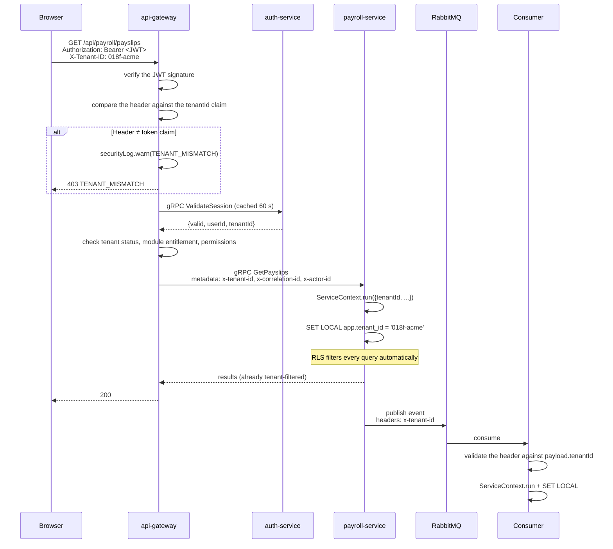
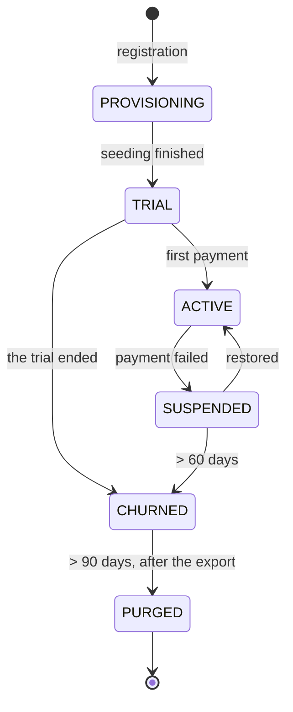

# 06 — Multitenancy & Authentication (X-Tenant-ID)

> This document complements `05-Dynamic-Role-Menu-Access.md`, which handles roles, menus, and per-user access. What follows is the layer beneath it: **tenant identification** and **authentication**, in line with the decision to defer SSO/OIDC for the early development phases.

---

## 1. The Multitenancy Model

### 1.1 The Decision

**A shared database per service + a `tenant_id` column + Row-Level Security.**

Every service owns its own database (doc. 02), and inside each of those databases all tenants share the same tables, separated by a `tenant_id` that RLS enforces.

| Model | Isolation | Cost per tenant | Migration complexity | Verdict |
|-------|-----------|-----------------|----------------------|---------|
| **Shared schema + `tenant_id` + RLS** | Logical, enforced by the DB engine | Very low | 1 migration × 14 services | **Chosen** |
| Schema per tenant | Medium | Low | N tenants × 14 services — unmanageable | Rejected |
| Database per tenant | Strong | Medium | N × 14 connection pools | Rejected for SaaS |
| Separate instances (silo) | Total | High | Per customer | An enterprise option only |

Under a microservices architecture the argument against schema- or database-per-tenant becomes far stronger: migration complexity is multiplied not by the number of tenants alone, but by the number of tenants **times the number of services**. A hundred tenants × 14 services = 1,400 migration executions that can partially fail.

### 1.2 Isolation Layers

```
Layer                        Mechanism                                     Fail-safe?
──────────────────────────────────────────────────────────────────────────────────────
1. Client                    X-Tenant-ID sent on every request             No
2. API Gateway               Validate X-Tenant-ID against the JWT claim    No
3. Inter-service propagation gRPC headers + RabbitMQ message headers       No
4. Application (service)     AsyncLocalStorage ServiceContext              No
5. Query                     A Prisma extension injecting tenant_id        No
6. Database                  Row-Level Security (NOBYPASSRLS)              ✅ YES
7. Redis cache               Key prefix t:{tenantId}:                      No
8. Object storage            Key prefix tenants/{tenantId}/                Partly
9. WebSocket                 Rooms tenant:{tenantId}:*                     No
```

Only layer 6 is genuinely fail-safe, and that is deliberate. **RLS is the defence that an application bug cannot get past**; the other eight layers are clarity and optimisation, not a guarantee.

---

## 2. X-Tenant-ID: The Rules of Use

### 2.1 The Uncompromised Principle

`X-Tenant-ID` is a **request discriminator**, not a **source of authorisation**.

```
X-Tenant-ID is used for:                X-Tenant-ID is NOT used for:
✓ Routing and context selection         ✗ Deciding which data may be accessed
✓ Inter-service propagation             ✗ Replacing identity verification
✓ Labelling logs, metrics, and traces   ✗ Being the truth when it differs from the token
✓ Cache and storage prefixes
✓ Diagnostics and support
```

**The reason is simple:** the header is sent by the client, and a client can change it. If `X-Tenant-ID` became the basis of an access decision, anyone logged into one company could read another company's data by editing a single header value in DevTools. That is why **the gateway must compare it against the `tenantId` claim in the session token** and refuse when they differ.

The mismatch itself is an attack signal — not an ordinary mistake — so it is written to the security log rather than merely returned as a 400.

### 2.2 Header Flow



### 2.3 The Gateway Implementation

```typescript
// services/api-gateway/src/middleware/tenant-context.middleware.ts
@Injectable()
export class TenantContextMiddleware implements NestMiddleware {
  async use(req: FastifyRequest, res: FastifyReply, next: () => void) {
    const headerTenant = req.headers['x-tenant-id'] as string | undefined;

    // 1. The header is mandatory and must be a UUID
    if (!headerTenant) {
      throw new BadRequestException({ code: 'MISSING_TENANT_HEADER',
        message: 'Header X-Tenant-ID wajib disertakan.' });
    }
    if (!isUuid(headerTenant)) {
      throw new BadRequestException({ code: 'INVALID_TENANT_HEADER' });
    }

    // 2. The token is the source of truth
    const claims = req.auth;   // already verified by AuthGuard
    if (!claims?.tenantId) throw new UnauthorizedException('MISSING_TENANT_CLAIM');

    // 3. The header MUST match the token. This is the security gate.
    if (headerTenant !== claims.tenantId) {
      this.securityLog.warn({
        event: 'TENANT_MISMATCH',
        headerTenant, tokenTenant: claims.tenantId,
        userId: claims.sub, ip: req.ip, userAgent: req.headers['user-agent'],
        path: req.url,
      });
      // The message deliberately does not explain what failed to match
      throw new ForbiddenException({ code: 'TENANT_MISMATCH' });
    }

    // 4. Tenant status
    const tenant = await this.tenantCache.get(headerTenant);   // Redis, 60 s TTL
    if (!tenant)                        throw new UnauthorizedException('TENANT_NOT_FOUND');
    if (tenant.status === 'SUSPENDED')  throw new ForbiddenException({ code: 'TENANT_SUSPENDED',
      message: 'Akun perusahaan Anda sedang ditangguhkan. Hubungi administrator.' });
    if (tenant.status === 'PURGED')     throw new ForbiddenException({ code: 'TENANT_CLOSED' });

    // 5. Build the context that flows through the whole call stack and on to downstream services
    ServiceContextStore.run({
      tenantId:      tenant.id,
      tenantCode:    tenant.code,
      timezone:      tenant.timezone,
      userId:        claims.sub,
      employeeId:    claims.employeeId,
      sessionId:     claims.sessionId,
      correlationId: (req.headers['x-correlation-id'] as string) ?? randomUUID(),
      causationId:   req.id,
      traceparent:   req.headers.traceparent as string,
      actorId:       claims.sub,
    }, next);
  }
}
```

### 2.4 Propagation to Downstream Services

```typescript
// services/api-gateway/src/grpc/context-interceptor.ts
export const outboundContextInterceptor: Interceptor = (options, nextCall) =>
  new InterceptingCall(nextCall(options), {
    start(metadata, listener, next) {
      const ctx = ServiceContextStore.get();
      if (!ctx?.tenantId) {
        // A call without tenant context is a bug, not an edge case. Fail hard.
        throw new Error('CONTEXT_MISSING: a gRPC call without tenant context');
      }
      metadata.set('x-tenant-id',      ctx.tenantId);
      metadata.set('x-correlation-id', ctx.correlationId);
      metadata.set('x-causation-id',   ctx.causationId);
      metadata.set('x-actor-id',       ctx.actorId);
      if (ctx.traceparent) metadata.set('traceparent', ctx.traceparent);
      next(metadata, listener);
    },
  });
```

### 2.5 Reception Inside a Service

Every service treats the `x-tenant-id` coming from the gateway as **already trusted**, because the gateway is the only way in. But that trust has to be enforced at the network layer, not assumed:

```typescript
// services/*/src/interceptors/inbound-context.interceptor.ts
@Injectable()
export class InboundContextInterceptor implements NestInterceptor {
  intercept(execCtx: ExecutionContext, next: CallHandler) {
    const metadata = execCtx.switchToRpc().getContext() as Metadata;
    const tenantId = metadata.get('x-tenant-id')[0] as string;

    if (!isUuid(tenantId)) {
      throw new RpcException({ code: Status.INVALID_ARGUMENT,
        message: 'x-tenant-id is missing or invalid' });
    }

    return new Observable((subscriber) => {
      ServiceContextStore.run({
        tenantId,
        correlationId: metadata.get('x-correlation-id')[0] as string,
        causationId:   metadata.get('x-causation-id')[0] as string,
        actorId:       metadata.get('x-actor-id')[0] as string ?? 'system',
        traceparent:   metadata.get('traceparent')[0] as string,
      }, () => next.handle().subscribe(subscriber));
    });
  }
}
```

**The network enforcement that must accompany it:** a domain service **must not** be reachable from outside the cluster. A Kubernetes NetworkPolicy allows ingress only from `api-gateway` and other internal services. Without this, anyone who can reach `payroll-service` directly can send any `x-tenant-id` they like.

```yaml
# k8s/network-policies/payroll-service.yaml
apiVersion: networking.k8s.io/v1
kind: NetworkPolicy
metadata: { name: payroll-service-ingress, namespace: hrms }
spec:
  podSelector: { matchLabels: { app: payroll-service } }
  policyTypes: [Ingress]
  ingress:
    - from:
        - podSelector: { matchLabels: { app: api-gateway } }
        - podSelector: { matchLabels: { app: reporting-service } }
      ports:
        - { protocol: TCP, port: 50051 }   # gRPC
    - from:
        - namespaceSelector: { matchLabels: { name: monitoring } }
      ports:
        - { protocol: TCP, port: 9090 }    # metrics
  # Every other source is denied by default
```

### 2.6 Applying RLS Inside a Service

```typescript
// packages/shared/src/db/tenant-transaction.ts
export async function withTenant<T>(
  prisma: PrismaClient,
  tenantId: string,
  fn: (tx: Prisma.TransactionClient) => Promise<T>,
): Promise<T> {
  if (!isUuid(tenantId)) throw new Error('INVALID_TENANT_ID');

  return prisma.$transaction(async (tx) => {
    // SET LOCAL — not SET. The value disappears when the transaction ends,
    // which makes it safe under PgBouncer transaction pooling.
    await tx.$executeRawUnsafe(`SET LOCAL app.tenant_id = '${tenantId}'`);
    await tx.$executeRawUnsafe(`SET LOCAL statement_timeout = '30s'`);
    return fn(tx);
  }, { isolationLevel: Prisma.TransactionIsolationLevel.ReadCommitted });
}
```

> **The trap that is most often fatal:** in transaction pooling mode, `SET` (without `LOCAL`) persists on the connection and carries over into the next tenant's request. This is the most likely cross-tenant leak path in practice. The mitigation: a custom lint rule that fails CI when it finds `SET app.` without `LOCAL`, plus a runtime check in non-production environments.

```typescript
// A runtime guard, active in dev and staging
export async function assertTenantContext(tx: Prisma.TransactionClient, expected: string) {
  const [{ current }] = await tx.$queryRaw<[{ current: string | null }]>`
    SELECT current_setting('app.tenant_id', true) AS current`;
  if (current !== expected) {
    throw new Error(`TENANT_CONTEXT_LEAK: the session points at ${current}, expected ${expected}`);
  }
}
```

---

## 3. Early-Phase Authentication

### 3.1 The Decision and Its Limits

SSO/OIDC is deferred. Authentication is handled by `auth-service` itself with email plus password, and the tenant is identified at login time.

This is a reasonable decision for the early phases, with caveats that need planning from now:

| What is deferred | When it becomes a requirement | Design readiness |
|------------------|-------------------------------|------------------|
| Corporate SSO (SAML/Azure AD) | A customer with more than 500 employees almost always asks for it | `users.external_id` is prepared; `auth-service` can add a provider without changing any other service |
| MFA | Once there is a customer with significant payroll data | The columns and flow are prepared in Phase 2 |
| SCIM provisioning | The enterprise phase | — |

Because `auth-service` is isolated behind the gateway and other services only ever see a JWT, changing the authentication mechanism later **does not touch the other 13 services**. That is one genuine microservices benefit that is relevant here.

### 3.2 The Login Flow

```mermaid
sequenceDiagram
    actor U as User
    participant W as Web App
    participant GW as api-gateway
    participant AUTH as auth-service
    participant TEN as tenant-service
    participant IAM as iam-service

    U->>W: Enter company code, email, password
    W->>GW: POST /api/auth/login {tenantCode, email, password}
    Note over GW: A public endpoint — there is no X-Tenant-ID yet
    GW->>AUTH: gRPC Login
    AUTH->>TEN: gRPC ResolveTenantByCode("ACME")
    TEN-->>AUTH: {tenantId, status: ACTIVE}

    alt Tenant missing / suspended
        AUTH-->>W: 401 (a generic message that does not reveal which tenants exist)
    end

    AUTH->>AUTH: look up users(tenant_id, email)
    AUTH->>AUTH: verify with Argon2id
    AUTH->>AUTH: check failed_attempts & locked_until

    alt Wrong credentials
        AUTH->>AUTH: failed_attempts += 1; lock for 15 min after 5 tries
        AUTH-->>W: 401 INVALID_CREDENTIALS
    end

    AUTH->>AUTH: create the session + refresh token
    AUTH-->>GW: {accessToken, refreshToken, tenantId, userId}
    GW-->>W: 200 + Set-Cookie(refresh, HttpOnly, Secure, SameSite=Strict)

    W->>W: store tenantId → used as X-Tenant-ID on every request
    W->>GW: GET /api/me/bootstrap<br/>Authorization + X-Tenant-ID
    GW->>TEN: subscription & enabled modules
    GW->>IAM: effective permissions & menus
    GW-->>W: {user, tenant, subscription, menus, lockedModules, permissions}
    W->>U: Render the shell plus a sidebar matching the subscription
```

### 3.3 Identifying the Tenant at Login

Three ways, usable together:

| Way | User experience | When it is used |
|-----|-----------------|-----------------|
| **An explicit company code** | Three fields: company code, email, password | The early-phase default — simple and unambiguous |
| **A subdomain** | `acme.hrms.id` → the code is filled in automatically | Added once the domains are ready; it only fills the field, it does not replace verification |
| **Discovery from the email** | The user types their email; the system finds the tenant | Only when the email is globally unique. If there are several, show a tenant picker |

```typescript
// services/auth-service/src/application/login.usecase.ts
async login(cmd: LoginCommand): Promise<LoginResult> {
  // Rate limit per IP and per (tenantCode + email)
  await this.rateLimiter.consume(`login:ip:${cmd.ip}`, 20, 900);
  await this.rateLimiter.consume(`login:user:${cmd.tenantCode}:${cmd.email}`, 5, 900);

  const tenant = await this.tenantClient.resolveByCode({ code: cmd.tenantCode })
    .catch(() => null);

  // The error message is ALWAYS the same, whatever the cause. Distinguishing
  // "no such tenant" from "wrong password" leaks the customer list.
  const genericError = new UnauthorizedException({
    code: 'INVALID_CREDENTIALS',
    message: 'Kode perusahaan, email, atau kata sandi tidak sesuai.',
  });

  if (!tenant || tenant.status === 'PURGED') {
    await this.recordAttempt(cmd, false, 'TENANT_NOT_FOUND');
    throw genericError;
  }

  const user = await this.repo.findByEmail(tenant.id, cmd.email);
  if (!user || !user.isActive) {
    // A dummy verification keeps the response time the same — it prevents user enumeration by timing
    await argon2.verify(DUMMY_HASH, cmd.password).catch(() => {});
    await this.recordAttempt(cmd, false, 'USER_NOT_FOUND');
    throw genericError;
  }

  if (user.lockedUntil && user.lockedUntil > new Date()) {
    throw new ForbiddenException({ code: 'ACCOUNT_LOCKED',
      message: `Akun terkunci sementara. Coba lagi setelah ${formatTime(user.lockedUntil)}.`,
      retryAfter: user.lockedUntil });
  }

  const valid = await argon2.verify(user.passwordHash, cmd.password);
  if (!valid) {
    const attempts = user.failedAttempts + 1;
    await this.repo.recordFailure(user.id, attempts,
      attempts >= 5 ? addMinutes(new Date(), 15) : null);
    await this.recordAttempt(cmd, false, 'WRONG_PASSWORD');
    throw genericError;
  }

  if (tenant.status === 'SUSPENDED' && !user.isTenantOwner) {
    throw new ForbiddenException({ code: 'TENANT_SUSPENDED',
      message: 'Akun perusahaan sedang ditangguhkan. Hubungi administrator perusahaan Anda.' });
  }

  await this.repo.resetFailures(user.id);
  const session = await this.createSession(user, tenant, cmd.ip, cmd.userAgent);

  await this.outbox.emit({ tenantId: tenant.id, type: 'auth.user.logged_in',
    aggregateType: 'User', aggregateId: user.id,
    payload: { userId: user.id, ip: cmd.ip, at: new Date().toISOString() }});

  return {
    accessToken:  this.signAccessToken(user, tenant, session),
    refreshToken: session.rawRefreshToken,
    tenantId:     tenant.id,          // the client uses this as its X-Tenant-ID
    tenantCode:   tenant.code,
    mustChangePassword: user.mustChangePassword,
  };
}
```

### 3.4 Token Shape

```typescript
// Access token — short-lived, sent in the Authorization header
{
  "iss": "hrms-auth",
  "aud": "hrms-api",
  "sub": "018f2c...",              // userId
  "tenantId": "018f-acme...",      // MANDATORY — compared against X-Tenant-ID
  "tenantCode": "ACME",
  "employeeId": "018f9a...",       // null when the user is not an employee
  "sessionId": "018fab...",        // for session revocation
  "iat": 1755400000,
  "exp": 1755400900                // 15 minutes
}
```

**What is deliberately kept out of the token:**

| Data | Reason |
|------|--------|
| The permission list | A user with 10 modules holds 150+ permissions — the token swells past the 8 KB header limit some proxies impose. More importantly, a revoked permission would not take effect until the token expires |
| The list of enabled modules | Cancelling a subscription has to take effect immediately, not after 15 minutes |
| Menus | They change more often than sessions do |
| Roles | They are enough on the server side; putting them in the token creates two sources of truth |

All of it is fetched by the gateway from `iam-service` and `tenant-service`, cached in Redis, and **invalidated by events** (`iam.access.changed`, `tenant.module.disabled`) so a change takes effect within seconds.

### 3.5 Refresh Tokens with Rotation & Theft Detection

```typescript
// services/auth-service/src/application/refresh.usecase.ts
async refresh(rawToken: string, ip: string): Promise<TokenPair> {
  const hash    = sha256(rawToken);
  const session = await this.repo.findByRefreshHash(hash);

  if (!session) throw new UnauthorizedException('INVALID_REFRESH_TOKEN');

  // A token that was already rotated and then used again strongly indicates theft.
  // The response: revoke ALL of the user's sessions, not just this one.
  if (session.revokedAt) {
    this.securityLog.error({ event: 'REFRESH_TOKEN_REUSE', userId: session.userId,
                             tenantId: session.tenantId, ip });
    await this.repo.revokeAllSessions(session.userId, 'TOKEN_REUSE_DETECTED');
    await this.notifications.securityAlert(session.userId, 'SUSPICIOUS_LOGIN');
    throw new UnauthorizedException('SESSION_REVOKED');
  }

  if (session.expiresAt < new Date()) throw new UnauthorizedException('SESSION_EXPIRED');

  // Rotation: the old token is marked used and a new one is issued
  const next = await this.repo.rotate(session.id, ip);
  return { accessToken: this.signAccessToken(session, next), refreshToken: next.rawToken };
}
```

Lifetimes: access token 15 minutes, refresh token 7 days (30 on mobile), a maximum of 10 active sessions per user.

### 3.6 Password Policy

| Rule | Value |
|------|-------|
| Hash algorithm | Argon2id (64 MB memory, 3 iterations, parallelism 4) |
| Minimum length | 10 characters |
| Checks | Refused if it appears in the 10,000 most common passwords, or contains the user's name or email |
| Mandatory character complexity | **Not applied** — it encourages the `Password1!` pattern, which is weaker than a long phrase |
| Periodic expiry | **Not applied** — forced rotation encourages `Januari2026` → `Februari2026`. A forced change happens only when there is an indication of a leak |
| Failed attempts | A 15-minute lock after 5 tries |
| The first password | Temporary, must be changed at first login, valid for 7 days |

---

## 4. The Tenant Lifecycle



| Status | Login | Read | Write | Scheduled jobs | Data |
|--------|-------|------|-------|----------------|------|
| `PROVISIONING` | ✗ | ✗ | ✗ | ✗ | — |
| `TRIAL` | ✓ | ✓ | ✓ | ✓ | Intact |
| `ACTIVE` | ✓ | ✓ | ✓ | ✓ | Intact |
| `SUSPENDED` | Owner only | ✓ | ✗ | ✗ | **Intact** |
| `CHURNED` | Export only, 90 days | ✓ | ✗ | ✗ | **Intact** |
| `PURGED` | ✗ | ✗ | ✗ | ✗ | Audit and legal records only |

**The binding principle:** suspension never deletes data. A company two weeks late on payment must not lose five years of payroll history.

### 4.1 Provisioning as a Saga

Under microservices, provisioning touches at least four services, so it cannot be done in a single transaction:

```typescript
// services/tenant-service/src/application/provision-tenant.saga.ts
const steps: SagaStep[] = [
  { name: 'CREATE_TENANT',
    execute: async (s) => {
      const tenant = await this.repo.create({ code: s.code, legalName: s.legalName,
                                              status: 'PROVISIONING' });
      await this.repo.enableModules(tenant.id, PLAN_MODULES[s.plan]);
      return { tenantId: tenant.id };
    },
    compensate: async (s) => { await this.repo.hardDelete(s.tenantId); } },

  { name: 'CREATE_OWNER_USER',
    execute: async (s) => {
      const user = await this.authClient.createUser({
        tenantId: s.tenantId, email: s.ownerEmail, fullName: s.ownerName,
        temporaryPassword: true });
      return { userId: user.id, tempPassword: user.tempPassword };
    },
    compensate: async (s) => { await this.authClient.deleteUser({ userId: s.userId }); } },

  { name: 'SEED_ROLES_AND_MENUS',
    execute: async (s) => {
      await this.iamClient.seedTenant({ tenantId: s.tenantId,
                                        enabledModules: PLAN_MODULES[s.plan] });
      await this.iamClient.assignRole({ userId: s.userId, roleKey: 'TENANT_OWNER' });
    },
    compensate: async (s) => { await this.iamClient.purgeTenant({ tenantId: s.tenantId }); } },

  { name: 'SEED_MASTER_DATA',
    execute: async (s) => {
      // Statutory leave types, national holidays, the basic salary components
      await this.employeeClient.seedDefaults({ tenantId: s.tenantId });
      await this.leaveClient.seedDefaults({ tenantId: s.tenantId, year: currentYear() });
      await this.payrollClient.seedDefaults({ tenantId: s.tenantId });
    },
    compensate: async (s) => { /* seeded data is discarded along with the tenant purge */ } },

  { name: 'ACTIVATE',
    execute: async (s) => {
      await this.repo.updateStatus(s.tenantId, 'TRIAL');
      await this.outbox.emit({ tenantId: s.tenantId, type: 'tenant.provisioned',
        aggregateType: 'Tenant', aggregateId: s.tenantId,
        payload: { code: s.code, plan: s.plan, ownerUserId: s.userId } });
    },
    compensate: async () => { /* the last step; there is nothing to undo */ } },
];
```

A tenant only moves to `TRIAL` once every step has succeeded. A half-built tenant — with employees but no roles, or with modules but no menus — is a far harder state to repair than a clean failure.

### 4.2 Offboarding & Data Portability (Personal Data Protection Act)

```
Day 0     The tenant leaves → status CHURNED
Day 0     The export saga: every service exports its data → a .zip archive
          (an xlsx per module + payslip PDFs + a manifest)
Day 1     The download link is sent, valid for 90 days
Day 90    The purge saga: every service deletes the tenant's data from its database
Forever   Retained: audit_logs, billing records, and payroll data inside the
          statutory tax retention period (10 years)
```

> A tenant purge is **the only data deletion permitted anywhere in the system** (document `09`, M4). Every other destructive operation — `DROP TABLE`, `TRUNCATE`, `DROP DATABASE` — is absolutely forbidden and blocked by the migration linter in CI. This exception exists because the right to erasure under the Personal Data Protection Act requires it, and that is precisely why its preconditions are made so strict.

```typescript
// The purge is a cross-service saga in the reverse order of the dependencies
const PURGE_ORDER = [
  'planning', 'recruitment', 'relation', 'performance',
  'payroll', 'leave', 'attendance', 'employee',
  'iam', 'auth', 'file', 'reporting', 'tenant',
];

async purgeTenant(tenantId: string, confirmations: PurgeConfirmation[]) {
  // Three hard preconditions — the difficulty of running this is a feature, not friction
  const tenant = await this.repo.findById(tenantId);
  if (tenant.status !== 'CHURNED')          throw new Error('PURGE_DENIED: status is not CHURNED');
  if (!await this.exportCompleted(tenantId)) throw new Error('PURGE_DENIED: the export is not finished');
  if (confirmations.length < 2)              throw new Error('PURGE_DENIED: two approvals are required');

  for (const service of PURGE_ORDER) {
    const result = await this.clients[service].purgeTenant({ tenantId, dryRun: false });
    await this.repo.recordPurgeStep(tenantId, service, result.rowsDeleted);
  }
  await this.repo.updateStatus(tenantId, 'PURGED');
}
```

---

## 5. Noisy Neighbours: Resource Fairness

Data isolation is not the only isolation that matters. One tenant with 10,000 employees running payroll must not slow down another tenant's dashboard.

| Resource | Mechanism | Configuration |
|----------|-----------|---------------|
| API requests | A per-tenant token bucket in Redis (at the gateway) | Basic 60 rpm, Advanced 300 rpm, Ultimate 1,200 rpm |
| Database queries | `SET LOCAL statement_timeout` | 30 s for requests, 300 s for workers |
| Job queue | Fair scheduling per tenant | See below |
| WebSocket connections | A limit per user (8) and per tenant (500) | Doc. 03, §3.6 |
| Object storage | A quota per plan | Basic 5 GB, Ultimate 100 GB |
| Scheduled jobs | Random jitter per tenant | ± 0–15 minutes |

```typescript
// services/*/src/scheduling/fair-scheduler.ts
// A large payroll job is split into chunks and interleaved between tenants.
// Without this, a 10,000-employee tenant holds every worker for 20 minutes
// while a 50-employee tenant waits behind it.
export class FairScheduler {
  async nextJob(): Promise<Job | null> {
    const tenants = await this.redis.zrange('queue:tenants:pending', 0, -1);

    const scored = await Promise.all(tenants.map(async (t) => ({
      tenantId: t,
      usage: Number(await this.redis.get(`queue:usage:${t}`) ?? 0),
    })));
    scored.sort((a, b) => a.usage - b.usage);   // the least-served goes next

    for (const { tenantId } of scored) {
      const job = await this.pop(`queue:jobs:${tenantId}`);
      if (job) {
        await this.redis.incrby(`queue:usage:${tenantId}`, job.estimatedCost);
        await this.redis.expire(`queue:usage:${tenantId}`, 300);
        return job;
      }
    }
    return null;
  }
}
```

The metric to watch: `tenant_queue_wait_seconds` per tenant. If one tenant's p95 deviates by more than 3× the fleet median, fair scheduling is failing.

---

## 6. Cross-Tenant Support Access

Support staff sometimes need to enter a customer's tenant. This is the most dangerous hole in every SaaS system.

> Support staff identities live in a separate realm (`platform_users` in `platform_db`), not in `auth_db`. The request, approval, and impersonation token flow is described in full in document `07`, §6. The section below explains its data structure from the tenant plane's side.

```sql
-- auth_db
CREATE TABLE support_sessions (
  id            uuid PRIMARY KEY DEFAULT uuid_v7(),
  tenant_id     uuid NOT NULL,
  support_user  text NOT NULL,
  approved_by   uuid,                  -- MANDATORY: approval from the tenant's side
  ticket_ref    text NOT NULL,
  reason        text NOT NULL,
  is_read_only  boolean NOT NULL DEFAULT true,
  started_at    timestamptz NOT NULL DEFAULT now(),
  expires_at    timestamptz NOT NULL,
  ended_at      timestamptz,
  actions_count integer NOT NULL DEFAULT 0,
  CONSTRAINT chk_max_duration CHECK (expires_at <= started_at + interval '4 hours'),
  CONSTRAINT chk_requires_approval CHECK (approved_by IS NOT NULL)
);
```

The flow:
```
1. A support staff member requests a session with a ticket reference plus a reason
2. A TENANT_OWNER or HR_ADMIN approves it explicitly in the application
3. The session lasts at most 4 hours and is read-only by default
4. The impersonation token carries the claim act.sub = the support staff member
5. A permanent banner in the tenant's UI: "Tim dukungan sedang mengakses akun Anda"
6. Every action is recorded in each service's audit_logs
7. An activity summary is sent to the tenant when the session ends
```

There is no "emergency access without approval" path. If the tenant cannot approve, support works from logs and reproduction, not from their production data.

---

## 7. Testing: The CI Gates

A tenant leak fails silently — no error, just data that should not be visible. Its tests are automated and block merges.

```typescript
// test/security/tenant-isolation.spec.ts  — run in EVERY service
describe('Tenant isolation', () => {
  it.each(ALL_MODELS)('%s cannot be accessed across tenants', async (model) => {
    const a = await seedTenant('acme');
    const b = await seedTenant('globex');
    const recordA = await seedRecord(model, a.id);

    await withTenant(prisma, b.id, async (tx) => {
      const found = await (tx as any)[model].findUnique({ where: { id: recordA.id } });
      expect(found).toBeNull();               // RLS blocks it
    });
  });

  it('refuses a write with a forged tenant_id', async () => {
    const a = await seedTenant('acme');
    const b = await seedTenant('globex');
    await expect(
      withTenant(prisma, b.id, (tx) =>
        tx.employee.create({ data: { ...validEmployee, tenantId: a.id } })),
    ).rejects.toThrow(/row-level security/i);   // WITH CHECK refuses it
  });

  it('leaves no tenant_id table without RLS', async () => {
    const unprotected = await prisma.$queryRaw`
      SELECT c.table_name FROM information_schema.columns c
        JOIN pg_class pc ON pc.relname = c.table_name
       WHERE c.column_name = 'tenant_id' AND pc.relrowsecurity = false`;
    expect(unprotected).toEqual([]);            // a CI gate
  });
});

// test/security/tenant-header.spec.ts  — run in api-gateway
describe('X-Tenant-ID', () => {
  it('refuses a request without the header', async () => {
    const { token } = await loginAs('acme', 'hr@acme.id');
    const res = await request(gw).get('/api/employees').set('Authorization', `Bearer ${token}`);
    expect(res.status).toBe(400);
    expect(res.body.code).toBe('MISSING_TENANT_HEADER');
  });

  it('refuses a header that differs from the token', async () => {
    const { token } = await loginAs('acme', 'hr@acme.id');
    const globex = await seedTenant('globex');
    const res = await request(gw).get('/api/employees')
      .set('Authorization', `Bearer ${token}`)
      .set('X-Tenant-ID', globex.id);          // a cross-tenant attempt
    expect(res.status).toBe(403);
    expect(res.body.code).toBe('TENANT_MISMATCH');
  });

  it('records a mismatch attempt in the security log', async () => {
    const spy = jest.spyOn(securityLog, 'warn');
    await attemptCrossTenant();
    expect(spy).toHaveBeenCalledWith(expect.objectContaining({ event: 'TENANT_MISMATCH' }));
  });

  it('refuses an unsubscribed module even when the permission is held', async () => {
    const { token, tenantId } = await loginAs('acme', 'hr@acme.id');   // the BASIC plan
    const res = await request(gw).get('/api/recruitment/jobs')
      .set('Authorization', `Bearer ${token}`).set('X-Tenant-ID', tenantId);
    expect(res.status).toBe(402);
    expect(res.body.code).toBe('MODULE_NOT_SUBSCRIBED');
  });

  it('applies a module being disabled without a new login', async () => {
    const { token, tenantId } = await loginAs('acme', 'hr@acme.id');
    expect((await get('/api/payroll/runs', token, tenantId)).status).toBe(200);
    await disableModule(tenantId, 'payroll');
    await waitForCacheInvalidation();
    expect((await get('/api/payroll/runs', token, tenantId)).status).toBe(402);
  });
});

// test/security/service-boundary.spec.ts
describe('Service boundaries', () => {
  it('a service cannot connect to another service database', async () => {
    const payrollDbUrl = process.env.PAYROLL_DATABASE_URL!;
    const crossUrl = payrollDbUrl.replace('/payroll_db', '/attendance_db');
    await expect(new PrismaClient({ datasources: { db: { url: crossUrl } } }).$connect())
      .rejects.toThrow(/permission denied|does not exist/i);
  });
});
```

**The CI gate:** the pipeline fails when (a) a `tenant_id` table exists without RLS, (b) a gateway route has no `ROUTE_MANIFEST` entry, (c) `SET app.` appears in the code without `LOCAL`, or (d) the cross-database test manages to connect.

---

## 8. Risks

| # | Risk | Prob. | Impact | Mitigation |
|---|------|-------|--------|------------|
| R12 | `X-Tenant-ID` is trusted without token verification somewhere | Medium | **Critical** | Centralised middleware at the gateway, a NetworkPolicy closing direct access to services, the `TENANT_MISMATCH` test as a CI gate |
| R13 | Context leaking through the connection pool (`SET` vs `SET LOCAL`) | Medium | **Critical** | A custom lint rule, `assertTenantContext` outside production |
| R14 | A domain service is exposed directly to the internet | Low | **Critical** | Default-deny NetworkPolicy, ingress only from the gateway, periodic configuration audits |
| R15 | A stale entitlement cache after a cancellation | Medium | Medium | Event-based invalidation plus a 60-second TTL as the upper bound |
| R16 | Noisy neighbour: a large tenant cripples a small one | Medium | High | Fair scheduling, tiered rate limits, `statement_timeout` |
| R17 | Cross-tenant support access is abused | Low | **Critical** | Tenant approval required, read-only, a 4-hour limit, a banner, a post-session report |
| R18 | A tenant purge is triggered accidentally | Low | **Critical** | Preconditions of `CHURNED` status + a completed export + 2 approvals |
| R19 | Without MFA, one leaked password opens a company's entire HR data | Medium | High | Account locking, refresh token reuse detection, a new-device login notification; MFA scheduled for Phase 2 |
| R20 | A superuser bypasses tenant isolation | Low | **Catastrophic** | A separate control plane with no credentials to any domain database; an egress NetworkPolicy; see document `07` |
| R21 | Location data and attendance photos become an ever-growing Personal Data Protection Act liability | Medium | High | Separate, withdrawable consent, a photo retention maximum of 365 days enforced by a `CHECK`, EXIF stripping, audited access (doc. `10` §8) |

---

## 9. Metrics

| Metric | Target |
|--------|--------|
| Cross-tenant leak incidents | **0** (zero tolerance) |
| RLS coverage on `tenant_id` tables | 100%, verified in CI in every service |
| Gateway routes without a manifest entry | 0, verified in CI |
| `TENANT_MISMATCH` occurrences per week | Monitored; a spike means a security investigation |
| Propagation time of a module/permission revocation | < 10 seconds |
| Bootstrap latency (`/me/bootstrap`) p95 | < 400 ms |
| Support sessions without tenant approval | 0 |
| `tenant_queue_wait_seconds` p95 deviation between tenants | < 3× the median |
