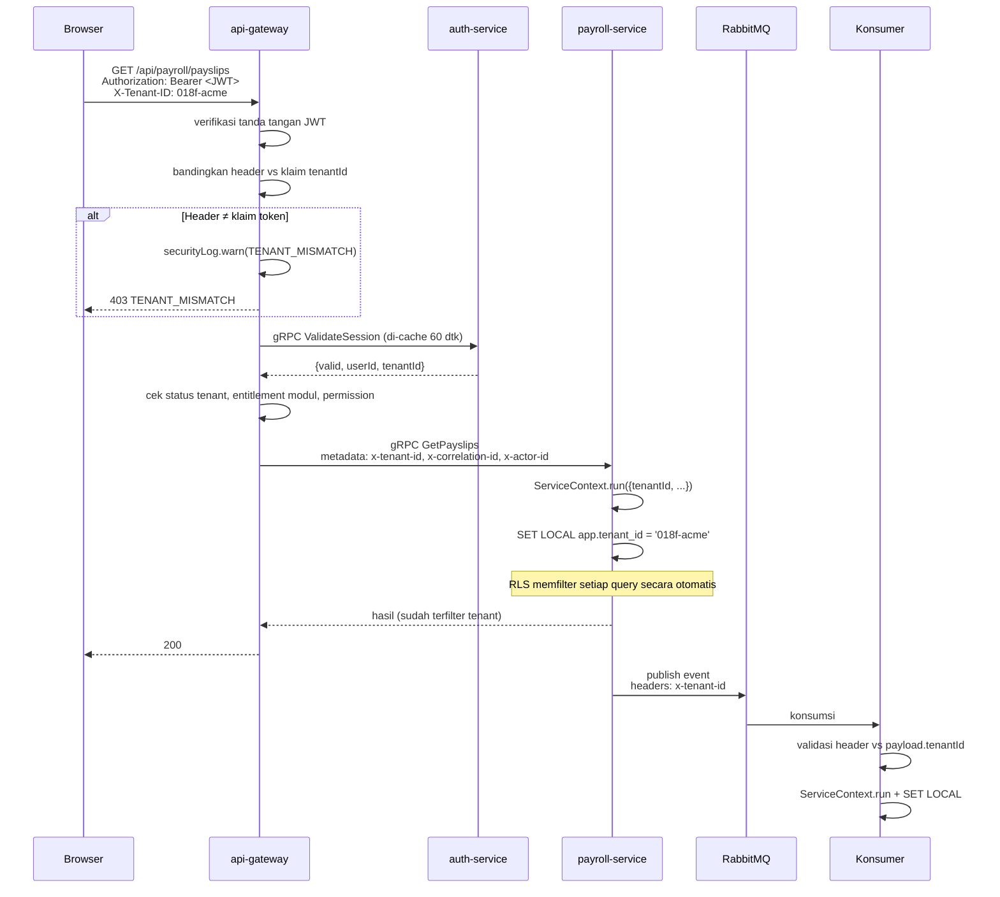
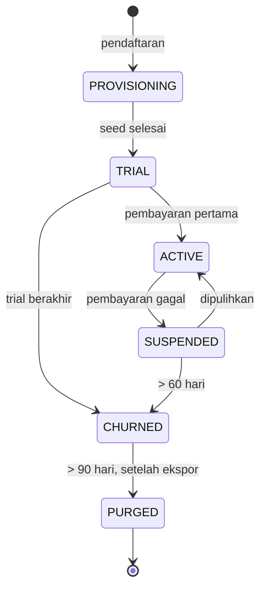

# 06 — Multitenancy & Autentikasi (X-Tenant-ID)

> Dokumen ini melengkapi `05-Dynamic-Role-Menu-Access.md` yang menangani peran, menu, dan hak akses per pengguna. Di sini dibahas lapisan di bawahnya: **identifikasi tenant** dan **autentikasi**, sesuai keputusan menunda SSO/OIDC untuk fase pengembangan awal.

---

## 1. Model Multitenancy

### 1.1 Keputusan

**Shared database per service + kolom `tenant_id` + Row-Level Security.**

Setiap service memiliki basis datanya sendiri (dok. 02), dan di dalam setiap basis data itu seluruh tenant berbagi tabel yang sama, dipisahkan oleh `tenant_id` yang ditegakkan RLS.

| Model | Isolasi | Biaya/tenant | Kompleksitas migrasi | Verdict |
|-------|---------|--------------|----------------------|---------|
| **Shared schema + `tenant_id` + RLS** | Logis, ditegakkan mesin DB | Sangat rendah | 1 migrasi × 14 service | **Dipilih** |
| Schema per tenant | Menengah | Rendah | N tenant × 14 service — tidak terkelola | Ditolak |
| Database per tenant | Kuat | Menengah | N × 14 koneksi pool | Ditolak untuk SaaS |
| Instance terpisah (silo) | Total | Tinggi | Per pelanggan | Opsi enterprise saja |

Pada arsitektur microservices, argumen menolak schema/database-per-tenant menjadi jauh lebih kuat: kompleksitas migrasi tidak dikalikan jumlah tenant saja, tetapi jumlah tenant **dikali jumlah service**. Seratus tenant × 14 service = 1.400 eksekusi migrasi yang bisa gagal sebagian.

### 1.2 Lapisan Isolasi

```
Lapisan                      Mekanisme                                     Gagal-aman?
──────────────────────────────────────────────────────────────────────────────────────
1. Klien                     X-Tenant-ID dikirim di setiap request         Tidak
2. API Gateway               Validasi X-Tenant-ID vs klaim JWT             Tidak
3. Propagasi antar-service   Header gRPC + header pesan RabbitMQ           Tidak
4. Aplikasi (service)        AsyncLocalStorage ServiceContext              Tidak
5. Query                     Prisma extension injeksi tenant_id            Tidak
6. Basis data                Row-Level Security (NOBYPASSRLS)              ✅ YA
7. Cache Redis               Prefix kunci t:{tenantId}:                    Tidak
8. Object storage            Prefix kunci tenants/{tenantId}/              Sebagian
9. WebSocket                 Room tenant:{tenantId}:*                      Tidak
```

Hanya lapisan 6 yang benar-benar gagal-aman, dan itu disengaja. **RLS adalah pertahanan yang tidak bisa dilewati bug aplikasi**; delapan lapisan lainnya adalah kejelasan dan optimasi, bukan jaminan.

---

## 2. X-Tenant-ID: Aturan Penggunaan

### 2.1 Prinsip yang Tidak Dikompromikan

`X-Tenant-ID` adalah **pembeda request**, bukan **sumber otorisasi**.

```
X-Tenant-ID dipakai untuk:              X-Tenant-ID TIDAK dipakai untuk:
✓ Routing dan pemilihan konteks         ✗ Menentukan data mana yang boleh diakses
✓ Propagasi antar-service               ✗ Menggantikan verifikasi identitas
✓ Label log, metrik, dan trace          ✗ Sumber kebenaran saat berbeda dari token
✓ Prefix cache dan storage
✓ Diagnostik dan dukungan
```

**Alasannya sederhana:** header dikirim klien, dan klien dapat mengubahnya. Bila `X-Tenant-ID` menjadi dasar keputusan akses, siapa pun yang sudah login di satu perusahaan dapat membaca data perusahaan lain hanya dengan mengganti satu nilai header di DevTools. Karena itu **gateway wajib membandingkannya dengan klaim `tenantId` di token sesi**, dan menolak bila berbeda.

Ketidakcocokan itu sendiri adalah sinyal serangan — bukan kesalahan biasa — sehingga dicatat ke log keamanan, bukan sekadar dikembalikan sebagai error 400.

### 2.2 Alur Header



### 2.3 Implementasi di Gateway

```typescript
// services/api-gateway/src/middleware/tenant-context.middleware.ts
@Injectable()
export class TenantContextMiddleware implements NestMiddleware {
  async use(req: FastifyRequest, res: FastifyReply, next: () => void) {
    const headerTenant = req.headers['x-tenant-id'] as string | undefined;

    // 1. Header wajib ada dan berbentuk UUID
    if (!headerTenant) {
      throw new BadRequestException({ code: 'MISSING_TENANT_HEADER',
        message: 'Header X-Tenant-ID wajib disertakan.' });
    }
    if (!isUuid(headerTenant)) {
      throw new BadRequestException({ code: 'INVALID_TENANT_HEADER' });
    }

    // 2. Token adalah sumber kebenaran
    const claims = req.auth;   // sudah diverifikasi AuthGuard
    if (!claims?.tenantId) throw new UnauthorizedException('MISSING_TENANT_CLAIM');

    // 3. Header HARUS cocok dengan token. Inilah gerbang keamanannya.
    if (headerTenant !== claims.tenantId) {
      this.securityLog.warn({
        event: 'TENANT_MISMATCH',
        headerTenant, tokenTenant: claims.tenantId,
        userId: claims.sub, ip: req.ip, userAgent: req.headers['user-agent'],
        path: req.url,
      });
      // Pesan sengaja tidak menjelaskan apa yang tidak cocok
      throw new ForbiddenException({ code: 'TENANT_MISMATCH' });
    }

    // 4. Status tenant
    const tenant = await this.tenantCache.get(headerTenant);   // Redis TTL 60 dtk
    if (!tenant)                        throw new UnauthorizedException('TENANT_NOT_FOUND');
    if (tenant.status === 'SUSPENDED')  throw new ForbiddenException({ code: 'TENANT_SUSPENDED',
      message: 'Akun perusahaan Anda sedang ditangguhkan. Hubungi administrator.' });
    if (tenant.status === 'PURGED')     throw new ForbiddenException({ code: 'TENANT_CLOSED' });

    // 5. Bangun konteks yang mengalir ke seluruh call stack dan ke service hilir
    ServiceContextStore.run({
      tenantId:      tenant.id,
      tenantCode:    tenant.code,
      timezone:      tenant.timezone,
      userId:        claims.sub,
      employeeId:    claims.employeeId,
      sessionId:     claims.sessionId,
      correlationId: (req.headers['x-correlation-id'] as string) ?? randomUUID(),
      causationId:   req.id,
      traceparent:   req.headers.traceparent as string,
      actorId:       claims.sub,
    }, next);
  }
}
```

### 2.4 Propagasi ke Service Hilir

```typescript
// services/api-gateway/src/grpc/context-interceptor.ts
export const outboundContextInterceptor: Interceptor = (options, nextCall) =>
  new InterceptingCall(nextCall(options), {
    start(metadata, listener, next) {
      const ctx = ServiceContextStore.get();
      if (!ctx?.tenantId) {
        // Panggilan tanpa konteks tenant adalah bug, bukan kasus tepi. Gagalkan keras.
        throw new Error('CONTEXT_MISSING: panggilan gRPC tanpa tenant context');
      }
      metadata.set('x-tenant-id',      ctx.tenantId);
      metadata.set('x-correlation-id', ctx.correlationId);
      metadata.set('x-causation-id',   ctx.causationId);
      metadata.set('x-actor-id',       ctx.actorId);
      if (ctx.traceparent) metadata.set('traceparent', ctx.traceparent);
      next(metadata, listener);
    },
  });
```

### 2.5 Penerimaan di Service

Setiap service memperlakukan `x-tenant-id` dari gateway sebagai **sudah tepercaya**, karena satu-satunya jalur masuk adalah gateway. Namun kepercayaan itu harus ditegakkan di lapisan jaringan, bukan diasumsikan:

```typescript
// services/*/src/interceptors/inbound-context.interceptor.ts
@Injectable()
export class InboundContextInterceptor implements NestInterceptor {
  intercept(execCtx: ExecutionContext, next: CallHandler) {
    const metadata = execCtx.switchToRpc().getContext() as Metadata;
    const tenantId = metadata.get('x-tenant-id')[0] as string;

    if (!isUuid(tenantId)) {
      throw new RpcException({ code: Status.INVALID_ARGUMENT,
        message: 'x-tenant-id tidak valid atau tidak ada' });
    }

    return new Observable((subscriber) => {
      ServiceContextStore.run({
        tenantId,
        correlationId: metadata.get('x-correlation-id')[0] as string,
        causationId:   metadata.get('x-causation-id')[0] as string,
        actorId:       metadata.get('x-actor-id')[0] as string ?? 'system',
        traceparent:   metadata.get('traceparent')[0] as string,
      }, () => next.handle().subscribe(subscriber));
    });
  }
}
```

**Penegakan jaringan yang wajib menyertainya:** service domain **tidak boleh** dapat dijangkau dari luar klaster. NetworkPolicy Kubernetes hanya mengizinkan ingress dari `api-gateway` dan service internal lain. Tanpa ini, siapa pun yang bisa menjangkau `payroll-service` langsung dapat mengirim `x-tenant-id` apa pun.

```yaml
# k8s/network-policies/payroll-service.yaml
apiVersion: networking.k8s.io/v1
kind: NetworkPolicy
metadata: { name: payroll-service-ingress, namespace: hrms }
spec:
  podSelector: { matchLabels: { app: payroll-service } }
  policyTypes: [Ingress]
  ingress:
    - from:
        - podSelector: { matchLabels: { app: api-gateway } }
        - podSelector: { matchLabels: { app: reporting-service } }
      ports:
        - { protocol: TCP, port: 50051 }   # gRPC
    - from:
        - namespaceSelector: { matchLabels: { name: monitoring } }
      ports:
        - { protocol: TCP, port: 9090 }    # metrik
  # Semua sumber lain ditolak secara default
```

### 2.6 Penerapan RLS di Service

```typescript
// packages/shared/src/db/tenant-transaction.ts
export async function withTenant<T>(
  prisma: PrismaClient,
  tenantId: string,
  fn: (tx: Prisma.TransactionClient) => Promise<T>,
): Promise<T> {
  if (!isUuid(tenantId)) throw new Error('INVALID_TENANT_ID');

  return prisma.$transaction(async (tx) => {
    // SET LOCAL — bukan SET. Nilai hilang saat transaksi selesai,
    // sehingga aman pada PgBouncer transaction pooling.
    await tx.$executeRawUnsafe(`SET LOCAL app.tenant_id = '${tenantId}'`);
    await tx.$executeRawUnsafe(`SET LOCAL statement_timeout = '30s'`);
    return fn(tx);
  }, { isolationLevel: Prisma.TransactionIsolationLevel.ReadCommitted });
}
```

> **Jebakan yang paling sering fatal:** dalam mode transaction pooling, `SET` (tanpa `LOCAL`) bertahan di koneksi dan terbawa ke request tenant berikutnya. Ini adalah jalur kebocoran lintas-tenant yang paling mungkin terjadi dalam praktik. Mitigasinya: aturan lint kustom yang menggagalkan CI bila menemukan `SET app.` tanpa `LOCAL`, ditambah pemeriksaan runtime di lingkungan non-produksi.

```typescript
// Guard runtime, aktif di dev & staging
export async function assertTenantContext(tx: Prisma.TransactionClient, expected: string) {
  const [{ current }] = await tx.$queryRaw<[{ current: string | null }]>`
    SELECT current_setting('app.tenant_id', true) AS current`;
  if (current !== expected) {
    throw new Error(`TENANT_CONTEXT_LEAK: sesi menunjuk ${current}, diharapkan ${expected}`);
  }
}
```

---

## 3. Autentikasi Fase Awal

### 3.1 Keputusan & Batasannya

SSO/OIDC ditunda. Autentikasi ditangani `auth-service` sendiri dengan email + kata sandi, dan tenant diidentifikasi saat login.

Ini keputusan yang wajar untuk fase awal, dengan catatan yang perlu direncanakan sejak sekarang:

| Yang ditunda | Kapan menjadi kebutuhan | Kesiapan desain |
|--------------|------------------------|-----------------|
| SSO korporat (SAML/Azure AD) | Pelanggan > 500 karyawan hampir selalu memintanya | `users.external_id` disiapkan; `auth-service` dapat menambah provider tanpa mengubah service lain |
| MFA | Setelah ada pelanggan dengan data payroll signifikan | Kolom & alur disiapkan di Fase 2 |
| SCIM provisioning | Fase enterprise | — |

Karena `auth-service` terisolasi di balik gateway dan service lain hanya melihat JWT, mengganti mekanisme autentikasi nanti **tidak menyentuh 13 service lainnya**. Inilah satu keuntungan nyata microservices yang relevan di sini.

### 3.2 Alur Login

```mermaid
sequenceDiagram
    actor U as Pengguna
    participant W as Web App
    participant GW as api-gateway
    participant AUTH as auth-service
    participant TEN as tenant-service
    participant IAM as iam-service

    U->>W: Isi kode perusahaan, email, kata sandi
    W->>GW: POST /api/auth/login {tenantCode, email, password}
    Note over GW: Endpoint publik — belum ada X-Tenant-ID
    GW->>AUTH: gRPC Login
    AUTH->>TEN: gRPC ResolveTenantByCode("ACME")
    TEN-->>AUTH: {tenantId, status: ACTIVE}

    alt Tenant tidak ada / ditangguhkan
        AUTH-->>W: 401 (pesan generik, tidak membocorkan tenant mana yang ada)
    end

    AUTH->>AUTH: cari users(tenant_id, email)
    AUTH->>AUTH: verifikasi Argon2id
    AUTH->>AUTH: cek failed_attempts & locked_until

    alt Kredensial salah
        AUTH->>AUTH: failed_attempts += 1; kunci 15 mnt setelah 5×
        AUTH-->>W: 401 INVALID_CREDENTIALS
    end

    AUTH->>AUTH: buat sessions + refresh token
    AUTH-->>GW: {accessToken, refreshToken, tenantId, userId}
    GW-->>W: 200 + Set-Cookie(refresh, HttpOnly, Secure, SameSite=Strict)

    W->>W: simpan tenantId → dipakai sebagai X-Tenant-ID di semua request
    W->>GW: GET /api/me/bootstrap<br/>Authorization + X-Tenant-ID
    GW->>TEN: langganan & modul aktif
    GW->>IAM: permission & menu efektif
    GW-->>W: {user, tenant, subscription, menus, lockedModules, permissions}
    W->>U: Render shell + sidebar sesuai langganan
```

### 3.3 Identifikasi Tenant Saat Login

Tiga cara, dapat digunakan bersamaan:

| Cara | Pengalaman pengguna | Kapan dipakai |
|------|--------------------|--------------|
| **Kode perusahaan eksplisit** | Tiga kolom: kode perusahaan, email, kata sandi | Default fase awal — sederhana dan tanpa ambiguitas |
| **Subdomain** | `acme.hrms.id` → kode terisi otomatis | Ditambahkan setelah domain siap; hanya mengisi kolom, bukan menggantikan verifikasi |
| **Penemuan lewat email** | Pengguna mengetik email; sistem mencari tenant | Hanya bila email unik global. Bila ganda, tampilkan pemilih tenant |

```typescript
// services/auth-service/src/application/login.usecase.ts
async login(cmd: LoginCommand): Promise<LoginResult> {
  // Rate limit per IP dan per (tenantCode + email)
  await this.rateLimiter.consume(`login:ip:${cmd.ip}`, 20, 900);
  await this.rateLimiter.consume(`login:user:${cmd.tenantCode}:${cmd.email}`, 5, 900);

  const tenant = await this.tenantClient.resolveByCode({ code: cmd.tenantCode })
    .catch(() => null);

  // Pesan galat SELALU sama, apa pun penyebabnya. Membedakan
  // "tenant tidak ada" dari "kata sandi salah" membocorkan daftar pelanggan.
  const genericError = new UnauthorizedException({
    code: 'INVALID_CREDENTIALS',
    message: 'Kode perusahaan, email, atau kata sandi tidak sesuai.',
  });

  if (!tenant || tenant.status === 'PURGED') {
    await this.recordAttempt(cmd, false, 'TENANT_NOT_FOUND');
    throw genericError;
  }

  const user = await this.repo.findByEmail(tenant.id, cmd.email);
  if (!user || !user.isActive) {
    // Verifikasi dummy agar waktu respons sama — mencegah user enumeration lewat timing
    await argon2.verify(DUMMY_HASH, cmd.password).catch(() => {});
    await this.recordAttempt(cmd, false, 'USER_NOT_FOUND');
    throw genericError;
  }

  if (user.lockedUntil && user.lockedUntil > new Date()) {
    throw new ForbiddenException({ code: 'ACCOUNT_LOCKED',
      message: `Akun terkunci sementara. Coba lagi setelah ${formatTime(user.lockedUntil)}.`,
      retryAfter: user.lockedUntil });
  }

  const valid = await argon2.verify(user.passwordHash, cmd.password);
  if (!valid) {
    const attempts = user.failedAttempts + 1;
    await this.repo.recordFailure(user.id, attempts,
      attempts >= 5 ? addMinutes(new Date(), 15) : null);
    await this.recordAttempt(cmd, false, 'WRONG_PASSWORD');
    throw genericError;
  }

  if (tenant.status === 'SUSPENDED' && !user.isTenantOwner) {
    throw new ForbiddenException({ code: 'TENANT_SUSPENDED',
      message: 'Akun perusahaan sedang ditangguhkan. Hubungi administrator perusahaan Anda.' });
  }

  await this.repo.resetFailures(user.id);
  const session = await this.createSession(user, tenant, cmd.ip, cmd.userAgent);

  await this.outbox.emit({ tenantId: tenant.id, type: 'auth.user.logged_in',
    aggregateType: 'User', aggregateId: user.id,
    payload: { userId: user.id, ip: cmd.ip, at: new Date().toISOString() }});

  return {
    accessToken:  this.signAccessToken(user, tenant, session),
    refreshToken: session.rawRefreshToken,
    tenantId:     tenant.id,          // klien memakainya sebagai X-Tenant-ID
    tenantCode:   tenant.code,
    mustChangePassword: user.mustChangePassword,
  };
}
```

### 3.4 Bentuk Token

```typescript
// Access token — masa hidup pendek, dikirim di header Authorization
{
  "iss": "hrms-auth",
  "aud": "hrms-api",
  "sub": "018f2c...",              // userId
  "tenantId": "018f-acme...",      // WAJIB — dibandingkan dengan X-Tenant-ID
  "tenantCode": "ACME",
  "employeeId": "018f9a...",       // null bila pengguna bukan karyawan
  "sessionId": "018fab...",        // untuk pencabutan sesi
  "iat": 1755400000,
  "exp": 1755400900                // 15 menit
}
```

**Yang sengaja tidak dimasukkan ke token:**

| Data | Alasan |
|------|--------|
| Daftar permission | Pengguna dengan 10 modul memiliki 150+ izin — token membengkak melewati batas header 8 KB pada beberapa proxy. Lebih penting: pencabutan izin tidak akan berlaku sampai token kedaluwarsa |
| Daftar modul aktif | Berhenti berlangganan harus berlaku seketika, bukan menunggu 15 menit |
| Menu | Berubah lebih sering daripada sesi |
| Peran | Cukup di sisi server; menyimpannya di token menciptakan dua sumber kebenaran |

Semua itu diambil gateway dari `iam-service` dan `tenant-service`, di-cache di Redis, dan **diinvalidasi oleh event** (`iam.access.changed`, `tenant.module.disabled`) sehingga perubahan berlaku dalam hitungan detik.

### 3.5 Refresh Token dengan Rotasi & Deteksi Pencurian

```typescript
// services/auth-service/src/application/refresh.usecase.ts
async refresh(rawToken: string, ip: string): Promise<TokenPair> {
  const hash    = sha256(rawToken);
  const session = await this.repo.findByRefreshHash(hash);

  if (!session) throw new UnauthorizedException('INVALID_REFRESH_TOKEN');

  // Token yang sudah dirotasi tetapi dipakai lagi = indikasi kuat token dicuri.
  // Respons: cabut SELURUH sesi pengguna, bukan hanya yang ini.
  if (session.revokedAt) {
    this.securityLog.error({ event: 'REFRESH_TOKEN_REUSE', userId: session.userId,
                             tenantId: session.tenantId, ip });
    await this.repo.revokeAllSessions(session.userId, 'TOKEN_REUSE_DETECTED');
    await this.notifications.securityAlert(session.userId, 'SUSPICIOUS_LOGIN');
    throw new UnauthorizedException('SESSION_REVOKED');
  }

  if (session.expiresAt < new Date()) throw new UnauthorizedException('SESSION_EXPIRED');

  // Rotasi: token lama ditandai dipakai, token baru diterbitkan
  const next = await this.repo.rotate(session.id, ip);
  return { accessToken: this.signAccessToken(session, next), refreshToken: next.rawToken };
}
```

Masa hidup: access token 15 menit, refresh token 7 hari (mobile 30 hari), maksimum 10 sesi aktif per pengguna.

### 3.6 Kebijakan Kata Sandi

| Aturan | Nilai |
|--------|-------|
| Algoritma hash | Argon2id (memory 64 MB, iterations 3, parallelism 4) |
| Panjang minimum | 10 karakter |
| Pemeriksaan | Ditolak bila ada di daftar 10.000 kata sandi paling umum, atau mengandung nama/email pengguna |
| Kompleksitas karakter wajib | **Tidak diterapkan** — mendorong pola `Password1!` yang justru lebih lemah dari frasa panjang |
| Kedaluwarsa berkala | **Tidak diterapkan** — rotasi paksa mendorong `Januari2026` → `Februari2026`. Ganti paksa hanya saat ada indikasi kebocoran |
| Percobaan gagal | Kunci 15 menit setelah 5 kali |
| Kata sandi pertama | Sementara, wajib diganti saat login pertama, berlaku 7 hari |

---

## 4. Siklus Hidup Tenant



| Status | Login | Baca | Tulis | Job terjadwal | Data |
|--------|-------|------|-------|---------------|------|
| `PROVISIONING` | ✗ | ✗ | ✗ | ✗ | — |
| `TRIAL` | ✓ | ✓ | ✓ | ✓ | Utuh |
| `ACTIVE` | ✓ | ✓ | ✓ | ✓ | Utuh |
| `SUSPENDED` | Owner saja | ✓ | ✗ | ✗ | **Utuh** |
| `CHURNED` | Ekspor saja, 90 hari | ✓ | ✗ | ✗ | **Utuh** |
| `PURGED` | ✗ | ✗ | ✗ | ✗ | Hanya audit & catatan hukum |

**Prinsip yang mengikat:** penangguhan tidak pernah menghapus data. Perusahaan yang telat bayar dua minggu tidak boleh kehilangan riwayat payroll lima tahun.

### 4.1 Provisioning sebagai Saga

Pada microservices, provisioning menyentuh minimal empat service, sehingga tidak dapat dilakukan dalam satu transaksi:

```typescript
// services/tenant-service/src/application/provision-tenant.saga.ts
const steps: SagaStep[] = [
  { name: 'CREATE_TENANT',
    execute: async (s) => {
      const tenant = await this.repo.create({ code: s.code, legalName: s.legalName,
                                              status: 'PROVISIONING' });
      await this.repo.enableModules(tenant.id, PLAN_MODULES[s.plan]);
      return { tenantId: tenant.id };
    },
    compensate: async (s) => { await this.repo.hardDelete(s.tenantId); } },

  { name: 'CREATE_OWNER_USER',
    execute: async (s) => {
      const user = await this.authClient.createUser({
        tenantId: s.tenantId, email: s.ownerEmail, fullName: s.ownerName,
        temporaryPassword: true });
      return { userId: user.id, tempPassword: user.tempPassword };
    },
    compensate: async (s) => { await this.authClient.deleteUser({ userId: s.userId }); } },

  { name: 'SEED_ROLES_AND_MENUS',
    execute: async (s) => {
      await this.iamClient.seedTenant({ tenantId: s.tenantId,
                                        enabledModules: PLAN_MODULES[s.plan] });
      await this.iamClient.assignRole({ userId: s.userId, roleKey: 'TENANT_OWNER' });
    },
    compensate: async (s) => { await this.iamClient.purgeTenant({ tenantId: s.tenantId }); } },

  { name: 'SEED_MASTER_DATA',
    execute: async (s) => {
      // Jenis cuti sesuai UU, hari libur nasional, komponen gaji dasar
      await this.employeeClient.seedDefaults({ tenantId: s.tenantId });
      await this.leaveClient.seedDefaults({ tenantId: s.tenantId, year: currentYear() });
      await this.payrollClient.seedDefaults({ tenantId: s.tenantId });
    },
    compensate: async (s) => { /* data seed dibuang bersama purge tenant */ } },

  { name: 'ACTIVATE',
    execute: async (s) => {
      await this.repo.updateStatus(s.tenantId, 'TRIAL');
      await this.outbox.emit({ tenantId: s.tenantId, type: 'tenant.provisioned',
        aggregateType: 'Tenant', aggregateId: s.tenantId,
        payload: { code: s.code, plan: s.plan, ownerUserId: s.userId } });
    },
    compensate: async () => { /* langkah terakhir; tidak ada yang perlu dibatalkan */ } },
];
```

Tenant hanya berpindah ke `TRIAL` setelah seluruh langkah berhasil. Tenant setengah jadi — punya karyawan tapi tanpa peran, atau punya modul tanpa menu — adalah keadaan yang jauh lebih sulit diperbaiki daripada kegagalan bersih.

### 4.2 Offboarding & Portabilitas Data (UU PDP)

```
Hari 0    Tenant berhenti → status CHURNED
Hari 0    Saga ekspor: setiap service mengekspor datanya → arsip .zip
          (xlsx per modul + PDF slip gaji + manifest)
Hari 1    Tautan unduh dikirim, berlaku 90 hari
Hari 90   Saga purge: setiap service menghapus data tenant di basis datanya
Selamanya Disimpan: audit_logs, catatan penagihan, data payroll dalam
          periode wajib simpan pajak (10 tahun)
```

> Purge tenant adalah **satu-satunya penghapusan data yang diizinkan di seluruh sistem** (dokumen `09`, M4). Setiap operasi destruktif lain — `DROP TABLE`, `TRUNCATE`, `DROP DATABASE` — dilarang mutlak dan diblokir linter migrasi di CI. Pengecualian ini ada karena diwajibkan hak penghapusan data pada UU PDP, dan karena itu prasyaratnya dibuat sangat ketat.

```typescript
// Purge adalah saga lintas service dengan urutan terbalik dari dependensi
const PURGE_ORDER = [
  'planning', 'recruitment', 'relation', 'performance',
  'payroll', 'leave', 'attendance', 'employee',
  'iam', 'auth', 'file', 'reporting', 'tenant',
];

async purgeTenant(tenantId: string, confirmations: PurgeConfirmation[]) {
  // Tiga prasyarat keras — kesulitan menjalankan ini adalah fitur, bukan gangguan
  const tenant = await this.repo.findById(tenantId);
  if (tenant.status !== 'CHURNED')          throw new Error('PURGE_DENIED: status bukan CHURNED');
  if (!await this.exportCompleted(tenantId)) throw new Error('PURGE_DENIED: ekspor belum selesai');
  if (confirmations.length < 2)              throw new Error('PURGE_DENIED: butuh 2 persetujuan');

  for (const service of PURGE_ORDER) {
    const result = await this.clients[service].purgeTenant({ tenantId, dryRun: false });
    await this.repo.recordPurgeStep(tenantId, service, result.rowsDeleted);
  }
  await this.repo.updateStatus(tenantId, 'PURGED');
}
```

---

## 5. Noisy Neighbor: Keadilan Sumber Daya

Isolasi data bukan satu-satunya isolasi yang penting. Satu tenant dengan 10.000 karyawan yang menjalankan payroll tidak boleh membuat dashboard tenant lain melambat.

| Sumber daya | Mekanisme | Konfigurasi |
|-------------|-----------|-------------|
| Request API | Token bucket per tenant di Redis (gateway) | Basic 60 rpm, Advanced 300 rpm, Ultimate 1.200 rpm |
| Query basis data | `SET LOCAL statement_timeout` | 30 dtk request, 300 dtk worker |
| Antrean job | Penjadwalan adil per tenant | Lihat di bawah |
| Koneksi WebSocket | Batas per pengguna (8) dan per tenant (500) | Dok. 03, §3.6 |
| Object storage | Kuota per paket | Basic 5 GB, Ultimate 100 GB |
| Job terjadwal | Jitter acak per tenant | ± 0–15 menit |

```typescript
// services/*/src/scheduling/fair-scheduler.ts
// Job payroll besar dipecah per-chunk dan diselang-seling antar tenant.
// Tanpa ini, tenant 10.000 karyawan menahan seluruh worker 20 menit
// dan tenant 50 karyawan menunggu di belakangnya.
export class FairScheduler {
  async nextJob(): Promise<Job | null> {
    const tenants = await this.redis.zrange('queue:tenants:pending', 0, -1);

    const scored = await Promise.all(tenants.map(async (t) => ({
      tenantId: t,
      usage: Number(await this.redis.get(`queue:usage:${t}`) ?? 0),
    })));
    scored.sort((a, b) => a.usage - b.usage);   // paling sedikit dilayani → giliran berikutnya

    for (const { tenantId } of scored) {
      const job = await this.pop(`queue:jobs:${tenantId}`);
      if (job) {
        await this.redis.incrby(`queue:usage:${tenantId}`, job.estimatedCost);
        await this.redis.expire(`queue:usage:${tenantId}`, 300);
        return job;
      }
    }
    return null;
  }
}
```

Metrik yang dipantau: `tenant_queue_wait_seconds` per tenant. Bila p95 salah satu tenant menyimpang lebih dari 3× median armada, penjadwalan adil sedang gagal.

---

## 6. Akses Dukungan Lintas-Tenant

Staf dukungan kadang perlu masuk ke tenant pelanggan. Ini lubang paling berbahaya di setiap sistem SaaS.

> Identitas staf dukungan berada di realm terpisah (`platform_users` di `platform_db`), bukan di `auth_db`. Alur pengajuan, persetujuan, dan token impersonasi dijabarkan lengkap di dokumen `07`, §6. Bagian di bawah menjelaskan struktur datanya dari sisi tenant plane.

```sql
-- auth_db
CREATE TABLE support_sessions (
  id            uuid PRIMARY KEY DEFAULT uuid_v7(),
  tenant_id     uuid NOT NULL,
  support_user  text NOT NULL,
  approved_by   uuid,                  -- WAJIB: persetujuan dari pihak tenant
  ticket_ref    text NOT NULL,
  reason        text NOT NULL,
  is_read_only  boolean NOT NULL DEFAULT true,
  started_at    timestamptz NOT NULL DEFAULT now(),
  expires_at    timestamptz NOT NULL,
  ended_at      timestamptz,
  actions_count integer NOT NULL DEFAULT 0,
  CONSTRAINT chk_max_duration CHECK (expires_at <= started_at + interval '4 hours'),
  CONSTRAINT chk_requires_approval CHECK (approved_by IS NOT NULL)
);
```

Alur:
```
1. Staf dukungan mengajukan sesi dengan referensi tiket + alasan
2. TENANT_OWNER atau HR_ADMIN menyetujui secara eksplisit di aplikasi
3. Sesi berlaku maksimum 4 jam, baca-saja secara default
4. Token impersonasi membawa klaim act.sub = staf dukungan
5. Banner permanen di UI tenant: "Tim dukungan sedang mengakses akun Anda"
6. Setiap aksi tercatat di audit_logs setiap service
7. Ringkasan aktivitas dikirim ke tenant saat sesi berakhir
```

Tidak ada jalur "akses darurat tanpa persetujuan". Bila tenant tidak dapat menyetujui, dukungan bekerja dari log dan reproduksi, bukan dari data produksi mereka.

---

## 7. Pengujian: Gerbang CI

Kebocoran tenant gagal secara senyap — tidak ada error, hanya data yang seharusnya tidak terlihat. Pengujiannya otomatis dan memblokir merge.

```typescript
// test/security/tenant-isolation.spec.ts  — dijalankan di SETIAP service
describe('Isolasi tenant', () => {
  it.each(ALL_MODELS)('%s tidak dapat diakses lintas tenant', async (model) => {
    const a = await seedTenant('acme');
    const b = await seedTenant('globex');
    const recordA = await seedRecord(model, a.id);

    await withTenant(prisma, b.id, async (tx) => {
      const found = await (tx as any)[model].findUnique({ where: { id: recordA.id } });
      expect(found).toBeNull();               // RLS memblokir
    });
  });

  it('menolak penulisan dengan tenant_id yang dipalsukan', async () => {
    const a = await seedTenant('acme');
    const b = await seedTenant('globex');
    await expect(
      withTenant(prisma, b.id, (tx) =>
        tx.employee.create({ data: { ...validEmployee, tenantId: a.id } })),
    ).rejects.toThrow(/row-level security/i);   // WITH CHECK menolak
  });

  it('tidak ada tabel ber-tenant_id yang luput dari RLS', async () => {
    const unprotected = await prisma.$queryRaw`
      SELECT c.table_name FROM information_schema.columns c
        JOIN pg_class pc ON pc.relname = c.table_name
       WHERE c.column_name = 'tenant_id' AND pc.relrowsecurity = false`;
    expect(unprotected).toEqual([]);            // gerbang CI
  });
});

// test/security/tenant-header.spec.ts  — dijalankan di api-gateway
describe('X-Tenant-ID', () => {
  it('menolak request tanpa header', async () => {
    const { token } = await loginAs('acme', 'hr@acme.id');
    const res = await request(gw).get('/api/employees').set('Authorization', `Bearer ${token}`);
    expect(res.status).toBe(400);
    expect(res.body.code).toBe('MISSING_TENANT_HEADER');
  });

  it('menolak header yang berbeda dari token', async () => {
    const { token } = await loginAs('acme', 'hr@acme.id');
    const globex = await seedTenant('globex');
    const res = await request(gw).get('/api/employees')
      .set('Authorization', `Bearer ${token}`)
      .set('X-Tenant-ID', globex.id);          // percobaan lintas tenant
    expect(res.status).toBe(403);
    expect(res.body.code).toBe('TENANT_MISMATCH');
  });

  it('mencatat percobaan ketidakcocokan ke log keamanan', async () => {
    const spy = jest.spyOn(securityLog, 'warn');
    await attemptCrossTenant();
    expect(spy).toHaveBeenCalledWith(expect.objectContaining({ event: 'TENANT_MISMATCH' }));
  });

  it('menolak modul yang tidak dilanggan meski permission dimiliki', async () => {
    const { token, tenantId } = await loginAs('acme', 'hr@acme.id');   // paket BASIC
    const res = await request(gw).get('/api/recruitment/jobs')
      .set('Authorization', `Bearer ${token}`).set('X-Tenant-ID', tenantId);
    expect(res.status).toBe(402);
    expect(res.body.code).toBe('MODULE_NOT_SUBSCRIBED');
  });

  it('penonaktifan modul berlaku tanpa login ulang', async () => {
    const { token, tenantId } = await loginAs('acme', 'hr@acme.id');
    expect((await get('/api/payroll/runs', token, tenantId)).status).toBe(200);
    await disableModule(tenantId, 'payroll');
    await waitForCacheInvalidation();
    expect((await get('/api/payroll/runs', token, tenantId)).status).toBe(402);
  });
});

// test/security/service-boundary.spec.ts
describe('Batas service', () => {
  it('service tidak dapat terhubung ke basis data service lain', async () => {
    const payrollDbUrl = process.env.PAYROLL_DATABASE_URL!;
    const crossUrl = payrollDbUrl.replace('/payroll_db', '/attendance_db');
    await expect(new PrismaClient({ datasources: { db: { url: crossUrl } } }).$connect())
      .rejects.toThrow(/permission denied|does not exist/i);
  });
});
```

**Gerbang CI:** pipeline gagal bila (a) ada tabel ber-`tenant_id` tanpa RLS, (b) ada route gateway tanpa entri di `ROUTE_MANIFEST`, (c) ada `SET app.` tanpa `LOCAL` di kode, (d) uji lintas-basis-data berhasil terhubung.

---

## 8. Risiko

| # | Risiko | Prob. | Dampak | Mitigasi |
|---|--------|-------|--------|----------|
| R12 | `X-Tenant-ID` dipercaya tanpa verifikasi token di suatu jalur | Sedang | **Kritis** | Middleware terpusat di gateway, NetworkPolicy menutup akses langsung ke service, uji `TENANT_MISMATCH` sebagai gerbang CI |
| R13 | Kebocoran konteks via connection pool (`SET` vs `SET LOCAL`) | Sedang | **Kritis** | Aturan lint kustom, `assertTenantContext` di non-produksi |
| R14 | Service domain terekspos langsung ke internet | Rendah | **Kritis** | NetworkPolicy default-deny, ingress hanya ke gateway, audit konfigurasi berkala |
| R15 | Cache entitlement basi setelah berhenti berlangganan | Sedang | Sedang | Invalidasi berbasis event + TTL 60 dtk sebagai batas atas |
| R16 | Noisy neighbor: tenant besar melumpuhkan tenant kecil | Sedang | Tinggi | Penjadwalan adil, rate limit berjenjang, `statement_timeout` |
| R17 | Penyalahgunaan akses dukungan lintas-tenant | Rendah | **Kritis** | Persetujuan tenant wajib, baca-saja, batas 4 jam, banner, laporan pasca-sesi |
| R18 | Purge tenant terpicu tidak sengaja | Rendah | **Kritis** | Prasyarat status `CHURNED` + ekspor selesai + 2 persetujuan |
| R19 | Tanpa MFA, kebocoran satu kata sandi membuka seluruh data HR perusahaan | Sedang | Tinggi | Kunci akun, deteksi penggunaan ulang refresh token, notifikasi login perangkat baru; MFA dijadwalkan Fase 2 |
| R20 | Superuser mem-bypass isolasi tenant | Rendah | **Katastrofik** | Control plane terpisah tanpa kredensial ke basis data domain; NetworkPolicy egress; lihat dokumen `07` |
| R21 | Data lokasi & foto presensi menjadi liabilitas UU PDP yang terus tumbuh | Sedang | Tinggi | Persetujuan terpisah yang dapat ditarik, retensi foto maksimum 365 hari ditegakkan `CHECK`, penghapusan EXIF, akses teraudit (dok. `10` §8) |

---

## 9. Metrik

| Metrik | Target |
|--------|--------|
| Insiden kebocoran lintas-tenant | **0** (nol toleransi) |
| Cakupan RLS pada tabel ber-`tenant_id` | 100%, diverifikasi CI di setiap service |
| Route gateway tanpa entri manifest | 0, diverifikasi CI |
| Kejadian `TENANT_MISMATCH` per minggu | Dipantau; lonjakan = investigasi keamanan |
| Waktu propagasi pencabutan modul/izin | < 10 detik |
| Latensi bootstrap (`/me/bootstrap`) p95 | < 400 ms |
| Sesi dukungan tanpa persetujuan tenant | 0 |
| Deviasi `tenant_queue_wait_seconds` p95 antar tenant | < 3× median |
