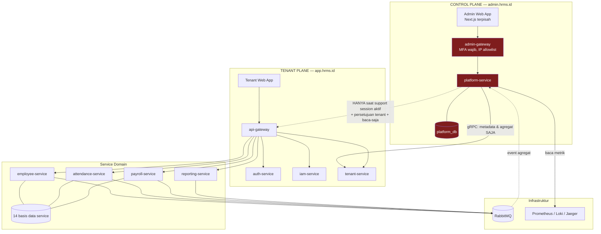

# 07 — Dashboard Global (Superuser) & Dashboard Tenant

---

## 1. Masalah yang Diselesaikan

Dibutuhkan dua dashboard dengan audiens dan tujuan yang sama sekali berbeda:

| | Dashboard Global | Dashboard Tenant |
|---|---|---|
| Pengguna | Superuser (tim internal penyedia SaaS) | Admin perusahaan pelanggan |
| Pertanyaan yang dijawab | "Bagaimana kesehatan platform dan bisnis kami?" | "Bagaimana kondisi SDM perusahaan saya?" |
| Cakupan data | Seluruh tenant, tetapi **hanya metadata & agregat** | Satu tenant, data bisnis lengkap |
| Contoh metrik | 247 tenant aktif, MRR Rp 412 jt, 3 tenant dengan DLQ menumpuk | 847 karyawan, 92% kehadiran hari ini, biaya SDM bulan ini |
| Domain akses | `admin.hrms.id` | `app.hrms.id` |

### 1.1 Keputusan Desain Paling Penting

**Superuser bukan "pengguna dengan izin lebih banyak". Superuser adalah entitas di bidang (plane) yang berbeda.**

Godaan implementasi yang harus ditolak:

```typescript
// ❌ JANGAN PERNAH — pola yang merusak seluruh model keamanan
if (user.isSuperuser) {
  // lewati filter tenant
  return prisma.employee.findMany();          // membaca SEMUA tenant
}
```

```sql
-- ❌ JANGAN PERNAH — mencabut satu-satunya lapisan gagal-aman
CREATE ROLE superuser_app LOGIN BYPASSRLS;
```

Alasannya:

| Konsekuensi | Penjelasan |
|-------------|-----------|
| RLS berhenti menjadi gagal-aman | Seluruh dokumen `06` bersandar pada klaim "bila developer lupa filter tenant, RLS tetap menahan". Satu jalur bypass membatalkan klaim itu untuk seluruh sistem |
| Radius ledakan maksimum | Satu kredensial superuser yang bocor = seluruh data gaji dan data pribadi setiap perusahaan pelanggan |
| Melanggar UU PDP | Akses ke data pribadi tanpa dasar dan tanpa persetujuan pengendali data (yaitu perusahaan pelanggan) |
| Tidak lolos audit | SOC 2 dan ISO 27001 menuntut pembatasan dan pencatatan akses administratif ke data pelanggan |

**Pendekatan yang dipakai: pemisahan bidang (plane separation).**

```
CONTROL PLANE (Dashboard Global)          TENANT PLANE (Dashboard Tenant)
├── Identitas: platform_users             ├── Identitas: users (per tenant)
├── Basis data: platform_db               ├── Basis data: 14 basis data service
├── Isi: metadata, agregat, telemetri     ├── Isi: data bisnis HR
├── Gateway: admin-gateway                ├── Gateway: api-gateway
├── Domain: admin.hrms.id                 ├── Domain: app.hrms.id
├── MFA: WAJIB                            ├── MFA: opsional (Fase 2)
└── Akses data tenant: HANYA lewat        └── Akses data: penuh dalam tenantnya
    support session yang disetujui tenant
```

Superuser **tidak memiliki kredensial** ke `employee_db`, `payroll_db`, dan seterusnya. Bukan "punya tapi tidak dipakai" — memang tidak punya. Isolasinya ditegakkan hak akses PostgreSQL dan NetworkPolicy, sama seperti isolasi antar-service.

---

## 2. Arsitektur Dua Bidang



Perhatikan garis putus-putus dari `platform-service` ke `api-gateway`: itu satu-satunya jalur superuser menuju data tenant, dan jalur itu melewati gateway yang sama dengan pengguna biasa, dengan token impersonasi yang membawa klaim `act.sub`. Tidak ada pintu belakang.

---

## 3. Identitas Superuser

### 3.1 Realm Terpisah

```sql
-- =====================================================================
-- platform_db  (dimiliki platform-service; TIDAK ber-tenant_id)
-- =====================================================================
CREATE TYPE platform_role AS ENUM (
  'PLATFORM_OWNER',      -- pendiri/CTO: seluruh akses termasuk pengelolaan superuser lain
  'PLATFORM_ADMIN',      -- operasional: kelola tenant, langganan, modul
  'PLATFORM_SUPPORT',    -- dukungan: baca metadata, ajukan support session
  'PLATFORM_FINANCE',    -- penagihan & pendapatan; tanpa akses operasional
  'PLATFORM_READONLY'    -- auditor internal
);

CREATE TABLE platform_users (
  id             uuid PRIMARY KEY DEFAULT uuid_v7(),
  email          citext UNIQUE NOT NULL,
  full_name      text NOT NULL,
  password_hash  text NOT NULL,                    -- Argon2id
  role           platform_role NOT NULL,

  -- MFA WAJIB. Akun tanpa MFA aktif tidak dapat login sama sekali.
  mfa_secret_enc bytea,
  mfa_enabled_at timestamptz,
  mfa_recovery_codes_enc bytea,

  ip_allowlist   inet[],                           -- opsional per pengguna; kosong = pakai allowlist global
  is_active      boolean NOT NULL DEFAULT true,
  last_login_at  timestamptz,
  failed_attempts smallint NOT NULL DEFAULT 0,
  locked_until   timestamptz,

  created_by     uuid REFERENCES platform_users(id),
  created_at     timestamptz NOT NULL DEFAULT now(),
  deactivated_at timestamptz,

  -- Akun superuser yang belum menyiapkan MFA tidak boleh berfungsi
  CONSTRAINT chk_mfa_required
    CHECK (NOT is_active OR mfa_enabled_at IS NOT NULL)
);

CREATE TABLE platform_sessions (
  id                 uuid PRIMARY KEY DEFAULT uuid_v7(),
  platform_user_id   uuid NOT NULL REFERENCES platform_users(id) ON DELETE CASCADE,
  refresh_token_hash text NOT NULL,
  ip_address         inet NOT NULL,
  user_agent         text,
  mfa_verified_at    timestamptz NOT NULL,
  issued_at          timestamptz NOT NULL DEFAULT now(),
  expires_at         timestamptz NOT NULL,         -- lebih pendek: 8 jam, bukan 7 hari
  revoked_at         timestamptz,
  revoke_reason      text
);
CREATE UNIQUE INDEX uq_platform_session ON platform_sessions (refresh_token_hash);

-- Setiap aksi superuser dicatat, termasuk PEMBACAAN
CREATE TABLE platform_audit_logs (
  id              bigint GENERATED ALWAYS AS IDENTITY,
  occurred_at     timestamptz NOT NULL DEFAULT now(),
  platform_user_id uuid NOT NULL,
  platform_user_email citext NOT NULL,             -- didenormalisasi: tetap terbaca setelah akun dihapus
  action          text NOT NULL,                   -- 'tenant.suspended', 'dashboard.viewed', 'support.session.requested'
  target_type     text,
  target_id       text,
  target_tenant_id uuid,                           -- tenant mana yang terdampak (bila ada)
  before          jsonb,
  after           jsonb,
  ip_address      inet NOT NULL,
  user_agent      text,
  correlation_id  text,
  PRIMARY KEY (id, occurred_at)
) PARTITION BY RANGE (occurred_at);
REVOKE UPDATE, DELETE ON platform_audit_logs FROM PUBLIC;

CREATE TABLE platform_login_attempts (
  id           bigint GENERATED ALWAYS AS IDENTITY PRIMARY KEY,
  email        citext,
  succeeded    boolean NOT NULL,
  failure_reason text,
  ip_address   inet NOT NULL,
  attempted_at timestamptz NOT NULL DEFAULT now()
);
```

### 3.2 Perbedaan Kontrol Autentikasi

| Kontrol | Pengguna tenant | Superuser |
|---------|-----------------|-----------|
| Domain login | `app.hrms.id` | `admin.hrms.id` |
| Kredensial | tenantCode + email + password | email + password + **TOTP** |
| MFA | Opsional (Fase 2) | **Wajib, ditegakkan constraint basis data** |
| IP allowlist | Tidak | **Ya** (kantor + VPN) |
| Masa access token | 15 menit | **10 menit** |
| Masa sesi | 7 hari (mobile 30) | **8 jam**, tidak dapat diperpanjang lintas hari |
| Sesi bersamaan | 10 | **2** |
| Kunci setelah gagal | 5× / 15 menit | **3× / 60 menit** |
| Pencatatan | Login saja | **Setiap aksi, termasuk pembacaan halaman** |
| Notifikasi | Perangkat baru | **Setiap login, ke seluruh PLATFORM_OWNER** |

```typescript
// services/platform-service/src/application/platform-login.usecase.ts
async login(cmd: PlatformLoginCommand): Promise<PlatformLoginResult> {
  // IP allowlist diperiksa PERTAMA, sebelum kredensial diuji sama sekali
  if (!this.ipAllowlist.permits(cmd.ip)) {
    this.securityLog.error({ event: 'PLATFORM_LOGIN_FROM_UNKNOWN_IP', ip: cmd.ip, email: cmd.email });
    await this.alerts.critical('PLATFORM_LOGIN_BLOCKED_IP', { ip: cmd.ip, email: cmd.email });
    throw new ForbiddenException({ code: 'IP_NOT_ALLOWED' });
  }

  await this.rateLimiter.consume(`plogin:ip:${cmd.ip}`, 10, 3600);

  const user = await this.repo.findByEmail(cmd.email);
  const genericError = new UnauthorizedException({ code: 'INVALID_CREDENTIALS' });

  if (!user || !user.isActive) {
    await argon2.verify(DUMMY_HASH, cmd.password).catch(() => {});   // samakan waktu respons
    await this.recordAttempt(cmd, false, 'USER_NOT_FOUND');
    throw genericError;
  }
  if (user.lockedUntil && user.lockedUntil > new Date()) {
    throw new ForbiddenException({ code: 'ACCOUNT_LOCKED', retryAfter: user.lockedUntil });
  }
  if (!await argon2.verify(user.passwordHash, cmd.password)) {
    const attempts = user.failedAttempts + 1;
    await this.repo.recordFailure(user.id, attempts,
      attempts >= 3 ? addMinutes(new Date(), 60) : null);
    if (attempts >= 3) await this.alerts.critical('PLATFORM_ACCOUNT_LOCKED', { email: cmd.email, ip: cmd.ip });
    throw genericError;
  }

  // MFA bukan langkah opsional; tidak ada jalur yang melewatinya
  if (!user.mfaEnabledAt) throw new ForbiddenException({ code: 'MFA_SETUP_REQUIRED' });
  if (!await this.totp.verify(decrypt(user.mfaSecretEnc), cmd.totpCode)) {
    await this.recordAttempt(cmd, false, 'INVALID_TOTP');
    throw genericError;
  }

  const session = await this.repo.createSession(user, cmd.ip, cmd.userAgent);

  // Setiap login superuser diberitahukan ke seluruh PLATFORM_OWNER —
  // login yang tidak dikenali harus segera terlihat oleh manusia lain
  await this.notifications.notifyOwners('PLATFORM_LOGIN', {
    who: user.email, ip: cmd.ip, at: new Date(), userAgent: cmd.userAgent,
  });
  await this.audit.record(user, 'platform.login', { ip: cmd.ip });

  return { accessToken: this.signToken(user, session), refreshToken: session.rawToken };
}
```

### 3.3 Bentuk Token Superuser

```typescript
{
  "iss": "hrms-platform",
  "aud": "hrms-admin",              // audience BERBEDA dari token tenant
  "sub": "018f...",                 // platformUserId
  "role": "PLATFORM_SUPPORT",
  "sessionId": "018f...",
  "mfa": true,
  "iat": 1755400000,
  "exp": 1755400600                 // 10 menit
}
```

> **Tidak ada klaim `tenantId`.** Ini disengaja dan penting: `api-gateway` menolak token apa pun yang tidak memiliki `tenantId` dan tidak memiliki `aud: hrms-api`. Token superuser secara struktural tidak dapat dipakai di tenant plane. Satu-satunya pengecualian adalah token impersonasi yang diterbitkan saat support session aktif (§6), dan token itu **membawa `tenantId` tenant yang menyetujui** plus klaim `act.sub` yang menandai siapa yang sedang menyamar.

---

## 4. Dashboard Global

### 4.1 Prinsip Isi

**Aturan:** dashboard global menampilkan **data tentang tenant**, bukan **data milik tenant**.

| Boleh ditampilkan | Tidak boleh ditampilkan |
|-------------------|------------------------|
| Jumlah karyawan per tenant (angka) | Nama, NIK, atau data pribadi karyawan mana pun |
| Total biaya payroll per tenant (agregat, untuk deteksi anomali penggunaan) | Gaji individu, slip gaji, struktur gaji |
| Jumlah pengajuan cuti bulan ini | Isi pengajuan cuti, alasan, lampiran |
| Tingkat kehadiran rata-rata | Catatan absensi per karyawan |
| Jumlah kasus employee relation | Judul, isi, atau pihak yang terlibat dalam kasus |
| Modul aktif, MRR, tanggal perpanjangan | — |
| Kesehatan teknis: error rate, lag antrean, DLQ | — |

> Batas "agregat vs individu" bukan garis yang aman dengan sendirinya. Agregat pada tenant berisi 3 karyawan praktis mengungkap data individu. Karena itu **setiap agregat yang berasal dari kurang dari 5 subjek data disembunyikan** dan ditampilkan sebagai "—" (lihat §4.4).

### 4.2 Tata Letak

```
┌─ RINGKASAN PLATFORM ──────────────────────────────────────────────────┐
│  Tenant aktif    Karyawan terkelola    MRR          Uji coba berjalan  │
│      247            38.412          Rp 412,3 jt          31            │
│    ▲ +12 (30h)      ▲ +2.104        ▲ +8,2%           ▼ −4             │
└───────────────────────────────────────────────────────────────────────┘

┌─ KESEHATAN SISTEM ────────────────┐  ┌─ PERLU PERHATIAN ───────────────┐
│  API p95         312 ms      ✓    │  │ ⚠ 3 tenant: DLQ menumpuk        │
│  Error rate      0,08%       ✓    │  │ ⚠ 7 tenant: langganan H-7       │
│  Antrean         142 pesan   ✓    │  │ ⚠ 2 tenant: replica drift       │
│  DLQ             14 pesan    ⚠    │  │ ⚠ 1 saga gagal kompensasi       │
│  Replica lag p95 8 dtk       ✓    │  │ ⚠ 5 tenant: kuota storage >90%  │
│  Saga macet      1           ⚠    │  │ ⚠ 12 tenant: 0 login 14 hari    │
└───────────────────────────────────┘  └─────────────────────────────────┘

┌─ PERTUMBUHAN & PENDAPATAN ────────────────────────────────────────────┐
│  [Grafik MRR 12 bulan]   [Tenant baru/churn per bulan]                │
│  Adopsi modul: attendance 94% · leave 91% · payroll 67% ·             │
│                performance 41% · claim 38% · onboarding 29% ·         │
│                recruitment 23% · hse 11%                              │
│  ⚠ onboarding di bawah ambang adopsi 30% (dok. 08 §9)                 │
└───────────────────────────────────────────────────────────────────────┘

┌─ DAFTAR TENANT ───────────────────────────────────────────────────────┐
│ Kode   Nama              Paket      Kary.  Status   Login  Kesehatan  │
│ ACME   PT Acme Indonesia ULTIMATE     847  ACTIVE     2j       ✓      │
│ GLBX   PT Globex         ADVANCED     212  ACTIVE     5j       ⚠ DLQ  │
│ INIT   CV Initech        BASIC         34  TRIAL      1h       ✓      │
│ UMBR   PT Umbrella       ADVANCED     156  SUSPENDED  12h      —      │
│                                    [Detail] [Kelola] [Minta akses]    │
└───────────────────────────────────────────────────────────────────────┘
```

Tombol **[Minta akses]** tidak membuka data tenant. Ia membuka formulir pengajuan support session yang harus disetujui pihak tenant (§6).

### 4.3 Sumber Data: Proyeksi Event, Bukan Query Lintas Tenant

`platform-service` **tidak pernah** melakukan query ke basis data service domain. Ia membangun proyeksinya sendiri dari event agregat.

```sql
-- platform_db
CREATE TABLE tenant_metrics_daily (
  tenant_id          uuid NOT NULL,
  metric_date        date NOT NULL,
  employee_count     integer NOT NULL DEFAULT 0,
  active_user_count  integer NOT NULL DEFAULT 0,
  login_count        integer NOT NULL DEFAULT 0,
  punch_count        integer NOT NULL DEFAULT 0,
  leave_request_count integer NOT NULL DEFAULT 0,
  payroll_run_count  integer NOT NULL DEFAULT 0,
  payroll_total_gross numeric(18,2),          -- agregat; dipakai deteksi anomali & penetapan harga
  storage_used_mb    integer NOT NULL DEFAULT 0,
  api_request_count  bigint  NOT NULL DEFAULT 0,
  error_count        integer NOT NULL DEFAULT 0,
  PRIMARY KEY (tenant_id, metric_date)
);

CREATE TABLE tenant_health (
  tenant_id        uuid PRIMARY KEY,
  last_login_at    timestamptz,
  dlq_message_count integer NOT NULL DEFAULT 0,
  replica_lag_seconds integer,
  stuck_saga_count integer NOT NULL DEFAULT 0,
  storage_quota_pct numeric(5,2),
  error_rate_pct   numeric(6,3),
  health_status    text NOT NULL DEFAULT 'HEALTHY',   -- HEALTHY/DEGRADED/CRITICAL
  updated_at       timestamptz NOT NULL DEFAULT now()
);

CREATE TABLE platform_revenue_monthly (
  period_month     date PRIMARY KEY,
  mrr              numeric(18,2) NOT NULL DEFAULT 0,
  arr              numeric(18,2) NOT NULL DEFAULT 0,
  new_tenants      integer NOT NULL DEFAULT 0,
  churned_tenants  integer NOT NULL DEFAULT 0,
  expansion_mrr    numeric(18,2) NOT NULL DEFAULT 0,
  contraction_mrr  numeric(18,2) NOT NULL DEFAULT 0,
  computed_at      timestamptz NOT NULL DEFAULT now()
);

CREATE TABLE module_adoption (
  module_key       text NOT NULL,
  period_month     date NOT NULL,
  tenants_enabled  integer NOT NULL DEFAULT 0,
  tenants_active   integer NOT NULL DEFAULT 0,   -- benar-benar dipakai, bukan sekadar aktif
  adoption_pct     numeric(5,2),
  PRIMARY KEY (module_key, period_month)
);
```

Konsumer event yang mengisinya:

```typescript
// services/platform-service/src/projections/tenant-metrics.consumer.ts
@EventHandler([
  'employee.employee.created', 'employee.employee.terminated',
  'attendance.punch.recorded', 'leave.request.submitted',
  'payroll.run.completed', 'auth.user.logged_in', 'tenant.module.enabled',
])
export class TenantMetricsProjection extends IdempotentConsumer<any> {
  readonly consumerName = 'platform.tenant-metrics';

  protected async execute(payload: any, tx: Prisma.TransactionClient) {
    const { tenantId } = ServiceContextStore.get()!;
    const today = todayInTenantTz(tenantId);

    // Hanya menambah penghitung. Tidak ada identitas individu yang disimpan di sini.
    const delta = this.toDelta(payload);   // { employeeCount: +1 } atau { punchCount: +1 }, dst.

    await tx.$executeRaw`
      INSERT INTO tenant_metrics_daily (tenant_id, metric_date, ${Prisma.raw(delta.column)})
      VALUES (${tenantId}::uuid, ${today}::date, ${delta.value})
      ON CONFLICT (tenant_id, metric_date) DO UPDATE
        SET ${Prisma.raw(delta.column)} = tenant_metrics_daily.${Prisma.raw(delta.column)} + ${delta.value}`;
  }
}
```

> Perhatikan yang **tidak** ada di proyeksi ini: `employeeId`, `fullName`, `amount` per individu. Proyeksi platform hanya menaikkan penghitung. Bila suatu saat ada permintaan menambahkan kolom berisi identitas individu ke `platform_db`, itu harus ditolak — perubahan seperti itu memindahkan data pribadi ke bidang yang tidak dilindungi RLS.

### 4.4 Ambang Anonimitas

```typescript
// services/platform-service/src/domain/aggregate-guard.ts
const MIN_COHORT_SIZE = 5;

export function guardAggregate<T extends { subjectCount: number }>(row: T, fields: (keyof T)[]): T {
  if (row.subjectCount < MIN_COHORT_SIZE) {
    // Agregat dari <5 subjek dapat mengungkap individu — sembunyikan nilainya
    return { ...row, ...Object.fromEntries(fields.map((f) => [f, null])), suppressed: true };
  }
  return row;
}
```

Contoh nyata: tenant uji coba dengan 3 karyawan. Menampilkan "total payroll Rp 27,3 juta" pada tenant berisi 3 orang sama saja dengan membocorkan kisaran gaji mereka. Dashboard menampilkan "—" beserta keterangan "data disembunyikan (kelompok terlalu kecil)".

### 4.5 Kapabilitas Operasional

| Aksi | PLATFORM_OWNER | PLATFORM_ADMIN | PLATFORM_SUPPORT | PLATFORM_FINANCE | PLATFORM_READONLY |
|------|:--:|:--:|:--:|:--:|:--:|
| Lihat dashboard global | ✓ | ✓ | ✓ | ✓ | ✓ |
| Lihat detail metadata tenant | ✓ | ✓ | ✓ | ✓ | ✓ |
| Buat / provisioning tenant | ✓ | ✓ | ✗ | ✗ | ✗ |
| Ubah paket & modul tenant | ✓ | ✓ | ✗ | ✓ | ✗ |
| Tangguhkan tenant | ✓ | ✓ | ✗ | ✗ | ✗ |
| Purge tenant | ✓ | ✗ | ✗ | ✗ | ✗ |
| Lihat data penagihan & pendapatan | ✓ | ✓ | ✗ | ✓ | ✓ |
| Ajukan support session | ✓ | ✓ | ✓ | ✗ | ✗ |
| **Membaca data bisnis tenant** | Hanya via support session yang disetujui | idem | idem | ✗ | ✗ |
| Kelola akun superuser | ✓ | ✗ | ✗ | ✗ | ✗ |
| Lihat audit log platform | ✓ | ✓ | ✗ | ✗ | ✓ |

**Pemisahan tugas di control plane:**

```typescript
export const PLATFORM_SOD_RULES: SodRule[] = [
  { id: 'PSOD-01', description: 'Purge tenant butuh 2 persetujuan PLATFORM_OWNER berbeda',
    check: (approvals) => new Set(approvals.map(a => a.userId)).size >= 2 },

  { id: 'PSOD-02', description: 'Pembuat akun superuser tidak boleh mengaktifkannya sendiri',
    check: (ctx, target) => target.createdBy !== ctx.userId },

  { id: 'PSOD-03', description: 'Pengaju support session tidak boleh menyetujuinya',
    check: (ctx, session) => session.requestedBy !== ctx.userId },

  { id: 'PSOD-04', description: 'PLATFORM_FINANCE tidak boleh memiliki akses operasional',
    checkOnGrant: (role, perms) =>
      role !== 'PLATFORM_FINANCE' || !perms.some(p => p.startsWith('platform.tenant.suspend')) },
];
```

---

## 5. Dashboard Tenant

### 5.1 Cakupan Akses

Permintaan menyebutkan dashboard tenant hanya untuk admin tenant. Ada satu nuansa yang perlu diputuskan secara sadar: **karyawan biasa tetap membutuhkan halaman beranda**, tetapi itu bukan dashboard yang sama.

| Halaman | Pengguna | Isi |
|---------|----------|-----|
| **Dashboard Tenant** | `TENANT_OWNER`, `HR_ADMIN` | Seluruh perusahaan: headcount, kehadiran, biaya SDM, turnover, pipeline rekrutmen |
| **Dashboard Tim** | `LINE_MANAGER`, `DEPT_HEAD` | Terbatas pada unit/bawahannya; tanpa data biaya |
| **Beranda ESS** | `EMPLOYEE` | Hanya dirinya: sisa cuti, absensi bulan ini, slip gaji terakhir, pengumuman |

Membedakan ketiganya lebih baik daripada memberi karyawan halaman kosong atau, lebih buruk, dashboard perusahaan yang widget-nya sebagian besar bertuliskan "tidak berizin".

```typescript
// services/api-gateway/src/routing/route-manifest.ts (tambahan)
export const DASHBOARD_ROUTES: RouteRule[] = [
  { method: 'GET', path: '/api/dashboard/tenant', service: 'reporting',
    module: 'core.organization', permission: 'dashboard.tenant.view' },
  { method: 'GET', path: '/api/dashboard/team',   service: 'reporting',
    module: 'core.organization', permission: 'dashboard.team.view' },
  { method: 'GET', path: '/api/dashboard/me',     service: 'reporting',
    module: 'core.organization', permission: 'dashboard.self.view' },
];
```

```typescript
// Permission baru di iam-service
const DASHBOARD_PERMISSIONS = [
  { key: 'dashboard.tenant.view', module: 'core.organization', scope: 'all',
    description: 'Melihat dashboard seluruh perusahaan' },
  { key: 'dashboard.team.view',   module: 'core.organization', scope: 'team',
    description: 'Melihat dashboard unit/tim sendiri' },
  { key: 'dashboard.self.view',   module: 'core.organization', scope: 'self',
    description: 'Melihat beranda pribadi' },
];

// Peran bawaan
TENANT_OWNER  → dashboard.tenant.view
HR_ADMIN      → dashboard.tenant.view
DEPT_HEAD     → dashboard.team.view
LINE_MANAGER  → dashboard.team.view
EMPLOYEE      → dashboard.self.view
```

### 5.2 Komposisi Widget Mengikuti Langganan

Dashboard tenant tidak berbentuk tetap. Widget-nya dirakit dari modul yang dilanggan — memperkuat model tiering produk referensi.

```typescript
// services/reporting-service/src/dashboard/widget-registry.ts
export const TENANT_WIDGETS: WidgetDefinition[] = [
  { key: 'headcount.summary',      module: 'core.organization', permission: 'dashboard.tenant.view',
    title: 'Ringkasan Karyawan', size: 'md', refresh: 'event' },
  { key: 'attendance.today',       module: 'attendance', permission: 'dashboard.tenant.view',
    title: 'Kehadiran Hari Ini',  size: 'lg', refresh: 'realtime' },
  { key: 'attendance.trend',       module: 'attendance', permission: 'dashboard.tenant.view',
    title: 'Tren Kehadiran 30 Hari', size: 'lg', refresh: 'daily' },
  { key: 'leave.calendar',         module: 'leave', permission: 'dashboard.tenant.view',
    title: 'Kalender Cuti Minggu Ini', size: 'lg', refresh: 'event' },
  { key: 'leave.pending',          module: 'leave', permission: 'leave.request.approve',
    title: 'Menunggu Persetujuan', size: 'sm', refresh: 'realtime' },
  { key: 'payroll.cost',           module: 'payroll', permission: 'payroll.run.create',
    title: 'Biaya SDM Bulan Ini', size: 'md', refresh: 'event' },
  { key: 'payroll.upcoming',       module: 'payroll', permission: 'payroll.run.create',
    title: 'Payroll Berikutnya',  size: 'sm', refresh: 'daily' },
  { key: 'performance.progress',   module: 'performance', permission: 'dashboard.tenant.view',
    title: 'Progres Penilaian',   size: 'md', refresh: 'daily' },
  { key: 'recruitment.pipeline',   module: 'recruitment', permission: 'dashboard.tenant.view',
    title: 'Pipeline Rekrutmen',  size: 'lg', refresh: 'event' },
  { key: 'relation.open_cases',    module: 'relation', permission: 'relation.case.read',
    title: 'Kasus Terbuka',       size: 'sm', refresh: 'event' },
  { key: 'turnover.rate',          module: 'core.organization', permission: 'dashboard.tenant.view',
    title: 'Tingkat Turnover',    size: 'md', refresh: 'monthly' },
];

// Perakitan: irisan langganan × permission
export function composeDashboard(ctx: RequestContext): WidgetDefinition[] {
  return TENANT_WIDGETS.filter(
    (w) => ctx.subscription.modules.has(w.module) && ctx.permissions.has(w.permission));
}
```

Widget dari modul yang belum dilanggan tidak dirender sebagai widget, melainkan muncul di baris terpisah "Tersedia pada paket lebih tinggi" — konsisten dengan pemisahan `menus` dan `lockedModules` di `/me/bootstrap` (dokumen `01`, §5.4).

### 5.3 Endpoint

```typescript
// GET /api/dashboard/tenant
// Header: Authorization + X-Tenant-ID
{
  "scope": "TENANT",
  "generatedAt": "2026-08-17T09:12:03+07:00",
  "widgets": [
    { "key": "headcount.summary", "data": {
        "total": 847, "active": 831, "onLeave": 12, "probation": 23,
        "newThisMonth": 14, "exitsThisMonth": 6 } },
    { "key": "attendance.today", "data": {
        "present": 764, "late": 41, "absent": 14, "onLeave": 12,
        "attendanceRate": 96.9, "asOf": "2026-08-17T09:00:00+07:00" } },
    { "key": "payroll.cost", "data": {
        "periodMonth": "2026-08", "totalGross": "4218450000.00",
        "totalNet": "3781200000.00", "employerCost": "612340000.00",
        "changeFromPrevMonth": 2.4 } }
  ],
  "lockedWidgets": [
    { "key": "recruitment.pipeline", "module": "recruitment",
      "teaser": "Pantau pipeline rekrutmen end-to-end", "upgradeUrl": "/settings/subscription" }
  ]
}
```

Data berasal dari `reporting-service` (read model, dokumen `02` §11) sehingga dashboard tidak membebani service domain. Widget bertanda `refresh: 'realtime'` juga berlangganan kanal WebSocket `tenant:{id}:dashboard:*`.

### 5.4 Dashboard Tim

`DEPT_HEAD` dan `LINE_MANAGER` mendapat dashboard yang sama secara struktur, tetapi difilter cakupan organisasi dan **tanpa widget biaya**:

```typescript
// services/reporting-service/src/dashboard/team-dashboard.query.ts
async getTeamDashboard(ctx: RequestContext) {
  // orgUnitScope berasal dari user_roles.org_unit_ids (dokumen 05)
  const scope = ctx.orgUnitScope;
  if (!scope.length && !ctx.permissions.has('dashboard.tenant.view')) {
    throw new ForbiddenException({ code: 'NO_ORG_SCOPE',
      message: 'Anda belum ditetapkan sebagai penanggung jawab unit mana pun.' });
  }

  const widgets = TENANT_WIDGETS.filter(
    (w) => ctx.subscription.modules.has(w.module)
        && !w.key.startsWith('payroll.')          // biaya SDM bukan wewenang manajer lini
        && w.key !== 'relation.open_cases');      // kasus disipliner ditangani HR

  return this.assemble(widgets, { tenantId: ctx.tenantId, orgUnitIds: scope });
}
```

---

## 6. Jembatan Terkendali: Support Session

Satu-satunya jalur superuser menuju data bisnis tenant. Desainnya sudah ada di dokumen `06` §6; di sini ditegaskan integrasinya dengan dashboard global.

```mermaid
sequenceDiagram
    actor S as Superuser (SUPPORT)
    participant AD as Admin Dashboard
    participant PLAT as platform-service
    participant TEN as tenant-service
    participant TO as Tenant Owner
    participant GW as api-gateway

    S->>AD: Klik [Minta akses] pada tenant ACME
    AD->>PLAT: POST /platform/support-sessions<br/>{tenantId, ticketRef, reason, readOnly}
    PLAT->>PLAT: validasi PSOD-03, cek peran
    PLAT->>TEN: buat permintaan sesi (status PENDING)
    TEN->>TO: notifikasi in-app + email
    Note over AD: Superuser MENUNGGU. Tidak ada data yang terbuka.

    TO->>TEN: Setujui (maks 4 jam, baca-saja)
    TEN->>PLAT: sesi disetujui
    PLAT->>PLAT: terbitkan token impersonasi<br/>{tenantId: ACME, sub: tenantOwnerId, act: {sub: superuserId}}

    S->>GW: Akses app.hrms.id dengan token impersonasi<br/>+ X-Tenant-ID: ACME
    GW->>GW: validasi normal; deteksi klaim act.sub
    GW->>GW: paksa mode baca-saja, tolak semua metode tulis
    GW-->>S: data tenant (dengan banner permanen)
    Note over TO: Banner di UI tenant:<br/>"Tim dukungan sedang mengakses akun Anda"

    loop setiap aksi
        GW->>PLAT: catat ke platform_audit_logs (target_tenant_id = ACME)
    end

    Note over PLAT: Sesi berakhir otomatis setelah 4 jam
    PLAT->>TO: ringkasan seluruh aktivitas sesi
```

```typescript
// services/api-gateway/src/guards/impersonation.guard.ts
@Injectable()
export class ImpersonationGuard implements CanActivate {
  async canActivate(ctx: ExecutionContext): Promise<boolean> {
    const req = ctx.switchToHttp().getRequest();
    const act = req.auth?.act;                       // klaim aktor: penanda impersonasi
    if (!act) return true;                           // sesi normal

    const session = await this.platformClient.getSupportSession({ sessionId: act.sessionId });

    if (!session || session.endedAt || session.expiresAt < new Date()) {
      throw new UnauthorizedException({ code: 'SUPPORT_SESSION_EXPIRED' });
    }
    if (session.tenantId !== req.ctx.tenantId) {
      // Sesi disetujui untuk tenant A tetapi dipakai mengakses tenant B
      this.securityLog.error({ event: 'IMPERSONATION_TENANT_MISMATCH',
        sessionTenant: session.tenantId, requestTenant: req.ctx.tenantId, actor: act.sub });
      await this.alerts.critical('IMPERSONATION_ABUSE', { actor: act.sub });
      throw new ForbiddenException({ code: 'SESSION_TENANT_MISMATCH' });
    }
    if (session.isReadOnly && !SAFE_METHODS.includes(req.method)) {
      throw new ForbiddenException({ code: 'SUPPORT_SESSION_READ_ONLY' });
    }

    // Modul paling sensitif tetap tertutup meski sesi disetujui,
    // kecuali tenant secara eksplisit membuka aksesnya saat menyetujui
    if (SENSITIVE_PATHS.some((p) => req.url.startsWith(p)) && !session.allowSensitive) {
      throw new ForbiddenException({ code: 'SENSITIVE_MODULE_EXCLUDED' });
    }

    await this.platformClient.recordAction({
      sessionId: act.sessionId, method: req.method, path: req.url, at: new Date() });
    return true;
  }
}

const SENSITIVE_PATHS = ['/api/payroll/payslips', '/api/relation/cases', '/api/employees/*/documents'];
const SAFE_METHODS = ['GET', 'HEAD', 'OPTIONS'];
```

---

## 7. Pemisahan Frontend

Dua aplikasi terpisah, bukan satu aplikasi dengan menu tersembunyi.

```
apps/
├── web/           app.hrms.id     — aplikasi tenant
└── admin/         admin.hrms.id   — dashboard global
```

Alasan pemisahan fisik:

| Manfaat | Penjelasan |
|---------|-----------|
| Bundel terpisah | Kode dashboard global tidak pernah terkirim ke browser pengguna tenant. Tidak ada yang bisa membaca logikanya untuk mencari celah |
| Origin berbeda | Cookie sesi superuser tidak dapat diakses dari `app.hrms.id`; serangan XSS di aplikasi tenant tidak menyentuh sesi superuser |
| CSP & header lebih ketat | `admin.hrms.id` dapat memakai CSP sangat ketat tanpa mengorbankan fitur aplikasi tenant |
| Kontrol jaringan | Cloudflare Access / IP allowlist diterapkan di level domain, sebelum request mencapai aplikasi |
| Tidak ada kekeliruan kondisi | Tanpa `if (isSuperuser)` di dalam aplikasi tenant, tidak ada kondisi yang bisa salah dievaluasi |
| Tanpa service worker | `app.hrms.id` adalah PWA; `admin.hrms.id` **sengaja tidak**. Service worker berjalan di luar siklus hidup halaman dan mencegat setiap permintaan jaringan — permukaan serangan yang tidak sepadan untuk control plane yang tidak membutuhkan mode luring (dok. `11` §1.1) |

```typescript
// apps/admin/src/middleware.ts
export function middleware(req: NextRequest) {
  const res = NextResponse.next();
  res.headers.set('Content-Security-Policy',
    "default-src 'self'; script-src 'self'; style-src 'self' 'unsafe-inline'; " +
    "connect-src 'self' https://admin-api.hrms.id; frame-ancestors 'none'");
  res.headers.set('X-Frame-Options', 'DENY');
  res.headers.set('Strict-Transport-Security', 'max-age=63072000; includeSubDomains; preload');
  res.headers.set('Referrer-Policy', 'no-referrer');
  return res;
}
```

```yaml
# k8s/network-policies/platform-service.yaml
apiVersion: networking.k8s.io/v1
kind: NetworkPolicy
metadata: { name: platform-service-ingress, namespace: hrms }
spec:
  podSelector: { matchLabels: { app: platform-service } }
  policyTypes: [Ingress, Egress]
  ingress:
    - from: [{ podSelector: { matchLabels: { app: admin-gateway } } }]
      ports: [{ protocol: TCP, port: 50051 }]
  egress:
    # platform-service HANYA boleh menjangkau tenant-service dan basis datanya sendiri.
    # Ia TIDAK memiliki jalur jaringan ke employee-service, payroll-service, dst.
    - to: [{ podSelector: { matchLabels: { app: tenant-service } } }]
    - to: [{ podSelector: { matchLabels: { app: postgres-platform } } }]
    - to: [{ podSelector: { matchLabels: { app: rabbitmq } } }]
    - to: [{ namespaceSelector: { matchLabels: { name: monitoring } } }]
```

> NetworkPolicy egress ini adalah penegakan terkuat dalam desain ini: sekalipun ada bug di `platform-service` yang mencoba memanggil `payroll-service`, paketnya tidak akan sampai. Isolasi tidak bergantung pada kebenaran kode.

---

## 8. Realtime untuk Dashboard Global

```
/realtime-admin                              namespace TERPISAH dari /realtime tenant
  platform:overview                          KPI platform
  platform:health                            kesehatan sistem, DLQ, saga
  platform:alerts                            peringatan yang perlu tindakan
  platform:tenant:{tenantId}                 status satu tenant (metadata saja)
```

```typescript
// services/realtime-service/src/admin-realtime.gateway.ts
@WebSocketGateway({ namespace: '/realtime-admin', transports: ['websocket'] })
export class AdminRealtimeGateway implements OnGatewayConnection {
  async handleConnection(client: Socket) {
    const claims = await this.jwt.verify(client.handshake.auth?.token);

    // Audience token menentukan namespace mana yang boleh dimasuki.
    // Token tenant tidak dapat masuk ke sini, dan sebaliknya.
    if (claims.aud !== 'hrms-admin') {
      client.emit('error', { code: 'WRONG_AUDIENCE' });
      return client.disconnect(true);
    }
    if (!claims.mfa) {
      client.emit('error', { code: 'MFA_REQUIRED' });
      return client.disconnect(true);
    }
    if (!this.ipAllowlist.permits(client.handshake.address)) {
      return client.disconnect(true);
    }

    client.data.ctx = { platformUserId: claims.sub, role: claims.role };
    await client.join('platform:overview');
    if (['PLATFORM_OWNER', 'PLATFORM_ADMIN'].includes(claims.role)) {
      await client.join('platform:health');
      await client.join('platform:alerts');
    }
  }
}
```

---

## 9. Pengujian: Gerbang CI

```typescript
// test/security/plane-separation.spec.ts
describe('Pemisahan control plane dan tenant plane', () => {
  it('token superuser ditolak di api-gateway tenant', async () => {
    const { token } = await platformLogin('ops@hrms.id');
    const res = await request(apiGateway).get('/api/employees')
      .set('Authorization', `Bearer ${token}`)
      .set('X-Tenant-ID', someTenantId);
    expect(res.status).toBe(401);
    expect(res.body.code).toBe('WRONG_AUDIENCE');
  });

  it('token tenant ditolak di admin-gateway', async () => {
    const { token } = await loginAs('acme', 'hr@acme.id');
    const res = await request(adminGateway).get('/platform/tenants')
      .set('Authorization', `Bearer ${token}`);
    expect(res.status).toBe(401);
  });

  it('platform-service tidak dapat terhubung ke basis data domain', async () => {
    const platformUrl = process.env.PLATFORM_DATABASE_URL!;
    for (const db of ['employee_db', 'payroll_db', 'attendance_db', 'relation_db']) {
      const crossUrl = platformUrl.replace('/platform_db', `/${db}`);
      await expect(new PrismaClient({ datasources: { db: { url: crossUrl } } }).$connect())
        .rejects.toThrow(/permission denied|does not exist/i);
    }
  });

  it('platform_db tidak memiliki kolom berisi data pribadi', async () => {
    // Gerbang struktural: mencegah data pribadi merembes ke bidang tanpa RLS
    const forbidden = ['full_name', 'employee_name', 'email_personal', 'national_id',
                       'nik', 'npwp', 'bank_account', 'salary', 'gross_amount', 'net_amount'];
    const found = await platformPrisma.$queryRaw`
      SELECT table_name, column_name FROM information_schema.columns
       WHERE table_schema = 'public' AND column_name = ANY(${forbidden}::text[])
         AND table_name NOT IN ('platform_users','platform_audit_logs')`;
    expect(found).toEqual([]);
  });

  it('akun superuser tanpa MFA tidak dapat diaktifkan', async () => {
    await expect(platformPrisma.platformUser.create({
      data: { email: 'x@hrms.id', fullName: 'X', passwordHash: 'h',
              role: 'PLATFORM_ADMIN', isActive: true, mfaEnabledAt: null },
    })).rejects.toThrow(/chk_mfa_required/);
  });

  it('login superuser dari IP di luar allowlist ditolak sebelum kredensial diuji', async () => {
    const res = await request(adminGateway).post('/platform/auth/login')
      .set('X-Forwarded-For', '203.0.113.99')
      .send({ email: 'ops@hrms.id', password: CORRECT_PASSWORD, totpCode: validTotp() });
    expect(res.status).toBe(403);
    expect(res.body.code).toBe('IP_NOT_ALLOWED');
  });
});

// test/security/support-session.spec.ts
describe('Support session', () => {
  it('tidak membuka data apa pun sebelum tenant menyetujui', async () => {
    const { token } = await platformLogin('support@hrms.id');
    const session = await requestSupportSession(token, acmeTenantId);   // status PENDING
    const res = await request(apiGateway).get('/api/employees')
      .set('Authorization', `Bearer ${session.impersonationToken ?? token}`)
      .set('X-Tenant-ID', acmeTenantId);
    expect(res.status).toBeGreaterThanOrEqual(401);
  });

  it('sesi tenant A tidak dapat dipakai mengakses tenant B', async () => {
    const impToken = await approvedSupportSession(acmeTenantId);
    const res = await request(apiGateway).get('/api/employees')
      .set('Authorization', `Bearer ${impToken}`)
      .set('X-Tenant-ID', globexTenantId);
    expect(res.status).toBe(403);
    expect(res.body.code).toBe('SESSION_TENANT_MISMATCH');
  });

  it('sesi baca-saja menolak seluruh metode tulis', async () => {
    const impToken = await approvedSupportSession(acmeTenantId, { readOnly: true });
    for (const [method, path] of [['post','/api/employees'], ['patch','/api/employees/x'],
                                  ['delete','/api/employees/x']]) {
      const res = await request(apiGateway)[method](path)
        .set('Authorization', `Bearer ${impToken}`).set('X-Tenant-ID', acmeTenantId);
      expect(res.body.code).toBe('SUPPORT_SESSION_READ_ONLY');
    }
  });

  it('setiap aksi impersonasi tercatat dengan identitas aktor sesungguhnya', async () => {
    const impToken = await approvedSupportSession(acmeTenantId);
    await request(apiGateway).get('/api/employees')
      .set('Authorization', `Bearer ${impToken}`).set('X-Tenant-ID', acmeTenantId);
    const logs = await platformPrisma.platformAuditLog.findMany({
      where: { targetTenantId: acmeTenantId } });
    expect(logs.at(-1)).toMatchObject({ platformUserEmail: 'support@hrms.id' });
  });
});

// test/security/dashboard-scope.spec.ts
describe('Cakupan dashboard tenant', () => {
  it('EMPLOYEE tidak dapat mengakses dashboard tenant', async () => {
    const { token, tenantId } = await loginAs('acme', 'budi@acme.id');   // peran EMPLOYEE
    const res = await get('/api/dashboard/tenant', token, tenantId);
    expect(res.status).toBe(403);
  });

  it('LINE_MANAGER hanya melihat unitnya dan tanpa widget biaya', async () => {
    const { token, tenantId } = await loginAs('acme', 'manager@acme.id');
    const res = await get('/api/dashboard/team', token, tenantId);
    expect(res.body.widgets.map((w) => w.key)).not.toContain('payroll.cost');
    expect(res.body.scope).toBe('TEAM');
  });

  it('agregat dari kurang dari 5 subjek disembunyikan', async () => {
    const tiny = await seedTenant('tiny', { employeeCount: 3 });
    const { token } = await platformLogin('ops@hrms.id');
    const res = await request(adminGateway).get(`/platform/tenants/${tiny.id}/metrics`)
      .set('Authorization', `Bearer ${token}`);
    expect(res.body.payrollTotalGross).toBeNull();
    expect(res.body.suppressed).toBe(true);
  });
});
```

**Gerbang CI tambahan:** pipeline gagal bila (a) `platform_db` memiliki kolom berisi data pribadi, (b) `platform-service` memiliki dependensi kode atau NetworkPolicy egress ke service domain, (c) ada endpoint di `admin-gateway` tanpa pemeriksaan peran platform, (d) uji lintas-audience token berhasil.

---

## 10. Dampak pada Dokumen Lain

| Dokumen | Perubahan |
|---------|-----------|
| `01` §2.1 | Tambahan service: `platform-service` dan `admin-gateway` (total menjadi 18 service) |
| `02` | Tambahan basis data: `platform_db`, tanpa `tenant_id` dan tanpa RLS (karena memang bukan data tenant) |
| `03` | Namespace WebSocket kedua: `/realtime-admin`; proyeksi platform berlangganan event agregat |
| `05` | Tambahan permission: `dashboard.tenant.view`, `dashboard.team.view`, `dashboard.self.view`; menu Dashboard memetakan ke ketiganya |
| `06` §6 | Support session menjadi jalur formal yang diintegrasikan ke dashboard global |
| `04` | Fase 1 bertambah 2 minggu; risiko R20–R22 baru |

---

## 11. Dampak pada Roadmap

### Fase 1 (Sprint 3–4, bersamaan service platform)
- `platform_db`, `platform-service`, `admin-gateway`
- Autentikasi superuser: password + TOTP wajib, IP allowlist, audit setiap aksi
- Aplikasi `apps/admin` dengan dashboard global versi dasar: daftar tenant, KPI, kesehatan sistem
- Proyeksi `tenant_metrics_daily` dan `tenant_health` dari event
- Dashboard tenant + dashboard tim + beranda ESS
- NetworkPolicy dan uji pemisahan bidang sebagai gerbang CI

### Fase 2
- Support session lengkap dengan alur persetujuan tenant, banner, dan laporan pasca-sesi
- Dashboard pendapatan & adopsi modul (`platform_revenue_monthly`, `module_adoption`)

### Fase 4
- Dashboard global terintegrasi marketplace: konversi upsell, tenant yang berpotensi upgrade

**Penambahan estimasi:** +2 minggu pada Fase 1, sekitar **+7 person-month** (backend `platform-service`, frontend `apps/admin`, dan pengujian pemisahan bidang). Total menjadi **±237 person-month** sebelum buffer, **±284** sesudah buffer 20%.

---

## 12. Risiko Tambahan

| # | Risiko | Prob. | Dampak | Mitigasi |
|---|--------|-------|--------|----------|
| **R20** | Kredensial superuser bocor → akses seluruh data pelanggan | Rendah | **Katastrofik** | MFA wajib (constraint DB), IP allowlist, sesi 8 jam, notifikasi setiap login ke seluruh owner, dan yang terpenting: **superuser tidak memiliki kredensial basis data domain**, sehingga kebocoran pun tidak membuka data bisnis tanpa persetujuan tenant |
| **R21** | Seseorang menambahkan `BYPASSRLS` atau jalur pintas "demi kemudahan dukungan" | **Sedang** | **Katastrofik** | Uji CI memverifikasi peran DB tidak `BYPASSRLS`; NetworkPolicy egress memblokir jalur; review arsitektur wajib untuk perubahan `platform-service` |
| **R22** | Data pribadi merembes ke `platform_db` lewat penambahan kolom | Sedang | Tinggi | Gerbang CI memeriksa nama kolom terlarang; review wajib untuk migrasi `platform_db` |
| **R23** | Dashboard global menampilkan agregat yang mengungkap individu pada tenant kecil | Sedang | Sedang | Ambang anonimitas 5 subjek, ditegakkan di lapisan query |
| **R24** | Support session disalahgunakan (akses tanpa alasan sah) | Rendah | **Kritis** | Persetujuan tenant wajib, PSOD-03, baca-saja default, modul sensitif dikecualikan, laporan pasca-sesi ke tenant, audit permanen |
| **R25** | Admin tenant menuntut akses ke data tenant lain (grup perusahaan) | Sedang | Sedang | Ditolak secara arsitektural. Kebutuhan grup perusahaan ditangani fitur "multi-entity" di dalam satu tenant, bukan dengan melintasi batas tenant |

---

## 13. Metrik

| Metrik | Target |
|--------|--------|
| Akses superuser ke data tenant tanpa support session yang disetujui | **0** |
| Akun superuser aktif tanpa MFA | **0**, ditegakkan constraint |
| Login superuser dari IP di luar allowlist | 0; setiap kejadian = investigasi |
| Kolom berisi data pribadi di `platform_db` | 0, diverifikasi CI |
| Rata-rata durasi support session | < 90 menit |
| Support session yang berakhir tanpa laporan ke tenant | 0 |
| Latensi dashboard global (p95) | < 800 ms |
| Latensi dashboard tenant (p95) | < 500 ms |
| Kesegaran metrik platform | < 5 menit |

> Panel adopsi modul pada dashboard global berfungsi sebagai gerbang keputusan ekspansi: modul dengan adopsi di bawah 30% setelah 90 hari menandai bahwa modul berikutnya belum boleh dimulai (dokumen `08`, §9). Menampilkannya di dashboard membuat gerbang itu terlihat setiap hari, bukan hanya saat rapat perencanaan kuartal.
