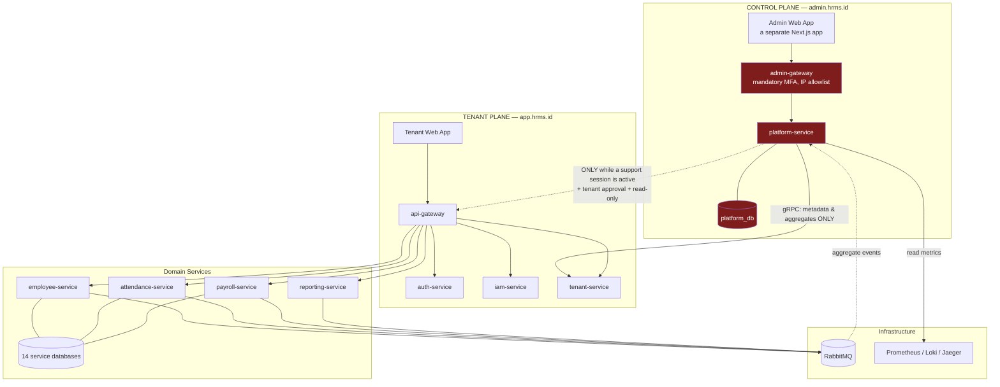

# 07 — Global (Superuser) Dashboard & Tenant Dashboard

---

## 1. The Problem Being Solved

Two dashboards are needed, with entirely different audiences and purposes:

| | Global Dashboard | Tenant Dashboard |
|---|---|---|
| User | A superuser (the SaaS provider's internal team) | The customer company's admin |
| Question it answers | "How healthy are our platform and our business?" | "How is my company's workforce doing?" |
| Data scope | Every tenant, but **metadata and aggregates only** | One tenant, complete business data |
| Example metrics | 247 active tenants, MRR Rp 412 m, 3 tenants with a DLQ backlog | 847 employees, 92% attendance today, this month's HR cost |
| Access domain | `admin.hrms.id` | `app.hrms.id` |

### 1.1 The Most Important Design Decision

**A superuser is not "a user with more permissions". A superuser is an entity on a different plane.**

The implementation temptation that must be refused:

```typescript
// ❌ NEVER — the pattern that destroys the whole security model
if (user.isSuperuser) {
  // skip the tenant filter
  return prisma.employee.findMany();          // reads EVERY tenant
}
```

```sql
-- ❌ NEVER — removing the only fail-safe layer
CREATE ROLE superuser_app LOGIN BYPASSRLS;
```

The reasons:

| Consequence | Explanation |
|-------------|-------------|
| RLS stops being fail-safe | All of document `06` rests on the claim that "if a developer forgets the tenant filter, RLS still holds". One bypass path voids that claim for the entire system |
| Maximum blast radius | One leaked superuser credential = every customer company's payroll and personal data |
| Breaches the Personal Data Protection Act | Access to personal data with no basis and without the consent of the data controller (the customer company) |
| Fails audit | SOC 2 and ISO 27001 require administrative access to customer data to be restricted and logged |

**The approach taken: plane separation.**

```
CONTROL PLANE (Global Dashboard)          TENANT PLANE (Tenant Dashboard)
├── Identity: platform_users              ├── Identity: users (per tenant)
├── Database: platform_db                 ├── Databases: 14 service databases
├── Contents: metadata, aggregates,       ├── Contents: HR business data
│   telemetry                             │
├── Gateway: admin-gateway                ├── Gateway: api-gateway
├── Domain: admin.hrms.id                 ├── Domain: app.hrms.id
├── MFA: MANDATORY                        ├── MFA: optional (Phase 2)
└── Access to tenant data: ONLY through   └── Data access: full, within its own tenant
    a tenant-approved support session
```

A superuser **holds no credentials** to `employee_db`, `payroll_db`, and so on. Not "holds them but does not use them" — genuinely does not have them. The isolation is enforced by PostgreSQL grants and NetworkPolicies, exactly like the isolation between services.

---

## 2. The Two-Plane Architecture



Note the dashed line from `platform-service` to `api-gateway`: that is the superuser's only path to tenant data, and it goes through the same gateway ordinary users do, with an impersonation token carrying an `act.sub` claim. There is no back door.

---

## 3. Superuser Identity

### 3.1 A Separate Realm

```sql
-- =====================================================================
-- platform_db  (owned by platform-service; has NO tenant_id)
-- =====================================================================
CREATE TYPE platform_role AS ENUM (
  'PLATFORM_OWNER',      -- founder/CTO: full access, including managing other superusers
  'PLATFORM_ADMIN',      -- operations: manage tenants, subscriptions, modules
  'PLATFORM_SUPPORT',    -- support: read metadata, request a support session
  'PLATFORM_FINANCE',    -- billing and revenue; no operational access
  'PLATFORM_READONLY'    -- internal auditor
);

CREATE TABLE platform_users (
  id             uuid PRIMARY KEY DEFAULT uuid_v7(),
  email          citext UNIQUE NOT NULL,
  full_name      text NOT NULL,
  password_hash  text NOT NULL,                    -- Argon2id
  role           platform_role NOT NULL,

  -- MFA IS MANDATORY. An account without MFA enabled cannot log in at all.
  mfa_secret_enc bytea,
  mfa_enabled_at timestamptz,
  mfa_recovery_codes_enc bytea,

  ip_allowlist   inet[],                           -- optional per user; empty = use the global allowlist
  is_active      boolean NOT NULL DEFAULT true,
  last_login_at  timestamptz,
  failed_attempts smallint NOT NULL DEFAULT 0,
  locked_until   timestamptz,

  created_by     uuid REFERENCES platform_users(id),
  created_at     timestamptz NOT NULL DEFAULT now(),
  deactivated_at timestamptz,

  -- A superuser account that has not set up MFA must not function
  CONSTRAINT chk_mfa_required
    CHECK (NOT is_active OR mfa_enabled_at IS NOT NULL)
);

CREATE TABLE platform_sessions (
  id                 uuid PRIMARY KEY DEFAULT uuid_v7(),
  platform_user_id   uuid NOT NULL REFERENCES platform_users(id) ON DELETE CASCADE,
  refresh_token_hash text NOT NULL,
  ip_address         inet NOT NULL,
  user_agent         text,
  mfa_verified_at    timestamptz NOT NULL,
  issued_at          timestamptz NOT NULL DEFAULT now(),
  expires_at         timestamptz NOT NULL,         -- shorter: 8 hours, not 7 days
  revoked_at         timestamptz,
  revoke_reason      text
);
CREATE UNIQUE INDEX uq_platform_session ON platform_sessions (refresh_token_hash);

-- Every superuser action is recorded, READS included
CREATE TABLE platform_audit_logs (
  id              bigint GENERATED ALWAYS AS IDENTITY,
  occurred_at     timestamptz NOT NULL DEFAULT now(),
  platform_user_id uuid NOT NULL,
  platform_user_email citext NOT NULL,             -- denormalised: still readable after the account is deleted
  action          text NOT NULL,                   -- 'tenant.suspended', 'dashboard.viewed', 'support.session.requested'
  target_type     text,
  target_id       text,
  target_tenant_id uuid,                           -- which tenant was affected (if any)
  before          jsonb,
  after           jsonb,
  ip_address      inet NOT NULL,
  user_agent      text,
  correlation_id  text,
  PRIMARY KEY (id, occurred_at)
) PARTITION BY RANGE (occurred_at);
REVOKE UPDATE, DELETE ON platform_audit_logs FROM PUBLIC;

CREATE TABLE platform_login_attempts (
  id           bigint GENERATED ALWAYS AS IDENTITY PRIMARY KEY,
  email        citext,
  succeeded    boolean NOT NULL,
  failure_reason text,
  ip_address   inet NOT NULL,
  attempted_at timestamptz NOT NULL DEFAULT now()
);
```

### 3.2 How the Authentication Controls Differ

| Control | Tenant user | Superuser |
|---------|-------------|-----------|
| Login domain | `app.hrms.id` | `admin.hrms.id` |
| Credentials | tenantCode + email + password | email + password + **TOTP** |
| MFA | Optional (Phase 2) | **Mandatory, enforced by a database constraint** |
| IP allowlist | No | **Yes** (office + VPN) |
| Access token lifetime | 15 minutes | **10 minutes** |
| Session lifetime | 7 days (30 on mobile) | **8 hours**, not extendable across days |
| Concurrent sessions | 10 | **2** |
| Lock after failures | 5× / 15 minutes | **3× / 60 minutes** |
| Logging | Login only | **Every action, including page reads** |
| Notification | New device | **Every login, to every PLATFORM_OWNER** |

```typescript
// services/platform-service/src/application/platform-login.usecase.ts
async login(cmd: PlatformLoginCommand): Promise<PlatformLoginResult> {
  // The IP allowlist is checked FIRST, before the credentials are tested at all
  if (!this.ipAllowlist.permits(cmd.ip)) {
    this.securityLog.error({ event: 'PLATFORM_LOGIN_FROM_UNKNOWN_IP', ip: cmd.ip, email: cmd.email });
    await this.alerts.critical('PLATFORM_LOGIN_BLOCKED_IP', { ip: cmd.ip, email: cmd.email });
    throw new ForbiddenException({ code: 'IP_NOT_ALLOWED' });
  }

  await this.rateLimiter.consume(`plogin:ip:${cmd.ip}`, 10, 3600);

  const user = await this.repo.findByEmail(cmd.email);
  const genericError = new UnauthorizedException({ code: 'INVALID_CREDENTIALS' });

  if (!user || !user.isActive) {
    await argon2.verify(DUMMY_HASH, cmd.password).catch(() => {});   // keep the response time equal
    await this.recordAttempt(cmd, false, 'USER_NOT_FOUND');
    throw genericError;
  }
  if (user.lockedUntil && user.lockedUntil > new Date()) {
    throw new ForbiddenException({ code: 'ACCOUNT_LOCKED', retryAfter: user.lockedUntil });
  }
  if (!await argon2.verify(user.passwordHash, cmd.password)) {
    const attempts = user.failedAttempts + 1;
    await this.repo.recordFailure(user.id, attempts,
      attempts >= 3 ? addMinutes(new Date(), 60) : null);
    if (attempts >= 3) await this.alerts.critical('PLATFORM_ACCOUNT_LOCKED', { email: cmd.email, ip: cmd.ip });
    throw genericError;
  }

  // MFA is not an optional step; no path goes around it
  if (!user.mfaEnabledAt) throw new ForbiddenException({ code: 'MFA_SETUP_REQUIRED' });
  if (!await this.totp.verify(decrypt(user.mfaSecretEnc), cmd.totpCode)) {
    await this.recordAttempt(cmd, false, 'INVALID_TOTP');
    throw genericError;
  }

  const session = await this.repo.createSession(user, cmd.ip, cmd.userAgent);

  // Every superuser login is announced to every PLATFORM_OWNER —
  // an unrecognised login has to become visible to another human immediately
  await this.notifications.notifyOwners('PLATFORM_LOGIN', {
    who: user.email, ip: cmd.ip, at: new Date(), userAgent: cmd.userAgent,
  });
  await this.audit.record(user, 'platform.login', { ip: cmd.ip });

  return { accessToken: this.signToken(user, session), refreshToken: session.rawToken };
}
```

### 3.3 The Shape of a Superuser Token

```typescript
{
  "iss": "hrms-platform",
  "aud": "hrms-admin",              // a DIFFERENT audience from a tenant token
  "sub": "018f...",                 // platformUserId
  "role": "PLATFORM_SUPPORT",
  "sessionId": "018f...",
  "mfa": true,
  "iat": 1755400000,
  "exp": 1755400600                 // 10 minutes
}
```

> **There is no `tenantId` claim.** That is deliberate and important: `api-gateway` refuses any token that lacks a `tenantId` and lacks `aud: hrms-api`. A superuser token structurally cannot be used in the tenant plane. The only exception is the impersonation token issued while a support session is active (§6), and that token **carries the `tenantId` of the tenant that approved it** plus an `act.sub` claim marking who is impersonating.

---

## 4. The Global Dashboard

### 4.1 Content Principles

**The rule:** the global dashboard shows **data about tenants**, not **data belonging to tenants**.

| May be shown | May not be shown |
|--------------|------------------|
| Employee count per tenant (a number) | The name, national ID, or any personal data of any employee |
| Total payroll cost per tenant (an aggregate, for usage anomaly detection) | Individual salaries, payslips, salary structures |
| Number of leave requests this month | The contents of a leave request, its reason, its attachments |
| Average attendance rate | Per-employee attendance records |
| Number of employee relation cases | The title, contents, or parties involved in a case |
| Enabled modules, MRR, renewal date | — |
| Technical health: error rate, queue lag, DLQ | — |

> The "aggregate vs individual" line is not safe on its own. An aggregate over a tenant with 3 employees effectively reveals individual data. That is why **any aggregate derived from fewer than 5 data subjects is suppressed** and shown as "—" (see §4.4).

### 4.2 Layout

```
┌─ RINGKASAN PLATFORM ──────────────────────────────────────────────────┐
│  Tenant aktif    Karyawan terkelola    MRR          Uji coba berjalan  │
│      247            38.412          Rp 412,3 jt          31            │
│    ▲ +12 (30h)      ▲ +2.104        ▲ +8,2%           ▼ −4             │
└───────────────────────────────────────────────────────────────────────┘

┌─ KESEHATAN SISTEM ────────────────┐  ┌─ PERLU PERHATIAN ───────────────┐
│  API p95         312 ms      ✓    │  │ ⚠ 3 tenant: DLQ menumpuk        │
│  Error rate      0,08%       ✓    │  │ ⚠ 7 tenant: langganan H-7       │
│  Antrean         142 pesan   ✓    │  │ ⚠ 2 tenant: replica drift       │
│  DLQ             14 pesan    ⚠    │  │ ⚠ 1 saga gagal kompensasi       │
│  Replica lag p95 8 dtk       ✓    │  │ ⚠ 5 tenant: kuota storage >90%  │
│  Saga macet      1           ⚠    │  │ ⚠ 12 tenant: 0 login 14 hari    │
└───────────────────────────────────┘  └─────────────────────────────────┘

┌─ PERTUMBUHAN & PENDAPATAN ────────────────────────────────────────────┐
│  [Grafik MRR 12 bulan]   [Tenant baru/churn per bulan]                │
│  Adopsi modul: attendance 94% · leave 91% · payroll 67% ·             │
│                performance 41% · claim 38% · onboarding 29% ·         │
│                recruitment 23% · hse 11%                              │
│  ⚠ onboarding di bawah ambang adopsi 30% (dok. 08 §9)                 │
└───────────────────────────────────────────────────────────────────────┘

┌─ DAFTAR TENANT ───────────────────────────────────────────────────────┐
│ Kode   Nama              Paket      Kary.  Status   Login  Kesehatan  │
│ ACME   PT Acme Indonesia ULTIMATE     847  ACTIVE     2j       ✓      │
│ GLBX   PT Globex         ADVANCED     212  ACTIVE     5j       ⚠ DLQ  │
│ INIT   CV Initech        BASIC         34  TRIAL      1h       ✓      │
│ UMBR   PT Umbrella       ADVANCED     156  SUSPENDED  12h      —      │
│                                    [Detail] [Kelola] [Minta akses]    │
└───────────────────────────────────────────────────────────────────────┘
```

The **[Minta akses]** button does not open tenant data. It opens the support session request form, which the tenant's side must approve (§6).

### 4.3 The Data Source: Event Projections, Not Cross-Tenant Queries

`platform-service` **never** queries a domain service database. It builds its own projections from aggregate events.

```sql
-- platform_db
CREATE TABLE tenant_metrics_daily (
  tenant_id          uuid NOT NULL,
  metric_date        date NOT NULL,
  employee_count     integer NOT NULL DEFAULT 0,
  active_user_count  integer NOT NULL DEFAULT 0,
  login_count        integer NOT NULL DEFAULT 0,
  punch_count        integer NOT NULL DEFAULT 0,
  leave_request_count integer NOT NULL DEFAULT 0,
  payroll_run_count  integer NOT NULL DEFAULT 0,
  payroll_total_gross numeric(18,2),          -- an aggregate; used for anomaly detection and pricing
  storage_used_mb    integer NOT NULL DEFAULT 0,
  api_request_count  bigint  NOT NULL DEFAULT 0,
  error_count        integer NOT NULL DEFAULT 0,
  PRIMARY KEY (tenant_id, metric_date)
);

CREATE TABLE tenant_health (
  tenant_id        uuid PRIMARY KEY,
  last_login_at    timestamptz,
  dlq_message_count integer NOT NULL DEFAULT 0,
  replica_lag_seconds integer,
  stuck_saga_count integer NOT NULL DEFAULT 0,
  storage_quota_pct numeric(5,2),
  error_rate_pct   numeric(6,3),
  health_status    text NOT NULL DEFAULT 'HEALTHY',   -- HEALTHY/DEGRADED/CRITICAL
  updated_at       timestamptz NOT NULL DEFAULT now()
);

CREATE TABLE platform_revenue_monthly (
  period_month     date PRIMARY KEY,
  mrr              numeric(18,2) NOT NULL DEFAULT 0,
  arr              numeric(18,2) NOT NULL DEFAULT 0,
  new_tenants      integer NOT NULL DEFAULT 0,
  churned_tenants  integer NOT NULL DEFAULT 0,
  expansion_mrr    numeric(18,2) NOT NULL DEFAULT 0,
  contraction_mrr  numeric(18,2) NOT NULL DEFAULT 0,
  computed_at      timestamptz NOT NULL DEFAULT now()
);

CREATE TABLE module_adoption (
  module_key       text NOT NULL,
  period_month     date NOT NULL,
  tenants_enabled  integer NOT NULL DEFAULT 0,
  tenants_active   integer NOT NULL DEFAULT 0,   -- genuinely used, not merely enabled
  adoption_pct     numeric(5,2),
  PRIMARY KEY (module_key, period_month)
);
```

The event consumer that fills them:

```typescript
// services/platform-service/src/projections/tenant-metrics.consumer.ts
@EventHandler([
  'employee.employee.created', 'employee.employee.terminated',
  'attendance.punch.recorded', 'leave.request.submitted',
  'payroll.run.completed', 'auth.user.logged_in', 'tenant.module.enabled',
])
export class TenantMetricsProjection extends IdempotentConsumer<any> {
  readonly consumerName = 'platform.tenant-metrics';

  protected async execute(payload: any, tx: Prisma.TransactionClient) {
    const { tenantId } = ServiceContextStore.get()!;
    const today = todayInTenantTz(tenantId);

    // Counters only. No individual identity is stored here.
    const delta = this.toDelta(payload);   // { employeeCount: +1 } or { punchCount: +1 }, etc.

    await tx.$executeRaw`
      INSERT INTO tenant_metrics_daily (tenant_id, metric_date, ${Prisma.raw(delta.column)})
      VALUES (${tenantId}::uuid, ${today}::date, ${delta.value})
      ON CONFLICT (tenant_id, metric_date) DO UPDATE
        SET ${Prisma.raw(delta.column)} = tenant_metrics_daily.${Prisma.raw(delta.column)} + ${delta.value}`;
  }
}
```

> Note what is **not** in this projection: `employeeId`, `fullName`, per-individual `amount`. The platform projection only increments counters. If a request ever arrives to add a column holding individual identity to `platform_db`, it must be refused — such a change moves personal data onto a plane that RLS does not protect.

### 4.4 The Anonymity Threshold

```typescript
// services/platform-service/src/domain/aggregate-guard.ts
const MIN_COHORT_SIZE = 5;

export function guardAggregate<T extends { subjectCount: number }>(row: T, fields: (keyof T)[]): T {
  if (row.subjectCount < MIN_COHORT_SIZE) {
    // An aggregate over fewer than 5 subjects can reveal an individual — suppress the value
    return { ...row, ...Object.fromEntries(fields.map((f) => [f, null])), suppressed: true };
  }
  return row;
}
```

A concrete example: a trial tenant with 3 employees. Showing "total payroll Rp 27.3 million" for a tenant of 3 people is the same as leaking their salary range. The dashboard shows "—" together with the note "data disembunyikan (kelompok terlalu kecil)".

### 4.5 Operational Capabilities

| Action | PLATFORM_OWNER | PLATFORM_ADMIN | PLATFORM_SUPPORT | PLATFORM_FINANCE | PLATFORM_READONLY |
|--------|:--:|:--:|:--:|:--:|:--:|
| View the global dashboard | ✓ | ✓ | ✓ | ✓ | ✓ |
| View tenant metadata detail | ✓ | ✓ | ✓ | ✓ | ✓ |
| Create / provision a tenant | ✓ | ✓ | ✗ | ✗ | ✗ |
| Change a tenant's plan & modules | ✓ | ✓ | ✗ | ✓ | ✗ |
| Suspend a tenant | ✓ | ✓ | ✗ | ✗ | ✗ |
| Purge a tenant | ✓ | ✗ | ✗ | ✗ | ✗ |
| View billing & revenue data | ✓ | ✓ | ✗ | ✓ | ✓ |
| Request a support session | ✓ | ✓ | ✓ | ✗ | ✗ |
| **Read a tenant's business data** | Only through a tenant-approved support session | as above | as above | ✗ | ✗ |
| Manage superuser accounts | ✓ | ✗ | ✗ | ✗ | ✗ |
| View the platform audit log | ✓ | ✓ | ✗ | ✗ | ✓ |

**Separation of duties in the control plane:**

```typescript
export const PLATFORM_SOD_RULES: SodRule[] = [
  { id: 'PSOD-01', description: 'A tenant purge needs 2 approvals from different PLATFORM_OWNERs',
    check: (approvals) => new Set(approvals.map(a => a.userId)).size >= 2 },

  { id: 'PSOD-02', description: 'Whoever creates a superuser account must not activate it themselves',
    check: (ctx, target) => target.createdBy !== ctx.userId },

  { id: 'PSOD-03', description: 'Whoever requests a support session must not approve it',
    check: (ctx, session) => session.requestedBy !== ctx.userId },

  { id: 'PSOD-04', description: 'PLATFORM_FINANCE must not hold operational access',
    checkOnGrant: (role, perms) =>
      role !== 'PLATFORM_FINANCE' || !perms.some(p => p.startsWith('platform.tenant.suspend')) },
];
```

---

## 5. The Tenant Dashboard

### 5.1 Access Scopes

The request specified a tenant dashboard for tenant admins only. There is one nuance that has to be decided consciously: **ordinary employees still need a home page**, but it is not the same dashboard.

| Page | User | Contents |
|------|------|----------|
| **Tenant Dashboard** | `TENANT_OWNER`, `HR_ADMIN` | The whole company: headcount, attendance, HR cost, turnover, recruitment pipeline |
| **Team Dashboard** | `LINE_MANAGER`, `DEPT_HEAD` | Limited to their unit/reports; no cost data |
| **ESS Home** | `EMPLOYEE` | Themselves only: leave balance, this month's attendance, the latest payslip, announcements |

Distinguishing the three is better than giving an employee an empty page or, worse, a company dashboard whose widgets mostly read "not authorised".

```typescript
// services/api-gateway/src/routing/route-manifest.ts (addition)
export const DASHBOARD_ROUTES: RouteRule[] = [
  { method: 'GET', path: '/api/dashboard/tenant', service: 'reporting',
    module: 'core.organization', permission: 'dashboard.tenant.view' },
  { method: 'GET', path: '/api/dashboard/team',   service: 'reporting',
    module: 'core.organization', permission: 'dashboard.team.view' },
  { method: 'GET', path: '/api/dashboard/me',     service: 'reporting',
    module: 'core.organization', permission: 'dashboard.self.view' },
];
```

```typescript
// New permissions in iam-service
const DASHBOARD_PERMISSIONS = [
  { key: 'dashboard.tenant.view', module: 'core.organization', scope: 'all',
    description: 'Melihat dashboard seluruh perusahaan' },
  { key: 'dashboard.team.view',   module: 'core.organization', scope: 'team',
    description: 'Melihat dashboard unit/tim sendiri' },
  { key: 'dashboard.self.view',   module: 'core.organization', scope: 'self',
    description: 'Melihat beranda pribadi' },
];

// Default roles
TENANT_OWNER  → dashboard.tenant.view
HR_ADMIN      → dashboard.tenant.view
DEPT_HEAD     → dashboard.team.view
LINE_MANAGER  → dashboard.team.view
EMPLOYEE      → dashboard.self.view
```

### 5.2 Widget Composition Follows the Subscription

The tenant dashboard has no fixed shape. Its widgets are assembled from the subscribed modules — reinforcing the reference product's tiering model.

```typescript
// services/reporting-service/src/dashboard/widget-registry.ts
export const TENANT_WIDGETS: WidgetDefinition[] = [
  { key: 'headcount.summary',      module: 'core.organization', permission: 'dashboard.tenant.view',
    title: 'Ringkasan Karyawan', size: 'md', refresh: 'event' },
  { key: 'attendance.today',       module: 'attendance', permission: 'dashboard.tenant.view',
    title: 'Kehadiran Hari Ini',  size: 'lg', refresh: 'realtime' },
  { key: 'attendance.trend',       module: 'attendance', permission: 'dashboard.tenant.view',
    title: 'Tren Kehadiran 30 Hari', size: 'lg', refresh: 'daily' },
  { key: 'leave.calendar',         module: 'leave', permission: 'dashboard.tenant.view',
    title: 'Kalender Cuti Minggu Ini', size: 'lg', refresh: 'event' },
  { key: 'leave.pending',          module: 'leave', permission: 'leave.request.approve',
    title: 'Menunggu Persetujuan', size: 'sm', refresh: 'realtime' },
  { key: 'payroll.cost',           module: 'payroll', permission: 'payroll.run.create',
    title: 'Biaya SDM Bulan Ini', size: 'md', refresh: 'event' },
  { key: 'payroll.upcoming',       module: 'payroll', permission: 'payroll.run.create',
    title: 'Payroll Berikutnya',  size: 'sm', refresh: 'daily' },
  { key: 'performance.progress',   module: 'performance', permission: 'dashboard.tenant.view',
    title: 'Progres Penilaian',   size: 'md', refresh: 'daily' },
  { key: 'recruitment.pipeline',   module: 'recruitment', permission: 'dashboard.tenant.view',
    title: 'Pipeline Rekrutmen',  size: 'lg', refresh: 'event' },
  { key: 'relation.open_cases',    module: 'relation', permission: 'relation.case.read',
    title: 'Kasus Terbuka',       size: 'sm', refresh: 'event' },
  { key: 'turnover.rate',          module: 'core.organization', permission: 'dashboard.tenant.view',
    title: 'Tingkat Turnover',    size: 'md', refresh: 'monthly' },
];

// Assembly: the intersection of subscription × permission
export function composeDashboard(ctx: RequestContext): WidgetDefinition[] {
  return TENANT_WIDGETS.filter(
    (w) => ctx.subscription.modules.has(w.module) && ctx.permissions.has(w.permission));
}
```

A widget from an unsubscribed module is not rendered as a widget; it appears in a separate row, "Tersedia pada paket lebih tinggi" — consistent with the separation between `menus` and `lockedModules` in `/me/bootstrap` (document `01`, §5.4).

### 5.3 The Endpoint

```typescript
// GET /api/dashboard/tenant
// Headers: Authorization + X-Tenant-ID
{
  "scope": "TENANT",
  "generatedAt": "2026-08-17T09:12:03+07:00",
  "widgets": [
    { "key": "headcount.summary", "data": {
        "total": 847, "active": 831, "onLeave": 12, "probation": 23,
        "newThisMonth": 14, "exitsThisMonth": 6 } },
    { "key": "attendance.today", "data": {
        "present": 764, "late": 41, "absent": 14, "onLeave": 12,
        "attendanceRate": 96.9, "asOf": "2026-08-17T09:00:00+07:00" } },
    { "key": "payroll.cost", "data": {
        "periodMonth": "2026-08", "totalGross": "4218450000.00",
        "totalNet": "3781200000.00", "employerCost": "612340000.00",
        "changeFromPrevMonth": 2.4 } }
  ],
  "lockedWidgets": [
    { "key": "recruitment.pipeline", "module": "recruitment",
      "teaser": "Pantau pipeline rekrutmen end-to-end", "upgradeUrl": "/settings/subscription" }
  ]
}
```

The data comes from `reporting-service` (the read model, document `02` §11) so the dashboard puts no load on the domain services. Widgets marked `refresh: 'realtime'` also subscribe to the `tenant:{id}:dashboard:*` WebSocket channels.

### 5.4 The Team Dashboard

`DEPT_HEAD` and `LINE_MANAGER` get a structurally identical dashboard, but filtered by organisational scope and **without the cost widgets**:

```typescript
// services/reporting-service/src/dashboard/team-dashboard.query.ts
async getTeamDashboard(ctx: RequestContext) {
  // orgUnitScope comes from user_roles.org_unit_ids (document 05)
  const scope = ctx.orgUnitScope;
  if (!scope.length && !ctx.permissions.has('dashboard.tenant.view')) {
    throw new ForbiddenException({ code: 'NO_ORG_SCOPE',
      message: 'Anda belum ditetapkan sebagai penanggung jawab unit mana pun.' });
  }

  const widgets = TENANT_WIDGETS.filter(
    (w) => ctx.subscription.modules.has(w.module)
        && !w.key.startsWith('payroll.')          // HR cost is not a line manager's remit
        && w.key !== 'relation.open_cases');      // disciplinary cases are handled by HR

  return this.assemble(widgets, { tenantId: ctx.tenantId, orgUnitIds: scope });
}
```

---

## 6. The Controlled Bridge: Support Sessions

The superuser's only path to a tenant's business data. The design already exists in document `06` §6; here its integration with the global dashboard is spelled out.

```mermaid
sequenceDiagram
    actor S as Superuser (SUPPORT)
    participant AD as Admin Dashboard
    participant PLAT as platform-service
    participant TEN as tenant-service
    participant TO as Tenant Owner
    participant GW as api-gateway

    S->>AD: Click [Minta akses] on tenant ACME
    AD->>PLAT: POST /platform/support-sessions<br/>{tenantId, ticketRef, reason, readOnly}
    PLAT->>PLAT: validate PSOD-03, check the role
    PLAT->>TEN: create the session request (status PENDING)
    TEN->>TO: in-app notification + email
    Note over AD: The superuser WAITS. No data is opened.

    TO->>TEN: Approve (max 4 hours, read-only)
    TEN->>PLAT: session approved
    PLAT->>PLAT: issue the impersonation token<br/>{tenantId: ACME, sub: tenantOwnerId, act: {sub: superuserId}}

    S->>GW: Access app.hrms.id with the impersonation token<br/>+ X-Tenant-ID: ACME
    GW->>GW: normal validation; detect the act.sub claim
    GW->>GW: force read-only mode, refuse every write method
    GW-->>S: tenant data (with a permanent banner)
    Note over TO: The banner in the tenant's UI:<br/>"Tim dukungan sedang mengakses akun Anda"

    loop every action
        GW->>PLAT: record to platform_audit_logs (target_tenant_id = ACME)
    end

    Note over PLAT: The session ends automatically after 4 hours
    PLAT->>TO: a summary of everything done in the session
```

```typescript
// services/api-gateway/src/guards/impersonation.guard.ts
@Injectable()
export class ImpersonationGuard implements CanActivate {
  async canActivate(ctx: ExecutionContext): Promise<boolean> {
    const req = ctx.switchToHttp().getRequest();
    const act = req.auth?.act;                       // the actor claim: the impersonation marker
    if (!act) return true;                           // an ordinary session

    const session = await this.platformClient.getSupportSession({ sessionId: act.sessionId });

    if (!session || session.endedAt || session.expiresAt < new Date()) {
      throw new UnauthorizedException({ code: 'SUPPORT_SESSION_EXPIRED' });
    }
    if (session.tenantId !== req.ctx.tenantId) {
      // The session was approved for tenant A but is being used against tenant B
      this.securityLog.error({ event: 'IMPERSONATION_TENANT_MISMATCH',
        sessionTenant: session.tenantId, requestTenant: req.ctx.tenantId, actor: act.sub });
      await this.alerts.critical('IMPERSONATION_ABUSE', { actor: act.sub });
      throw new ForbiddenException({ code: 'SESSION_TENANT_MISMATCH' });
    }
    if (session.isReadOnly && !SAFE_METHODS.includes(req.method)) {
      throw new ForbiddenException({ code: 'SUPPORT_SESSION_READ_ONLY' });
    }

    // The most sensitive modules stay closed even with an approved session,
    // unless the tenant explicitly opened them at approval time
    if (SENSITIVE_PATHS.some((p) => req.url.startsWith(p)) && !session.allowSensitive) {
      throw new ForbiddenException({ code: 'SENSITIVE_MODULE_EXCLUDED' });
    }

    await this.platformClient.recordAction({
      sessionId: act.sessionId, method: req.method, path: req.url, at: new Date() });
    return true;
  }
}

const SENSITIVE_PATHS = ['/api/payroll/payslips', '/api/relation/cases', '/api/employees/*/documents'];
const SAFE_METHODS = ['GET', 'HEAD', 'OPTIONS'];
```

---

## 7. Frontend Separation

Two separate applications, not one application with hidden menus.

```
apps/
├── web/           app.hrms.id     — the tenant application
└── admin/         admin.hrms.id   — the global dashboard
```

Why they are physically separate:

| Benefit | Explanation |
|---------|-------------|
| Separate bundles | Global dashboard code is never sent to a tenant user's browser. Nobody can read its logic looking for a way in |
| Different origins | The superuser's session cookie is unreachable from `app.hrms.id`; an XSS attack in the tenant application does not touch the superuser session |
| Stricter CSP and headers | `admin.hrms.id` can use a very strict CSP without sacrificing tenant application features |
| Network control | Cloudflare Access / IP allowlisting is applied at the domain level, before the request reaches the application |
| No conditional mistakes | With no `if (isSuperuser)` inside the tenant application, there is no condition that can be evaluated wrongly |
| No service worker | `app.hrms.id` is a PWA; `admin.hrms.id` **deliberately is not**. A service worker runs outside the page lifecycle and intercepts every network request — an attack surface not worth taking on for a control plane that needs no offline mode (doc. `11` §1.1) |

```typescript
// apps/admin/src/middleware.ts
export function middleware(req: NextRequest) {
  const res = NextResponse.next();
  res.headers.set('Content-Security-Policy',
    "default-src 'self'; script-src 'self'; style-src 'self' 'unsafe-inline'; " +
    "connect-src 'self' https://admin-api.hrms.id; frame-ancestors 'none'");
  res.headers.set('X-Frame-Options', 'DENY');
  res.headers.set('Strict-Transport-Security', 'max-age=63072000; includeSubDomains; preload');
  res.headers.set('Referrer-Policy', 'no-referrer');
  return res;
}
```

```yaml
# k8s/network-policies/platform-service.yaml
apiVersion: networking.k8s.io/v1
kind: NetworkPolicy
metadata: { name: platform-service-ingress, namespace: hrms }
spec:
  podSelector: { matchLabels: { app: platform-service } }
  policyTypes: [Ingress, Egress]
  ingress:
    - from: [{ podSelector: { matchLabels: { app: admin-gateway } } }]
      ports: [{ protocol: TCP, port: 50051 }]
  egress:
    # platform-service may ONLY reach tenant-service and its own database.
    # It has NO network path to employee-service, payroll-service, and so on.
    - to: [{ podSelector: { matchLabels: { app: tenant-service } } }]
    - to: [{ podSelector: { matchLabels: { app: postgres-platform } } }]
    - to: [{ podSelector: { matchLabels: { app: rabbitmq } } }]
    - to: [{ namespaceSelector: { matchLabels: { name: monitoring } } }]
```

> This egress NetworkPolicy is the strongest enforcement in the design: even if a bug in `platform-service` tried to call `payroll-service`, the packets would not arrive. The isolation does not depend on the code being correct.

---

## 8. Real Time for the Global Dashboard

```
/realtime-admin                              a namespace SEPARATE from the tenant /realtime
  platform:overview                          platform KPIs
  platform:health                            system health, DLQ, sagas
  platform:alerts                            alerts that need action
  platform:tenant:{tenantId}                 one tenant's status (metadata only)
```

```typescript
// services/realtime-service/src/admin-realtime.gateway.ts
@WebSocketGateway({ namespace: '/realtime-admin', transports: ['websocket'] })
export class AdminRealtimeGateway implements OnGatewayConnection {
  async handleConnection(client: Socket) {
    const claims = await this.jwt.verify(client.handshake.auth?.token);

    // The token audience decides which namespace may be entered.
    // A tenant token cannot get in here, and vice versa.
    if (claims.aud !== 'hrms-admin') {
      client.emit('error', { code: 'WRONG_AUDIENCE' });
      return client.disconnect(true);
    }
    if (!claims.mfa) {
      client.emit('error', { code: 'MFA_REQUIRED' });
      return client.disconnect(true);
    }
    if (!this.ipAllowlist.permits(client.handshake.address)) {
      return client.disconnect(true);
    }

    client.data.ctx = { platformUserId: claims.sub, role: claims.role };
    await client.join('platform:overview');
    if (['PLATFORM_OWNER', 'PLATFORM_ADMIN'].includes(claims.role)) {
      await client.join('platform:health');
      await client.join('platform:alerts');
    }
  }
}
```

---

## 9. Testing: The CI Gates

```typescript
// test/security/plane-separation.spec.ts
describe('Control plane and tenant plane separation', () => {
  it('refuses a superuser token at the tenant api-gateway', async () => {
    const { token } = await platformLogin('ops@hrms.id');
    const res = await request(apiGateway).get('/api/employees')
      .set('Authorization', `Bearer ${token}`)
      .set('X-Tenant-ID', someTenantId);
    expect(res.status).toBe(401);
    expect(res.body.code).toBe('WRONG_AUDIENCE');
  });

  it('refuses a tenant token at the admin-gateway', async () => {
    const { token } = await loginAs('acme', 'hr@acme.id');
    const res = await request(adminGateway).get('/platform/tenants')
      .set('Authorization', `Bearer ${token}`);
    expect(res.status).toBe(401);
  });

  it('platform-service cannot connect to a domain database', async () => {
    const platformUrl = process.env.PLATFORM_DATABASE_URL!;
    for (const db of ['employee_db', 'payroll_db', 'attendance_db', 'relation_db']) {
      const crossUrl = platformUrl.replace('/platform_db', `/${db}`);
      await expect(new PrismaClient({ datasources: { db: { url: crossUrl } } }).$connect())
        .rejects.toThrow(/permission denied|does not exist/i);
    }
  });

  it('platform_db holds no column containing personal data', async () => {
    // A structural gate: it stops personal data seeping onto a plane without RLS
    const forbidden = ['full_name', 'employee_name', 'email_personal', 'national_id',
                       'nik', 'npwp', 'bank_account', 'salary', 'gross_amount', 'net_amount'];
    const found = await platformPrisma.$queryRaw`
      SELECT table_name, column_name FROM information_schema.columns
       WHERE table_schema = 'public' AND column_name = ANY(${forbidden}::text[])
         AND table_name NOT IN ('platform_users','platform_audit_logs')`;
    expect(found).toEqual([]);
  });

  it('a superuser account without MFA cannot be activated', async () => {
    await expect(platformPrisma.platformUser.create({
      data: { email: 'x@hrms.id', fullName: 'X', passwordHash: 'h',
              role: 'PLATFORM_ADMIN', isActive: true, mfaEnabledAt: null },
    })).rejects.toThrow(/chk_mfa_required/);
  });

  it('refuses a superuser login from outside the allowlist before testing credentials', async () => {
    const res = await request(adminGateway).post('/platform/auth/login')
      .set('X-Forwarded-For', '203.0.113.99')
      .send({ email: 'ops@hrms.id', password: CORRECT_PASSWORD, totpCode: validTotp() });
    expect(res.status).toBe(403);
    expect(res.body.code).toBe('IP_NOT_ALLOWED');
  });
});

// test/security/support-session.spec.ts
describe('Support sessions', () => {
  it('opens no data at all before the tenant approves', async () => {
    const { token } = await platformLogin('support@hrms.id');
    const session = await requestSupportSession(token, acmeTenantId);   // status PENDING
    const res = await request(apiGateway).get('/api/employees')
      .set('Authorization', `Bearer ${session.impersonationToken ?? token}`)
      .set('X-Tenant-ID', acmeTenantId);
    expect(res.status).toBeGreaterThanOrEqual(401);
  });

  it('a session for tenant A cannot be used against tenant B', async () => {
    const impToken = await approvedSupportSession(acmeTenantId);
    const res = await request(apiGateway).get('/api/employees')
      .set('Authorization', `Bearer ${impToken}`)
      .set('X-Tenant-ID', globexTenantId);
    expect(res.status).toBe(403);
    expect(res.body.code).toBe('SESSION_TENANT_MISMATCH');
  });

  it('a read-only session refuses every write method', async () => {
    const impToken = await approvedSupportSession(acmeTenantId, { readOnly: true });
    for (const [method, path] of [['post','/api/employees'], ['patch','/api/employees/x'],
                                  ['delete','/api/employees/x']]) {
      const res = await request(apiGateway)[method](path)
        .set('Authorization', `Bearer ${impToken}`).set('X-Tenant-ID', acmeTenantId);
      expect(res.body.code).toBe('SUPPORT_SESSION_READ_ONLY');
    }
  });

  it('every impersonated action is logged with the real actor identity', async () => {
    const impToken = await approvedSupportSession(acmeTenantId);
    await request(apiGateway).get('/api/employees')
      .set('Authorization', `Bearer ${impToken}`).set('X-Tenant-ID', acmeTenantId);
    const logs = await platformPrisma.platformAuditLog.findMany({
      where: { targetTenantId: acmeTenantId } });
    expect(logs.at(-1)).toMatchObject({ platformUserEmail: 'support@hrms.id' });
  });
});

// test/security/dashboard-scope.spec.ts
describe('Tenant dashboard scopes', () => {
  it('an EMPLOYEE cannot reach the tenant dashboard', async () => {
    const { token, tenantId } = await loginAs('acme', 'budi@acme.id');   // the EMPLOYEE role
    const res = await get('/api/dashboard/tenant', token, tenantId);
    expect(res.status).toBe(403);
  });

  it('a LINE_MANAGER sees only their unit and no cost widget', async () => {
    const { token, tenantId } = await loginAs('acme', 'manager@acme.id');
    const res = await get('/api/dashboard/team', token, tenantId);
    expect(res.body.widgets.map((w) => w.key)).not.toContain('payroll.cost');
    expect(res.body.scope).toBe('TEAM');
  });

  it('suppresses an aggregate covering fewer than 5 subjects', async () => {
    const tiny = await seedTenant('tiny', { employeeCount: 3 });
    const { token } = await platformLogin('ops@hrms.id');
    const res = await request(adminGateway).get(`/platform/tenants/${tiny.id}/metrics`)
      .set('Authorization', `Bearer ${token}`);
    expect(res.body.payrollTotalGross).toBeNull();
    expect(res.body.suppressed).toBe(true);
  });
});
```

**Additional CI gates:** the pipeline fails when (a) `platform_db` has a column containing personal data, (b) `platform-service` has a code dependency or egress NetworkPolicy toward a domain service, (c) an `admin-gateway` endpoint exists without a platform role check, or (d) the cross-audience token test succeeds.

---

## 10. Impact on the Other Documents

| Document | Change |
|----------|--------|
| `01` §2.1 | Additional services: `platform-service` and `admin-gateway` (bringing the total to 18) |
| `02` | An additional database: `platform_db`, with no `tenant_id` and no RLS (because it genuinely is not tenant data) |
| `03` | A second WebSocket namespace: `/realtime-admin`; the platform projections subscribe to aggregate events |
| `05` | Additional permissions: `dashboard.tenant.view`, `dashboard.team.view`, `dashboard.self.view`; the Dashboard menu maps to all three |
| `06` §6 | Support sessions become a formal path integrated into the global dashboard |
| `04` | Phase 1 grows by 2 weeks; new risks R20–R22 |

---

## 11. Roadmap Impact

### Phase 1 (Sprints 3–4, alongside the platform services)
- `platform_db`, `platform-service`, `admin-gateway`
- Superuser authentication: password + mandatory TOTP, IP allowlist, every action audited
- The `apps/admin` application with a basic global dashboard: tenant list, KPIs, system health
- The `tenant_metrics_daily` and `tenant_health` projections built from events
- The tenant dashboard + team dashboard + ESS home page
- NetworkPolicies and the plane separation tests as CI gates

### Phase 2
- Complete support sessions with the tenant approval flow, the banner, and the post-session report
- The revenue and module adoption dashboards (`platform_revenue_monthly`, `module_adoption`)

### Phase 4
- A global dashboard integrated with the marketplace: upsell conversion, tenants likely to upgrade

**Estimate increase:** +2 weeks in Phase 1, roughly **+7 person-months** (the `platform-service` backend, the `apps/admin` frontend, and the plane separation tests). That brings the total to **±237 person-months** before the buffer, **±284** after the 20% buffer.

---

## 12. Additional Risks

| # | Risk | Prob. | Impact | Mitigation |
|---|------|-------|--------|------------|
| **R20** | Superuser credentials leak → access to all customer data | Low | **Catastrophic** | Mandatory MFA (a DB constraint), IP allowlist, 8-hour sessions, a notification of every login to every owner, and most importantly: **a superuser holds no domain database credentials**, so even a leak opens no business data without tenant approval |
| **R21** | Someone adds `BYPASSRLS` or a shortcut "to make support easier" | **Medium** | **Catastrophic** | A CI test verifies no DB role has `BYPASSRLS`; the egress NetworkPolicy blocks the path; an architecture review is mandatory for `platform-service` changes |
| **R22** | Personal data seeps into `platform_db` through a new column | Medium | High | A CI gate checks for forbidden column names; review is mandatory for `platform_db` migrations |
| **R23** | The global dashboard shows an aggregate that reveals an individual in a small tenant | Medium | Medium | The 5-subject anonymity threshold, enforced at the query layer |
| **R24** | A support session is abused (access with no legitimate reason) | Low | **Critical** | Tenant approval required, PSOD-03, read-only by default, sensitive modules excluded, a post-session report to the tenant, a permanent audit trail |
| **R25** | A tenant admin demands access to another tenant's data (a company group) | Medium | Medium | Refused architecturally. Company group needs are handled by a "multi-entity" feature inside a single tenant, not by crossing the tenant boundary |

---

## 13. Metrics

| Metric | Target |
|--------|--------|
| Superuser access to tenant data without an approved support session | **0** |
| Active superuser accounts without MFA | **0**, enforced by a constraint |
| Superuser logins from outside the allowlist | 0; every occurrence is an investigation |
| Columns holding personal data in `platform_db` | 0, verified in CI |
| Average support session duration | < 90 minutes |
| Support sessions ending without a report to the tenant | 0 |
| Global dashboard latency (p95) | < 800 ms |
| Tenant dashboard latency (p95) | < 500 ms |
| Platform metric freshness | < 5 minutes |

> The module adoption panel on the global dashboard doubles as the expansion decision gate: a module whose adoption is below 30% after 90 days signals that the next module must not start yet (document `08`, §9). Showing it on the dashboard makes that gate visible every day, not only at the quarterly planning meeting.
