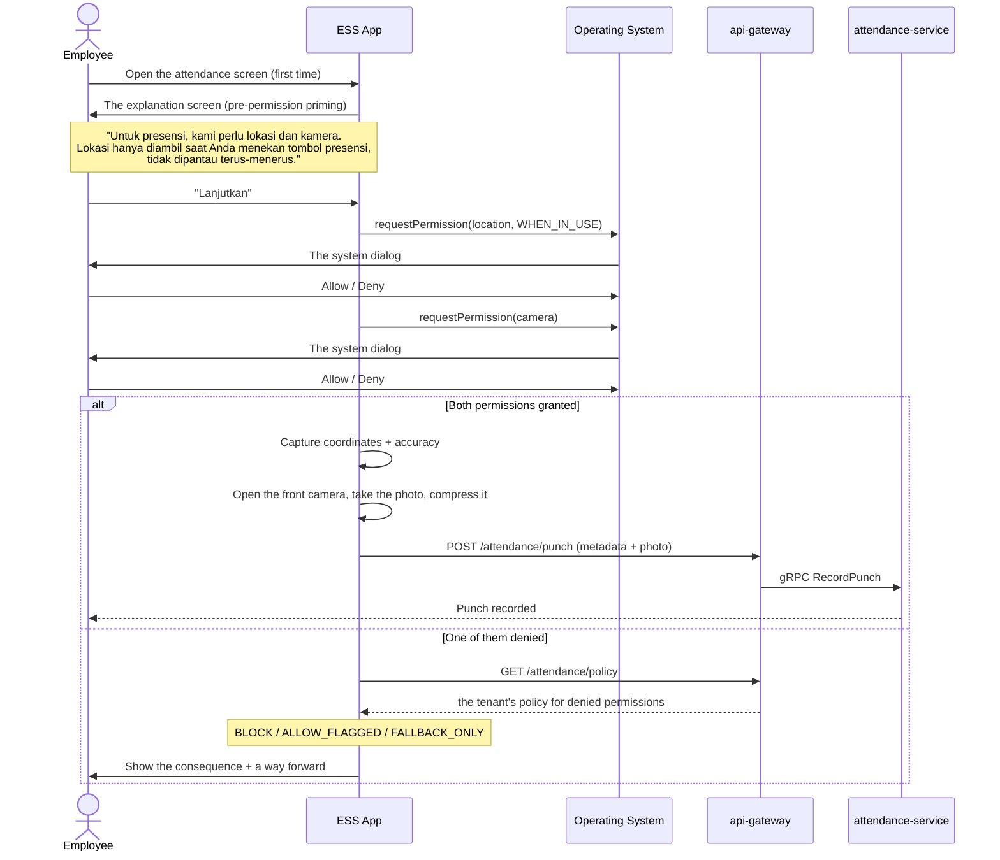

# 10 — Geolocation & Photo-Based Attendance

---

## 1. Scope & the Problem Being Solved

Punching in through an app with no evidence at all is buddy punching in digital form — easier, in fact, because no friend needs to be in the office. So every non-biometric punch captures two pieces of evidence:

1. **Location coordinates** at the moment the button is pressed
2. **A selfie** as evidence that the person in question was present

### 1.1 The Honesty Boundary That Must Be Set From the Start

Before the design, three things need saying plainly, because stakeholders often assume otherwise:

| The mistaken assumption | The reality |
|-------------------------|-------------|
| "GPS proves the employee is at the office" | Mock GPS can be installed on Android in two minutes without root. Raw coordinates are a *device claim*, not a fact |
| "The photo proves the person was there" | A photo of another phone's screen is also a photo. Without liveness detection, a photo proves there was a *picture of a face*, not that there was a *person* |
| "If both are present, it must be valid" | Both can be faked simultaneously by one motivated person |

**The design consequence:** this system is **not** built to make cheating impossible — that is unreachable without biometric hardware. It is built to make cheating **expensive, detectable, and documented**. A suspicious punch is not silently rejected; it is flagged for a human to review.

For tenants who demand high certainty, the answer is still a fingerprint or face recognition machine on site — and the integration for that already exists in `attendance-service`. Mobile punching is a complement for field workers, sales staff, and remote work, not a replacement.

---

## 2. Device Permissions

### 2.1 The Principle

**A permission denial is a normal path, not an error condition.** A user has the right to refuse camera and location access. An application that breaks or coerces will fail App Store and Play Store review, and more importantly it treats its users badly.

### 2.2 The Permission Request Flow



### 2.3 Asking Before the System Asks

The system permission dialog appears only once on iOS. If it is denied, the user has to go into Settings by hand — and most will not. So the explanation screen is shown **before** the system dialog, so an accidental denial can be prevented.

```typescript
// apps/mobile/src/features/attendance/permission-flow.ts
export async function ensureAttendancePermissions(policy: TenantAttendancePolicy) {
  // 1. Explain first, ask second.
  const primed = await showPrimingScreen({
    title: 'Presensi memerlukan lokasi dan kamera',
    points: [
      'Lokasi diambil hanya saat Anda menekan tombol presensi',
      'Aplikasi tidak memantau lokasi Anda di luar jam presensi',
      'Foto disimpan sebagai bukti kehadiran dan dihapus otomatis setelah ' +
        `${policy.photoRetentionDays} hari`,
    ],
    primaryAction: 'Lanjutkan',
    secondaryAction: 'Nanti saja',
  });
  if (!primed) return { status: 'DEFERRED' as const };

  // 2. WHEN_IN_USE, not ALWAYS. The app does not need background location,
  //    and asking for it invites both denials and questions at store review.
  const loc = await requestLocationPermission({ accuracy: 'high', background: false });
  const cam = await requestCameraPermission();

  if (loc === 'blocked' || cam === 'blocked') {
    // 'blocked' means the user once denied permanently; the system dialog
    // will not appear again. The only route is Settings.
    return { status: 'BLOCKED' as const, missing: { loc, cam }, canOpenSettings: true };
  }
  if (loc !== 'granted' || cam !== 'granted') {
    return { status: 'DENIED' as const, missing: { loc, cam } };
  }
  return { status: 'GRANTED' as const };
}
```

### 2.4 Tenant Policy When Permission Is Denied

This decision belongs to the tenant, not to the system — a construction firm and a consultancy have different answers.

| Policy | Behaviour | Suited to |
|--------|-----------|-----------|
| `BLOCK` | Mobile punching is impossible; direct the user to the attendance machine or a manual correction request | Companies with fixed work sites and attendance machines available |
| `ALLOW_FLAGGED` | The punch is still recorded, flagged `missing_evidence`, and enters the HR review queue | The recommended default — it does not obstruct work, but it does not paper over missing evidence either |
| `FALLBACK_ONLY` | A punch missing location AND photo is accepted **only from a registered office network**; everything else is recorded and flagged as under `ALLOW_FLAGGED` | Offices with a managed Wi-Fi network |

**Implemented.** The allowlist lives in `work_sites.ip_ranges inet[]`, edited on
`/attendance/sites`, and is matched with PostgreSQL's `<<=` containment operator.
Per site rather than per tenant: a company with three branches has three networks,
and a punch from the Bandung office should be recognised as a Bandung punch.

The QR-code half of the original description is **not** built.

Two rules that keep the policy honest:

- **With no network registered anywhere, `FALLBACK_ONLY` degrades to
  `ALLOW_FLAGGED`.** Refusing instead would lock out a whole company at 07:00 over
  a list they may not know exists. The degradation is shown on the settings screen
  — a policy quietly doing nothing is worse than one that does less than it says.
- **A match removes the browser penalty; it never adds score, and it never
  substitutes for the geofence.** The address proves the connection originated on
  that network, not that the person is in the building — a VPN back to the office
  satisfies it exactly.

```sql
-- Added to attendance_db, following the additive migration rules (doc. 09)
CREATE TABLE IF NOT EXISTS attendance_policies (
  tenant_id                 uuid PRIMARY KEY,
  require_location          boolean NOT NULL DEFAULT true,
  require_photo             boolean NOT NULL DEFAULT true,
  on_permission_denied      text NOT NULL DEFAULT 'ALLOW_FLAGGED'
    CHECK (on_permission_denied IN ('BLOCK','ALLOW_FLAGGED','FALLBACK_ONLY')),
  max_location_accuracy_m   integer NOT NULL DEFAULT 100,   -- reject accuracy worse than this
  allow_outside_geofence    boolean NOT NULL DEFAULT true,  -- true = allowed, but flagged
  photo_retention_days      integer NOT NULL DEFAULT 90,
  location_retention_days   integer NOT NULL DEFAULT 365,
  mock_location_action      text NOT NULL DEFAULT 'FLAG'
    CHECK (mock_location_action IN ('FLAG','REJECT')),
  rooted_device_action      text NOT NULL DEFAULT 'FLAG'
    CHECK (rooted_device_action IN ('FLAG','REJECT','IGNORE')),
  require_liveness          boolean NOT NULL DEFAULT false,
  auto_approve_threshold    smallint NOT NULL DEFAULT 80,   -- the trust score
  updated_at                timestamptz NOT NULL DEFAULT now()
);
```

### 2.5 Platform Permission Declarations

```xml
<!-- apps/mobile/android/app/src/main/AndroidManifest.xml -->
<uses-permission android:name="android.permission.CAMERA" />
<uses-permission android:name="android.permission.ACCESS_FINE_LOCATION" />
<uses-permission android:name="android.permission.ACCESS_COARSE_LOCATION" />
<!-- ACCESS_BACKGROUND_LOCATION is deliberately NOT requested: the app does not need
     background location. Asking for it triggers extra Play Store review and raises
     the denial rate. -->
<uses-feature android:name="android.hardware.camera" android:required="false" />
```

```xml
<!-- apps/mobile/ios/Info.plist -->
<key>NSCameraUsageDescription</key>
<string>Kamera digunakan untuk mengambil foto sebagai bukti kehadiran saat Anda melakukan presensi.</string>
<key>NSLocationWhenInUseUsageDescription</key>
<string>Lokasi digunakan untuk memastikan presensi dilakukan di area kerja. Lokasi hanya diambil saat Anda menekan tombol presensi.</string>
```

> A vague `UsageDescription` is a common cause of review rejection. The sentences above say **when** the data is captured, not only what it is for — that is what a reviewer looks for.

### 2.6 Punching from the Web

> **An important warning:** browser punching cannot use the three strongest signals in §5 — `isFromMockProvider`, root detection, and the Wi-Fi SSID — because there is no web API for any of them. Faking a location in a browser is even easier than on Android: DevTools → Sensors is enough. The score adjustment and its compensation (office network IP verification) are set out in document `11` §2.2 and must be implemented alongside this feature.

The browser only provides `navigator.geolocation` and `getUserMedia` in a secure context (HTTPS), and both can be denied. Because browser geolocation accuracy on a desktop depends on the IP address and is often kilometres out, **web punching does not use the geofence as a determinant**; it records the location as supplementary information only, plus office network IP verification.

---

## 3. The Data Model

Every change is additive, per document `09`. The `latitude`, `longitude`, and `selfie_key` columns already exist on `punch_logs`; what follows is the addition.

### 3.1 Extending `punch_logs`

```sql
-- attendance_db — an additive migration, safe to run repeatedly
SET lock_timeout = '3s';

ALTER TABLE punch_logs ADD COLUMN IF NOT EXISTS location_accuracy_m   numeric(8,2);
ALTER TABLE punch_logs ADD COLUMN IF NOT EXISTS altitude_m            numeric(8,2);
ALTER TABLE punch_logs ADD COLUMN IF NOT EXISTS location_provider     text;
  -- 'GPS','NETWORK','FUSED','BROWSER','IP'
ALTER TABLE punch_logs ADD COLUMN IF NOT EXISTS location_captured_at  timestamptz;
  -- When the coordinates were captured, distinct from punched_at.
  -- A large gap = stale coordinates (an old cache), an important signal.

ALTER TABLE punch_logs ADD COLUMN IF NOT EXISTS site_id               uuid;
ALTER TABLE punch_logs ADD COLUMN IF NOT EXISTS distance_from_site_m  numeric(10,2);
ALTER TABLE punch_logs ADD COLUMN IF NOT EXISTS inside_geofence       boolean;

ALTER TABLE punch_logs ADD COLUMN IF NOT EXISTS photo_file_id         uuid;
ALTER TABLE punch_logs ADD COLUMN IF NOT EXISTS photo_hash            text;
  -- SHA-256; an identical photo on two different punches = a duplicated file

ALTER TABLE punch_logs ADD COLUMN IF NOT EXISTS device_id             text;
ALTER TABLE punch_logs ADD COLUMN IF NOT EXISTS device_model          text;
ALTER TABLE punch_logs ADD COLUMN IF NOT EXISTS os_version            text;
ALTER TABLE punch_logs ADD COLUMN IF NOT EXISTS app_version           text;
ALTER TABLE punch_logs ADD COLUMN IF NOT EXISTS network_type          text;
ALTER TABLE punch_logs ADD COLUMN IF NOT EXISTS ip_address            inet;

ALTER TABLE punch_logs ADD COLUMN IF NOT EXISTS is_mock_location      boolean;
ALTER TABLE punch_logs ADD COLUMN IF NOT EXISTS is_rooted_device      boolean;
ALTER TABLE punch_logs ADD COLUMN IF NOT EXISTS trust_score           smallint;
  -- 0–100; the result of the layered assessment (§5)
ALTER TABLE punch_logs ADD COLUMN IF NOT EXISTS trust_flags           text[] NOT NULL DEFAULT '{}';
  -- 'MOCK_LOCATION','OUTSIDE_GEOFENCE','LOW_ACCURACY','IMPOSSIBLE_VELOCITY',
  -- 'STALE_LOCATION','NEW_DEVICE','SHARED_DEVICE','DUPLICATE_PHOTO',
  -- 'NO_PHOTO','NO_LOCATION','ROOTED_DEVICE','OFFLINE_SYNCED'

ALTER TABLE punch_logs ADD COLUMN IF NOT EXISTS review_status         text NOT NULL DEFAULT 'AUTO_APPROVED'
  -- No inline CHECK: use NOT VALID then VALIDATE (doc. 09 §3.3)
  ;
ALTER TABLE punch_logs ADD COLUMN IF NOT EXISTS reviewed_by           uuid;
ALTER TABLE punch_logs ADD COLUMN IF NOT EXISTS reviewed_at           timestamptz;
ALTER TABLE punch_logs ADD COLUMN IF NOT EXISTS review_note           text;

ALTER TABLE punch_logs ADD COLUMN IF NOT EXISTS captured_offline      boolean NOT NULL DEFAULT false;
ALTER TABLE punch_logs ADD COLUMN IF NOT EXISTS synced_at             timestamptz;

ALTER TABLE punch_logs
  ADD CONSTRAINT chk_review_status
  CHECK (review_status IN ('AUTO_APPROVED','NEEDS_REVIEW','APPROVED','REJECTED')) NOT VALID;
-- The next separate migration: ALTER TABLE punch_logs VALIDATE CONSTRAINT chk_review_status;
```

Indexes are created per partition, concurrently:

```sql
-- prisma-migration-config: { "transaction": false }
CREATE INDEX CONCURRENTLY IF NOT EXISTS idx_punch_review_2026m08
  ON punch_logs_2026m08 (tenant_id, review_status, punched_at DESC)
  WHERE review_status = 'NEEDS_REVIEW';

CREATE INDEX CONCURRENTLY IF NOT EXISTS idx_punch_trust_2026m08
  ON punch_logs_2026m08 (tenant_id, trust_score)
  WHERE trust_score < 80;
```

### 3.2 Work Sites & Geofences

```sql
CREATE TABLE IF NOT EXISTS work_sites (
  id              uuid PRIMARY KEY DEFAULT uuid_v7(),
  tenant_id       uuid NOT NULL,
  code            text NOT NULL,
  name            text NOT NULL,
  address         text,
  latitude        numeric(9,6) NOT NULL,
  longitude       numeric(9,6) NOT NULL,
  radius_m        integer NOT NULL DEFAULT 100 CHECK (radius_m BETWEEN 20 AND 5000),
  polygon         jsonb,               -- optional GeoJSON for non-circular areas (factories, sites)
  wifi_ssids      text[] NOT NULL DEFAULT '{}',
  ip_ranges       inet[] NOT NULL DEFAULT '{}',
  timezone        text NOT NULL DEFAULT 'Asia/Jakarta',
  is_active       boolean NOT NULL DEFAULT true,
  created_at      timestamptz NOT NULL DEFAULT now(),
  UNIQUE (tenant_id, code)
);

-- Assigning a site to an employee or unit; empty = may punch at any of the tenant's sites
CREATE TABLE IF NOT EXISTS site_assignments (
  id          uuid PRIMARY KEY DEFAULT uuid_v7(),
  tenant_id   uuid NOT NULL,
  site_id     uuid NOT NULL REFERENCES work_sites(id) ON DELETE CASCADE,
  employee_id uuid,
  org_unit_id uuid,
  effective   daterange NOT NULL DEFAULT daterange(CURRENT_DATE, NULL, '[)'),
  CONSTRAINT chk_one_target CHECK (num_nonnulls(employee_id, org_unit_id) = 1)
);
CREATE INDEX IF NOT EXISTS idx_site_assign_emp ON site_assignments (tenant_id, employee_id)
  WHERE employee_id IS NOT NULL;
```

**A note on PostGIS:** for a circular radius, the Haversine formula in plain SQL is accurate enough and avoids adding an extension dependency to 14 databases. PostGIS is only considered once complex polygons become a common requirement rather than an exception.

```sql
CREATE OR REPLACE FUNCTION haversine_m(
  lat1 numeric, lon1 numeric, lat2 numeric, lon2 numeric
) RETURNS numeric AS $$
  SELECT 6371000 * 2 * asin(sqrt(
    power(sin(radians(lat2 - lat1) / 2), 2) +
    cos(radians(lat1)) * cos(radians(lat2)) *
    power(sin(radians(lon2 - lon1) / 2), 2)
  ))::numeric;
$$ LANGUAGE sql IMMUTABLE;
```

### 3.3 Device Registration

A known device is a cheap and effective trust signal — far cheaper than face liveness detection.

```sql
CREATE TABLE IF NOT EXISTS employee_devices (
  id              uuid PRIMARY KEY DEFAULT uuid_v7(),
  tenant_id       uuid NOT NULL,
  employee_id     uuid NOT NULL,
  device_id       text NOT NULL,          -- a stable identifier per app installation
  device_model    text,
  os_version      text,
  first_seen_at   timestamptz NOT NULL DEFAULT now(),
  last_seen_at    timestamptz NOT NULL DEFAULT now(),
  punch_count     integer NOT NULL DEFAULT 0,
  is_trusted      boolean NOT NULL DEFAULT false,   -- automatically true after 10 clean punches
  is_blocked      boolean NOT NULL DEFAULT false,
  blocked_reason  text,
  UNIQUE (tenant_id, employee_id, device_id)
);

-- One device used by many employees = the most common buddy-punching pattern
CREATE INDEX IF NOT EXISTS idx_device_shared ON employee_devices (tenant_id, device_id);
```

---

## 4. The Photo Pipeline

### 4.1 The Flow

```
Client                             file-service              attendance-service
  │
  ├─ Take a photo with the FRONT camera
  ├─ Compress: max 1024px on the longest side, JPEG q=0.7 → ~120 KB
  ├─ Compute SHA-256
  ├─ Request a presigned URL ─────► POST /files/presign
  │                                   ├─ validate the tenant quota
  │                                   └─ return the URL + fileId
  ├─ Upload straight to S3 ───────► (does not pass through the backend)
  │
  └─ POST /attendance/punch ──────────────────────────────► RecordPunch
       {fileId, photoHash, lat, lng, accuracy, deviceInfo}     ├─ verify the fileId exists and belongs to the tenant
                                                               ├─ compute the geofence
                                                               ├─ score the trust
                                                               └─ store the punch_log
                                      file-service (async)
                                        ├─ strip EXIF (GPS EXIF included)
                                        ├─ verify this really is an image
                                        ├─ scan for malware
                                        └─ build a 256px thumbnail
```

**Why upload straight to S3:** attendance photos are the largest upload load in the system — 1,000 employees × 2 punches × 22 days = 44,000 files per month per tenant. Routing them through the backend means `api-gateway` handles ~44,000 multipart uploads a month per tenant for no reason.

### 4.2 Client-Side Compression

```typescript
// apps/mobile/src/features/attendance/photo-capture.ts
export async function captureAttendancePhoto(): Promise<CapturedPhoto> {
  const raw = await camera.takePhoto({
    cameraType: 'front',           // the front camera; the rear one makes photographing another screen easy
    flash: 'auto',
    qualityPrioritization: 'speed',
    enableShutterSound: true,      // a social cue: a photo is being taken, not taken covertly
  });

  // Compression on the client is mandatory. A 4 MB photo from a modern camera
  // burns the employee's data allowance and the tenant's storage for no benefit —
  // a face at 1024px is more than enough for a human to verify.
  const compressed = await ImageResizer.createResizedImage(
    raw.path, 1024, 1024, 'JPEG', 70, 0, undefined, false,
    { mode: 'contain', onlyScaleDown: true });

  const bytes = await RNFS.readFile(compressed.uri, 'base64');
  const hash  = sha256(bytes);

  return {
    uri: compressed.uri,
    sizeBytes: compressed.size,
    hash,
    capturedAt: new Date().toISOString(),
    // Metadata from the camera rather than the gallery — used to detect an uploaded old file
    isFromCamera: true,
  };
}
```

### 4.3 Stripping EXIF

A photo from a phone often carries GPS coordinates in its EXIF. Storing them creates **a second copy of the location data outside the retention policy's control**, and that is a compliance problem.

```typescript
// services/file-service/src/processors/attendance-photo.processor.ts
@EventHandler(['file.uploaded'])
export class AttendancePhotoProcessor extends IdempotentConsumer<FileUploadedEvent> {
  readonly consumerName = 'file.attendance-photo';

  protected async execute(e: FileUploadedEvent) {
    if (e.purpose !== 'ATTENDANCE_PHOTO') return;

    const buf = await this.storage.get(e.fileKey);

    // Verify this really is an image, not another kind of file named .jpg
    const type = await fileTypeFromBuffer(buf);
    if (!type || !['image/jpeg', 'image/png'].includes(type.mime)) {
      await this.storage.quarantine(e.fileKey);
      await this.publish('file.rejected', { fileId: e.fileId, reason: 'NOT_AN_IMAGE' });
      return;
    }

    // Strip ALL EXIF. We store the coordinates in a database column that is
    // subject to the retention policy; EXIF is a stray copy.
    const clean = await sharp(buf).rotate().jpeg({ quality: 75 }).toBuffer();
    await this.storage.put(e.fileKey, clean, { contentType: 'image/jpeg' });

    const thumb = await sharp(clean).resize(256, 256, { fit: 'cover' }).jpeg({ quality: 60 }).toBuffer();
    await this.storage.put(`${e.fileKey}.thumb`, thumb);

    await this.publish('file.processed', { fileId: e.fileId, sizeBytes: clean.length });
  }
}
```

### 4.4 Storage & Retention

| Parameter | Value | Reason |
|-----------|-------|--------|
| Size per photo | ~120 KB after compression | 1024px is enough for a human to verify |
| Volume per 1,000 employees | ~5.3 GB/month | 44,000 photos × 120 KB |
| Default retention | 90 days | Enough for an attendance dispute; beyond that the value is small |
| Maximum retention | 365 days | A hard limit; a tenant cannot raise it further |
| After retention | The file is deleted; `punch_logs` stays intact with `photo_deleted_at` set | Attendance history must not disappear |
| Storage class | Standard for 30 days → Infrequent Access | Old photos are almost never opened |

```sql
ALTER TABLE punch_logs ADD COLUMN IF NOT EXISTS photo_deleted_at timestamptz;
```

```typescript
// A daily job: delete photos past retention, keep their attendance records
@Cron('0 3 * * *')
async purgeExpiredPhotos() {
  for (const tenant of await this.tenants.active()) {
    const policy = await this.policies.get(tenant.id);
    const cutoff = subDays(new Date(), policy.photoRetentionDays);

    const batch = await this.repo.findPhotosOlderThan(tenant.id, cutoff, 500);
    for (const p of batch) {
      await this.fileClient.delete({ fileId: p.photoFileId });
      await this.repo.markPhotoDeleted(p.id);      // the punch_log REMAINS
    }
    metrics.increment('attendance.photos_purged', { tenant: tenant.id, count: batch.length });
  }
}
```

> **Photo retention is a privacy decision, not a storage decision.** Keeping 44,000 photos of employees' faces per month indefinitely is a liability that keeps growing — and the storage cost is the cheapest part of the problem.

---

## 5. Layered Trust Scoring

### 5.1 Why a Score Rather Than Yes/No

Automatically rejecting a punch on the strength of one signal produces two failures at once: an honest employee in a building with poor GPS is refused, while an employee using good mock GPS still gets through. So every signal contributes to a score, and **the decision threshold is configured by the tenant**.

```typescript
// services/attendance-service/src/domain/trust-scoring.ts
export function scorePunch(ctx: PunchContext): TrustAssessment {
  let score = 100;
  const flags: string[] = [];

  // ── Strong signals: device manipulation ──
  if (ctx.isMockLocation) {
    score -= 60;                                  // almost certainly deliberate
    flags.push('MOCK_LOCATION');
  }
  if (ctx.isRootedDevice) {
    score -= 15;                                  // could simply be a technical user
    flags.push('ROOTED_DEVICE');
  }

  // ── Location quality ──
  if (ctx.accuracyM == null) { score -= 25; flags.push('NO_LOCATION'); }
  else if (ctx.accuracyM > ctx.policy.maxAccuracyM) {
    score -= 15; flags.push('LOW_ACCURACY');      // indoors, this is normal
  }
  const staleness = differenceInSeconds(ctx.punchedAt, ctx.locationCapturedAt ?? ctx.punchedAt);
  if (staleness > 120) { score -= 20; flags.push('STALE_LOCATION'); }

  // ── Geofence ──
  if (ctx.assignedSite && !ctx.insideGeofence) {
    // The distance sets the weight: 50 m outside the radius is not 40 km
    const overshoot = ctx.distanceFromSiteM! - ctx.assignedSite.radiusM;
    score -= overshoot < 200 ? 10 : overshoot < 2000 ? 25 : 40;
    flags.push('OUTSIDE_GEOFENCE');
  }

  // ── Physical impossibility ──
  if (ctx.previousPunch) {
    const meters  = haversine(ctx.previousPunch, ctx);
    const seconds = differenceInSeconds(ctx.punchedAt, ctx.previousPunch.punchedAt);
    const kmh     = (meters / 1000) / (seconds / 3600);
    if (seconds > 0 && kmh > 900) {               // faster than a commercial airliner
      score -= 50; flags.push('IMPOSSIBLE_VELOCITY');
    }
  }

  // ── Device ──
  if (!ctx.device?.isTrusted)  { score -= 10; flags.push('NEW_DEVICE'); }
  if (ctx.deviceSharedWithOthers) {
    score -= 35; flags.push('SHARED_DEVICE');     // the most common buddy-punching pattern
  }

  // ── Photo ──
  if (!ctx.photoFileId)        { score -= 25; flags.push('NO_PHOTO'); }
  if (ctx.photoHashSeenBefore) { score -= 45; flags.push('DUPLICATE_PHOTO'); }
  if (!ctx.photoFromCamera)    { score -= 30; flags.push('PHOTO_FROM_GALLERY'); }

  // ── Offline sync ──
  if (ctx.capturedOffline) {
    const lag = differenceInHours(ctx.syncedAt!, ctx.punchedAt);
    if (lag > 24) { score -= 20; flags.push('LATE_OFFLINE_SYNC'); }
    else flags.push('OFFLINE_SYNCED');
  }

  score = Math.max(0, Math.min(100, score));

  const decision =
    ctx.policy.mockLocationAction === 'REJECT' && flags.includes('MOCK_LOCATION') ? 'REJECTED'
    : score >= ctx.policy.autoApproveThreshold ? 'AUTO_APPROVED'
    : 'NEEDS_REVIEW';

  return { score, flags, decision };
}
```

### 5.2 Mock Location Detection

```typescript
// apps/mobile/src/features/attendance/location-capture.ts
export async function captureLocation(policy: TenantAttendancePolicy): Promise<LocationEvidence> {
  const pos = await Geolocation.getCurrentPosition({
    enableHighAccuracy: true,
    timeout: 15_000,
    maximumAge: 0,          // MUST be 0: never accept coordinates from a cache
  });

  const isMock = Platform.OS === 'android'
    ? pos.mocked === true                     // isFromMockProvider
    : await detectIosLocationSpoof();         // iOS does not expose it; heuristics only

  return {
    latitude:  pos.coords.latitude,
    longitude: pos.coords.longitude,
    accuracyM: pos.coords.accuracy,
    altitudeM: pos.coords.altitude,
    provider:  pos.provider ?? 'FUSED',
    capturedAt: new Date(pos.timestamp).toISOString(),
    isMockLocation: isMock,
    isRootedDevice: await JailMonkey.isJailBroken(),
    // A cross-signal: a Wi-Fi SSID is far harder to fake than coordinates
    wifiSsid: await getCurrentWifiSsid().catch(() => null),
    networkType: await NetInfo.fetch().then(s => s.type),
  };
}
```

> **The honesty boundary:** `pos.mocked` on Android only catches the standard mock provider. An advanced spoofing app with an Xposed module can hide from it. This detection catches the majority of cases — someone who installed a Fake GPS app from the Play Store — not a genuinely skilled attacker. Telling a customer otherwise is a misrepresentation.

That is why **Wi-Fi SSID verification is a stronger signal** than coordinates for tenants with fixed offices: faking the office network's SSID is much harder than faking coordinates.

### 5.3 Face Liveness Detection

Scheduled as an optional capability, not part of the initial release. The honest reason: liveness that genuinely works needs either a paid SDK or a heavy on-device model, and a half-finished implementation gives a false sense of security.

| Level | Method | Cost | Phase |
|-------|--------|------|-------|
| 0 — No liveness | The photo as-is, reviewed by a human | Zero | Initial release |
| 1 — Face detection | Confirm exactly one face, large enough in frame | Low (on-device ML Kit / Vision) | Initial release |
| 2 — Passive liveness | An on-device model detects a photo-of-a-screen | Medium | The next phase |
| 3 — Active liveness | Random instructions: blink, turn right | High, intrusive | Only when a tenant asks |
| 4 — Face matching | Compare against the employee's reference photo | High + **biometric data** | Requires a legal review of its own |

Level 1 is implemented from the start because it is cheap and closes the silliest cases (a photo of the ceiling, a photo of a desk):

```typescript
const faces = await FaceDetector.detect(photo.uri, { performanceMode: 'fast' });
if (faces.length === 0) return { ok: false, reason: 'NO_FACE_DETECTED' };
if (faces.length > 1)   return { ok: false, reason: 'MULTIPLE_FACES' };
if (faces[0].bounds.width < photo.width * 0.15) return { ok: false, reason: 'FACE_TOO_SMALL' };
```

> **A legal warning for Level 4:** face matching produces a *biometric template*, which under Personal Data Protection Act No. 27/2022 counts as **specific personal data** with stricter processing requirements — including separate explicit consent and an impact assessment. This is not merely a technical feature; it changes the compliance profile of the whole product. Do not build it without a legal review.

---

## 6. Offline Punching

Field workers are often in areas without signal. Punching still has to work.

### 6.1 The Local Queue

```typescript
// apps/mobile/src/features/attendance/offline-queue.ts
export async function submitPunch(evidence: PunchEvidence) {
  const online = await NetInfo.fetch().then(s => s.isConnected && s.isInternetReachable);

  if (online) {
    try { return await api.postPunch(evidence); }
    catch (e) { if (!isNetworkError(e)) throw e; }
  }

  await offlineDb.punches.insert({
    ...evidence,
    localId: uuidv7(),
    capturedOffline: true,
    // Device time is not trusted — it can be changed by hand.
    // The monotonic clock since boot is what the server uses to detect manipulation.
    deviceUptimeMs: await getUptime(),
    queuedAt: new Date().toISOString(),
  });

  return { status: 'QUEUED', message: 'Presensi tersimpan dan akan dikirim saat ada koneksi.' };
}

// Automatic sync once the connection returns
NetInfo.addEventListener(async (state) => {
  if (!state.isConnected) return;
  const pending = await offlineDb.punches.pending();
  for (const p of pending) {
    try {
      // The server's dedupe_key prevents duplicates if the sync runs twice
      await api.postPunch({ ...p, syncedAt: new Date().toISOString() });
      await offlineDb.punches.markSynced(p.localId);
    } catch (e) { if (!isNetworkError(e)) await offlineDb.punches.markFailed(p.localId, e); }
  }
});
```

### 6.2 The Time Trust Problem

An offline punch depends on the device clock, and a device clock can be changed. How it is handled:

```typescript
// services/attendance-service/src/domain/offline-validation.ts
export function validateOfflinePunch(p: OfflinePunch): ValidationResult {
  const flags: string[] = [];

  // The punch time must not be in the future according to the server clock
  if (p.punchedAt > p.syncedAt) flags.push('FUTURE_TIMESTAMP');

  // Device uptime must be consistent: if the device claims a punch 8 hours ago
  // but has only been up for 10 minutes, its clock was probably changed
  const claimedAgeMs = p.syncedAt.getTime() - p.punchedAt.getTime();
  if (p.deviceUptimeMs < claimedAgeMs - 60_000) flags.push('UPTIME_INCONSISTENT');

  // An offline punch more than 7 days old is not accepted automatically
  if (claimedAgeMs > 7 * 86_400_000) flags.push('OFFLINE_TOO_OLD');

  return { flags, decision: flags.length ? 'NEEDS_REVIEW' : 'AUTO_APPROVED' };
}
```

---

## 7. HR Review

A punch flagged `NEEDS_REVIEW` enters a queue; it is neither lost nor silently accepted.

```
┌─ Tinjauan Presensi — 12 menunggu ─────────────────────────────────────┐
│                                                                        │
│  [foto]  Budi Santoso · 08:14 · 17 Agu 2026                Skor: 45   │
│  128×128  IN · Mobile GPS                                              │
│           ⚠ MOCK_LOCATION  ⚠ NEW_DEVICE                                │
│           📍 2,3 km dari Kantor Pusat  ·  akurasi ±8 m                 │
│           📱 Samsung SM-A536E · Android 14 · aplikasi 2.4.1            │
│           🕐 Presensi sebelumnya: kemarin 17:02, Kantor Pusat          │
│           [Peta] [Foto ukuran penuh] [Riwayat 30 hari]                 │
│                                    [Setujui] [Tolak] [Minta penjelasan]│
│                                                                        │
│  [foto]  Siti Aminah · 07:58 · 17 Agu 2026                 Skor: 70   │
│           ⚠ LOW_ACCURACY (±180 m)                                      │
│           📍 Dalam radius Kantor Cabang Bandung                        │
│           💡 Akurasi rendah umum di dalam gedung bertingkat            │
│                                    [Setujui] [Tolak] [Minta penjelasan]│
└────────────────────────────────────────────────────────────────────────┘
```

Two things make this interface work:

1. **Context, not just flags.** A hint like "low accuracy is common inside a multi-storey building" stops HR rejecting an honest punch merely because they saw a red marker.
2. **"Ask for an explanation" as the middle path.** Most anomalies have a reasonable explanation (a client visit, working from another location). Forcing HR to choose between approve and reject without asking creates conflict for no reason.

```sql
ALTER TABLE punch_logs ADD COLUMN IF NOT EXISTS explanation_requested_at timestamptz;
ALTER TABLE punch_logs ADD COLUMN IF NOT EXISTS employee_explanation     text;
ALTER TABLE punch_logs ADD COLUMN IF NOT EXISTS explained_at             timestamptz;
```

**The effect on the daily calculation:** a `NEEDS_REVIEW` punch **still counts provisionally** as present, so the dashboard does not show an employee as absent when they are merely awaiting review. If it is later rejected, `daily_records` is recomputed and `attendance.daily.recomputed` is published.

---

## 8. Privacy & Compliance

### 8.1 Data Classification

| Data | Personal Data Protection Act classification | Implication |
|------|---------------------------------------------|-------------|
| Coordinates at punch time | Personal data | Consent + purpose limitation + retention |
| The face photo (as an image) | Personal data | As above |
| The face template (at Level 4) | **Specific personal data** | Separate explicit consent, an impact assessment |
| The device identifier | Personal data | Limited retention |

### 8.2 The Binding Rules

| # | Rule | Enforcement |
|---|------|-------------|
| PR1 | Location is captured **only at punch time**, never in the background | `ACCESS_BACKGROUND_LOCATION` is not requested; verified at store review |
| PR2 | Consent is requested separately from the app's general consent, and can be withdrawn | A dedicated consent screen; withdrawal activates the `on_permission_denied` policy |
| PR3 | Photos are deleted automatically after the retention period; the attendance record stays | The daily job in §4.4 |
| PR4 | EXIF is stripped from every photo | The `file-service` pipeline in §4.3 |
| PR5 | An employee can see all of their own attendance data, photos and map included | The ESS endpoint `/attendance/me/evidence` |
| PR6 | HR access to an attendance photo is logged | The same as confidential cases in `relation-service` |
| PR7 | Photo retention is capped at 365 days; a tenant cannot raise it | A `CHECK` on `attendance_policies` |
| PR8 | Location data is not used for any other purpose (behavioural analysis, performance appraisal) | A written policy + `reporting-service` never receives raw coordinates |

```sql
CREATE TABLE IF NOT EXISTS attendance_consents (
  id            uuid PRIMARY KEY DEFAULT uuid_v7(),
  tenant_id     uuid NOT NULL,
  employee_id   uuid NOT NULL,
  consent_type  text NOT NULL CHECK (consent_type IN ('LOCATION','PHOTO','BIOMETRIC')),
  version       text NOT NULL,              -- the version of the consent text that was agreed to
  granted_at    timestamptz,
  withdrawn_at  timestamptz,
  ip_address    inet,
  UNIQUE (tenant_id, employee_id, consent_type, version)
);

CREATE TABLE IF NOT EXISTS photo_access_logs (
  id          bigint GENERATED ALWAYS AS IDENTITY PRIMARY KEY,
  tenant_id   uuid NOT NULL,
  punch_id    uuid NOT NULL,
  employee_id uuid NOT NULL,               -- the photo's subject
  accessed_by uuid NOT NULL,
  action      text NOT NULL,               -- VIEW / DOWNLOAD / EXPORT
  accessed_at timestamptz NOT NULL DEFAULT now()
);
```

PR8 deserves particular attention. Once attendance coordinates are stored, requests will appear to use them for something else — mapping a salesperson's movements, measuring how long an employee stays at the office, tying it to a performance appraisal. **Purpose limitation is not a legal formality**; it is what separates an attendance tool from a surveillance tool, and that difference decides whether employees trust the system.

---

## 9. Architectural Impact

| Component | Change |
|-----------|--------|
| `attendance-service` | Geofence computation, trust scoring, the review queue, offline validation |
| `file-service` | The `ATTENDANCE_PHOTO` file purpose: presign, strip EXIF, thumbnail, scheduled purge |
| ESS Mobile | The permission flow, the location and photo capture, the offline queue, the evidence history screen |
| `reporting-service` | Receives statuses and flags only — **it receives neither raw coordinates nor photos** (PR8) |
| `api-gateway` | The `/attendance/punch`, `/attendance/review`, `/attendance/sites` routes in `ROUTE_MANIFEST` |
| New permissions | `attendance.punch.create`, `attendance.evidence.read.self`, `attendance.evidence.read.all`, `attendance.review.approve`, `attendance.site.manage` |
| New events | `attendance.punch.flagged`, `attendance.punch.reviewed`, `attendance.photo.purged` |

```typescript
// The route manifest (doc. 01 §5.2)
{ method: 'POST', path: '/api/attendance/punch',        service: 'attendance', module: 'attendance', permission: 'attendance.punch.create' },
{ method: 'GET',  path: '/api/attendance/me/evidence',  service: 'attendance', module: 'attendance', permission: 'attendance.evidence.read.self' },
{ method: 'GET',  path: '/api/attendance/review',       service: 'attendance', module: 'attendance', permission: 'attendance.review.approve' },
{ method: 'POST', path: '/api/attendance/review/:id',   service: 'attendance', module: 'attendance', permission: 'attendance.review.approve' },
{ method: 'GET',  path: '/api/attendance/sites',        service: 'attendance', module: 'attendance', permission: 'attendance.site.manage' },
```

---

## 10. Roadmap Impact

### Phase 1, Sprints 6–9 (`attendance-service`)
- The `work_sites`, `site_assignments`, `attendance_policies`, `employee_devices` models
- Capturing coordinates plus a photo from web and mobile
- Geofence computation (Haversine), trust scoring, the HR review queue
- The photo pipeline: presign, strip EXIF, thumbnail, retention
- The consent screen and permission flow in ESS
- Level 1 face detection

### Phase 3 (ESS Mobile)
- The offline queue with time consistency validation
- Wi-Fi SSID verification as a cross-signal
- The evidence history screen for employees (PR5)

### Phase 5 (if requested)
- Level 2 passive liveness
- Complex geofence polygons (evaluate PostGIS)

**Estimate addition: ± 4 person-months**, mostly in Phase 1. The total becomes ± 268 person-months before the buffer, ± 321 after.

---

## 11. Risks

| # | Risk | Prob. | Impact | Mitigation |
|---|------|-------|--------|------------|
| **R39** | **Mock GPS evades detection; the customer believes the system is spoof-proof** | **High** | High | State the capability limits explicitly in the sales material; scoring plus human review, not an absolute claim; push Wi-Fi/attendance machines for high certainty |
| **R47** | **Browser punching is weaker still: no mock GPS detection at all** | **High** | High | A `WEB_UNVERIFIED_DEVICE` flag, a lower base score, office IP verification as compensation, the `FALLBACK_ONLY` policy (doc. `11` §2.2) |
| R40 | A photo of another phone's screen gets through | High | Medium | Level 1 face detection, the `DUPLICATE_PHOTO` and `SHARED_DEVICE` flags, liveness as a paid option |
| R41 | Employees refuse permissions en masse because they feel surveilled | Medium | High | An honest explanation screen, no background location, short retention, employee access to their own data, enforced purpose limitation |
| R42 | Photo storage costs balloon | Medium | Medium | Mandatory client compression, a 90-day default retention, tiered storage classes, a per-tenant quota |
| R43 | Poor indoor GPS accuracy produces many false flags | **High** | Medium | A tenant-configured accuracy threshold, context in the review UI, Wi-Fi/IP verification as an alternative |
| R44 | Location data is used for surveillance beyond its original purpose | Medium | **High** | PR8: `reporting-service` never receives raw coordinates; photo access is audited; a written policy |
| R45 | Face matching is built without a legal review of biometric data | Medium | **Critical** | Level 4 does not start without a Personal Data Protection Act review and separate explicit consent |
| R46 | Offline punches are manipulated by changing the device clock | Medium | Medium | Uptime validation, the 7-day limit, an `OFFLINE_SYNCED` flag that always enters review beyond 24 hours |

---

## 12. Metrics

| Metric | Target |
|--------|--------|
| Punches with complete evidence (location + photo) | ≥ 90% |
| Permission grant rate on first request | ≥ 85% |
| Punches entering `NEEDS_REVIEW` | < 8% (higher means the threshold is too strict) |
| Reviews completed within 48 hours | ≥ 95% |
| Punches flagged and then **approved** by HR | Monitored; > 70% means the scoring is too sensitive |
| Average photo size | < 150 KB |
| Photos past retention not yet deleted | 0 |
| Offline punches successfully synced | ≥ 99% |
| Photo accesses without an audit trail | 0 |
