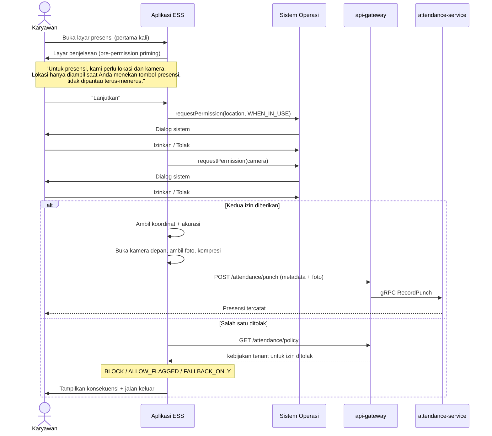

# 10 — Presensi Berbasis Geolokasi & Foto

---

## 1. Ruang Lingkup & Masalah yang Diselesaikan

Presensi lewat aplikasi tanpa bukti apa pun setara dengan titip absen versi digital — justru lebih mudah karena tidak perlu ada teman di kantor. Karena itu setiap presensi non-biometrik menangkap dua bukti:

1. **Koordinat lokasi** pada saat penekanan tombol
2. **Foto swafoto** sebagai bukti kehadiran orang yang bersangkutan

### 1.1 Batas Kejujuran yang Harus Ditetapkan Sejak Awal

Sebelum masuk desain, tiga hal perlu dinyatakan terang-terangan karena sering diasumsikan keliru oleh pemangku kepentingan:

| Asumsi yang keliru | Kenyataan |
|--------------------|-----------|
| "GPS membuktikan karyawan ada di kantor" | Mock GPS dapat dipasang di Android dalam dua menit tanpa root. Koordinat mentah adalah *klaim perangkat*, bukan fakta |
| "Foto membuktikan orangnya hadir" | Foto dari layar ponsel lain juga menghasilkan foto. Tanpa deteksi keaslian, foto membuktikan ada *gambar wajah*, bukan ada *orang* |
| "Kalau dua-duanya ada, pasti valid" | Keduanya dapat dipalsukan secara bersamaan oleh satu orang yang termotivasi |

**Konsekuensi desain:** sistem ini **tidak** dibangun untuk membuat kecurangan mustahil — itu tidak tercapai tanpa perangkat keras biometrik. Sistem dibangun untuk membuat kecurangan **mahal, terdeteksi, dan terdokumentasi**. Presensi yang mencurigakan tidak ditolak diam-diam, melainkan ditandai untuk ditinjau manusia.

Bagi tenant yang menuntut kepastian tinggi, jawabannya tetap mesin fingerprint atau face recognition di lokasi — dan integrasinya sudah ada di `attendance-service`. Presensi mobile adalah pelengkap untuk pekerja lapangan, sales, dan kerja jarak jauh, bukan penggantinya.

---

## 2. Izin Perangkat

### 2.1 Prinsip

**Penolakan izin adalah jalur normal, bukan kondisi galat.** Pengguna berhak menolak akses kamera dan lokasi. Aplikasi yang rusak atau memaksa akan ditolak review App Store dan Play Store, dan lebih penting lagi, itu perlakuan yang tidak pantas terhadap penggunanya.

### 2.2 Alur Permintaan Izin



### 2.3 Meminta Izin Sebelum Sistem Meminta

Dialog izin sistem hanya muncul sekali di iOS. Kalau ditolak, pengguna harus masuk ke Pengaturan secara manual — dan sebagian besar tidak akan melakukannya. Karena itu layar penjelasan ditampilkan **sebelum** dialog sistem, agar penolakan yang tidak disengaja bisa dicegah.

```typescript
// apps/mobile/src/features/attendance/permission-flow.ts
export async function ensureAttendancePermissions(policy: TenantAttendancePolicy) {
  // 1. Jelaskan dulu, minta kemudian.
  const primed = await showPrimingScreen({
    title: 'Presensi memerlukan lokasi dan kamera',
    points: [
      'Lokasi diambil hanya saat Anda menekan tombol presensi',
      'Aplikasi tidak memantau lokasi Anda di luar jam presensi',
      'Foto disimpan sebagai bukti kehadiran dan dihapus otomatis setelah ' +
        `${policy.photoRetentionDays} hari`,
    ],
    primaryAction: 'Lanjutkan',
    secondaryAction: 'Nanti saja',
  });
  if (!primed) return { status: 'DEFERRED' as const };

  // 2. WHEN_IN_USE, bukan ALWAYS. Aplikasi tidak butuh lokasi latar belakang,
  //    dan memintanya akan memicu penolakan sekaligus pertanyaan saat review store.
  const loc = await requestLocationPermission({ accuracy: 'high', background: false });
  const cam = await requestCameraPermission();

  if (loc === 'blocked' || cam === 'blocked') {
    // 'blocked' berarti pengguna pernah menolak permanen; dialog sistem
    // tidak akan muncul lagi. Satu-satunya jalan adalah Pengaturan.
    return { status: 'BLOCKED' as const, missing: { loc, cam }, canOpenSettings: true };
  }
  if (loc !== 'granted' || cam !== 'granted') {
    return { status: 'DENIED' as const, missing: { loc, cam } };
  }
  return { status: 'GRANTED' as const };
}
```

### 2.4 Kebijakan Tenant saat Izin Ditolak

Keputusan ini milik tenant, bukan milik sistem — perusahaan konstruksi dan perusahaan konsultan punya jawaban berbeda.

| Kebijakan | Perilaku | Cocok untuk |
|-----------|----------|-------------|
| `BLOCK` | Presensi mobile tidak dapat dilakukan sama sekali; arahkan ke mesin absensi atau ajukan koreksi manual | Perusahaan dengan lokasi kerja tetap dan mesin absensi tersedia |
| `ALLOW_FLAGGED` | Presensi tetap tercatat, ditandai `missing_evidence`, masuk antrean tinjauan HR | Default yang disarankan — tidak menghalangi pekerjaan, tetapi tidak menutupi kekurangan bukti |
| `FALLBACK_ONLY` | Presensi hanya dari jaringan kantor (IP allowlist) atau QR di lokasi | Kantor dengan Wi-Fi terkelola |

```sql
-- Ditambahkan ke attendance_db, mengikuti aturan migrasi aditif (dok. 09)
CREATE TABLE IF NOT EXISTS attendance_policies (
  tenant_id                 uuid PRIMARY KEY,
  require_location          boolean NOT NULL DEFAULT true,
  require_photo             boolean NOT NULL DEFAULT true,
  on_permission_denied      text NOT NULL DEFAULT 'ALLOW_FLAGGED'
    CHECK (on_permission_denied IN ('BLOCK','ALLOW_FLAGGED','FALLBACK_ONLY')),
  max_location_accuracy_m   integer NOT NULL DEFAULT 100,   -- tolak akurasi lebih buruk dari ini
  allow_outside_geofence    boolean NOT NULL DEFAULT true,  -- true = boleh, tapi ditandai
  photo_retention_days      integer NOT NULL DEFAULT 90,
  location_retention_days   integer NOT NULL DEFAULT 365,
  mock_location_action      text NOT NULL DEFAULT 'FLAG'
    CHECK (mock_location_action IN ('FLAG','REJECT')),
  rooted_device_action      text NOT NULL DEFAULT 'FLAG'
    CHECK (rooted_device_action IN ('FLAG','REJECT','IGNORE')),
  require_liveness          boolean NOT NULL DEFAULT false,
  auto_approve_threshold    smallint NOT NULL DEFAULT 80,   -- skor kepercayaan
  updated_at                timestamptz NOT NULL DEFAULT now()
);
```

### 2.5 Deklarasi Izin Platform

```xml
<!-- apps/mobile/android/app/src/main/AndroidManifest.xml -->
<uses-permission android:name="android.permission.CAMERA" />
<uses-permission android:name="android.permission.ACCESS_FINE_LOCATION" />
<uses-permission android:name="android.permission.ACCESS_COARSE_LOCATION" />
<!-- ACCESS_BACKGROUND_LOCATION TIDAK diminta: aplikasi tidak butuh lokasi latar belakang.
     Memintanya memicu tinjauan tambahan Play Store dan menaikkan tingkat penolakan. -->
<uses-feature android:name="android.hardware.camera" android:required="false" />
```

```xml
<!-- apps/mobile/ios/Info.plist -->
<key>NSCameraUsageDescription</key>
<string>Kamera digunakan untuk mengambil foto sebagai bukti kehadiran saat Anda melakukan presensi.</string>
<key>NSLocationWhenInUseUsageDescription</key>
<string>Lokasi digunakan untuk memastikan presensi dilakukan di area kerja. Lokasi hanya diambil saat Anda menekan tombol presensi.</string>
```

> Teks `UsageDescription` yang samar adalah penyebab penolakan review yang umum. Kalimat di atas menyebutkan **kapan** data diambil, bukan hanya untuk apa — itu yang dicari reviewer.

### 2.6 Presensi dari Web

> **Peringatan penting:** presensi dari browser tidak dapat memakai tiga sinyal terkuat di §5 — `isFromMockProvider`, deteksi root, dan SSID Wi-Fi — karena tidak ada API-nya di web. Memalsukan lokasi di browser bahkan lebih mudah daripada di Android: cukup DevTools → Sensors. Penyesuaian skor dan kompensasinya (verifikasi IP jaringan kantor) dijabarkan di dokumen `11` §2.2, dan wajib diterapkan bersamaan dengan fitur ini.

Browser hanya memberikan `navigator.geolocation` dan `getUserMedia` pada konteks aman (HTTPS), dan keduanya dapat ditolak. Karena akurasi geolokasi browser di desktop bergantung pada IP dan sering meleset kilometer, **presensi web tidak memakai geofence sebagai penentu**, melainkan hanya mencatat lokasi sebagai informasi tambahan, ditambah verifikasi IP jaringan kantor.

---

## 3. Model Data

Seluruh perubahan bersifat aditif sesuai dokumen `09`. Kolom `latitude`, `longitude`, dan `selfie_key` sudah ada di `punch_logs`; berikut penambahannya.

### 3.1 Perluasan `punch_logs`

```sql
-- attendance_db — migrasi aditif, aman dijalankan berulang
SET lock_timeout = '3s';

ALTER TABLE punch_logs ADD COLUMN IF NOT EXISTS location_accuracy_m   numeric(8,2);
ALTER TABLE punch_logs ADD COLUMN IF NOT EXISTS altitude_m            numeric(8,2);
ALTER TABLE punch_logs ADD COLUMN IF NOT EXISTS location_provider     text;
  -- 'GPS','NETWORK','FUSED','BROWSER','IP'
ALTER TABLE punch_logs ADD COLUMN IF NOT EXISTS location_captured_at  timestamptz;
  -- Waktu koordinat diambil, berbeda dari punched_at.
  -- Selisih besar = koordinat basi (cache lama), sinyal penting.

ALTER TABLE punch_logs ADD COLUMN IF NOT EXISTS site_id               uuid;
ALTER TABLE punch_logs ADD COLUMN IF NOT EXISTS distance_from_site_m  numeric(10,2);
ALTER TABLE punch_logs ADD COLUMN IF NOT EXISTS inside_geofence       boolean;

ALTER TABLE punch_logs ADD COLUMN IF NOT EXISTS photo_file_id         uuid;
ALTER TABLE punch_logs ADD COLUMN IF NOT EXISTS photo_hash            text;
  -- SHA-256; foto identik pada dua presensi berbeda = duplikasi berkas

ALTER TABLE punch_logs ADD COLUMN IF NOT EXISTS device_id             text;
ALTER TABLE punch_logs ADD COLUMN IF NOT EXISTS device_model          text;
ALTER TABLE punch_logs ADD COLUMN IF NOT EXISTS os_version            text;
ALTER TABLE punch_logs ADD COLUMN IF NOT EXISTS app_version           text;
ALTER TABLE punch_logs ADD COLUMN IF NOT EXISTS network_type          text;
ALTER TABLE punch_logs ADD COLUMN IF NOT EXISTS ip_address            inet;

ALTER TABLE punch_logs ADD COLUMN IF NOT EXISTS is_mock_location      boolean;
ALTER TABLE punch_logs ADD COLUMN IF NOT EXISTS is_rooted_device      boolean;
ALTER TABLE punch_logs ADD COLUMN IF NOT EXISTS trust_score           smallint;
  -- 0–100; hasil penilaian berlapis (§5)
ALTER TABLE punch_logs ADD COLUMN IF NOT EXISTS trust_flags           text[] NOT NULL DEFAULT '{}';
  -- 'MOCK_LOCATION','OUTSIDE_GEOFENCE','LOW_ACCURACY','IMPOSSIBLE_VELOCITY',
  -- 'STALE_LOCATION','NEW_DEVICE','SHARED_DEVICE','DUPLICATE_PHOTO',
  -- 'NO_PHOTO','NO_LOCATION','ROOTED_DEVICE','OFFLINE_SYNCED'

ALTER TABLE punch_logs ADD COLUMN IF NOT EXISTS review_status         text NOT NULL DEFAULT 'AUTO_APPROVED'
  -- Tanpa CHECK langsung: pakai NOT VALID lalu VALIDATE (dok. 09 §3.3)
  ;
ALTER TABLE punch_logs ADD COLUMN IF NOT EXISTS reviewed_by           uuid;
ALTER TABLE punch_logs ADD COLUMN IF NOT EXISTS reviewed_at           timestamptz;
ALTER TABLE punch_logs ADD COLUMN IF NOT EXISTS review_note           text;

ALTER TABLE punch_logs ADD COLUMN IF NOT EXISTS captured_offline      boolean NOT NULL DEFAULT false;
ALTER TABLE punch_logs ADD COLUMN IF NOT EXISTS synced_at             timestamptz;

ALTER TABLE punch_logs
  ADD CONSTRAINT chk_review_status
  CHECK (review_status IN ('AUTO_APPROVED','NEEDS_REVIEW','APPROVED','REJECTED')) NOT VALID;
-- Migrasi terpisah berikutnya: ALTER TABLE punch_logs VALIDATE CONSTRAINT chk_review_status;
```

Indeks dibuat per partisi secara concurrent:

```sql
-- prisma-migration-config: { "transaction": false }
CREATE INDEX CONCURRENTLY IF NOT EXISTS idx_punch_review_2026m08
  ON punch_logs_2026m08 (tenant_id, review_status, punched_at DESC)
  WHERE review_status = 'NEEDS_REVIEW';

CREATE INDEX CONCURRENTLY IF NOT EXISTS idx_punch_trust_2026m08
  ON punch_logs_2026m08 (tenant_id, trust_score)
  WHERE trust_score < 80;
```

### 3.2 Lokasi Kerja & Geofence

```sql
CREATE TABLE IF NOT EXISTS work_sites (
  id              uuid PRIMARY KEY DEFAULT uuid_v7(),
  tenant_id       uuid NOT NULL,
  code            text NOT NULL,
  name            text NOT NULL,
  address         text,
  latitude        numeric(9,6) NOT NULL,
  longitude       numeric(9,6) NOT NULL,
  radius_m        integer NOT NULL DEFAULT 100 CHECK (radius_m BETWEEN 20 AND 5000),
  polygon         jsonb,               -- GeoJSON opsional untuk area tidak bulat (pabrik, proyek)
  wifi_ssids      text[] NOT NULL DEFAULT '{}',
  ip_ranges       inet[] NOT NULL DEFAULT '{}',
  timezone        text NOT NULL DEFAULT 'Asia/Jakarta',
  is_active       boolean NOT NULL DEFAULT true,
  created_at      timestamptz NOT NULL DEFAULT now(),
  UNIQUE (tenant_id, code)
);

-- Penugasan lokasi ke karyawan atau unit; kosong = boleh presensi di lokasi mana pun milik tenant
CREATE TABLE IF NOT EXISTS site_assignments (
  id          uuid PRIMARY KEY DEFAULT uuid_v7(),
  tenant_id   uuid NOT NULL,
  site_id     uuid NOT NULL REFERENCES work_sites(id) ON DELETE CASCADE,
  employee_id uuid,
  org_unit_id uuid,
  effective   daterange NOT NULL DEFAULT daterange(CURRENT_DATE, NULL, '[)'),
  CONSTRAINT chk_one_target CHECK (num_nonnulls(employee_id, org_unit_id) = 1)
);
CREATE INDEX IF NOT EXISTS idx_site_assign_emp ON site_assignments (tenant_id, employee_id)
  WHERE employee_id IS NOT NULL;
```

**Catatan tentang PostGIS:** untuk radius lingkaran, rumus Haversine di SQL biasa sudah cukup akurat dan menghindari ketergantungan ekstensi tambahan pada 14 basis data. PostGIS baru dipertimbangkan bila poligon kompleks menjadi kebutuhan umum, bukan pengecualian.

```sql
CREATE OR REPLACE FUNCTION haversine_m(
  lat1 numeric, lon1 numeric, lat2 numeric, lon2 numeric
) RETURNS numeric AS $$
  SELECT 6371000 * 2 * asin(sqrt(
    power(sin(radians(lat2 - lat1) / 2), 2) +
    cos(radians(lat1)) * cos(radians(lat2)) *
    power(sin(radians(lon2 - lon1) / 2), 2)
  ))::numeric;
$$ LANGUAGE sql IMMUTABLE;
```

### 3.3 Registrasi Perangkat

Perangkat yang dikenal adalah sinyal kepercayaan yang murah dan efektif — jauh lebih murah daripada deteksi keaslian wajah.

```sql
CREATE TABLE IF NOT EXISTS employee_devices (
  id              uuid PRIMARY KEY DEFAULT uuid_v7(),
  tenant_id       uuid NOT NULL,
  employee_id     uuid NOT NULL,
  device_id       text NOT NULL,          -- identifier stabil per instalasi aplikasi
  device_model    text,
  os_version      text,
  first_seen_at   timestamptz NOT NULL DEFAULT now(),
  last_seen_at    timestamptz NOT NULL DEFAULT now(),
  punch_count     integer NOT NULL DEFAULT 0,
  is_trusted      boolean NOT NULL DEFAULT false,   -- otomatis true setelah 10 presensi bersih
  is_blocked      boolean NOT NULL DEFAULT false,
  blocked_reason  text,
  UNIQUE (tenant_id, employee_id, device_id)
);

-- Satu perangkat dipakai banyak karyawan = pola titip absen paling umum
CREATE INDEX IF NOT EXISTS idx_device_shared ON employee_devices (tenant_id, device_id);
```

---

## 4. Pipeline Foto

### 4.1 Alur

```
Klien                              file-service              attendance-service
  │
  ├─ Ambil foto kamera DEPAN
  ├─ Kompresi: maks 1024px sisi terpanjang, JPEG q=0.7 → ~120 KB
  ├─ Hitung SHA-256
  ├─ Minta presigned URL ─────────► POST /files/presign
  │                                   ├─ validasi kuota tenant
  │                                   └─ kembalikan URL + fileId
  ├─ Unggah langsung ke S3 ───────► (tidak melewati backend)
  │
  └─ POST /attendance/punch ──────────────────────────────► RecordPunch
       {fileId, photoHash, lat, lng, accuracy, deviceInfo}     ├─ verifikasi fileId ada & milik tenant
                                                               ├─ hitung geofence
                                                               ├─ skor kepercayaan
                                                               └─ simpan punch_log
                                      file-service (async)
                                        ├─ hapus EXIF (termasuk GPS EXIF)
                                        ├─ verifikasi ini benar-benar gambar
                                        ├─ pindai malware
                                        └─ buat thumbnail 256px
```

**Mengapa unggah langsung ke S3:** foto presensi adalah beban unggah terbesar dalam sistem — 1.000 karyawan × 2 presensi × 22 hari = 44.000 berkas per bulan per tenant. Melewatkannya melalui backend berarti `api-gateway` harus menangani ~44.000 unggahan multipart bulanan per tenant tanpa alasan.

### 4.2 Kompresi di Sisi Klien

```typescript
// apps/mobile/src/features/attendance/photo-capture.ts
export async function captureAttendancePhoto(): Promise<CapturedPhoto> {
  const raw = await camera.takePhoto({
    cameraType: 'front',           // kamera depan; kamera belakang memudahkan memotret layar lain
    flash: 'auto',
    qualityPrioritization: 'speed',
    enableShutterSound: true,      // isyarat sosial: foto sedang diambil, bukan diam-diam
  });

  // Kompresi wajib di klien. Foto 4 MB dari kamera modern akan
  // menghabiskan kuota data karyawan dan penyimpanan tenant tanpa manfaat —
  // wajah pada 1024px sudah lebih dari cukup untuk verifikasi manusia.
  const compressed = await ImageResizer.createResizedImage(
    raw.path, 1024, 1024, 'JPEG', 70, 0, undefined, false,
    { mode: 'contain', onlyScaleDown: true });

  const bytes = await RNFS.readFile(compressed.uri, 'base64');
  const hash  = sha256(bytes);

  return {
    uri: compressed.uri,
    sizeBytes: compressed.size,
    hash,
    capturedAt: new Date().toISOString(),
    // Metadata dari kamera, bukan dari galeri — dipakai mendeteksi unggahan berkas lama
    isFromCamera: true,
  };
}
```

### 4.3 Penghapusan EXIF

Foto dari ponsel sering membawa koordinat GPS di EXIF. Menyimpannya menciptakan **salinan kedua data lokasi di luar kendali kebijakan retensi**, dan itu masalah kepatuhan.

```typescript
// services/file-service/src/processors/attendance-photo.processor.ts
@EventHandler(['file.uploaded'])
export class AttendancePhotoProcessor extends IdempotentConsumer<FileUploadedEvent> {
  readonly consumerName = 'file.attendance-photo';

  protected async execute(e: FileUploadedEvent) {
    if (e.purpose !== 'ATTENDANCE_PHOTO') return;

    const buf = await this.storage.get(e.fileKey);

    // Verifikasi ini benar-benar gambar, bukan berkas lain yang diberi nama .jpg
    const type = await fileTypeFromBuffer(buf);
    if (!type || !['image/jpeg', 'image/png'].includes(type.mime)) {
      await this.storage.quarantine(e.fileKey);
      await this.publish('file.rejected', { fileId: e.fileId, reason: 'NOT_AN_IMAGE' });
      return;
    }

    // Hapus SELURUH EXIF. Kita menyimpan koordinat di kolom basis data
    // yang tunduk pada kebijakan retensi; EXIF adalah salinan liar.
    const clean = await sharp(buf).rotate().jpeg({ quality: 75 }).toBuffer();
    await this.storage.put(e.fileKey, clean, { contentType: 'image/jpeg' });

    const thumb = await sharp(clean).resize(256, 256, { fit: 'cover' }).jpeg({ quality: 60 }).toBuffer();
    await this.storage.put(`${e.fileKey}.thumb`, thumb);

    await this.publish('file.processed', { fileId: e.fileId, sizeBytes: clean.length });
  }
}
```

### 4.4 Penyimpanan & Retensi

| Parameter | Nilai | Alasan |
|-----------|-------|--------|
| Ukuran per foto | ~120 KB setelah kompresi | 1024px cukup untuk verifikasi manusia |
| Volume per 1.000 karyawan | ~5,3 GB/bulan | 44.000 foto × 120 KB |
| Retensi default | 90 hari | Cukup untuk sengketa absensi; melewati itu nilainya kecil |
| Retensi maksimum | 365 hari | Batas keras; tenant tidak dapat menaikkan lebih dari ini |
| Setelah retensi | Berkas dihapus; `punch_logs` tetap utuh dengan `photo_deleted_at` terisi | Riwayat absensi tidak boleh hilang |
| Kelas penyimpanan | Standard 30 hari → Infrequent Access | Foto lama hampir tidak pernah dibuka |

```sql
ALTER TABLE punch_logs ADD COLUMN IF NOT EXISTS photo_deleted_at timestamptz;
```

```typescript
// Job harian: hapus foto melewati retensi, pertahankan catatan presensinya
@Cron('0 3 * * *')
async purgeExpiredPhotos() {
  for (const tenant of await this.tenants.active()) {
    const policy = await this.policies.get(tenant.id);
    const cutoff = subDays(new Date(), policy.photoRetentionDays);

    const batch = await this.repo.findPhotosOlderThan(tenant.id, cutoff, 500);
    for (const p of batch) {
      await this.fileClient.delete({ fileId: p.photoFileId });
      await this.repo.markPhotoDeleted(p.id);      // punch_log TETAP ada
    }
    metrics.increment('attendance.photos_purged', { tenant: tenant.id, count: batch.length });
  }
}
```

> **Retensi foto adalah keputusan privasi, bukan keputusan penyimpanan.** Menyimpan 44.000 foto wajah karyawan per bulan tanpa batas waktu adalah liabilitas yang terus tumbuh — dan biaya penyimpanannya justru bagian termurah dari masalahnya.

---

## 5. Penilaian Kepercayaan Berlapis

### 5.1 Mengapa Skor, Bukan Ya/Tidak

Menolak presensi secara otomatis berdasarkan satu sinyal menghasilkan dua kegagalan sekaligus: karyawan jujur di gedung dengan sinyal GPS buruk ditolak, sementara karyawan yang memakai mock GPS berkualitas tetap lolos. Karena itu setiap sinyal memberi kontribusi ke skor, dan **ambang keputusannya dikonfigurasi tenant**.

```typescript
// services/attendance-service/src/domain/trust-scoring.ts
export function scorePunch(ctx: PunchContext): TrustAssessment {
  let score = 100;
  const flags: string[] = [];

  // ── Sinyal kuat: manipulasi perangkat ──
  if (ctx.isMockLocation) {
    score -= 60;                                  // hampir pasti sengaja
    flags.push('MOCK_LOCATION');
  }
  if (ctx.isRootedDevice) {
    score -= 15;                                  // bisa jadi hanya pengguna teknis
    flags.push('ROOTED_DEVICE');
  }

  // ── Kualitas lokasi ──
  if (ctx.accuracyM == null) { score -= 25; flags.push('NO_LOCATION'); }
  else if (ctx.accuracyM > ctx.policy.maxAccuracyM) {
    score -= 15; flags.push('LOW_ACCURACY');      // dalam gedung, ini wajar
  }
  const staleness = differenceInSeconds(ctx.punchedAt, ctx.locationCapturedAt ?? ctx.punchedAt);
  if (staleness > 120) { score -= 20; flags.push('STALE_LOCATION'); }

  // ── Geofence ──
  if (ctx.assignedSite && !ctx.insideGeofence) {
    // Jarak menentukan bobot: 50 m di luar radius berbeda dari 40 km
    const overshoot = ctx.distanceFromSiteM! - ctx.assignedSite.radiusM;
    score -= overshoot < 200 ? 10 : overshoot < 2000 ? 25 : 40;
    flags.push('OUTSIDE_GEOFENCE');
  }

  // ── Kemustahilan fisik ──
  if (ctx.previousPunch) {
    const meters  = haversine(ctx.previousPunch, ctx);
    const seconds = differenceInSeconds(ctx.punchedAt, ctx.previousPunch.punchedAt);
    const kmh     = (meters / 1000) / (seconds / 3600);
    if (seconds > 0 && kmh > 900) {               // lebih cepat dari pesawat komersial
      score -= 50; flags.push('IMPOSSIBLE_VELOCITY');
    }
  }

  // ── Perangkat ──
  if (!ctx.device?.isTrusted)  { score -= 10; flags.push('NEW_DEVICE'); }
  if (ctx.deviceSharedWithOthers) {
    score -= 35; flags.push('SHARED_DEVICE');     // pola titip absen paling umum
  }

  // ── Foto ──
  if (!ctx.photoFileId)        { score -= 25; flags.push('NO_PHOTO'); }
  if (ctx.photoHashSeenBefore) { score -= 45; flags.push('DUPLICATE_PHOTO'); }
  if (!ctx.photoFromCamera)    { score -= 30; flags.push('PHOTO_FROM_GALLERY'); }

  // ── Sinkronisasi luring ──
  if (ctx.capturedOffline) {
    const lag = differenceInHours(ctx.syncedAt!, ctx.punchedAt);
    if (lag > 24) { score -= 20; flags.push('LATE_OFFLINE_SYNC'); }
    else flags.push('OFFLINE_SYNCED');
  }

  score = Math.max(0, Math.min(100, score));

  const decision =
    ctx.policy.mockLocationAction === 'REJECT' && flags.includes('MOCK_LOCATION') ? 'REJECTED'
    : score >= ctx.policy.autoApproveThreshold ? 'AUTO_APPROVED'
    : 'NEEDS_REVIEW';

  return { score, flags, decision };
}
```

### 5.2 Deteksi Mock Location

```typescript
// apps/mobile/src/features/attendance/location-capture.ts
export async function captureLocation(policy: TenantAttendancePolicy): Promise<LocationEvidence> {
  const pos = await Geolocation.getCurrentPosition({
    enableHighAccuracy: true,
    timeout: 15_000,
    maximumAge: 0,          // WAJIB 0: jangan pernah menerima koordinat dari cache
  });

  const isMock = Platform.OS === 'android'
    ? pos.mocked === true                     // isFromMockProvider
    : await detectIosLocationSpoof();         // iOS tidak mengeksposnya; heuristik saja

  return {
    latitude:  pos.coords.latitude,
    longitude: pos.coords.longitude,
    accuracyM: pos.coords.accuracy,
    altitudeM: pos.coords.altitude,
    provider:  pos.provider ?? 'FUSED',
    capturedAt: new Date(pos.timestamp).toISOString(),
    isMockLocation: isMock,
    isRootedDevice: await JailMonkey.isJailBroken(),
    // Sinyal silang: SSID Wi-Fi jauh lebih sulit dipalsukan daripada koordinat
    wifiSsid: await getCurrentWifiSsid().catch(() => null),
    networkType: await NetInfo.fetch().then(s => s.type),
  };
}
```

> **Batas kejujuran:** `pos.mocked` pada Android hanya menangkap mock provider standar. Aplikasi spoofing tingkat lanjut dengan modul Xposed dapat menyembunyikannya. Deteksi ini menangkap mayoritas kasus — orang yang memasang aplikasi Fake GPS dari Play Store — bukan penyerang yang benar-benar terampil. Menyatakan sebaliknya kepada pelanggan adalah salah representasi.

Karena itu **verifikasi SSID Wi-Fi adalah sinyal yang lebih kuat** daripada koordinat bagi tenant dengan kantor tetap: memalsukan SSID jaringan kantor jauh lebih sulit daripada memalsukan koordinat.

### 5.3 Deteksi Keaslian Wajah (Liveness)

Dijadwalkan sebagai kemampuan opsional, bukan bagian rilis awal. Alasannya jujur: liveness yang benar-benar bekerja memerlukan SDK berbayar atau model on-device yang berat, dan implementasi setengah jadi memberi rasa aman yang keliru.

| Tingkat | Cara | Biaya | Fase |
|---------|------|-------|------|
| 0 — Tanpa liveness | Foto apa adanya, manusia yang meninjau | Nol | Rilis awal |
| 1 — Deteksi wajah | Pastikan ada tepat satu wajah dan cukup besar dalam bingkai | Rendah (ML Kit / Vision on-device) | Rilis awal |
| 2 — Liveness pasif | Model on-device mendeteksi foto-dari-layar | Menengah | Fase berikutnya |
| 3 — Liveness aktif | Instruksi acak: kedip, tengok kanan | Tinggi, mengganggu | Hanya bila diminta tenant |
| 4 — Pencocokan wajah | Bandingkan dengan foto acuan karyawan | Tinggi + **data biometrik** | Perlu kajian hukum tersendiri |

Tingkat 1 sudah diterapkan sejak awal karena murah dan menutup kasus paling konyol (foto langit-langit, foto meja):

```typescript
const faces = await FaceDetector.detect(photo.uri, { performanceMode: 'fast' });
if (faces.length === 0) return { ok: false, reason: 'NO_FACE_DETECTED' };
if (faces.length > 1)   return { ok: false, reason: 'MULTIPLE_FACES' };
if (faces[0].bounds.width < photo.width * 0.15) return { ok: false, reason: 'FACE_TOO_SMALL' };
```

> **Peringatan hukum untuk Tingkat 4:** pencocokan wajah menghasilkan *template biometrik*, yang di bawah UU PDP No. 27/2022 termasuk **data pribadi spesifik** dengan persyaratan pemrosesan lebih ketat — termasuk persetujuan eksplisit terpisah dan penilaian dampak. Ini bukan sekadar fitur teknis; ia mengubah profil kepatuhan seluruh produk. Jangan dibangun tanpa kajian hukum.

---

## 6. Presensi Luring (Offline)

Pekerja lapangan sering berada di area tanpa sinyal. Presensi harus tetap bisa dilakukan.

### 6.1 Antrean Lokal

```typescript
// apps/mobile/src/features/attendance/offline-queue.ts
export async function submitPunch(evidence: PunchEvidence) {
  const online = await NetInfo.fetch().then(s => s.isConnected && s.isInternetReachable);

  if (online) {
    try { return await api.postPunch(evidence); }
    catch (e) { if (!isNetworkError(e)) throw e; }
  }

  await offlineDb.punches.insert({
    ...evidence,
    localId: uuidv7(),
    capturedOffline: true,
    // Waktu perangkat tidak tepercaya — bisa diubah manual.
    // Jam monotonik sejak boot dipakai server untuk mendeteksi manipulasi.
    deviceUptimeMs: await getUptime(),
    queuedAt: new Date().toISOString(),
  });

  return { status: 'QUEUED', message: 'Presensi tersimpan dan akan dikirim saat ada koneksi.' };
}

// Sinkronisasi otomatis saat koneksi pulih
NetInfo.addEventListener(async (state) => {
  if (!state.isConnected) return;
  const pending = await offlineDb.punches.pending();
  for (const p of pending) {
    try {
      // dedupe_key di server mencegah duplikat bila sinkronisasi berjalan dua kali
      await api.postPunch({ ...p, syncedAt: new Date().toISOString() });
      await offlineDb.punches.markSynced(p.localId);
    } catch (e) { if (!isNetworkError(e)) await offlineDb.punches.markFailed(p.localId, e); }
  }
});
```

### 6.2 Masalah Kepercayaan Waktu

Presensi luring bergantung pada jam perangkat, dan jam perangkat dapat diubah. Penanganannya:

```typescript
// services/attendance-service/src/domain/offline-validation.ts
export function validateOfflinePunch(p: OfflinePunch): ValidationResult {
  const flags: string[] = [];

  // Waktu presensi tidak boleh di masa depan menurut jam server
  if (p.punchedAt > p.syncedAt) flags.push('FUTURE_TIMESTAMP');

  // Uptime perangkat harus konsisten: bila perangkat mengklaim presensi 8 jam lalu
  // tetapi uptime-nya baru 10 menit, jamnya kemungkinan diubah
  const claimedAgeMs = p.syncedAt.getTime() - p.punchedAt.getTime();
  if (p.deviceUptimeMs < claimedAgeMs - 60_000) flags.push('UPTIME_INCONSISTENT');

  // Presensi luring lebih dari 7 hari tidak diterima otomatis
  if (claimedAgeMs > 7 * 86_400_000) flags.push('OFFLINE_TOO_OLD');

  return { flags, decision: flags.length ? 'NEEDS_REVIEW' : 'AUTO_APPROVED' };
}
```

---

## 7. Tinjauan oleh HR

Presensi bertanda `NEEDS_REVIEW` masuk antrean, tidak hilang dan tidak diterima diam-diam.

```
┌─ Tinjauan Presensi — 12 menunggu ─────────────────────────────────────┐
│                                                                        │
│  [foto]  Budi Santoso · 08:14 · 17 Agu 2026                Skor: 45   │
│  128×128  IN · Mobile GPS                                              │
│           ⚠ MOCK_LOCATION  ⚠ NEW_DEVICE                                │
│           📍 2,3 km dari Kantor Pusat  ·  akurasi ±8 m                 │
│           📱 Samsung SM-A536E · Android 14 · aplikasi 2.4.1            │
│           🕐 Presensi sebelumnya: kemarin 17:02, Kantor Pusat          │
│           [Peta] [Foto ukuran penuh] [Riwayat 30 hari]                 │
│                                    [Setujui] [Tolak] [Minta penjelasan]│
│                                                                        │
│  [foto]  Siti Aminah · 07:58 · 17 Agu 2026                 Skor: 70   │
│           ⚠ LOW_ACCURACY (±180 m)                                      │
│           📍 Dalam radius Kantor Cabang Bandung                        │
│           💡 Akurasi rendah umum di dalam gedung bertingkat            │
│                                    [Setujui] [Tolak] [Minta penjelasan]│
└────────────────────────────────────────────────────────────────────────┘
```

Dua hal yang membuat antarmuka ini berfungsi:

1. **Konteks, bukan hanya tanda.** Petunjuk seperti "akurasi rendah umum di dalam gedung" mencegah HR menolak presensi jujur hanya karena melihat tanda merah.
2. **"Minta penjelasan" sebagai jalan tengah.** Sebagian besar anomali punya penjelasan wajar (kunjungan klien, kerja dari lokasi lain). Memaksa HR memilih antara setuju dan tolak tanpa bertanya menciptakan konflik yang tidak perlu.

```sql
ALTER TABLE punch_logs ADD COLUMN IF NOT EXISTS explanation_requested_at timestamptz;
ALTER TABLE punch_logs ADD COLUMN IF NOT EXISTS employee_explanation     text;
ALTER TABLE punch_logs ADD COLUMN IF NOT EXISTS explained_at             timestamptz;
```

**Dampak ke perhitungan harian:** presensi `NEEDS_REVIEW` **tetap dihitung sementara** sebagai hadir agar dashboard tidak menampilkan karyawan sebagai absen padahal hanya menunggu tinjauan. Bila kemudian ditolak, `daily_records` dihitung ulang dan `attendance.daily.recomputed` diterbitkan.

---

## 8. Privasi & Kepatuhan

### 8.1 Klasifikasi Data

| Data | Klasifikasi UU PDP | Implikasi |
|------|-------------------|-----------|
| Koordinat saat presensi | Data pribadi | Persetujuan + pembatasan tujuan + retensi |
| Foto wajah (sebagai gambar) | Data pribadi | Idem |
| Template wajah (bila Tingkat 4) | **Data pribadi spesifik** | Persetujuan eksplisit terpisah, penilaian dampak |
| Identifier perangkat | Data pribadi | Retensi terbatas |

### 8.2 Aturan yang Mengikat

| # | Aturan | Penegakan |
|---|--------|-----------|
| PR1 | Lokasi diambil **hanya pada saat presensi**, tidak pernah di latar belakang | `ACCESS_BACKGROUND_LOCATION` tidak diminta; diverifikasi saat review store |
| PR2 | Persetujuan diminta terpisah dari persetujuan umum aplikasi, dan dapat ditarik | Layar persetujuan khusus; penarikan mengaktifkan kebijakan `on_permission_denied` |
| PR3 | Foto dihapus otomatis setelah masa retensi; catatan presensi tetap | Job harian §4.4 |
| PR4 | EXIF dihapus dari setiap foto | Pipeline `file-service` §4.3 |
| PR5 | Karyawan dapat melihat seluruh data presensi dirinya, termasuk foto dan peta | Endpoint ESS `/attendance/me/evidence` |
| PR6 | Akses HR ke foto presensi dicatat | Sama seperti kasus rahasia di `relation-service` |
| PR7 | Retensi maksimum foto 365 hari; tenant tidak dapat menaikkannya | `CHECK` pada `attendance_policies` |
| PR8 | Data lokasi tidak dipakai untuk tujuan lain (analisis perilaku, penilaian kinerja) | Kebijakan tertulis + `reporting-service` tidak menerima koordinat mentah |

```sql
CREATE TABLE IF NOT EXISTS attendance_consents (
  id            uuid PRIMARY KEY DEFAULT uuid_v7(),
  tenant_id     uuid NOT NULL,
  employee_id   uuid NOT NULL,
  consent_type  text NOT NULL CHECK (consent_type IN ('LOCATION','PHOTO','BIOMETRIC')),
  version       text NOT NULL,              -- versi teks persetujuan yang disetujui
  granted_at    timestamptz,
  withdrawn_at  timestamptz,
  ip_address    inet,
  UNIQUE (tenant_id, employee_id, consent_type, version)
);

CREATE TABLE IF NOT EXISTS photo_access_logs (
  id          bigint GENERATED ALWAYS AS IDENTITY PRIMARY KEY,
  tenant_id   uuid NOT NULL,
  punch_id    uuid NOT NULL,
  employee_id uuid NOT NULL,               -- pemilik foto
  accessed_by uuid NOT NULL,
  action      text NOT NULL,               -- VIEW / DOWNLOAD / EXPORT
  accessed_at timestamptz NOT NULL DEFAULT now()
);
```

PR8 patut diperhatikan khusus. Begitu koordinat presensi tersimpan, akan muncul permintaan memakainya untuk hal lain — memetakan pergerakan sales, mengukur berapa lama karyawan di kantor, menghubungkannya dengan penilaian kinerja. **Pembatasan tujuan bukan formalitas hukum**; ia yang membedakan alat presensi dari alat pengawasan, dan perbedaan itu menentukan apakah karyawan mempercayai sistemnya.

---

## 9. Dampak Arsitektur

| Komponen | Perubahan |
|----------|-----------|
| `attendance-service` | Perhitungan geofence, penilaian kepercayaan, antrean tinjauan, validasi luring |
| `file-service` | Tujuan berkas `ATTENDANCE_PHOTO`: presign, hapus EXIF, thumbnail, purge terjadwal |
| ESS Mobile | Alur izin, penangkap lokasi & foto, antrean luring, layar riwayat bukti |
| `reporting-service` | Menerima status dan tanda saja — **tidak menerima koordinat mentah maupun foto** (PR8) |
| `api-gateway` | Route `/attendance/punch`, `/attendance/review`, `/attendance/sites` di `ROUTE_MANIFEST` |
| Permission baru | `attendance.punch.create`, `attendance.evidence.read.self`, `attendance.evidence.read.all`, `attendance.review.approve`, `attendance.site.manage` |
| Event baru | `attendance.punch.flagged`, `attendance.punch.reviewed`, `attendance.photo.purged` |

```typescript
// Route manifest (dok. 01 §5.2)
{ method: 'POST', path: '/api/attendance/punch',        service: 'attendance', module: 'attendance', permission: 'attendance.punch.create' },
{ method: 'GET',  path: '/api/attendance/me/evidence',  service: 'attendance', module: 'attendance', permission: 'attendance.evidence.read.self' },
{ method: 'GET',  path: '/api/attendance/review',       service: 'attendance', module: 'attendance', permission: 'attendance.review.approve' },
{ method: 'POST', path: '/api/attendance/review/:id',   service: 'attendance', module: 'attendance', permission: 'attendance.review.approve' },
{ method: 'GET',  path: '/api/attendance/sites',        service: 'attendance', module: 'attendance', permission: 'attendance.site.manage' },
```

---

## 10. Dampak Roadmap

### Fase 1, Sprint 6–9 (`attendance-service`)
- Model `work_sites`, `site_assignments`, `attendance_policies`, `employee_devices`
- Penangkapan koordinat + foto dari web dan mobile
- Perhitungan geofence (Haversine), penilaian kepercayaan, antrean tinjauan HR
- Pipeline foto: presign, hapus EXIF, thumbnail, retensi
- Layar persetujuan & alur izin di ESS
- Deteksi wajah Tingkat 1

### Fase 3 (ESS Mobile)
- Antrean luring dengan validasi konsistensi waktu
- Verifikasi SSID Wi-Fi sebagai sinyal silang
- Layar riwayat bukti untuk karyawan (PR5)

### Fase 5 (bila diminta)
- Liveness pasif Tingkat 2
- Poligon geofence kompleks (evaluasi PostGIS)

**Tambahan estimasi: ± 4 person-month**, sebagian besar di Fase 1. Total menjadi ± 268 person-month sebelum buffer, ± 321 sesudah.

---

## 11. Risiko

| # | Risiko | Prob. | Dampak | Mitigasi |
|---|--------|-------|--------|----------|
| **R39** | **Mock GPS lolos deteksi; pelanggan mengira sistem antipalsu** | **Tinggi** | Tinggi | Nyatakan batas kemampuan secara eksplisit dalam materi penjualan; skor + tinjauan manusia, bukan klaim mutlak; dorong Wi-Fi/mesin absensi untuk kepastian tinggi |
| **R47** | **Presensi dari browser lebih lemah lagi: tidak ada deteksi mock GPS sama sekali** | **Tinggi** | Tinggi | Tanda `WEB_UNVERIFIED_DEVICE`, skor dasar lebih rendah, verifikasi IP kantor sebagai kompensasi, kebijakan `FALLBACK_ONLY` (dok. `11` §2.2) |
| R40 | Foto dari layar ponsel lain lolos | Tinggi | Sedang | Deteksi wajah Tingkat 1, tanda `DUPLICATE_PHOTO` dan `SHARED_DEVICE`, liveness sebagai opsi berbayar |
| R41 | Karyawan menolak izin secara massal karena merasa diawasi | Sedang | Tinggi | Layar penjelasan jujur, tanpa lokasi latar belakang, retensi pendek, akses karyawan ke datanya sendiri, pembatasan tujuan yang ditegakkan |
| R42 | Biaya penyimpanan foto membengkak | Sedang | Sedang | Kompresi klien wajib, retensi 90 hari default, kelas penyimpanan berjenjang, kuota per tenant |
| R43 | Akurasi GPS buruk di dalam gedung menghasilkan banyak tanda palsu | **Tinggi** | Sedang | Ambang akurasi dikonfigurasi tenant, konteks di UI tinjauan, verifikasi Wi-Fi/IP sebagai alternatif |
| R44 | Data lokasi dipakai untuk pengawasan di luar tujuan awal | Sedang | **Tinggi** | PR8: `reporting-service` tidak menerima koordinat mentah; akses foto teraudit; kebijakan tertulis |
| R45 | Fitur pencocokan wajah dibangun tanpa kajian hukum data biometrik | Sedang | **Kritis** | Tingkat 4 tidak dimulai tanpa kajian UU PDP dan persetujuan eksplisit terpisah |
| R46 | Presensi luring dimanipulasi lewat pengubahan jam perangkat | Sedang | Sedang | Validasi uptime, batas 7 hari, tanda `OFFLINE_SYNCED` selalu masuk tinjauan bila > 24 jam |

---

## 12. Metrik

| Metrik | Target |
|--------|--------|
| Presensi dengan bukti lengkap (lokasi + foto) | ≥ 90% |
| Tingkat pemberian izin saat pertama diminta | ≥ 85% |
| Presensi masuk `NEEDS_REVIEW` | < 8% (lebih tinggi berarti ambang terlalu ketat) |
| Tinjauan diselesaikan dalam 48 jam | ≥ 95% |
| Presensi ditandai lalu **disetujui** HR | Dipantau; > 70% berarti penilaian terlalu sensitif |
| Ukuran rata-rata foto | < 150 KB |
| Foto melewati retensi yang belum terhapus | 0 |
| Presensi luring berhasil tersinkron | ≥ 99% |
| Akses foto tanpa jejak audit | 0 |
