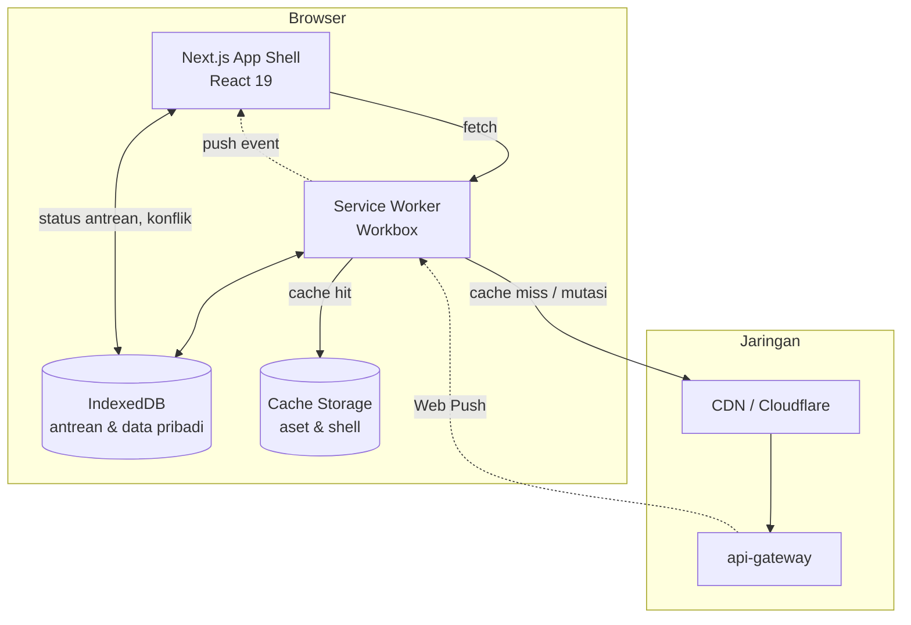

# 11 — Progressive Web App (PWA)

---

## 1. Keputusan & Ruang Lingkup

### 1.1 Aplikasi Mana yang Menjadi PWA

| Aplikasi | PWA? | Alasan |
|----------|:----:|--------|
| `app.hrms.id` — aplikasi tenant | ✅ Ya | Dipakai HR dan karyawan setiap hari, sering dari perangkat seluler, sering di jaringan tidak stabil |
| `admin.hrms.id` — dashboard global | ❌ **Tidak** | Control plane dengan CSP paling ketat, sesi 8 jam, IP allowlist. Service worker menambah permukaan serangan tanpa manfaat: superuser tidak butuh mode luring |

Keputusan untuk `admin.hrms.id` bukan kelalaian. Dokumen `07` §7 memisahkan control plane secara fisik justru agar dapat menerapkan kebijakan keamanan yang lebih keras. Menambahkan service worker — kode yang berjalan di luar siklus hidup halaman dan dapat mencegat setiap permintaan jaringan — bertentangan dengan tujuan itu.

### 1.2 Apa yang Berfungsi Luring

Menentukan ini di depan mencegah kekecewaan pengguna dan pekerjaan yang sia-sia.

| Kemampuan | Luring | Catatan |
|-----------|:------:|---------|
| Membuka aplikasi, navigasi, shell UI | ✅ | App shell di-cache |
| Melihat profil diri, jadwal shift, saldo cuti | ✅ | Data pribadi, di-cache dengan TTL pendek |
| **Melakukan presensi** | ✅ | Antrean lokal, dikirim saat online (§6) |
| Mengajukan cuti | ✅ | Antrean lokal, butuh validasi saldo server saat sinkron |
| Melihat riwayat absensi 30 hari | ✅ | Cache |
| Melihat slip gaji | ❌ | **Sengaja tidak di-cache** — lihat §5.4 |
| Dashboard tenant / tim | ❌ | Data agregat lintas perusahaan; basi berbahaya, bukan sekadar tidak berguna |
| Menyetujui cuti, menjalankan payroll, mengelola karyawan | ❌ | Operasi yang butuh konkurensi dan otorisasi terkini |

**Prinsip yang dipakai:** luring diberikan untuk **membaca data milik sendiri** dan **satu jenis tulis yang benar-benar terhalang jaringan** (presensi). Selebihnya menampilkan status jelas, bukan gagal diam-diam.

---

## 2. Batas Nyata PWA untuk Kasus Ini

Bagian ini ditulis lebih dulu karena menentukan keputusan di §3.

### 2.1 Tabel Dukungan Platform

| Kemampuan | Chrome / Android | Safari / iOS 17+ | Dampak pada produk |
|-----------|:----------------:|:----------------:|--------------------|
| Instal ke layar utama | ✅ Otomatis (prompt) | ⚠️ Manual via Bagikan → Tambah ke Layar Utama | Adopsi iOS lebih rendah; butuh panduan dalam aplikasi |
| Service worker & cache | ✅ | ✅ | — |
| Kamera (`getUserMedia`) | ✅ | ✅ | Presensi foto berfungsi |
| Geolokasi | ✅ | ✅ | Koordinat tertangkap |
| **Deteksi mock GPS** | ❌ | ❌ | **Skor kepercayaan melemah signifikan (§2.2)** |
| Background Sync API | ✅ | ❌ | Antrean luring hanya terkirim saat aplikasi dibuka |
| Periodic Background Sync | ✅ | ❌ | Tidak dipakai sama sekali |
| Web Push | ✅ | ⚠️ Hanya bila PWA sudah diinstal | Notifikasi iOS tidak andal untuk pengguna yang tidak menginstal |
| Persistent storage | ✅ (`navigator.storage.persist()`) | ⚠️ Terbatas | **Data terhapus setelah 7 hari tidak dipakai bila tidak diinstal** |
| Deteksi perangkat root | ❌ | ❌ | Sinyal `ROOTED_DEVICE` tidak tersedia di web |

### 2.2 Konsekuensi Terbesar: Bukti Presensi Melemah

Dokumen `10` §5 membangun skor kepercayaan dari beberapa sinyal. Tiga di antaranya **tidak tersedia di web sama sekali**:

| Sinyal | Native | Web |
|--------|:------:|:---:|
| `isFromMockProvider` | ✅ | ❌ Tidak ada API-nya |
| Deteksi root/jailbreak | ✅ | ❌ |
| SSID Wi-Fi | ✅ | ❌ Tidak diekspos ke JavaScript |

Di web, memalsukan lokasi bahkan lebih mudah daripada di Android: cukup buka DevTools → Sensors → set koordinat. Tidak perlu memasang apa pun.

**Penyesuaian yang wajib dilakukan:**

```typescript
// services/attendance-service/src/domain/trust-scoring.ts (penambahan)
export function scorePunch(ctx: PunchContext): TrustAssessment {
  let score = 100;
  const flags: string[] = [];

  // Presensi dari browser dinilai dengan dasar lebih rendah, bukan dengan
  // aturan yang sama. Ketiadaan tanda MOCK_LOCATION di web tidak berarti
  // lokasinya asli — hanya berarti kita tidak bisa memeriksanya.
  if (ctx.source === 'WEB') {
    score -= 20;
    flags.push('WEB_UNVERIFIED_DEVICE');
    // Kompensasi: verifikasi IP jaringan kantor jauh lebih berarti di web
    if (ctx.ipMatchesSiteRange) { score += 25; flags.push('OFFICE_IP_VERIFIED'); }
  }
  // ... sisa penilaian seperti dokumen 10 §5.1
}
```

Bagi tenant yang menuntut kepastian, kebijakan `FALLBACK_ONLY` (presensi web hanya dari IP kantor) menjadi pilihan yang masuk akal — dan itu sudah ada di `attendance_policies`.

### 2.3 Konsekuensi Kedua: Antrean Luring iOS Bisa Hilang

Safari menghapus penyimpanan situs setelah **7 hari tanpa interaksi** untuk PWA yang tidak diinstal ke layar utama. Presensi luring yang tersimpan di IndexedDB dapat lenyap sebelum sempat terkirim.

Mitigasi berlapis:

```typescript
// apps/web/src/lib/offline/storage-guard.ts
export async function ensureDurableStorage(): Promise<StorageStatus> {
  if (!navigator.storage?.persist) return { persistent: false, reason: 'UNSUPPORTED' };

  const already = await navigator.storage.persisted();
  if (already) return { persistent: true };

  // Chrome memberikannya otomatis bila PWA diinstal & sering dipakai.
  // Safari mengabaikan permintaan ini sepenuhnya.
  const granted = await navigator.storage.persist();
  return { persistent: granted, reason: granted ? undefined : 'DENIED_BY_BROWSER' };
}

// Bila penyimpanan tidak dijamin DAN ada antrean menunggu,
// pengguna harus tahu — bukan diberi rasa aman palsu.
export function OfflineQueueBanner() {
  const { pending, storageStatus } = useOfflineQueue();
  if (pending === 0) return null;

  if (!storageStatus.persistent && isIos()) {
    return (
      <Banner tone="warning">
        {pending} presensi menunggu dikirim. Buka aplikasi ini saat ada koneksi
        dalam 7 hari agar data tidak hilang.
        {!isInstalled() && <InstallHint>Pasang ke Layar Utama agar lebih aman</InstallHint>}
      </Banner>
    );
  }
  return <Banner tone="info">{pending} presensi menunggu dikirim.</Banner>;
}
```

### 2.4 Rekomendasi: PWA Dulu, Native untuk Kasus Tertentu

| Segmen pengguna | Rekomendasi |
|-----------------|-------------|
| HR & admin (mayoritas pemakaian di desktop) | **PWA saja.** Native tidak memberi nilai tambah |
| Karyawan kantor dengan lokasi tetap | **PWA cukup.** Presensi dari IP kantor sudah memberi kepastian memadai |
| Pekerja lapangan, sales, proyek | **Native tetap dibutuhkan** — antrean luring andal, deteksi mock GPS, push notifikasi |
| Tenant dengan kepatuhan ketat (manufaktur, konstruksi) | Native, atau mesin absensi di lokasi |

**Dampak roadmap:** PWA dibangun di Fase 1 dan **menggantikan sebagian besar kebutuhan yang semula direncanakan untuk ESS Mobile di Fase 3**. Aplikasi React Native tetap dibangun, tetapi lingkupnya menyempit menjadi kasus yang benar-benar memerlukan kemampuan native — sehingga estimasinya turun, bukan bertambah (§9).

---

## 3. Arsitektur PWA



### 3.1 Manifest

```json
// apps/web/public/manifest.webmanifest
{
  "id": "/?source=pwa",
  "name": "HR Management Suite",
  "short_name": "HRMS",
  "description": "Presensi, cuti, slip gaji, dan administrasi HR",
  "start_url": "/?source=pwa",
  "scope": "/",
  "display": "standalone",
  "display_override": ["window-controls-overlay", "standalone", "browser"],
  "orientation": "portrait-primary",
  "background_color": "#ffffff",
  "theme_color": "#0f172a",
  "lang": "id-ID",
  "dir": "ltr",
  "categories": ["business", "productivity"],
  "icons": [
    { "src": "/icons/icon-192.png", "sizes": "192x192", "type": "image/png", "purpose": "any" },
    { "src": "/icons/icon-512.png", "sizes": "512x512", "type": "image/png", "purpose": "any" },
    { "src": "/icons/maskable-192.png", "sizes": "192x192", "type": "image/png", "purpose": "maskable" },
    { "src": "/icons/maskable-512.png", "sizes": "512x512", "type": "image/png", "purpose": "maskable" }
  ],
  "shortcuts": [
    { "name": "Presensi", "short_name": "Presensi", "url": "/attendance/punch?source=shortcut",
      "icons": [{ "src": "/icons/shortcut-punch.png", "sizes": "96x96" }] },
    { "name": "Ajukan Cuti", "short_name": "Cuti", "url": "/leave/new?source=shortcut",
      "icons": [{ "src": "/icons/shortcut-leave.png", "sizes": "96x96" }] },
    { "name": "Slip Gaji", "short_name": "Slip", "url": "/payroll/payslips?source=shortcut",
      "icons": [{ "src": "/icons/shortcut-payslip.png", "sizes": "96x96" }] }
  ],
  "screenshots": [
    { "src": "/screenshots/mobile-dashboard.png", "sizes": "390x844", "type": "image/png",
      "form_factor": "narrow" },
    { "src": "/screenshots/desktop-dashboard.png", "sizes": "1280x800", "type": "image/png",
      "form_factor": "wide" }
  ],
  "prefer_related_applications": false
}
```

> `shortcuts` menempatkan tombol Presensi satu ketukan dari layar utama — pintasan yang secara langsung menangani keluhan paling umum pada aplikasi absensi: terlalu banyak langkah saat terburu-buru pagi hari.

### 3.2 Strategi Caching

```typescript
// apps/web/src/sw.ts — dibangun dengan Workbox
import { precacheAndRoute, cleanupOutdatedCaches } from 'workbox-precaching';
import { registerRoute, NavigationRoute } from 'workbox-routing';
import { CacheFirst, NetworkFirst, StaleWhileRevalidate, NetworkOnly } from 'workbox-strategies';
import { ExpirationPlugin } from 'workbox-expiration';
import { CacheableResponsePlugin } from 'workbox-cacheable-response';
import { BackgroundSyncPlugin } from 'workbox-background-sync';

declare const self: ServiceWorkerGlobalScope;

cleanupOutdatedCaches();
precacheAndRoute(self.__WB_MANIFEST);          // aset build ber-hash

// ── 1. Aset statis ber-hash: tidak pernah berubah isinya ──
registerRoute(
  ({ request, url }) => url.pathname.startsWith('/_next/static/'),
  new CacheFirst({
    cacheName: 'static-assets-v1',
    plugins: [new ExpirationPlugin({ maxEntries: 300, maxAgeSeconds: 60 * 60 * 24 * 365 })],
  }),
);

// ── 2. Font & ikon ──
registerRoute(
  ({ request }) => ['font', 'image'].includes(request.destination),
  new CacheFirst({
    cacheName: 'media-v1',
    plugins: [
      new CacheableResponsePlugin({ statuses: [0, 200] }),
      new ExpirationPlugin({ maxEntries: 200, maxAgeSeconds: 60 * 60 * 24 * 30 }),
    ],
  }),
);

// ── 3. Navigasi: app shell ──
registerRoute(new NavigationRoute(
  new NetworkFirst({
    cacheName: 'pages-v1',
    networkTimeoutSeconds: 3,                  // jaringan lambat → langsung pakai cache
    plugins: [new ExpirationPlugin({ maxEntries: 50, maxAgeSeconds: 60 * 60 * 24 })],
  }),
  { denylist: [/^\/api\//, /^\/auth\//] },
));

// ── 4. Data pribadi yang boleh basi sebentar ──
const PERSONAL_CACHEABLE = [
  '/api/me/bootstrap',
  '/api/attendance/me/summary',
  '/api/attendance/me/schedule',
  '/api/leave/me/balance',
  '/api/employees/me',
];
registerRoute(
  ({ url }) => PERSONAL_CACHEABLE.some((p) => url.pathname.startsWith(p)),
  new NetworkFirst({
    cacheName: 'api-personal-v1',
    networkTimeoutSeconds: 4,
    plugins: [
      new CacheableResponsePlugin({ statuses: [200] }),
      new ExpirationPlugin({ maxEntries: 60, maxAgeSeconds: 60 * 60 * 12 }),
      tenantScopePlugin,                        // §5.2 — kunci cache dipisah per tenant & pengguna
    ],
  }),
);

// ── 5. Yang TIDAK PERNAH di-cache ──
registerRoute(
  ({ url }) =>
    url.pathname.startsWith('/api/payroll/') ||       // data gaji (§5.4)
    url.pathname.startsWith('/api/dashboard/') ||     // agregat; basi menyesatkan
    url.pathname.startsWith('/api/relation/') ||      // kasus rahasia
    url.pathname.startsWith('/auth/') ||
    url.pathname.startsWith('/api/iam/'),
  new NetworkOnly(),
);

// ── 6. Mutasi: antrean latar belakang (Chromium) ──
const punchQueue = new BackgroundSyncPlugin('punch-queue', {
  maxRetentionTime: 7 * 24 * 60,               // menit
  onSync: async ({ queue }) => {
    let entry;
    while ((entry = await queue.shiftRequest())) {
      try {
        await fetch(entry.request.clone());
        await notifyClients({ type: 'PUNCH_SYNCED' });
      } catch (err) {
        await queue.unshiftRequest(entry);      // kembalikan ke antrean, coba lagi nanti
        throw err;
      }
    }
  },
});

registerRoute(
  ({ url, request }) => url.pathname === '/api/attendance/punch' && request.method === 'POST',
  new NetworkOnly({ plugins: [punchQueue] }),
  'POST',
);

// ── 7. Fallback luring ──
self.addEventListener('install', (e) => {
  e.waitUntil(caches.open('pages-v1').then((c) => c.addAll(['/offline'])));
});
```

> **Catatan penting tentang `BackgroundSyncPlugin`:** ia hanya bekerja di Chromium. Safari akan gagal diam-diam. Karena itu antrean di §6 **tidak bergantung padanya** — Background Sync adalah percepatan, bukan mekanisme utama.

---

## 4. Pembaruan Aplikasi

### 4.1 Masalah Khas Microservices

Service worker menyajikan bundel yang di-cache. Bila `api-gateway` dan service backend sudah di versi baru sementara browser masih menjalankan bundel lama, kontrak API bisa tidak cocok — dan pengguna melihat galat yang tidak masuk akal.

Ini bukan hipotesis: dengan deploy per service (dokumen `01` §8.1), backend berubah lebih sering daripada frontend.

### 4.2 Solusi: Negosiasi Versi + Pembaruan Terkendali

```typescript
// apps/web/src/lib/pwa/update-manager.ts
export function useAppUpdate() {
  const [state, setState] = useState<'idle' | 'available' | 'required'>('idle');

  useEffect(() => {
    // 1. Service worker baru terdeteksi
    navigator.serviceWorker.ready.then((reg) => {
      reg.addEventListener('updatefound', () => {
        const sw = reg.installing;
        sw?.addEventListener('statechange', () => {
          if (sw.state === 'installed' && navigator.serviceWorker.controller) {
            setState('available');
          }
        });
      });
      // Periksa setiap 30 menit dan setiap kali tab kembali aktif
      setInterval(() => reg.update(), 30 * 60_000);
      document.addEventListener('visibilitychange', () => {
        if (!document.hidden) reg.update();
      });
    });

    // 2. Backend memberi tahu bahwa versi klien ini terlalu tua.
    //    Gateway menyertakan header X-Min-Client-Version pada setiap respons.
    api.interceptors.response.use((res) => {
      const min = res.headers['x-min-client-version'];
      if (min && semverLt(APP_VERSION, min)) setState('required');
      return res;
    });
  }, []);

  const applyUpdate = async () => {
    const reg = await navigator.serviceWorker.ready;
    reg.waiting?.postMessage({ type: 'SKIP_WAITING' });
    // Muat ulang setelah controller berganti
    navigator.serviceWorker.addEventListener('controllerchange', () => window.location.reload());
  };

  return { state, applyUpdate };
}
```

```tsx
// Pembaruan opsional: tawarkan, jangan paksa — pengguna mungkin sedang mengisi formulir
{state === 'available' && (
  <Toast action={{ label: 'Muat ulang', onClick: applyUpdate }}>
    Versi baru tersedia.
  </Toast>
)}

// Pembaruan wajib: jelaskan, lalu paksa
{state === 'required' && (
  <BlockingDialog title="Pembaruan diperlukan"
    description="Versi aplikasi Anda tidak lagi kompatibel dengan server. Muat ulang untuk melanjutkan."
    action={{ label: 'Muat ulang sekarang', onClick: applyUpdate }} />
)}
```

> **`skipWaiting()` tidak dipanggil otomatis.** Mengganti service worker di tengah sesi dapat mengganti bundel JavaScript saat pengguna sedang mengisi formulir cuti, dan potongan kode lama yang dimuat lazy bisa tidak ditemukan lagi. Pembaruan hanya diterapkan atas tindakan pengguna, atau saat backend menyatakan versi lama sudah tidak didukung.

### 4.3 Kompatibilitas Kontrak

Aturan yang sama dengan migrasi non-destruktif (dokumen `09`) berlaku untuk API yang dikonsumsi klien PWA:

```typescript
// services/api-gateway/src/middleware/client-version.middleware.ts
const MIN_SUPPORTED_CLIENT = '2.0.0';       // dinaikkan hanya saat ada perubahan yang merusak

res.header('X-Min-Client-Version', MIN_SUPPORTED_CLIENT);
res.header('X-Server-Version', APP_VERSION);
```

Karena perubahan API bersifat aditif, `MIN_SUPPORTED_CLIENT` jarang dinaikkan. Bila pernah dinaikkan, itu tanda ada perubahan yang merusak — dan sebaiknya ditinjau ulang apakah benar-benar perlu.

---

## 5. Keamanan & Multitenancy

### 5.1 Service Worker Adalah Kode Istimewa

Service worker mencegat setiap permintaan jaringan dalam scope-nya dan bertahan setelah tab ditutup. Karena itu:

| Aturan | Alasan |
|--------|--------|
| Disajikan dari origin yang sama, scope `/` | Tidak pernah dari CDN pihak ketiga |
| `Service-Worker-Allowed` tidak diperluas | Scope tetap dalam kendali aplikasi |
| CSP ketat pada berkas SW | Mencegah injeksi |
| Tidak pernah menyimpan token akses di Cache Storage atau IndexedDB | §5.3 |
| Versi SW dipublikasikan dengan integrity hash | Deteksi perubahan tak sah |

```nginx
location /sw.js {
    add_header Cache-Control "no-cache, no-store, must-revalidate";
    add_header Content-Security-Policy "default-src 'none'; connect-src 'self'";
    # SW tidak boleh di-cache: kalau ter-cache, pembaruan bisa tertahan berhari-hari
}
```

### 5.2 Cache Dipisah per Tenant dan per Pengguna

Ini masalah nyata pada perangkat bersama, misalnya tablet presensi di pabrik atau komputer bersama di kantor cabang.

```typescript
// apps/web/src/lib/pwa/tenant-scope-plugin.ts
export const tenantScopePlugin: WorkboxPlugin = {
  // Kunci cache disisipi tenantId dan userId. Dua pengguna berbeda
  // pada perangkat yang sama tidak pernah berbagi entri cache.
  cacheKeyWillBeUsed: async ({ request }) => {
    const session = await getSessionMeta();      // dari IndexedDB, bukan token
    if (!session) return request;
    const url = new URL(request.url);
    url.searchParams.set('__t', session.tenantId);
    url.searchParams.set('__u', session.userId);
    return new Request(url.toString(), request);
  },
};
```

```typescript
// Pembersihan total saat logout atau pergantian tenant
export async function purgeAllClientData(reason: 'LOGOUT' | 'TENANT_SWITCH' | 'SESSION_REVOKED') {
  // 1. Seluruh Cache Storage
  const names = await caches.keys();
  await Promise.all(names.map((n) => caches.delete(n)));

  // 2. IndexedDB — KECUALI antrean presensi yang belum terkirim.
  //    Menghapus presensi yang belum tersinkron berarti menghilangkan
  //    kehadiran karyawan yang sudah benar-benar terjadi.
  await idb.clearAllExcept(['pendingPunches']);

  // 3. Beri tahu service worker
  const reg = await navigator.serviceWorker.ready;
  reg.active?.postMessage({ type: 'PURGE_CACHES', reason });

  // 4. Batalkan langganan push agar notifikasi tidak sampai ke orang berikutnya
  const sub = await reg.pushManager.getSubscription();
  await sub?.unsubscribe();
}
```

> Pengecualian `pendingPunches` disengaja dan perlu dijelaskan ke pengguna: bila ada presensi belum terkirim saat logout, aplikasi menampilkan peringatan dan menawarkan mengirimnya lebih dulu.

### 5.3 Token Tidak Pernah Menyentuh Penyimpanan Persisten

```
Access token   → variabel di memori saja. Hilang saat tab ditutup — memang seharusnya
Refresh token  → cookie HttpOnly + Secure + SameSite=Strict. JavaScript tidak bisa membacanya
Metadata sesi  → IndexedDB, hanya { tenantId, userId, expiresAt }. Tidak ada kredensial
```

Service worker tidak pernah menambahkan header `Authorization` sendiri. Ia meneruskan permintaan apa adanya; token disisipkan lapisan aplikasi. Ini mencegah service worker yang tersusupi mengirim permintaan terautentikasi atas nama pengguna.

### 5.4 Mengapa Slip Gaji Tidak Di-cache

Ini pilihan sadar yang mengorbankan kenyamanan demi alasan yang jelas:

- Slip gaji adalah data paling sensitif yang dapat diakses karyawan biasa.
- PWA sering dipasang di perangkat bersama.
- Cache Storage dapat dibaca siapa pun yang memegang perangkat dalam keadaan tidak terkunci.
- Nilai luringnya rendah — slip gaji dibuka sekali sebulan, hampir selalu saat ada koneksi.

PDF slip gaji tetap dapat **diunduh** pengguna secara eksplisit; bedanya, itu keputusan sadar pengguna dan berada di penyimpanan berkas perangkat yang tunduk pada kontrol sistem operasi.

---

## 6. Antrean Luring

### 6.1 Tidak Bergantung pada Background Sync

Karena Safari tidak mendukungnya, mekanisme utama adalah IndexedDB + pemicu sinkronisasi berlapis.

```typescript
// apps/web/src/lib/offline/punch-queue.ts
const db = await openDB('hrms-offline', 2, {
  upgrade(db, oldVersion) {
    if (oldVersion < 1) {
      const store = db.createObjectStore('pendingPunches', { keyPath: 'localId' });
      store.createIndex('by-status', 'status');
      store.createIndex('by-captured', 'capturedAt');
    }
    if (oldVersion < 2) {
      db.createObjectStore('pendingLeaveRequests', { keyPath: 'localId' });
    }
  },
});

export async function enqueuePunch(evidence: PunchEvidence) {
  const entry = {
    localId: uuidv7(),
    ...evidence,
    capturedOffline: true,
    status: 'PENDING' as const,
    attempts: 0,
    queuedAt: new Date().toISOString(),
  };
  await db.put('pendingPunches', entry);

  // Foto disimpan sebagai Blob terpisah — IndexedDB menanganinya efisien;
  // menyimpan base64 akan membengkakkan ukuran ~33%
  await db.put('pendingPhotos', { localId: entry.localId, blob: evidence.photoBlob });

  await requestBackgroundSyncIfAvailable('punch-queue');   // percepatan Chromium
  return entry.localId;
}

export async function flushQueue() {
  const pending = await db.getAllFromIndex('pendingPunches', 'by-status', 'PENDING');

  for (const entry of pending) {
    try {
      const photo = await db.get('pendingPhotos', entry.localId);
      const { fileId } = await uploadPhoto(photo.blob);

      await api.post('/attendance/punch', {
        ...entry,
        photoFileId: fileId,
        syncedAt: new Date().toISOString(),
      }, {
        // dedupe_key server + idempotency key: aman meski flush berjalan dua kali
        headers: { 'Idempotency-Key': entry.localId },
      });

      await db.delete('pendingPunches', entry.localId);
      await db.delete('pendingPhotos', entry.localId);
    } catch (err) {
      if (isNetworkError(err)) return;                  // hentikan; coba lagi nanti
      // Galat non-jaringan (misal presensi ditolak server) tidak boleh
      // membuat entri terjebak selamanya di antrean
      await db.put('pendingPunches', {
        ...entry, status: 'FAILED', attempts: entry.attempts + 1,
        lastError: serializeError(err),
      });
    }
  }
}

// Pemicu berlapis — cukup satu yang berhasil
window.addEventListener('online', flushQueue);
document.addEventListener('visibilitychange', () => { if (!document.hidden) flushQueue(); });
setInterval(() => { if (navigator.onLine) flushQueue(); }, 60_000);
navigator.serviceWorker.addEventListener('message', (e) => {
  if (e.data?.type === 'PUNCH_SYNCED') queryClient.invalidateQueries(['attendance']);
});
```

### 6.2 Umpan Balik yang Jujur

Antarmuka tidak boleh menampilkan presensi luring seolah sudah tercatat di server.

```tsx
<PunchResult status={result.status}>
  {result.status === 'SYNCED' && <>✓ Presensi tercatat pukul {time}</>}
  {result.status === 'QUEUED' && (
    <>
      ⏳ Presensi tersimpan di perangkat pukul {time}
      <Detail>Akan dikirim otomatis saat ada koneksi.</Detail>
      {isIos() && !isPersistent && (
        <Warning>Buka aplikasi dalam 7 hari agar data tidak terhapus browser.</Warning>
      )}
    </>
  )}
  {result.status === 'FAILED' && (
    <>⚠ Presensi tidak dapat dikirim. <Action onClick={retry}>Coba lagi</Action></>
  )}
</PunchResult>
```

---

## 7. Web Push

```typescript
// apps/web/src/lib/pwa/push.ts
export async function subscribeToPush(): Promise<PushSubscriptionResult> {
  if (!('PushManager' in window)) return { ok: false, reason: 'UNSUPPORTED' };

  // iOS: Web Push HANYA berfungsi bila PWA sudah dipasang ke Layar Utama.
  // Meminta izin sebelum itu akan gagal dan membakar satu-satunya kesempatan bertanya.
  if (isIos() && !isStandalone()) {
    return { ok: false, reason: 'IOS_REQUIRES_INSTALL', showInstallGuide: true };
  }

  const permission = await Notification.requestPermission();
  if (permission !== 'granted') return { ok: false, reason: 'DENIED' };

  const reg = await navigator.serviceWorker.ready;
  const sub = await reg.pushManager.subscribe({
    userVisibleOnly: true,                    // wajib; push senyap tidak diizinkan
    applicationServerKey: urlBase64ToUint8Array(VAPID_PUBLIC_KEY),
  });

  await api.post('/notifications/subscriptions', {
    endpoint: sub.endpoint,
    keys: sub.toJSON().keys,
    userAgent: navigator.userAgent,
  });
  return { ok: true };
}
```

```typescript
// sw.ts — penanganan push
self.addEventListener('push', (event) => {
  const data = event.data?.json() ?? {};
  event.waitUntil(self.registration.showNotification(data.title, {
    body: data.body,
    icon: '/icons/icon-192.png',
    badge: '/icons/badge-72.png',
    tag: data.tag,                            // notifikasi sejenis saling menimpa
    renotify: false,
    data: { url: data.url },
    actions: data.actions,
  }));
});

self.addEventListener('notificationclick', (event) => {
  event.notification.close();
  const url = event.notification.data?.url ?? '/';
  event.waitUntil(
    self.clients.matchAll({ type: 'window', includeUncontrolled: true }).then((list) => {
      // Fokuskan tab yang sudah terbuka daripada membuka tab baru
      const existing = list.find((c) => c.url.includes(new URL(url, location.origin).pathname));
      if (existing) return existing.focus();
      return self.clients.openWindow(url);
    }),
  );
});
```

**Karena Web Push tidak andal di iOS**, `notification-service` mempertahankan jalur berjenjang:

```
Push web  →  gagal/tidak tersedia  →  Push native (bila aplikasi terpasang)
          →  gagal                 →  Email
          →  untuk hal mendesak    →  WhatsApp
```

---

## 8. Performa

Target pasar mengakses lewat jaringan seluler Indonesia, sering di 4G lemah. Anggaran performa ditetapkan sebagai gerbang CI, bukan aspirasi.

| Metrik | Anggaran | Perangkat uji |
|--------|----------|---------------|
| Largest Contentful Paint | < 2,5 dtk | Moto G Power, throttling 4G lambat |
| Interaction to Next Paint | < 200 ms | idem |
| Cumulative Layout Shift | < 0,1 | idem |
| Bundel JS awal (gzip) | < 180 KB | — |
| Bundel per modul (gzip) | < 120 KB | — |
| Ukuran precache | < 3 MB | — |
| Lighthouse PWA | 100 | — |
| Lighthouse Performance | ≥ 90 | — |

```yaml
# .github/workflows/pwa-budget.yml
- name: Lighthouse CI
  run: |
    pnpm build
    pnpm lhci autorun --collect.settings.preset=mobile
  env:
    LHCI_BUDGET: |
      [{ "path": "/*",
         "resourceSizes": [
           { "resourceType": "script", "budget": 180 },
           { "resourceType": "total",  "budget": 800 }],
         "timings": [
           { "metric": "largest-contentful-paint", "budget": 2500 },
           { "metric": "cumulative-layout-shift",  "budget": 0.1 }] }]
```

Pemuatan bundel per modul mengikuti langganan (dokumen `01` §5.5): pelanggan Paket Basic tidak mengunduh kode Recruitment, sehingga anggaran ini realistis meski jumlah modul terus bertambah.

---

## 9. Dampak Roadmap

### 9.1 Perubahan Lingkup ESS Mobile

| | Rencana semula | Setelah PWA |
|---|---|---|
| Fase 1 | — | **PWA penuh**: instalasi, luring, push, presensi web |
| Fase 3 | ESS React Native lengkap (± 12 pm) | **ESS React Native terbatas** (± 7 pm): hanya kemampuan yang tidak ada di web — antrean luring andal, deteksi mock GPS & root, push iOS andal, kamera native |
| Selisih | | **− 5 pm** di Fase 3, **+ 4 pm** di Fase 1 |

**Bersih: − 1 person-month**, dengan jangkauan pengguna yang jauh lebih luas sejak Fase 1. Ini salah satu dari sedikit perubahan lingkup dalam cetak biru ini yang menurunkan biaya sekaligus menaikkan nilai — karena PWA menggantikan pekerjaan yang memang sudah direncanakan, bukan menambah pekerjaan baru.

### 9.2 Penempatan

**Fase 1, Sprint 3–4 (bersamaan shell frontend):**
- Manifest, ikon, service worker dasar, strategi caching
- Pemisahan cache per tenant & pengguna, pembersihan saat logout
- Alur pembaruan terkendali + negosiasi versi klien
- Anggaran performa sebagai gerbang CI

**Fase 1, Sprint 6–9 (bersamaan `attendance-service`):**
- Antrean presensi luring (IndexedDB)
- Penyesuaian skor kepercayaan untuk sumber `WEB`
- Panduan instalasi khusus iOS
- Peringatan durabilitas penyimpanan

**Fase 2:**
- Web Push + langganan; jalur berjenjang di `notification-service`
- Pintasan aplikasi, layar berbagi

**Fase 3:**
- ESS React Native dengan lingkup menyempit

---

## 10. Pengujian

```typescript
// test/pwa/service-worker.spec.ts
describe('Service worker', () => {
  it('tidak pernah men-cache endpoint payroll', async () => {
    await page.goto('/payroll/payslips');
    await page.waitForResponse((r) => r.url().includes('/api/payroll/payslips'));
    const cached = await page.evaluate(async () => {
      const names = await caches.keys();
      for (const n of names) {
        const c = await caches.open(n);
        const keys = await c.keys();
        if (keys.some((k) => k.url.includes('/api/payroll/'))) return true;
      }
      return false;
    });
    expect(cached).toBe(false);
  });

  it('menghapus seluruh cache saat logout', async () => {
    await login('acme', 'hr@acme.id');
    await page.goto('/attendance');
    await logout();
    const remaining = await page.evaluate(() => caches.keys());
    expect(remaining).toEqual([]);
  });

  it('cache pengguna A tidak terbaca pengguna B pada perangkat sama', async () => {
    await login('acme', 'a@acme.id');
    await page.goto('/employees/me');
    await logout();
    await login('acme', 'b@acme.id');
    const leaked = await page.evaluate(() =>
      fetch('/api/employees/me').then((r) => r.json()).then((d) => d.email));
    expect(leaked).toBe('b@acme.id');
  });

  it('token tidak pernah tersimpan di Cache Storage maupun IndexedDB', async () => {
    await login('acme', 'hr@acme.id');
    const found = await page.evaluate(async () => {
      const dump = JSON.stringify(await dumpAllClientStorage());
      return /eyJhbGciOi|Bearer /.test(dump);        // pola JWT
    });
    expect(found).toBe(false);
  });
});

// test/pwa/offline.spec.ts
describe('Mode luring', () => {
  it('presensi tersimpan saat luring dan terkirim saat online', async () => {
    await login('acme', 'budi@acme.id');
    await page.context().setOffline(true);
    await submitPunch();
    await expect(page.getByText('tersimpan di perangkat')).toBeVisible();

    await page.context().setOffline(false);
    await page.evaluate(() => window.dispatchEvent(new Event('online')));
    await expect(page.getByText('Presensi tercatat')).toBeVisible({ timeout: 10_000 });

    const punches = await api.get('/attendance/me/summary');
    expect(punches.data.today).toHaveLength(1);      // tepat satu, bukan duplikat
  });

  it('flush dua kali tidak menghasilkan presensi ganda', async () => {
    await queueOfflinePunch();
    await page.evaluate(() => Promise.all([flushQueue(), flushQueue()]));
    const punches = await api.get('/attendance/me/summary');
    expect(punches.data.today).toHaveLength(1);      // dedupe_key + Idempotency-Key
  });

  it('halaman payroll menampilkan status luring, bukan data basi', async () => {
    await page.goto('/payroll/payslips');
    await page.context().setOffline(true);
    await page.reload();
    await expect(page.getByText('Tidak tersedia saat luring')).toBeVisible();
  });
});
```

Pengujian dijalankan pada **Chromium dan WebKit** di Playwright. WebKit wajib karena perilaku Safari berbeda pada justru bagian yang paling berisiko.

---

## 11. Risiko

| # | Risiko | Prob. | Dampak | Mitigasi |
|---|--------|-------|--------|----------|
| **R47** | **Presensi web dianggap sekuat presensi native padahal mock GPS tidak terdeteksi** | **Tinggi** | Tinggi | Tanda `WEB_UNVERIFIED_DEVICE` otomatis, skor lebih rendah, verifikasi IP kantor sebagai kompensasi, kebijakan `FALLBACK_ONLY` tersedia; dinyatakan eksplisit dalam materi penjualan |
| **R48** | **Antrean presensi luring hilang di iOS karena penghapusan penyimpanan 7 hari** | Sedang | Tinggi | `navigator.storage.persist()`, peringatan eksplisit ke pengguna, dorongan memasang ke Layar Utama, batas antrean 7 hari yang sama dengan kebijakan server |
| R49 | Service worker basi menyajikan bundel tak kompatibel dengan API baru | Sedang | Sedang | Header `X-Min-Client-Version`, pembaruan wajib terkendali, API aditif sehingga jarang terjadi |
| R50 | Data satu pengguna terbaca pengguna lain pada perangkat bersama | Rendah | **Kritis** | Kunci cache per tenant & pengguna, pembersihan total saat logout, uji kebocoran sebagai gerbang CI |
| R51 | Adopsi instalasi rendah di iOS | **Tinggi** | Sedang | Panduan instalasi dalam aplikasi, pintasan, kesabaran — dan penerimaan bahwa sebagian pengguna iOS akan memakai mode browser biasa |
| R52 | Web Push tidak sampai di iOS | Tinggi | Sedang | Jalur berjenjang push → email → WhatsApp; notifikasi penting tidak pernah hanya mengandalkan push |
| R53 | Ukuran bundel membengkak seiring bertambahnya modul | Sedang | Sedang | Pemuatan per modul mengikuti langganan, anggaran performa sebagai gerbang CI |

---

## 12. Metrik

| Metrik | Target |
|--------|--------|
| Lighthouse PWA | 100 |
| Lighthouse Performance (mobile) | ≥ 90 |
| LCP p75 pada 4G lambat | < 2,5 dtk |
| Tingkat instalasi (Android) | ≥ 40% pengguna aktif |
| Tingkat instalasi (iOS) | ≥ 15% (realistis, bukan aspirasi) |
| Presensi luring berhasil tersinkron | ≥ 99% |
| Presensi luring hilang sebelum sinkron | < 0,1% |
| Cache hit rate aset statis | ≥ 90% |
| Kebocoran data antar pengguna di perangkat bersama | **0** |
| Sesi terhenti akibat service worker basi | < 0,1% |
