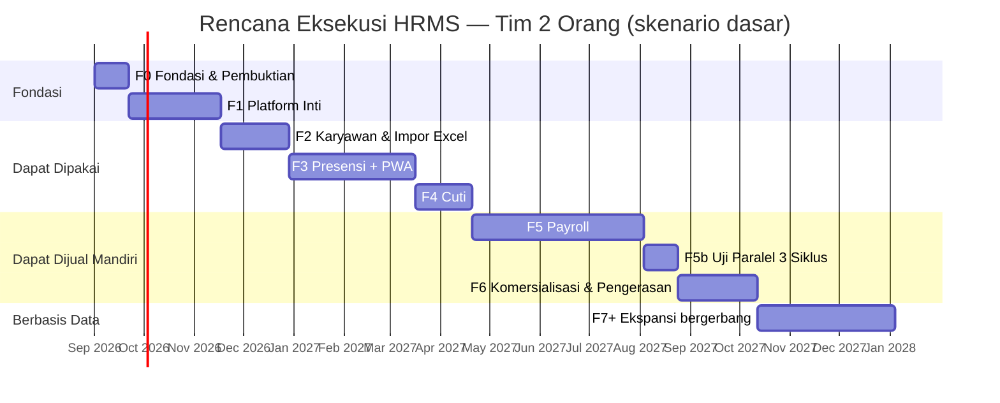

# 12 — Rencana Eksekusi untuk Tim Kecil (1–3 Orang)

**Status:** menggantikan roadmap di dokumen `04` §2–§10 untuk kondisi tim saat ini.
**Yang tetap berlaku dari `04`:** filosofi roadmap (§1), strategi migrasi pelanggan Excel (§13), dan sebagian besar registrasi risiko (§11).
**Tanggal:** 18 Agustus 2026

---

## 1. Mengapa Dokumen Ini Ada

Dokumen `04` menyusun roadmap untuk tim **14–15 FTE selama 18 bulan (±320 person-month)** di atas arsitektur 16–24 microservices. Rencana itu koheren secara internal — setiap keputusannya dapat dibenarkan **bila asumsi timnya benar**.

Asumsi itu tidak berlaku. Kapasitas nyata adalah **1–3 orang**.

Konsekuensinya bukan "kerjakan lebih lambat". Pada 2 orang, ±320 person-month berarti **±13 tahun kalender**. Rencana yang membutuhkan 13 tahun bukan rencana yang lambat — ia rencana yang salah. Menjalankannya apa adanya akan berakhir sebelum pelanggan pertama membayar.

Dokumen ini menyusun ulang eksekusi dengan dua perubahan besar dan satu yang dipertahankan utuh:

| | Perubahan |
|---|---|
| **Arsitektur** | Microservices → **modular monolith yang siap dipecah**. Batas domain, kontrak, dan RLS dipertahankan; infrastruktur terdistribusinya ditunda sampai ada pemicu nyata (§9). |
| **Cakupan** | 10 modul referensi + 10 modul ekspansi → **4 modul inti** (Karyawan, Presensi, Cuti, Payroll). Sisanya menunggu data penggunaan nyata. |
| **Prinsip** | **Tidak berubah.** Enam belas prinsip di dokumen `00` §3.2 tetap mengikat, termasuk P6 (RLS), P11 (superuser tidak mem-bypass RLS), P12 (migrasi aditif), P13 (riwayat tidak ditimpa), dan P14–P16 (presensi & privasi). Prinsip-prinsip itu murah dipertahankan dan mahal dipasang belakangan. |

**Pembagian penghematannya jujur:** dari ±320 ke ±34 person-month, sekitar **80% berasal dari pemangkasan cakupan** dan hanya **20% dari perubahan arsitektur**. Modular monolith bukan jalan pintas ajaib — memangkas 16 modul yang belum tentu dibeli siapa pun, itulah yang menghemat.

---

## 2. Batasan Nyata yang Membentuk Rencana Ini

| Batasan | Konsekuensi pada rencana |
|---------|--------------------------|
| Tim 1–3 orang | Tidak ada peran khusus. Orang yang menulis kode payroll adalah orang yang menerima telepon saat produksi turun. Beban operasional adalah pajak langsung atas kecepatan fitur. |
| Tidak ada SRE | Kubernetes, service mesh, RabbitMQ berklaster, dan Jaeger tidak dapat dioperasikan. Setiap komponen infrastruktur harus dapat dilupakan berminggu-minggu tanpa rusak. |
| Belum ada kode | Tidak ada beban warisan. Ini keunggulan sekali pakai: batas modul yang ditegakkan sejak commit pertama jauh lebih murah daripada dipasang di commit ke-3.000. |
| Belum ada target komersial | Kebebasan urutan, **tetapi juga bahaya terbesar**: tanpa tekanan pelanggan, tim kecil cenderung membangun fondasi selama setahun tanpa satu pun pengguna. Rencana ini memasang gerbang komersial untuk melawan kecenderungan itu (§6). |
| Domain payroll berisiko hukum | Satu-satunya bagian yang **tidak boleh** dipercepat. Salah potong PPh21 bukan bug — ia kewajiban hukum pelanggan yang berpindah ke pundak kita. |

---

## 3. Keputusan Arsitektur: Monolit Modular yang Siap Dipecah

### 3.1 Bentuk Sistem

Satu basis kode, dua proses berjalan, satu basis data.

```
hrms/
├── apps/
│   ├── web/                 Next.js 15 — UI + route handler REST. Satu deployable.
│   └── worker/              Proses Node — konsumer pg-boss (impor, payroll, PDF, notifikasi)
├── packages/
│   ├── core/                Modul domain. Inti dari keputusan ini.
│   │   ├── tenant/
│   │   ├── iam/
│   │   ├── employee/
│   │   ├── attendance/
│   │   ├── leave/
│   │   └── payroll/
│   ├── db/                  Prisma schema, migrasi, helper RLS, klien ber-tenant
│   └── contracts/           Skema Zod: event internal, payload API, kontrak impor Excel
└── ops/                     docker-compose, skrip backup, runbook
```

**Empat aturan yang membuat ini bukan sekadar monolit:**

1. Setiap modul di `packages/core/*` hanya boleh diimpor lewat `index.ts` publiknya. Ditegakkan `eslint-plugin-boundaries` sebagai gerbang CI — bukan kesepakatan lisan. Melanggarnya menggagalkan build, sama seperti kredensial DB terpisah menegakkan P10 pada microservices.
2. Modul berkomunikasi lewat **event internal** yang melewati tabel `outbox` dan pg-boss, bukan panggilan fungsi langsung antar-domain. Bentuk kodenya identik dengan versi terdistribusi; yang berbeda hanya jarak tempuhnya.
3. Setiap modul memiliki **schema PostgreSQL sendiri** (`employee.*`, `attendance.*`) dalam satu basis data. Tidak ada `JOIN` lintas schema di kode aplikasi — data lintas modul diambil lewat API publik modul atau tabel replika lokal, persis seperti pada rancangan asli.
4. `ROUTE_MANIFEST` (dokumen `01` §5.2) tetap ada. Setiap route terdaftar dengan modul dan permission-nya; route tak terdaftar mengembalikan 404. P7 tidak dikompromikan.

Aturan 1–3 adalah **harga yang dibayar sekarang agar §9 mungkin dilakukan nanti**. Tanpa keempatnya, ini akan menjadi monolit biasa dan pemisahan menjadi service kelak berarti penulisan ulang.

### 3.2 Tumpukan Teknologi: Revisi dari Dokumen `01` §6

| Lapisan | Dokumen `01` | Rencana ini | Alasan perubahan |
|---------|--------------|-------------|------------------|
| Deployable | 16–24 service | **1 web + 1 worker** | Satu build, satu deploy, satu log. Dapat dioperasikan satu orang. |
| Runtime | NestJS per service | **Next.js 15 (App Router) + worker Node** | Satu bahasa, satu build tool, satu pipeline. Logika domain tetap di `packages/core`, bebas framework. |
| Basis data | 24 DB, satu per service | **1 PostgreSQL 16, schema per modul** | Isolasi logis dipertahankan lewat schema + RLS. Backup tunggal, PITR tunggal. |
| Message broker | RabbitMQ 4 quorum queue | **pg-boss (di PostgreSQL)** | Menghapus satu sistem yang harus dijaga hidup. Volume HRIS (ribuan pesan/menit) jauh di bawah batas pg-boss. |
| Cache / lock | Redis 7 | **PostgreSQL advisory lock + cache dalam proses** | Redis ditambahkan saat ada bukti butuh, bukan sebelumnya. |
| Realtime | Socket.IO + Redis Streams | **SSE + `LISTEN/NOTIFY`, fallback polling** | Satu proses web tidak butuh fanout lintas node. Socket.IO menyusul bila web di-scale horizontal. |
| RPC internal | gRPC + protobuf | **Panggilan fungsi TypeScript lewat `index.ts` modul** | Kontraknya tetap eksplisit dan diperiksa tipe. Serialisasi jaringan adalah biaya tanpa manfaat di dalam satu proses. |
| Orkestrasi | Kubernetes + Argo CD | **Docker Compose di 1 VPS**, PostgreSQL terkelola | K8s tanpa SRE adalah kewajiban, bukan aset. |
| Object storage | MinIO / S3 | **S3-compatible terkelola** (R2 / IDCloudHost) | Tidak ada storage yang perlu dijaga sendiri. |
| Observabilitas | OTel + Jaeger + Prometheus + Grafana + Loki | **Sentry + log terstruktur (pino) + uptime check** | Tracing terdistribusi memecahkan masalah yang belum ada. Sentry menangkap 90% nilai dengan 5% biaya operasi. |
| Frontend | Next.js 15 + AG Grid + PWA | **Tidak berubah** | Grid ala Excel dan PWA adalah nilai jual inti (dokumen `00` §2.1), bukan kemewahan. |
| ORM | Prisma 6 | **Tidak berubah** | Dengan pagar migrasi dokumen `09` §7.1 tetap dipasang. |

### 3.3 Yang Dipertahankan Utuh dari Cetak Biru

Ini bukan penyederhanaan menyeluruh. Hal-hal berikut tetap dibangun sejak Fase 1 karena **mahal atau mustahil dipasang belakangan**:

| Dipertahankan | Dari dokumen | Mengapa tidak boleh ditunda |
|---------------|--------------|----------------------------|
| RLS di setiap tabel ber-`tenant_id`, role aplikasi `NOBYPASSRLS` | `02`, `06` | Satu kebocoran lintas-tenant menghabisi produk B2B. Memasangnya di 60 tabel berisi data jauh lebih mahal daripada di 6 tabel kosong. |
| Migrasi aditif + linter SQL | `09` | Kebiasaan `DROP`/`RENAME` tidak bisa dibatalkan setelah tertanam. Linter-nya cukup 80 baris skrip. |
| `audit_logs` append-only | `02` | Riwayat yang tidak dicatat sejak awal hilang selamanya. |
| Riwayat berdimensi waktu (`daterange`) untuk gaji, tarif, kebijakan | P13 | Slip gaji tahun lalu tidak boleh berubah karena tarif tahun ini. Retrofit berarti kehilangan riwayat. |
| `ROUTE_MANIFEST` + guard entitlement & permission di satu tempat | `01` §5, `05` | P7–P9. Menambahkannya setelah 200 route berarti mengaudit 200 route. |
| Realm superuser terpisah (audience token berbeda, TOTP wajib, tanpa akses data tenant) | `07` | P11. Diimplementasikan sebagai route group `/_admin` dalam deployable yang sama — **prinsipnya dipertahankan, infrastrukturnya ditunda**. |
| Outbox + konsumer idempoten | `03` | Bentuk kode yang membuat §9 mungkin. Di pg-boss biayanya hampir nol. |
| Skor kepercayaan presensi + tinjauan manusia | `10` (P14) | Menjanjikan "antipalsu" lalu menariknya kembali merusak kepercayaan. Rancang jujur sejak awal. |
| Pembatasan tujuan data lokasi | `10` (P15) | Sekali koordinat mentah masuk ke laporan, menariknya keluar adalah perubahan yang merusak. |
| Impor/ekspor Excel di setiap modul | `00` §2.1 | Ini jalur migrasi dari produk referensi. Tanpa ini tidak ada pelanggan pertama. |

### 3.4 Beli, Jangan Bangun

Untuk tim sebesar ini, setiap komponen yang dibangun sendiri adalah komponen yang harus dipelihara selamanya.

| Kebutuhan | Keputusan |
|-----------|-----------|
| PostgreSQL | Terkelola (Neon / Supabase / RDS). Membangun HA sendiri butuh SRE yang tidak ada. |
| Email transaksional | Resend / Postmark. Jangan menyentuh SMTP dan reputasi IP. |
| Pelacakan galat | Sentry. |
| Pembayaran & langganan | **Midtrans / Xendit**, bukan Stripe — pasar Indonesia butuh VA, QRIS, dan e-wallet. |
| Penyimpanan berkas | S3-compatible terkelola. |
| Primitif kripto | `argon2id` + `jose`. Jangan menulis penanganan token sendiri dari nol. |
| Hari libur nasional | Sumber data terpelihara + kemampuan override per tenant. |
| **Aturan PPh21 & BPJS** | **Bangun sendiri, tetapi sebagai konfigurasi berversi (`statutory_configs` + `daterange`), bukan kode.** Ini satu-satunya logika yang tidak boleh dibeli — dan tidak boleh di-hardcode. |

---

## 4. Aturan yang Mengikat Rencana Ini

1. **Setiap fase berakhir dengan sesuatu yang dipakai orang di luar tim.** Fase 1 adalah satu-satunya pengecualian, dan itu sebabnya ia dibatasi 8 minggu.
2. **Gerbang komersial mendahului fase berikutnya.** Fase tidak dimulai karena fase sebelumnya selesai, melainkan karena syarat gerbangnya terpenuhi (§6). Ini penangkal utama risiko "membangun setahun tanpa pengguna".
3. **Payroll tidak dimulai tanpa ahli domain terikat.** Bukan preferensi — prasyarat keras. Gerbang C.
4. **Modul kelima tidak dibangun sebelum modul keempat terbukti dipakai.** Ambang: > 30% tenant aktif.
5. **Fitur di luar empat modul inti masuk daftar tunggu, bukan sprint.** Termasuk permintaan dari calon pelanggan besar. Terutama itu.

---

## 5. Peta Fase



**Yang penting adalah tonggaknya, bukan tanggalnya:**

| Tonggak | Setelah | Kalender (2 orang, tanpa buffer) |
|---------|---------|----------------------------------|
| Pilot pertama memakai sistem dengan data nyata | F2 | ±17 minggu (±4 bulan) |
| **Pelanggan pertama dapat membayar** | F3 | ±28 minggu (±6,5 bulan) |
| Cakupan setara Paket Basic referensi | F5b | ±51 minggu (±12 bulan) |
| Berjualan mandiri tanpa sentuhan tim | F6 | ±58 minggu (±13,5 bulan) |

Dengan buffer 25% (§7), tonggak "pelanggan pertama membayar" jatuh di **±8 bulan** dan "Basic lengkap" di **±17 bulan**.

---

## 6. Rincian Fase

### Fase 0 — Fondasi & Pembuktian (3 minggu)

Tujuan: menghapus ketidakpastian yang dapat membatalkan seluruh rencana, **sebelum** menulis kode produksi. Untuk tim kecil, spike yang gagal di minggu ke-2 adalah penghematan enam bulan.

**Aktivitas**

| Aktivitas | Keluaran |
|-----------|----------|
| Wawancara 5 praktisi HR (utamakan pemakai produk Excel referensi) | Daftar nyeri berperingkat, bukan daftar fitur |
| Kumpulkan artefak nyata: 30 slip gaji, 3 file presensi Excel, 2 ekspor mesin fingerprint, 3 kebijakan cuti | Bahan uji regresi emas |
| Empat spike (di bawah) | Keputusan tertulis (ADR) |
| Repo, CI, staging, PostgreSQL terkelola, Sentry | Lingkungan siap |

**Spike — dipangkas dari sembilan menjadi empat**

Lima spike di dokumen `04` (S2 fanout WebSocket, S7 rantai gRPC, S8 saga, S9 DX 16 service, sebagian S6) menguji risiko yang **tidak lagi ada** pada arsitektur ini. Empat yang tersisa justru menjadi lebih penting:

| Spike | Pertanyaan | Kriteria lulus | Bila gagal |
|-------|-----------|----------------|------------|
| **S1 — Akurasi PPh21 TER** | Perhitungan cocok dengan 30 slip gaji nyata? | **30/30 tepat sampai satuan rupiah** | Payroll keluar dari janji produk sampai ahli domain terlibat. Kerjakan sebagai spreadsheet/skrip dulu — belum perlu aplikasi. |
| **S2 — Impor Excel** | 5.000 baris tervalidasi & ter-commit < 60 detik dengan laporan galat per baris? | Tercapai | Rancang ulang menjadi impor asinkron berbatch. |
| **S3 — RLS + `SET LOCAL`** | Konteks tenant bocor antar transaksi pada connection pool Prisma? | **Nol kebocoran dalam 100.000 transaksi konkuren** | Pindah ke klien per-tenant atau `SET` non-transaksional dengan pembersihan eksplisit. |
| **S4 — Presensi PWA di perangkat nyata** | Izin, akurasi GPS dalam gedung, dan antrean IndexedDB bertahan 24 jam? | Diuji pada ≥1 Android kelas menengah **dan** ≥1 iPhone nyata | Sesuaikan kebijakan geofence & ambang akurasi sebelum merancang skor kepercayaan. |

> S1 dan S3 adalah dua yang paling sering dilewati dan paling mahal bila terlambat diketahui. S1 menentukan apakah payroll layak dijanjikan sama sekali. S3 gagal tanpa gejala — kebocoran lintas-tenant tidak melempar galat, ia hanya menampilkan data orang lain.

**DoD Fase 0**
- [ ] Empat spike lulus, atau menghasilkan keputusan arsitektural tertulis
- [ ] 30 kasus payroll terdokumentasi beserta hasil yang diharapkan
- [ ] ADR tercatat untuk: monolit modular, pg-boss, satu DB multi-schema, batas modul
- [ ] Repo, CI, staging, dan backup PITR berjalan; restore sudah pernah diuji sekali

---

### Fase 1 — Platform Inti (8 minggu)

Satu-satunya fase tanpa keluaran bagi pengguna luar. Karena itu ia dibatasi keras: **apa pun yang belum selesai di minggu ke-8 dipotong, bukan diperpanjang.**

**Lingkup**

- Monorepo + batas modul ditegakkan lint sebagai gerbang CI
- Satu PostgreSQL, schema per modul, **RLS di setiap tabel ber-`tenant_id`**, role aplikasi `NOBYPASSRLS`
- Perkakas migrasi non-destruktif (dokumen `09`, versi ringkas): linter SQL yang memblokir `DROP`/`RENAME`/`TRUNCATE`/`CREATE INDEX` non-concurrent; setiap migrasi idempoten dan diuji jalan tiga kali
- `audit_logs` append-only + helper yang dipakai seluruh modul
- **Auth**: `tenantCode + email + password`, argon2id, JWT 15 menit, refresh dengan rotasi & deteksi pencurian, kunci akun, reset password
- **Tenant**: tenant, paket, `tenant_modules`, siklus hidup (trial → aktif → suspend → churn)
- **IAM** (dokumen `05`): peran, permission, menu, grant & deny per pengguna, resolusi akses efektif dengan cache berversi
- **`ROUTE_MANIFEST`** + `EntitlementGuard` + `PermissionGuard` di satu tempat; route tak terdaftar → 404
- **`/me/bootstrap`** dan shell UI: login, sidebar dinamis, penjagaan rute, halaman modul terkunci
- pg-boss + tabel `outbox` + konsumer idempoten
- **Realm admin `/_admin`**: audience token terpisah, TOTP wajib (ditegakkan constraint DB), daftar tenant + metrik dasar. **Tanpa jalur baca ke data tenant.**
- Deploy: Docker Compose di 1 VPS, PostgreSQL terkelola, Sentry, log terstruktur, uptime check

**DoD Fase 1**
- [ ] Tenant baru dapat dibuat; pengguna login; sidebar merender tepat modul yang aktif
- [ ] **Gerbang CI**: token tenant A tidak dapat membaca satu baris pun milik tenant B — diuji pada setiap tabel
- [ ] **Gerbang CI**: nol route tanpa entri di `ROUTE_MANIFEST`
- [ ] **Gerbang CI**: batas modul tidak dilanggar (impor lintas modul selain lewat `index.ts` menggagalkan build)
- [ ] Setiap migrasi idempoten; linter memblokir operasi terlarang
- [ ] Superuser terbukti tidak dapat membaca data tenant mana pun
- [ ] Restore dari backup diuji dan terdokumentasi

---

### Fase 2 — Karyawan & Impor Excel (6 minggu) → **rilis pilot pertama**

Modul pertama yang dipakai orang luar. Nilainya sederhana dan langsung: menggantikan sheet *Employee Database* dengan sesuatu yang tidak rusak saat dua orang membukanya bersamaan.

**Lingkup**

- CRUD karyawan dengan **grid ala Excel** (AG Grid): tempel dari clipboard, navigasi keyboard, edit massal
- Struktur organisasi, jabatan, penempatan berbasis periode
- Kontrak kerja PKWT/PKWTT dengan tanggal berakhir
- Dokumen karyawan (unggah ke object storage)
- Enkripsi & masking PII (NIK, NPWP, nomor rekening) berbasis permission
- **Wizard impor Excel**: unggah → pemetaan kolom → pratinjau → validasi per baris → commit; template `.xlsx` tersedia
- Ekspor `.xlsx` di setiap daftar
- **Pengingat kontrak H-90 / H-30 / H-7** — modul A5 dokumen `08` ditarik maju ke sini karena datanya sudah ada, biayanya hampir nol, dan nilainya paling mudah dijelaskan ke pembeli

**DoD Fase 2**
- [ ] **Tiga perusahaan pilot mengimpor ≥100 karyawan nyata dari file Excel mereka sendiri, dalam < 30 menit, tanpa bantuan tim**
- [ ] Ekspor menghasilkan berkas yang terbuka di Excel dan cocok baris-per-baris dengan data
- [ ] Galat impor dilaporkan per baris dan dapat diperbaiki lalu diunggah ulang
- [ ] PII termasking sesuai permission; pembukaan masking tercatat di audit

> **Gerbang A** — bila tiga pilot tidak berhasil impor secara mandiri, perbaiki dulu. Jangan lanjut ke Fase 3. Kegagalan di sini memprediksi kegagalan seluruh strategi migrasi pelanggan (dokumen `04` §13).

---

### Fase 3 — Presensi & PWA (11 minggu) → **rilis berbayar pertama**

Fase terbesar sebelum payroll, dan yang paling menentukan. Presensi adalah nyeri harian — modul yang orang bersedia bayar meski modul lain belum ada.

**Lingkup**

- Master shift, pola jadwal, kalender hari libur nasional dengan override tenant
- Sumber punch: entri manual HR (grid), **impor CSV/Excel generik dari mesin absensi**, presensi web/PWA
- **PWA** (dokumen `11`): manifest, service worker Workbox, dapat dipasang, cache dipisah per tenant **dan** per pengguna, pembersihan total saat logout
- **Antrean presensi luring** (IndexedDB) dengan `dedupe_key`; pemicu sinkronisasi berlapis; peringatan durabilitas iOS
- **Bukti presensi** (dokumen `10`): `work_sites` + geofence Haversine, tangkap koordinat + akurasi, foto swafoto
- Pipeline foto: kompresi klien → presign → **hapus EXIF** → thumbnail → retensi 90 hari
- **Skor kepercayaan berlapis + antrean tinjauan HR** — bukan terima/tolak otomatis (P14)
- Layar persetujuan UU PDP; karyawan dapat melihat seluruh bukti presensi dirinya sendiri
- Kalkulasi harian (hadir/telat/lembur/alfa), koreksi manual teraudit
- Rekap periode, penutupan periode, `period_snapshots`
- Dashboard presensi (SSE, fallback polling)

**Yang sengaja tidak dibangun di sini:** konektor per vendor mesin absensi (Solution, Fingerspot, ZKTeco, Hikvision). Impor CSV/Excel generik menangani semuanya dengan biaya seperlima. Konektor asli dibangun saat ada pelanggan yang membayar untuk itu secara spesifik.

**DoD Fase 3**
- [ ] Presensi di luar geofence **tetap tercatat dan ditandai** — tidak pernah hilang
- [ ] Penolakan izin kamera/lokasi ditangani sesuai kebijakan tenant tanpa aplikasi rusak
- [ ] Presensi bertanda masuk antrean tinjauan HR — tidak diterima diam-diam maupun ditolak otomatis
- [ ] EXIF terhapus dari setiap foto; foto melewati retensi terhapus otomatis, **catatan presensinya tetap utuh**
- [ ] Presensi luring tersimpan dan terkirim saat online, **tanpa duplikat meski flush dijalankan dua kali**
- [ ] Endpoint dashboard dan data sensitif tidak pernah masuk Cache Storage — diverifikasi uji otomatis
- [ ] Cache dan langganan push terhapus total saat logout; data pengguna A tidak terbaca pengguna B di perangkat yang sama
- [ ] Token tidak pernah tersimpan di Cache Storage maupun IndexedDB
- [ ] Lighthouse PWA 100, Performance ≥ 90 pada profil mobile
- [ ] Diuji pada Chromium dan WebKit, **dan pada ≥2 perangkat fisik nyata**

> **Gerbang B** — minimal **satu tenant membayar** untuk Karyawan + Presensi sebelum Fase 4 dimulai. Ini gerbang terpenting dalam rencana. Bila tidak ada yang bersedia membayar untuk presensi, payroll tidak akan menyelamatkannya — dan lebih baik mengetahuinya di bulan ke-7 daripada bulan ke-14.

---

### Fase 4 — Cuti (5 minggu)

**Lingkup**

- Jenis cuti, kebijakan akrual, pembentukan saldo tahunan
- Pengajuan + alur persetujuan berjenjang
- Kalender cuti tim/departemen
- Buku besar mutasi saldo + job kedaluwarsa carry-over
- Integrasi ke presensi: hari bercuti tidak dihitung alfa
- Penanganan konkurensi penuh (dokumen `03` §4.1) — advisory lock per karyawan

**DoD Fase 4**
- [ ] Alur berjalan dari pengajuan sampai persetujuan; saldo terpotong akurat
- [ ] **Uji konkurensi: 50 persetujuan simultan pada saldo 2 hari → tepat 1 berhasil**
- [ ] Saldo tidak pernah negatif; setiap mutasi punya baris buku besar
- [ ] Kalender tim terlihat oleh atasan sesuai cakupan permission, tidak lebih

→ **Paket "Basic tanpa payroll" siap dijual** (Karyawan + Presensi + Cuti = 3 dari 4 fitur Paket Basic referensi).

---

### Fase 5 — Payroll (15 minggu + 3 minggu uji paralel)

Fase paling berisiko dalam produk. Kesalahan payroll bukan bug — ia insiden kepercayaan yang jarang bisa dipulihkan.

> **Gerbang C — prasyarat keras, diperiksa sebelum menulis baris pertama:**
> 1. **Ahli payroll/HR terikat** — konsultan paruh waktu minimum. Aturan PPh21, prorata, dan lembur terlalu bernuansa untuk ditafsirkan dari dokumen.
> 2. **30 slip gaji nyata terkumpul** beserta hasil yang diharapkan, terdokumentasi sebagai kasus uji yang dieksekusi.
> 3. **Spike S1 lulus 30/30.**
>
> Tanpa ketiganya, Fase 5 **ditunda** — bukan dijalankan dengan asumsi. Menunda payroll berarti kehilangan peluang penjualan; salah menghitung payroll berarti kehilangan pelanggan dan berpotensi menanggung kewajiban hukum mereka.

**Lingkup**

- Komponen gaji yang dapat dikonfigurasi (tetap, per hari/jam, persentase, formula)
- **Parser ekspresi berdaftar-izin untuk formula — tanpa `eval()`**
- Struktur gaji per karyawan dengan riwayat berbasis periode (P13)
- PPh21 skema TER + perhitungan tahunan Desember, PTKP, gross/nett/gross-up
- BPJS Ketenagakerjaan (JHT, JP, JKK, JKM) & Kesehatan dengan batas atas upah
- Prorata masuk/keluar tengah bulan, lembur sesuai formula Kepmenaker
- THR sebagai `run_type` terpisah
- Slip gaji PDF + distribusi ke ESS
- **`statutory_configs` berversi dengan `daterange`** — perubahan tarif adalah konfigurasi, bukan deploy
- **`calculation_trace` per baris** — saat karyawan menyanggah gajinya, HR menunjukkan rincian, bukan berdebat
- Ekspor bank: **dua bank saja (BCA + Mandiri)**; bank lain menyusul berdasarkan permintaan nyata

**Ditunda ke Fase 6+ berdasarkan permintaan:** SPT masa, rekap BPJS format resmi, jurnal akuntansi. Ketiganya adalah format pelaporan yang berubah mengikuti regulasi dan menjadi utang pemeliharaan permanen (risiko R27) — hanya dibangun bila ada pelanggan yang memintanya secara spesifik.

**Strategi kualitas**

| Lapisan | Pendekatan |
|---------|-----------|
| Uji regresi emas | 30 kasus dari slip nyata dijalankan **setiap commit**; deviasi 1 rupiah menggagalkan build |
| Uji properti | Gaji bersih tidak pernah negatif; total baris slip = header; hitung ulang deterministik |
| Determinisme snapshot | Rekalkulasi dari snapshot presensi yang sama memberi hasil identik meski data hulu berubah |
| **Uji paralel (3 minggu)** | Pilot menjalankan payroll di sistem lama **dan** baru. Rilis hanya setelah **3 siklus identik**. |

**DoD Fase 5**
- [ ] **3 siklus payroll paralel identik dengan sistem lama sampai satuan rupiah**
- [ ] 1.000 karyawan selesai < 3 menit
- [ ] Menjalankan run yang sama dua kali menghasilkan tepat satu run
- [ ] Mematikan worker di tengah kalkulasi → dilanjutkan tanpa slip ganda
- [ ] Slip hanya terlihat pemiliknya dan pemegang permission yang tepat, diuji dengan token lintas-tenant
- [ ] Perubahan tarif pajak diterapkan lewat konfigurasi, tanpa deploy ulang
- [ ] MFA tersedia (dan disarankan) untuk peran dengan akses payroll

→ **Cakupan setara Paket Basic produk referensi tercapai.**

---

### Fase 6 — Komersialisasi & Pengerasan (7 minggu)

Sampai fase ini, penjualan masih membutuhkan sentuhan tim. Fase ini menghapus tim dari jalur itu.

**Lingkup**

- **Billing**: Midtrans/Xendit, langganan bulanan & tahunan, invoice, dunning, pemulihan pembayaran gagal
- Registrasi mandiri + **uji coba 14 hari**
- Aktivasi & penonaktifan modul mandiri — versi ringkas dari marketplace dokumen `04` §7: satu halaman katalog, bukan platform add-on
- Dashboard tenant & tim lengkap (dokumen `07` §5), tiga cakupan: tenant, tim, beranda ESS
- Laporan siap pakai + ekspor `.xlsx` di seluruh modul
- Notifikasi berjenjang: email → Web Push → WhatsApp (WA hanya untuk hal mendesak, karena Web Push tidak andal di iOS)
- Pengerasan: rate limit per tenant, `statement_timeout`, deteksi schema drift harian, runbook untuk 5 insiden paling mungkin
- **Kredit langganan bagi pemilik lisensi produk Excel referensi** (dokumen `04` §13)

**DoD Fase 6**
- [ ] Pelanggan dapat mendaftar, mencoba, membayar, dan mengaktifkan modul **tanpa menyentuh tim**
- [ ] Menonaktifkan modul menyembunyikan menu dan menolak API-nya, tetapi **data tetap utuh** dan pulih saat diaktifkan kembali
- [ ] Perubahan langganan tercermin di UI < 10 detik tanpa login ulang
- [ ] Data tenant dapat diekspor lengkap atas permintaan (portabilitas UU PDP)

---

### Fase 7+ — Ekspansi Berbasis Data (tidak dijadwalkan di muka)

> **Gerbang D** — modul berikutnya tidak dimulai sebelum **adopsi modul terakhir > 30% tenant aktif**. Ini penangkal langsung risiko R26 (ekspansi lingkup mendahului kedalaman), yang untuk tim kecil bukan risiko melainkan hampir kepastian.

Urutan kandidat, disesuaikan dari dokumen `08` §4.1 untuk kapasitas tim ini:

| Urutan | Modul | Alasan |
|--------|-------|--------|
| 1 | **Klaim & reimbursement** | Satu-satunya modul yang disentuh hampir seluruh karyawan setiap bulan — pendorong retensi terkuat |
| 2 | **Performance sederhana** | Melengkapi Paket Basic referensi (fitur ke-4); cakupan dipangkas ke penilaian periodik + KPI berbobot, tanpa kalibrasi & 9-box |
| 3 | **Onboarding & offboarding** | Kelekatan tertinggi; memanfaatkan seluruh data yang sudah ada |
| 4+ | Ditinjau ulang berdasarkan data penggunaan | — |

---

## 7. Estimasi & Realitas Kalender

### 7.1 Beban Kerja per Fase

| Fase | Person-week | Keluaran |
|------|-------------|----------|
| F0 — Fondasi & pembuktian | 6 | Keputusan & lingkungan |
| F1 — Platform inti | 16 | Fondasi (tanpa pengguna luar) |
| F2 — Karyawan & impor Excel | 12 | **Pilot pertama** |
| F3 — Presensi & PWA | 22 | **Pelanggan berbayar pertama** |
| F4 — Cuti | 10 | Paket Basic tanpa payroll |
| F5 — Payroll + uji paralel | 36 | **Setara Paket Basic referensi** |
| F6 — Komersialisasi & pengerasan | 14 | Berjualan mandiri |
| **Total** | **116 person-week ≈ 27 person-month** | |
| **+ buffer 25%** | **≈ 34 person-month** | |

Buffer 25% (bukan 20% seperti dokumen `04`) karena tim kecil tidak punya kapasitas menyerap kejutan: satu orang sakit sepekan adalah 50% kapasitas hilang.

### 7.2 Kalender menurut Ukuran Tim

Penambahan orang tidak berskala linear pada pekerjaan seperti ini — koordinasi dan konflik pada modul yang sama memakan sebagian keuntungan.

| Ukuran tim | Pelanggan berbayar pertama (akhir F3) | Setara Paket Basic (akhir F5) | Berjualan mandiri (akhir F6) |
|------------|--------------------------------------|-------------------------------|------------------------------|
| **1 orang** | ±14 bulan | ±29 bulan | ±33 bulan |
| **2 orang** (skenario dasar) | **±8 bulan** | **±17 bulan** | **±19 bulan** |
| **3 orang** | ±6 bulan | ±13 bulan | ±14,5 bulan |

Angka sudah termasuk buffer 25%.

**Bacaan penting dari tabel ini:** pada 1 orang, payroll baru tersedia di tahun ketiga. Bila payroll adalah bagian yang tidak bisa dikompromikan dari proposisi produk, **1 orang bukan ukuran tim yang layak untuk rencana ini** — dan menyembunyikan fakta itu dalam estimasi hanya memindahkannya menjadi keterlambatan dua tahun lagi.

### 7.3 Perbandingan dengan Dokumen `04`

| | Dokumen `04` (microservices) | Rencana ini (monolit modular) |
|---|------------------------------|-------------------------------|
| Person-month termasuk buffer | ±320 | **±34** |
| Cakupan modul | 10 referensi + 10 ekspansi | **4 inti** |
| Jumlah deployable | 16–24 | **2** |
| Jumlah basis data | 24 | **1** |
| Komponen infrastruktur yang harus dijaga hidup | K8s, RabbitMQ, Redis, Jaeger, Prometheus, Loki, Argo CD, MinIO | **PostgreSQL + object storage (keduanya terkelola)** |
| Ukuran tim minimum yang layak | 13–15 | **2** |
| Radius kegagalan satu bug | Satu service | **Seluruh sistem** ← konsekuensi yang diterima sadar |
| Waktu memecah satu domain jadi service | Sudah terpecah | **4–6 minggu** (karena batas modul ditegakkan sejak awal) |

Dua baris terakhir adalah harga sesungguhnya dari keputusan ini, dan keduanya dapat diterima pada skala ini: dengan 5–50 tenant, satu bug yang menjatuhkan sistem selama 20 menit adalah insiden yang dapat dipulihkan dengan permintaan maaf — bukan kejadian yang mengakhiri perusahaan.

---

## 8. Yang Sengaja Tidak Dibangun

Daftar ini sama pentingnya dengan daftar fase. Setiap barisnya adalah keputusan sadar, bukan kelalaian.

| Tidak dibangun | Alasan | Ditinjau ulang bila |
|----------------|--------|---------------------|
| Recruitment / ATS penuh | Modul terbesar dalam katalog referensi, dengan pembeli dan siklus penjualan berbeda | Ada ≥5 permintaan berbayar |
| Planning (RACI/DACI, FTE, IDP) | Nilai per person-month terendah dalam katalog; mudah digantikan spreadsheet | Data penggunaan menunjukkan permintaan |
| K3/HSE, Training, Aset | Butuh ahli domain yang tidak ada di tim (risiko R28) | Ahli terlibat **dan** konsep tervalidasi ≥3 perusahaan |
| Aplikasi native (React Native) | PWA melayani ≥90% kebutuhan ESS. Native hanya menambah antrean luring andal, deteksi mock GPS, dan push iOS | Tenant dengan kepatuhan ketat membayar untuk itu |
| SSO/OIDC, SAML, SCIM | Kebutuhan segmen enterprise, bukan UKM 20–2.000 karyawan | Masuk segmen enterprise |
| Konektor per vendor mesin absensi | Impor CSV/Excel generik menangani semua vendor dengan biaya seperlima | Satu vendor mendominasi basis pelanggan |
| ISO 27001 / SOC 2 | Biaya berjalan besar tanpa pendapatan yang membenarkannya | Diminta dalam tender yang nilainya menutup biayanya |
| Deployment silo per pelanggan | Melipatgandakan beban operasi yang sudah ditanggung 2 orang | Kontrak BUMN/enterprise dengan harga yang mencerminkannya |
| Marketplace add-on penuh | Satu halaman katalog + toggle sudah memberi 90% nilainya | > 8 modul tersedia |
| Kafka, service mesh, GraphQL federation, event sourcing | Sudah ditolak di dokumen `01` §6.3 dengan alasan yang **makin kuat** pada tim ini | — |

---

## 9. Kapan Kembali ke Microservices

Rencana ini tidak membuang arsitektur di dokumen `01` — ia menundanya sampai ada bukti yang membenarkan biayanya. Bukti itu berbentuk pemicu terukur, bukan firasat.

| Pemicu | Ambang | Yang dipecah lebih dulu |
|--------|--------|------------------------|
| Beban tulis presensi membebani DB bersama | p95 tulis > 200 ms saat jam masuk, dan tuning indeks sudah habis | `attendance` |
| Payroll run mengganggu request pengguna meski di worker terpisah | Latensi API naik > 2× selama run | `payroll` |
| Tabrakan deploy menjadi rutin | Tim > 8 orang, atau > 3 kali per bulan menunggu deploy orang lain | Modul dengan frekuensi rilis tertinggi |
| Pelanggan enterprise menuntut deployment terisolasi | Kontrak yang menutup biaya operasinya | Sesuai kebutuhan kontrak |

**Mengapa pemisahan nanti bukan penulisan ulang.** Karena empat aturan di §3.1 ditegakkan sejak commit pertama, satu modul sudah memiliki batas API publik, komunikasi berbasis event, dan schema database sendiri. Memisahkannya berarti: pindahkan folder ke deployable baru, ganti panggilan `index.ts` menjadi HTTP/gRPC, pindahkan schema ke basis data sendiri, arahkan pg-boss ke broker bersama. **Perkiraan 4–6 minggu per service.**

Bila keempat aturan itu **tidak** ditegakkan, angka yang sama menjadi 4–6 bulan per service. Itulah seluruh nilai dari disiplin batas modul — dan itu sebabnya lint boundary adalah gerbang CI, bukan anjuran.

---

## 10. Risiko: Yang Hilang, Yang Tersisa, Yang Baru

### 10.1 Hilang bersama microservices

R10 (batas service salah), R11 (replica drift), R12 (saga gagal kompensasi), R13 (beban operasional 16 service), R14 (kegagalan berantai), R29 (jumlah service melewati kapasitas), R36 (konsumen kontrak tertinggal).

Tujuh kategori kegagalan yang tidak perlu dipantau. Ini keuntungan terbesar dari keputusan arsitektur ini — lebih besar daripada penghematan person-month-nya.

### 10.2 Tetap berlaku dari dokumen `04`

R1 (akurasi payroll), R2 (perubahan regulasi), R3 (migrasi Excel berantakan), R4 (kebocoran lintas-tenant), R6 (adopsi rendah karena UI lebih rumit dari Excel), R9 (insiden UU PDP), R17 (noisy neighbor), R19 (purge tenant tak sengaja), R26 (ekspansi mendahului kedalaman), R32–R34 (skema membengkak, migrasi mengunci, backfill membanjiri), R39/R41/R43/R47 (batas deteksi presensi & penolakan izin), R48/R50/R51/R52 (PWA: antrean iOS, kebocoran cache, adopsi instalasi, push iOS).

### 10.3 Baru — khas arsitektur & ukuran tim ini

| # | Risiko | Prob. | Dampak | Mitigasi |
|---|--------|-------|--------|----------|
| **N1** | **Monolit berubah menjadi bola lumpur; batas modul luntur diam-diam** | **Tinggi** | **Tinggi** | Lint boundary sebagai gerbang CI sejak commit pertama. Ini bukan anjuran gaya — ia satu-satunya hal yang membuat §9 mungkin. |
| **N2** | **Satu bug menjatuhkan seluruh sistem** | Sedang | Tinggi | Konsekuensi yang diterima sadar. Diredam: worker terpisah dari web, `statement_timeout`, timeout per modul, rollback deploy < 5 menit. Dapat diterima pada 5–50 tenant; ditinjau ulang di atas itu. |
| **N3** | **Bus factor 1–2 orang** | **Tinggi** | **Kritis** | Aturan bisnis didokumentasikan sebagai **kasus uji yang dieksekusi**, bukan pengetahuan lisan (R7 diperluas). ADR untuk setiap keputusan tak terbalikkan. Runbook untuk 5 insiden. |
| **N4** | **Payroll dibangun tanpa ahli domain karena "sudah terlanjur jauh"** | **Tinggi** | **Kritis** | Gerbang C bersifat keras dan diperiksa sebelum baris pertama, bukan saat rilis. |
| **N5** | **Kehabisan tenaga/dana sebelum pelanggan pertama** | **Tinggi** | **Kritis** | Gerbang A dan B memaksa kontak dengan pasar di bulan ke-4 dan ke-8, bukan ke-14. |
| **N6** | **Pelanggan besar meminta fitur di luar 4 modul inti dan tim menurutinya** | **Tinggi** | Tinggi | Aturan §4.5. Permintaan masuk daftar tunggu dengan harga, bukan sprint. Satu pelanggan besar yang membelokkan roadmap tim 2 orang dapat menghabiskan setahun. |
| **N7** | **pg-boss menjadi hambatan pada volume presensi puncak** | Rendah | Sedang | Ukur pada Fase 3. Batasnya jauh di atas volume HRIS; bila tercapai, ini justru pemicu §9 baris pertama. |

---

## 11. Metrik yang Benar-Benar Dipantau

Dokumen `04` §12 mencantumkan 30+ metrik. Tim 2 orang tidak akan memantau 30 metrik — mereka akan memantau nol. Berikut daftar yang muat dalam satu layar dan cukup untuk mendeteksi seluruh kegagalan yang penting.

| Metrik | Ambang | Mengapa yang ini |
|--------|--------|------------------|
| Insiden kebocoran lintas-tenant | **0** | Satu kejadian mengakhiri produk B2B |
| Deviasi payroll pada uji paralel | **0 rupiah** | Gerbang rilis Fase 5 |
| Ketersediaan | ≥ 99,5% bulanan | Sesuai target NFR dokumen `00` |
| p95 latensi API | < 500 ms | Cukup untuk terasa cepat pada skala ini |
| Waktu ke nilai pertama (registrasi → dashboard berisi data) | < 30 menit | Proposisi inti melawan Excel |
| Retensi pilot minggu ke-4 | ≥ 70% | Sinyal paling awal bahwa produk dipakai, bukan sekadar dibeli |
| Presensi masuk antrean tinjauan | < 12% | Di atas ini, HR berhenti meninjau dan skor kepercayaan jadi teater |
| Sengketa payroll per 1.000 slip | < 1 | Ukuran kepercayaan yang sesungguhnya |
| Migrasi dengan lock > 2 detik | **0** | Satu migrasi buruk = downtime jam sibuk |
| Modul aktif rata-rata per tenant | ≥ 2 | Sinyal untuk Gerbang D |

---

## 12. Ringkasan Keputusan

| Aspek | Keputusan |
|-------|-----------|
| Arsitektur | Monolit modular: 1 web + 1 worker, batas modul ditegakkan lint, event lewat outbox + pg-boss. Siap dipecah dengan pemicu terukur (§9) |
| Basis data | Satu PostgreSQL 16 terkelola, schema per modul, **RLS di semua tabel ber-`tenant_id`**, role aplikasi `NOBYPASSRLS` |
| Infrastruktur | Docker Compose di 1 VPS + PostgreSQL & object storage terkelola. Tanpa K8s, RabbitMQ, Redis, atau tracing terdistribusi |
| Cakupan 18 bulan | **Empat modul**: Karyawan, Presensi, Cuti, Payroll — setara Paket Basic produk referensi |
| Frontend | Next.js 15 + AG Grid + PWA. Tanpa aplikasi native |
| Superuser | Realm terpisah (`/_admin`, audience token berbeda, TOTP wajib), **tanpa jalur baca ke data tenant**. P11 dipertahankan tanpa infrastruktur terpisah |
| Urutan | Fondasi → Karyawan → Presensi → Cuti → Payroll → Komersialisasi → ekspansi bergerbang |
| Gerbang | A: 3 pilot impor mandiri · B: 1 pelanggan membayar · C: ahli payroll + 30 kasus uji · D: adopsi > 30% |
| Estimasi | ±34 person-month termasuk buffer. **Tim 2 orang: pelanggan berbayar pertama ±8 bulan, setara Paket Basic ±17 bulan** |
| Prinsip | Enam belas prinsip dokumen `00` §3.2 tetap mengikat tanpa pengecualian |
