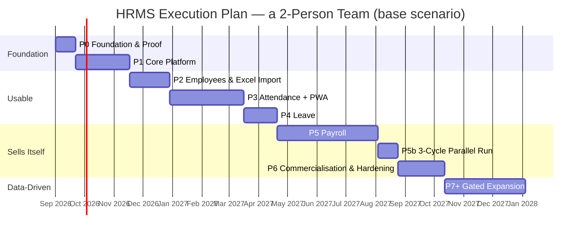

# 12 — Execution Plan for a Small Team (1–3 People)

**Status:** supersedes the roadmap in document `04` §2–§10 for the team as it stands.
**What still applies from `04`:** the roadmap philosophy (§1), the Excel customer migration strategy (§13), and most of the risk register (§11).
**Date:** 18 August 2026

---

## 1. Why This Document Exists

Document `04` lays out a roadmap for a team of **14–15 FTE over 18 months (±320 person-months)** on top of a 16–24 microservice architecture. That plan is internally coherent — every decision in it can be justified **if its team assumption holds**.

That assumption does not hold. The real capacity is **1–3 people**.

The consequence is not "work more slowly". At 2 people, ±320 person-months means **±13 calendar years**. A plan that takes 13 years is not a slow plan — it is the wrong plan. Running it as written would end before the first customer paid anything.

This document restructures the execution with two large changes and one thing kept entirely intact:

| | Change |
|---|---|
| **Architecture** | Microservices → **a modular monolith built to be split**. The domain boundaries, contracts, and RLS are kept; the distributed infrastructure is deferred until there is a real trigger (§9). |
| **Scope** | 10 reference modules + 10 expansion modules → **4 core modules** (Employees, Attendance, Leave, Payroll). The rest waits for real usage data. |
| **Principles** | **Unchanged.** The sixteen principles in document `00` §3.2 remain binding, including P6 (RLS), P11 (a superuser never bypasses RLS), P12 (additive migrations), P13 (history is never overwritten), and P14–P16 (attendance & privacy). Those principles are cheap to keep and expensive to retrofit. |

**The saving splits honestly:** going from ±320 to ±34 person-months, roughly **80% comes from cutting scope** and only **20% from the architectural change**. A modular monolith is no magic shortcut — cutting 16 modules nobody has necessarily agreed to buy is what saves the time.

---

## 2. The Real Constraints That Shape This Plan

| Constraint | Consequence for the plan |
|------------|--------------------------|
| A team of 1–3 | No specialised roles. The person who writes the payroll code is the person who takes the call when production goes down. Operational load is a direct tax on feature velocity. |
| No SRE | Kubernetes, a service mesh, a clustered RabbitMQ, and Jaeger cannot be operated. Every infrastructure component has to survive being forgotten for weeks. |
| No code yet | No legacy burden. This is a one-time advantage: module boundaries enforced from the first commit are far cheaper than boundaries fitted at commit 3,000. |
| No commercial target yet | Freedom of ordering, **but also the biggest danger**: without customer pressure, a small team tends to build foundations for a year with not one user. This plan installs commercial gates against that tendency (§6). |
| Payroll carries legal risk | The one part that **must not** be rushed. Getting PPh21 wrong is not a bug — it is the customer's legal obligation transferred onto our shoulders. |

---

## 3. The Architectural Decision: a Modular Monolith Built to Be Split

### 3.1 The Shape of the System

One codebase, two running processes, one database.

```
hrms/
├── apps/
│   ├── web/                 Next.js 15 — UI + REST route handlers. One deployable.
│   └── worker/              A Node process — pg-boss consumers (import, payroll, PDF, notifications)
├── packages/
│   ├── core/                The domain modules. The heart of this decision.
│   │   ├── tenant/
│   │   ├── iam/
│   │   ├── employee/
│   │   ├── attendance/
│   │   ├── leave/
│   │   └── payroll/
│   ├── db/                  The Prisma schema, migrations, RLS helpers, the tenant-scoped client
│   └── contracts/           Zod schemas: internal events, API payloads, the Excel import contract
└── ops/                     docker-compose, backup scripts, runbooks
```

**Four rules that make this more than a monolith:**

1. Every module in `packages/core/*` may only be imported through its public `index.ts`. Enforced by `eslint-plugin-boundaries` as a CI gate — not by verbal agreement. Breaking it fails the build, exactly as separate DB credentials enforce P10 under microservices.
2. Modules communicate through **internal events** that pass through the `outbox` table and pg-boss, not through direct cross-domain function calls. The code has the same shape as the distributed version; only the distance travelled differs.
3. Every module owns its **own PostgreSQL schema** (`employee.*`, `attendance.*`) within one database. There is no cross-schema `JOIN` in application code — cross-module data is fetched through a module's public API or a local replica table, exactly as in the original design.
4. `ROUTE_MANIFEST` (document `01` §5.2) stays. Every route is registered with its module and permission; an unregistered route returns 404. P7 is not compromised.

Rules 1–3 are **the price paid now so that §9 is possible later**. Without all four, this would be an ordinary monolith and splitting off a service later would mean a rewrite.

### 3.2 The Technology Stack: a Revision of Document `01` §6

| Layer | Document `01` | This plan | Reason for the change |
|-------|---------------|-----------|-----------------------|
| Deployables | 16–24 services | **1 web + 1 worker** | One build, one deploy, one log. Operable by one person. |
| Runtime | NestJS per service | **Next.js 15 (App Router) + a Node worker** | One language, one build tool, one pipeline. The domain logic stays in `packages/core`, framework-free. |
| Database | 24 DBs, one per service | **1 PostgreSQL 18, a schema per module** | Logical isolation is kept through schemas + RLS. A single backup, a single PITR. |
| Message broker | RabbitMQ 4 quorum queues | **pg-boss (inside PostgreSQL)** | Removes one system that has to be kept alive. HRIS volume (thousands of messages a minute) is far below pg-boss's limits. |
| Cache / locks | Redis 7 | **PostgreSQL advisory locks + in-process cache** | Redis is added when there is evidence it is needed, not before. |
| Real time | Socket.IO + Redis Streams | **SSE + `LISTEN/NOTIFY`, polling fallback** | A single web process needs no cross-node fan-out. Socket.IO follows if the web tier scales horizontally. |
| Internal RPC | gRPC + protobuf | **TypeScript function calls through a module's `index.ts`** | The contract stays explicit and type-checked. Network serialisation is a cost with no benefit inside one process. |
| Orchestration | Kubernetes + Argo CD | **Docker Compose on 1 VPS**, managed PostgreSQL | K8s without an SRE is a liability, not an asset. |
| Object storage | MinIO / S3 | **Managed S3-compatible** (R2 / IDCloudHost) | No storage that has to be looked after in-house. |
| Observability | OTel + Jaeger + Prometheus + Grafana + Loki | **Sentry + structured logs (pino) + an uptime check** | Distributed tracing solves a problem that does not exist yet. Sentry captures 90% of the value at 5% of the operating cost. |
| Frontend | Next.js 15 + AG Grid + PWA | **Unchanged** | An Excel-like grid and the PWA are core selling points (document `00` §2.1), not luxuries. |
| ORM | Prisma 6 | **Unchanged** | With the migration fences from document `09` §7.1 still fitted. |

### 3.3 What Is Kept Intact From the Blueprint

This is not a wholesale simplification. The following are still built from Phase 1 because they are **expensive or impossible to retrofit**:

| Kept | From document | Why it cannot be deferred |
|------|---------------|---------------------------|
| RLS on every `tenant_id` table, an application role that is `NOBYPASSRLS` | `02`, `06` | One cross-tenant leak kills a B2B product. Fitting it across 60 tables full of data is far more expensive than across 6 empty ones. |
| Additive migrations + the SQL linter | `09` | The `DROP`/`RENAME` habit cannot be undone once embedded. The linter is 80 lines of script. |
| Append-only `audit_logs` | `02` | History not recorded from the start is lost forever. |
| Time-dimensioned history (`daterange`) for salaries, rates, policies | P13 | Last year's payslip must not change because of this year's rate. Retrofitting means losing the history. |
| `ROUTE_MANIFEST` + entitlement and permission guards in one place | `01` §5, `05` | P7–P9. Adding it after 200 routes exist means auditing 200 routes. |
| A separate superuser realm (a different token audience, mandatory TOTP, no access to tenant data) | `07` | P11. Implemented as an `/_admin` route group inside the same deployable — **the principle is kept, the infrastructure deferred**. |
| The outbox + idempotent consumers | `03` | The code shape that makes §9 possible. On pg-boss the cost is near zero. |
| Attendance trust scoring + human review | `10` (P14) | Promising "spoof-proof" and then walking it back destroys trust. Design it honestly from the start. |
| Purpose limitation on location data | `10` (P15) | Once raw coordinates enter a report, pulling them back out is a breaking change. |
| Excel import/export in every module | `00` §2.1 | This is the migration path from the reference product. Without it there is no first customer. |

### 3.4 Buy, Don't Build

For a team this size, every component built in-house is a component to maintain forever.

| Need | Decision |
|------|----------|
| PostgreSQL | Managed (Neon / Supabase / RDS). Building HA in-house needs an SRE who does not exist. |
| Transactional email | Resend / Postmark. Do not touch SMTP or IP reputation. |
| Error tracking | Sentry. |
| Payments & subscriptions | **Midtrans / Xendit**, not Stripe — the Indonesian market needs virtual accounts, QRIS, and e-wallets. |
| File storage | Managed S3-compatible. |
| Crypto primitives | `argon2id` + `jose`. Do not write token handling from scratch. |
| National holidays | A maintained data source plus a per-tenant override. |
| **PPh21 & BPJS rules** | **Build in-house, but as versioned configuration (`statutory_configs` + `daterange`), not code.** This is the one piece of logic that must not be bought — and must not be hard-coded either. |

---

## 4. The Rules That Bind This Plan

1. **Every phase ends with something used by someone outside the team.** Phase 1 is the only exception, and that is why it is capped at 8 weeks.
2. **A commercial gate precedes the next phase.** A phase does not start because the previous one finished, but because its gate condition is met (§6). This is the main antidote to the "build for a year with no users" risk.
3. **Payroll does not start without a domain expert engaged.** Not a preference — a hard precondition. Gate C.
4. **The fifth module is not built until the fourth is proven to be used.** The threshold: > 30% of active tenants.
5. **Anything outside the four core modules goes on a waiting list, not into a sprint.** Requests from large prospects included. Especially those.

---

## 5. The Phase Map



**What matters is the milestone, not the date:**

| Milestone | After | Calendar (2 people, no buffer) |
|-----------|-------|--------------------------------|
| The first pilot uses the system with real data | P2 | ±17 weeks (±4 months) |
| **The first customer can pay** | P3 | ±28 weeks (±6.5 months) |
| Coverage equal to the reference Basic plan | P5b | ±51 weeks (±12 months) |
| Selling without the team touching anything | P6 | ±58 weeks (±13.5 months) |

With the 25% buffer (§7), "first paying customer" lands at **±8 months** and "complete Basic" at **±17 months**.

---

## 6. Phase Detail

### Phase 0 — Foundation & Proof (3 weeks)

The goal: remove the uncertainties that could invalidate the whole plan, **before** writing production code. For a small team, a spike that fails in week 2 is a six-month saving.

**Activities**

| Activity | Output |
|----------|--------|
| Interview 5 HR practitioners (prioritise users of the reference Excel product) | A ranked list of pain points, not a feature list |
| Collect real artefacts: 30 payslips, 3 Excel attendance files, 2 fingerprint machine exports, 3 leave policies | The material for the golden regression tests |
| Four spikes (below) | Written decisions (ADRs) |
| Repo, CI, staging, managed PostgreSQL, Sentry | The environment is ready |

**Spikes — cut from nine to four**

Five of the spikes in document `04` (S2 WebSocket fan-out, S7 gRPC chains, S8 sagas, S9 the DX of 16 services, part of S6) test risks that **no longer exist** under this architecture. The four that remain become more important:

| Spike | Question | Pass criterion | If it fails |
|-------|----------|----------------|-------------|
| **S1 — PPh21 TER accuracy** | Does the calculation match 30 real payslips? | **30/30 exact to the rupiah** | Payroll leaves the product promise until a domain expert is involved. Do it as a spreadsheet/script first — no application needed yet. |
| **S2 — Excel import** | Are 5,000 rows validated and committed in under 60 seconds with per-row error reporting? | Achieved | Redesign it as a batched asynchronous import. |
| **S3 — RLS + `SET LOCAL`** | Does the tenant context leak between transactions on the Prisma connection pool? | **Zero leaks across 100,000 concurrent transactions** | Move to a per-tenant client, or a non-transactional `SET` with explicit cleanup. |
| **S4 — PWA punching on a real device** | Do permissions, indoor GPS accuracy, and the IndexedDB queue survive 24 hours? | Tested on ≥1 mid-range Android **and** ≥1 real iPhone | Adjust the geofence policy and accuracy thresholds before designing the trust score. |

> S1 and S3 are the two most often skipped and the most expensive to discover late. S1 decides whether payroll can be promised at all. S3 fails without symptoms — a cross-tenant leak throws no error, it simply shows somebody else's data.

**Phase 0 DoD**
- [ ] The four spikes pass, or produce a written architectural decision
- [ ] 30 payroll cases documented with their expected results
- [ ] ADRs recorded for: the modular monolith, pg-boss, one multi-schema DB, the module boundaries
- [ ] Repo, CI, staging, and PITR backups running; a restore has been tested once

---

### Phase 1 — Core Platform (8 weeks)

The only phase with no output for an outside user. That is why it is capped hard: **anything unfinished in week 8 gets cut, not extended.**

**Scope**

- The monorepo + module boundaries enforced by lint as a CI gate
- One PostgreSQL, a schema per module, **RLS on every `tenant_id` table**, an application role that is `NOBYPASSRLS`
- Non-destructive migration tooling (document `09`, condensed): a SQL linter blocking `DROP`/`RENAME`/`TRUNCATE`/non-concurrent `CREATE INDEX`; every migration idempotent and tested by running it three times
- Append-only `audit_logs` + a helper used by every module
- **Auth**: `tenantCode + email + password`, argon2id, a 15-minute JWT, refresh with rotation and theft detection, account locking, password reset
- **Tenant**: tenants, plans, `tenant_modules`, the lifecycle (trial → active → suspended → churned)
- **IAM** (document `05`): roles, permissions, menus, per-user grants and denials, effective access resolution with a versioned cache
- **`ROUTE_MANIFEST`** + `EntitlementGuard` + `PermissionGuard` in one place; an unregistered route → 404
- **`/me/bootstrap`** and the UI shell: login, a dynamic sidebar, route guarding, the locked module page
- pg-boss + the `outbox` table + idempotent consumers
- **The `/_admin` realm**: a separate token audience, mandatory TOTP (enforced by a DB constraint), a tenant list plus basic metrics. **No read path into tenant data.**
- Deployment: Docker Compose on 1 VPS, managed PostgreSQL, Sentry, structured logs, an uptime check

**Phase 1 DoD**
- [ ] A new tenant can be created; a user logs in; the sidebar renders exactly the active modules
- [ ] **CI gate**: a tenant A token cannot read a single row belonging to tenant B — tested on every table
- [ ] **CI gate**: zero routes without a `ROUTE_MANIFEST` entry
- [ ] **CI gate**: module boundaries are not violated (a cross-module import other than through `index.ts` fails the build)
- [ ] Every migration is idempotent; the linter blocks the forbidden operations
- [ ] A superuser is proven unable to read any tenant's data
- [ ] A restore from backup is tested and documented

---

### Phase 2 — Employees & Excel Import (6 weeks) → **the first pilot release**

The first module used by people outside the team. Its value is simple and immediate: replacing the *Employee Database* sheet with something that does not break when two people open it at once.

**Scope**

- Employee CRUD with an **Excel-like grid** (AG Grid): paste from the clipboard, keyboard navigation, bulk edit
- The organisational structure, positions, period-based assignments
- Fixed-term and permanent employment contracts with an end date
- Employee documents (uploaded to object storage)
- PII encryption and permission-based masking (national ID, tax ID, bank account)
- **The Excel import wizard**: upload → column mapping → preview → per-row validation → commit; an `.xlsx` template is provided
- `.xlsx` export on every list
- **Contract reminders at 90 / 30 / 7 days** — module A5 from document `08` pulled forward to here because the data already exists, the cost is near zero, and the value is the easiest to explain to a buyer

**Phase 2 DoD**
- [ ] **Three pilot companies import ≥100 real employees from their own Excel files, in under 30 minutes, with no help from the team**
- [ ] The export produces a file that opens in Excel and matches the data row for row
- [ ] Import errors are reported per row and can be corrected and re-uploaded
- [ ] PII is masked according to permission; unmasking is recorded in the audit log

> **Gate A** — if three pilots cannot import on their own, fix that first. Do not go on to Phase 3. Failing here predicts the failure of the entire customer migration strategy (document `04` §13).

---

### Phase 3 — Attendance & PWA (11 weeks) → **the first paid release**

The largest phase before payroll, and the most decisive. Attendance is daily pain — the module people will pay for even when the others do not exist yet.

**Scope**

- Shift master data, schedule patterns, the national holiday calendar with tenant overrides
- Punch sources: manual HR entry (a grid), **a generic CSV/Excel import from attendance machines**, web/PWA punching
- **The PWA** (document `11`): manifest, a Workbox service worker, installable, caches separated per tenant **and** per user, a full wipe on logout
- **The offline punch queue** (IndexedDB) with a `dedupe_key`; layered sync triggers; the iOS durability warning
- **Attendance evidence** (document `10`): `work_sites` + a Haversine geofence, capturing coordinates + accuracy, a selfie
- The photo pipeline: client compression → presign → **strip EXIF** → thumbnail → 90-day retention
- **Layered trust scoring + the HR review queue** — not automatic accept/reject (P14)
- The Personal Data Protection Act consent screen; an employee can see all of their own attendance evidence
- The daily calculation (present/late/overtime/absent), audited manual correction
- Period recaps, period closing, `period_snapshots`
- The attendance dashboard (SSE, polling fallback)

**What is deliberately not built here:** per-vendor attendance machine connectors (Solution, Fingerspot, ZKTeco, Hikvision). A generic CSV/Excel import handles all of them at a fifth of the cost. A native connector gets built when a customer pays for that specifically.

**Phase 3 DoD**
- [ ] A punch outside the geofence is **still recorded and flagged** — never lost
- [ ] A denied camera/location permission is handled per tenant policy without breaking the app
- [ ] A flagged punch enters the HR review queue — neither silently accepted nor automatically rejected
- [ ] EXIF is stripped from every photo; photos past retention are deleted automatically, **their attendance records intact**
- [ ] Offline punches are stored and sent when online, **with no duplicate even if the flush runs twice**
- [ ] Dashboard and sensitive-data endpoints never enter Cache Storage — verified by an automated test
- [ ] The cache and push subscription are fully wiped on logout; user A's data is not readable by user B on the same device
- [ ] Tokens are never stored in Cache Storage or IndexedDB
- [ ] Lighthouse PWA 100, Performance ≥ 90 on the mobile profile
- [ ] Tested on Chromium and WebKit, **and on ≥2 real physical devices**

> **Gate B** — at least **one tenant pays** for Employees + Attendance before Phase 4 starts. This is the most important gate in the plan. If nobody will pay for attendance, payroll will not save it — and it is better to know that in month 7 than in month 14.

---

### Phase 4 — Leave (5 weeks)

**Scope**

- Leave types, accrual policies, annual balance creation
- Submission + a tiered approval flow
- The team/department leave calendar
- The balance movement ledger + the carry-over expiry job
- Integration with attendance: a day on leave is not counted absent
- Full concurrency handling (document `03` §4.1) — an advisory lock per employee

**Phase 4 DoD**
- [ ] The flow runs from submission through approval; the balance is deducted accurately
- [ ] **Concurrency test: 50 simultaneous approvals against a 2-day balance → exactly 1 succeeds**
- [ ] The balance is never negative; every movement has a ledger row
- [ ] The team calendar is visible to a manager within their permission scope, and no further

→ **A "Basic without payroll" plan is ready to sell** (Employees + Attendance + Leave = 3 of the 4 features in the reference Basic plan).

---

### Phase 5 — Payroll (15 weeks + 3 weeks of parallel running)

The riskiest phase in the product. A payroll error is not a bug — it is a trust incident that is rarely recoverable.

> **Gate C — hard preconditions, checked before the first line is written:**
> 1. **A payroll/HR expert is engaged** — a part-time consultant at minimum. The PPh21, proration, and overtime rules are too nuanced to interpret from a document.
> 2. **30 real payslips collected** along with their expected results, documented as executable test cases.
> 3. **Spike S1 passes 30/30.**
>
> Without all three, Phase 5 is **deferred** — not run on assumptions. Deferring payroll means losing a sales opportunity; getting payroll wrong means losing customers and potentially taking on their legal liability.

**Scope**

- Configurable salary components (fixed, per day/hour, percentage, formula)
- **An allowlisted expression parser for formulas — no `eval()`**
- A per-employee salary structure with period-based history (P13)
- PPh21 under the TER scheme + the December annual calculation, PTKP, gross/net/gross-up
- BPJS Ketenagakerjaan (JHT, JP, JKK, JKM) and Kesehatan with wage ceilings
- Proration for mid-month joiners and leavers, overtime per the Kepmenaker formula
- THR as a separate `run_type`
- PDF payslips + distribution to ESS
- **Versioned `statutory_configs` with a `daterange`** — a rate change is configuration, not a deploy
- **A per-line `calculation_trace`** — when an employee disputes their pay, HR shows the breakdown instead of arguing
- Bank export: **two banks only (BCA + Mandiri)**; others follow on real demand

**Deferred to Phase 6+ on demand:** periodic tax filing, the official BPJS recap format, the accounting journal. All three are reporting formats that change with regulation and become permanent maintenance debt (risk R27) — built only when a customer asks for them specifically.

**The quality strategy**

| Layer | Approach |
|-------|----------|
| Golden regression tests | 30 cases from real payslips run on **every commit**; a one-rupiah deviation fails the build |
| Property tests | Net pay is never negative; the payslip line total equals the header; recalculation is deterministic |
| Snapshot determinism | Recalculating from the same attendance snapshot gives an identical result even if the upstream data changed |
| **Parallel run (3 weeks)** | Pilots run payroll in both the old **and** the new system. Release only after **3 identical cycles**. |

**Phase 5 DoD**
- [ ] **3 parallel payroll cycles identical to the old system down to the rupiah**
- [ ] 1,000 employees finish in under 3 minutes
- [ ] Running the same run twice produces exactly one run
- [ ] Killing the worker mid-calculation → it continues with no duplicate payslip
- [ ] A payslip is visible only to its owner and to holders of the right permission, tested with a cross-tenant token
- [ ] A tax rate change is applied through configuration, without a redeploy
- [ ] MFA is available (and recommended) for roles with payroll access

→ **Coverage equal to the reference product's Basic plan is reached.**

---

### Phase 6 — Commercialisation & Hardening (7 weeks)

Up to this phase, selling still requires the team's involvement. This phase removes the team from that path.

**Scope**

- **Billing**: Midtrans/Xendit, monthly and annual subscriptions, invoices, dunning, failed payment recovery
- Self-service registration + a **14-day trial**
- Self-service module activation and deactivation — a condensed version of the marketplace in document `04` §7: one catalogue page, not an add-on platform
- The complete tenant and team dashboards (document `07` §5), three scopes: tenant, team, ESS home
- Ready-made reports + `.xlsx` export across every module
- Tiered notifications: email → Web Push → WhatsApp (WhatsApp only for urgent matters, because Web Push is unreliable on iOS)
- Hardening: per-tenant rate limits, `statement_timeout`, daily schema drift detection, runbooks for the 5 most likely incidents
- **Subscription credit for owners of a reference Excel product licence** (document `04` §13)

**Phase 6 DoD**
- [ ] A customer can register, try, pay, and enable a module **without touching the team**
- [ ] Disabling a module hides its menu and refuses its API, but **the data stays intact** and returns when it is re-enabled
- [ ] A subscription change is reflected in the UI within 10 seconds without logging in again
- [ ] A tenant's data can be exported in full on request (Personal Data Protection Act portability)

---

### Phase 7+ — Data-Driven Expansion (not scheduled in advance)

> **Gate D** — the next module does not start until **adoption of the last one exceeds 30% of active tenants**. This is the direct antidote to risk R26 (expanding breadth ahead of depth), which for a small team is not a risk but nearly a certainty.

The candidate order, adapted from document `08` §4.1 for this team's capacity:

| Order | Module | Reason |
|-------|--------|--------|
| 1 | **Claims & reimbursement** | The only module almost every employee touches every month — the strongest retention driver |
| 2 | **Simple performance** | Completes the reference Basic plan (its 4th feature); the scope is cut to periodic appraisal + weighted KPIs, without calibration or the 9-box |
| 3 | **Onboarding & offboarding** | The highest stickiness; makes use of all the data that already exists |
| 4+ | Reviewed against usage data | — |

---

## 7. Estimates & Calendar Reality

### 7.1 Workload per Phase

| Phase | Person-weeks | Output |
|-------|--------------|--------|
| P0 — Foundation & proof | 6 | Decisions & the environment |
| P1 — Core platform | 16 | The foundation (no outside users) |
| P2 — Employees & Excel import | 12 | **The first pilot** |
| P3 — Attendance & PWA | 22 | **The first paying customer** |
| P4 — Leave | 10 | Basic without payroll |
| P5 — Payroll + the parallel run | 36 | **Equal to the reference Basic plan** |
| P6 — Commercialisation & hardening | 14 | Sells itself |
| **Total** | **116 person-weeks ≈ 27 person-months** | |
| **+ 25% buffer** | **≈ 34 person-months** | |

The buffer is 25% (rather than document `04`'s 20%) because a small team has no capacity to absorb surprises: one person ill for a week is 50% of capacity gone.

### 7.2 Calendar by Team Size

Adding people does not scale linearly on work like this — coordination and conflicts on the same module eat part of the gain.

| Team size | First paying customer (end of P3) | Equal to the Basic plan (end of P5) | Sells itself (end of P6) |
|-----------|-----------------------------------|-------------------------------------|--------------------------|
| **1 person** | ±14 months | ±29 months | ±33 months |
| **2 people** (base scenario) | **±8 months** | **±17 months** | **±19 months** |
| **3 people** | ±6 months | ±13 months | ±14.5 months |

The figures include the 25% buffer.

**The important reading of this table:** at 1 person, payroll only arrives in the third year. If payroll is a non-negotiable part of the product proposition, **1 person is not a viable team size for this plan** — and hiding that inside an estimate merely converts it into a two-year delay later.

### 7.3 Comparison with Document `04`

| | Document `04` (microservices) | This plan (modular monolith) |
|---|-------------------------------|------------------------------|
| Person-months including the buffer | ±320 | **±34** |
| Module scope | 10 reference + 10 expansion | **4 core** |
| Number of deployables | 16–24 | **2** |
| Number of databases | 24 | **1** |
| Infrastructure components to keep alive | K8s, RabbitMQ, Redis, Jaeger, Prometheus, Loki, Argo CD, MinIO | **PostgreSQL + object storage (both managed)** |
| Minimum viable team size | 13–15 | **2** |
| Blast radius of one bug | One service | **The whole system** ← a consciously accepted consequence |
| Time to split one domain into a service | Already split | **4–6 weeks** (because the module boundaries were enforced from the start) |

The last two rows are the true price of this decision, and both are acceptable at this scale: with 5–50 tenants, one bug that takes the system down for 20 minutes is an incident recoverable with an apology — not a company-ending event.

---

## 8. What Is Deliberately Not Built

This list matters as much as the phase list. Every line is a conscious decision, not an oversight.

| Not built | Reason | Reviewed when |
|-----------|--------|---------------|
| Full recruitment / ATS | The largest module in the reference catalogue, with a different buyer and sales cycle | There are ≥5 paying requests |
| Planning (RACI/DACI, FTE, IDP) | The lowest value per person-month in the catalogue; easily replaced by a spreadsheet | Usage data shows demand |
| OHS/HSE, Training, Assets | Needs domain expertise the team does not have (risk R28) | An expert is engaged **and** the concept is validated with ≥3 companies |
| A native app (React Native) | The PWA serves ≥90% of ESS needs. Native only adds a reliable offline queue, mock GPS detection, and iOS push | A tenant with strict compliance needs pays for it |
| SSO/OIDC, SAML, SCIM | An enterprise segment need, not one for SMEs of 20–2,000 employees | We enter the enterprise segment |
| Per-vendor attendance machine connectors | A generic CSV/Excel import handles every vendor at a fifth of the cost | One vendor dominates the customer base |
| ISO 27001 / SOC 2 | A large ongoing cost with no revenue to justify it | Requested in a tender whose value covers it |
| Per-customer siloed deployment | Multiplies an operational load already carried by 2 people | A state-owned/enterprise contract priced to reflect it |
| A full add-on marketplace | One catalogue page plus a toggle already delivers 90% of the value | More than 8 modules exist |
| Kafka, a service mesh, GraphQL federation, event sourcing | Already rejected in document `01` §6.3, for reasons that are **stronger still** with this team | — |

---

## 9. When to Return to Microservices

This plan does not discard the architecture in document `01` — it defers it until there is evidence justifying the cost. That evidence takes the form of measurable triggers, not a hunch.

| Trigger | Threshold | What gets split first |
|---------|-----------|-----------------------|
| The attendance write load burdens the shared DB | p95 write > 200 ms during the morning rush, with index tuning exhausted | `attendance` |
| A payroll run disturbs user requests even from a separate worker | API latency rises more than 2× during a run | `payroll` |
| Deploy collisions become routine | A team of more than 8, or more than 3 times a month waiting on someone else's deploy | The module with the highest release frequency |
| An enterprise customer demands an isolated deployment | A contract that covers its operating cost | Whatever the contract requires |

**Why splitting later is not a rewrite.** Because the four rules in §3.1 are enforced from the first commit, a module already has a public API boundary, event-based communication, and its own database schema. Splitting it means: move the folder into a new deployable, swap the `index.ts` calls for HTTP/gRPC, move the schema into its own database, point pg-boss at a shared broker. **An estimated 4–6 weeks per service.**

If those four rules are **not** enforced, the same figure becomes 4–6 months per service. That is the entire value of module boundary discipline — and it is why boundary linting is a CI gate rather than a suggestion.

### 9.1 Amendment — auth is being split ahead of these triggers

**None of the triggers above has fired**, and `auth` is not in the table. It is
being extracted anyway, by decision recorded in
[`14-Service-Split-and-Platform-Evolution.md`](14-Service-Split-and-Platform-Evolution.md).

That document argues the case on grounds specific to auth — a dependency star
with no back-edges, the lowest change rate paired with the widest blast radius, a
different scaling profile, and being the only sensible home for SSO, SAML, and a
public API — and it states the costs plainly rather than claiming a trigger fired
when none did.

This section is **not** thereby weakened for any other module. A split without
evidence is still the wrong default, and §14 §3 makes the same point about
itself: if SSO and a public API are not genuinely on the roadmap, the extraction
should stop after its fifth stage, which is valuable on its own.

---

## 10. Risks: Gone, Remaining, New

### 10.1 Gone with the microservices

R10 (wrong service boundaries), R11 (replica drift), R12 (failed saga compensation), R13 (the operational load of 16 services), R14 (cascading failure), R29 (the service count exceeding capacity), R36 (contract consumers left behind).

Seven categories of failure that no longer need watching. This is the biggest gain from this architectural decision — bigger than its person-month saving.

### 10.2 Still applicable from document `04`

R1 (payroll accuracy), R2 (regulatory change), R3 (a messy Excel migration), R4 (cross-tenant leak), R6 (low adoption because the UI is more complex than Excel), R9 (a Personal Data Protection Act incident), R17 (noisy neighbours), R19 (an accidental tenant purge), R26 (breadth ahead of depth), R32–R34 (schema bloat, locking migrations, flooding backfills), R39/R41/R43/R47 (the limits of attendance detection and permission denials), R48/R50/R51/R52 (PWA: the iOS queue, cache leaks, install adoption, iOS push).

### 10.3 New — specific to this architecture and team size

| # | Risk | Prob. | Impact | Mitigation |
|---|------|-------|--------|------------|
| **N1** | **The monolith turns into a ball of mud; the module boundaries quietly dissolve** | **High** | **High** | Boundary linting as a CI gate from the first commit. This is not a style suggestion — it is the one thing that makes §9 possible. |
| **N2** | **One bug takes down the whole system** | Medium | High | A consciously accepted consequence. Damped by: the worker separate from the web tier, `statement_timeout`, per-module timeouts, a deploy rollback in under 5 minutes. Acceptable at 5–50 tenants; reviewed above that. |
| **N3** | **A bus factor of 1–2 people** | **High** | **Critical** | Business rules documented as **executable test cases**, not spoken knowledge (R7 extended). An ADR for every irreversible decision. Runbooks for 5 incidents. |
| **N4** | **Payroll is built without a domain expert because "we have already come too far"** | **High** | **Critical** | Gate C is hard and checked before the first line, not at release. |
| **N5** | **Running out of energy or money before the first customer** | **High** | **Critical** | Gates A and B force contact with the market in months 4 and 8, not month 14. |
| **N6** | **A large customer asks for a feature outside the 4 core modules and the team obliges** | **High** | High | The rule in §4.5. A request goes onto a waiting list with a price, not into a sprint. One large customer bending a 2-person team's roadmap can consume a year. |
| **N7** | **pg-boss becomes a bottleneck at peak attendance volume** | Low | Medium | Measure it in Phase 3. Its limits are far above HRIS volume; if reached, that is precisely the first trigger in §9. |

---

## 11. The Metrics Actually Monitored

Document `04` §12 lists 30+ metrics. A 2-person team will not monitor 30 metrics — they will monitor none. Here is a list that fits on one screen and is enough to detect every failure that matters.

| Metric | Threshold | Why this one |
|--------|-----------|--------------|
| Cross-tenant leak incidents | **0** | One occurrence ends a B2B product |
| Payroll deviation in the parallel run | **0 rupiah** | The Phase 5 release gate |
| Availability | ≥ 99.5% monthly | Matches the NFR target in document `00` |
| p95 API latency | < 500 ms | Enough to feel fast at this scale |
| Time to first value (registration → a dashboard with data) | < 30 minutes | The core proposition against Excel |
| Pilot retention at week 4 | ≥ 70% | The earliest signal that the product is used, not merely bought |
| Punches entering the review queue | < 12% | Above this, HR stops reviewing and the trust score becomes theatre |
| Payroll disputes per 1,000 payslips | < 1 | The real measure of trust |
| Migrations holding a lock > 2 seconds | **0** | One bad migration = downtime during peak hours |
| Average active modules per tenant | ≥ 2 | The signal for Gate D |

---

## 12. Decision Summary

| Aspect | Decision |
|--------|----------|
| Architecture | A modular monolith: 1 web + 1 worker, module boundaries enforced by lint, events through the outbox + pg-boss. Ready to split against measurable triggers (§9) |
| Database | One managed PostgreSQL 18, a schema per module, **RLS on every `tenant_id` table**, an application role that is `NOBYPASSRLS` |
| Infrastructure | Docker Compose on 1 VPS + managed PostgreSQL and object storage. No K8s, RabbitMQ, Redis, or distributed tracing |
| 18-month scope | **Four modules**: Employees, Attendance, Leave, Payroll — equal to the reference product's Basic plan |
| Frontend | Next.js 15 + AG Grid + PWA. No native app |
| Superuser | A separate realm (`/_admin`, a different token audience, mandatory TOTP), **with no read path into tenant data**. P11 is kept without separate infrastructure |
| Order | Foundation → Employees → Attendance → Leave → Payroll → Commercialisation → gated expansion |
| Gates | A: 3 pilots import unaided · B: 1 paying customer · C: a payroll expert + 30 test cases · D: adoption above 30% |
| Estimate | ±34 person-months including the buffer. **A 2-person team: first paying customer ±8 months, equal to the Basic plan ±17 months** |
| Principles | The sixteen principles in document `00` §3.2 remain binding without exception |
