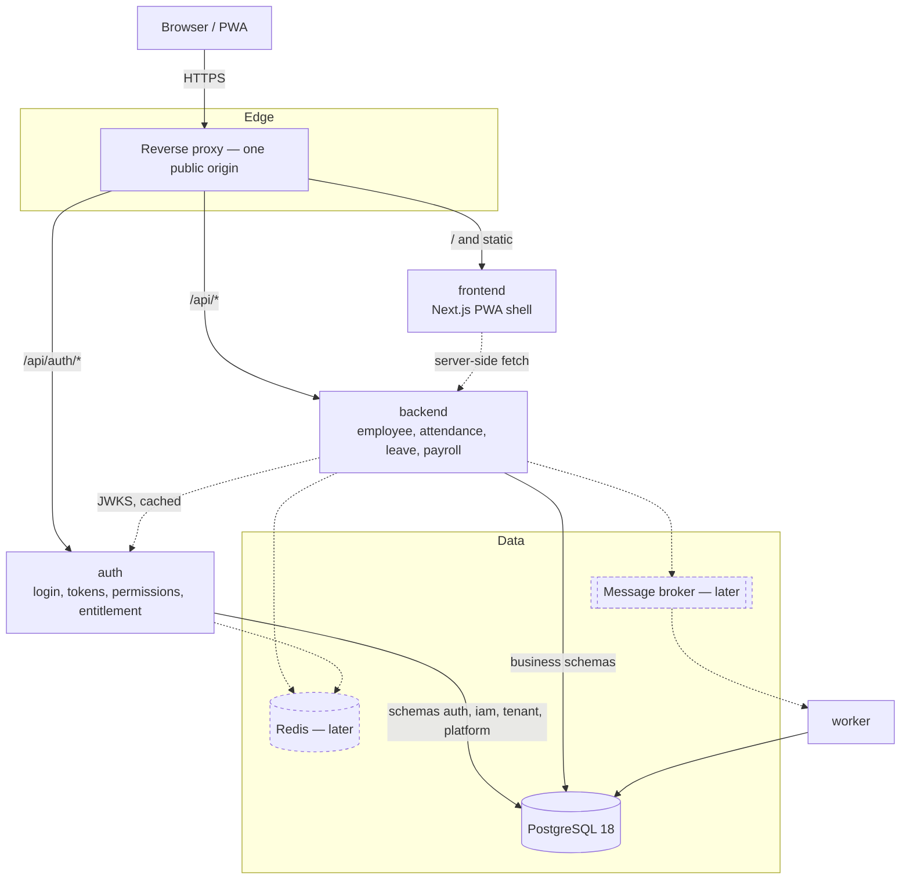

# 14 — Service Split: Extracting Auth, and the Platform Around It

**Status:** decided, not yet built.
**Supersedes:** nothing. It *amends* document `12` §9 — see §3, which is the part
of this document worth arguing with.

---

## 1. What Changed

The deployment target is now **four containers** instead of two:

| Container | What it is | Exists today |
|---|---|---|
| `frontend` | The PWA and its server-rendered shell | Part of `apps/web` |
| `backend` | The business API — employee, attendance, leave, payroll | Part of `apps/web` |
| `auth` | Identity, sessions, tokens, permissions, tenant entitlement | Inside `packages/core` |
| `worker` | Scheduled and queued jobs | `apps/worker`, already separate |

And three platform components are anticipated rather than deferred forever:

| Component | Replaces | When |
|---|---|---|
| A message broker | pg-boss on the application database | §9.1 |
| Redis | in-process rate limiting, no permission cache | §9.2 |
| Datadog or equivalent | the structured logger writing to stdout | §9.3 |

This document records the decision, what it costs, what it must not break, and
the order in which it can be built without a period where nothing works.

---

## 2. Why Auth Is a Reasonable First Split

Document `12` argues for a modular monolith and it argues well. Auth is
nonetheless the one module where the argument is weakest, for reasons that are
specific to it rather than general:

1. **It is the only module every other module depends on and which depends on
   none of them.** The dependency graph around auth is a star with auth at the
   centre and no back-edges. Every other candidate for extraction — attendance,
   payroll — has edges in both directions.
2. **Its change rate is the lowest and its blast radius the highest.** Login has
   not changed shape in months; a bad deploy of it locks every user out of every
   module. Those two facts together are the textbook argument for a separate
   release cadence.
3. **Its scaling profile differs.** Argon2 verification is deliberately expensive
   in CPU and memory. It runs on a handful of requests per user per day, while
   attendance runs on thousands. Sizing one container for both means overpaying
   for one of them.
4. **It is the natural home for things not yet built** — SSO, SAML, MFA beyond
   the current TOTP, device trust, an OAuth server for a future public API. Each
   of those is a reason on its own for auth to have its own deploy.

None of that is true of, say, `leave`. This is an argument about auth
specifically, and it should not be read as the first step of a general migration
back to document `01`.

---

## 3. The Honest Cost — and Where This Contradicts Document 12

Document `12` §9 lists the triggers that justify splitting a service, and is
explicit that a split without one of them is a cost with no return. **None of
those triggers has fired.** There is no measured p95 problem, no deploy
collision, no enterprise contract demanding isolation.

That must be stated plainly rather than rationalised away, because §9 exists
precisely to stop a team splitting services on architectural taste. This
decision is being taken **ahead of its evidence**, and the following costs are
accepted knowingly:

| Cost | Concretely |
|---|---|
| A network hop on the hot path | Every authenticated request currently resolves permissions in-process. See §5 — this is the hard part, not the token verification everyone thinks of first. |
| Two more failure modes | Auth unreachable, and auth reachable but stale. Neither exists today. |
| A distributed transaction that used to be local | Registering a tenant writes `tenant`, `auth`, and `iam` rows in one PostgreSQL transaction. After the split it still can — see §4.2 — but only because of a deliberate choice about the database. |
| Local development gets heavier | Four containers to start, and a new class of "works on my machine" where a stale auth image is running. |
| The boundary lint stops being the whole guard | `eslint-plugin-boundaries` cannot see across a network call. What it enforced becomes an API contract that needs its own test. |

**What buys those costs back** is §2.4 — the features that have no sensible home
in a monolith gateway. If SSO, SAML, and a public API are not actually coming,
this split is not worth doing, and the right move is to keep the modular
monolith and revisit when §9 fires. That is a product question, not a technical
one, and it should be answered before any of §10 is started.

---

## 4. What the Auth Service Owns

### 4.1 Schemas

| Schema | Moves to auth | Why |
|---|---|---|
| `auth` — users, refresh tokens, action tokens | **Yes** | Credentials and sessions. Nothing else reads them. |
| `iam` — roles, permissions, menus, grants, access versions | **Yes** | The permission model is meaningless split from the thing that issues tokens against it. |
| `tenant` — tenants, plans, modules, tenant_modules | **Yes**, reluctantly | Because of P8. See below. |
| `platform` — superusers, platform audit | **Yes** | The control plane authenticates the same way. |
| `employee`, `attendance`, `leave`, `payroll` | No | They stay with the backend. |

`tenant` moving is the uncomfortable one. It is not an identity concern, and a
purist split would leave it with the backend. It moves because **P8 — "a
subscription beats a role" — is evaluated in the same breath as the permission
check**: `resolveEffectiveAccess` filters permissions by the tenant's enabled
modules, and returns a 402 before it ever considers a 403. Splitting those two
tables across a network boundary would mean the auth service asking the backend
for entitlement in order to answer the backend's authorization question. The
cycle is worse than the impurity.

### 4.2 One database or two

**One PostgreSQL instance, separate schemas, separate roles — at least
initially.** The auth service connects as a role with grants on `auth`, `iam`,
`tenant`, `platform`; the backend connects as a role with grants on the business
schemas. Neither can read the other's tables, enforced by `GRANT`, not by
convention.

This is a real boundary — a compromised backend cannot read password hashes —
while keeping tenant registration a single local transaction and keeping one
backup and one PITR timeline. Document `12` §3 made the same trade for the same
reason and it has held.

Separate database *instances* is a later step, and it is the step that turns
registration into a saga. It should not be taken until there is a reason beyond
tidiness.

> **Consequence to accept:** two services sharing an instance can still be taken
> down by one bad query. This split does not buy fault isolation at the database
> layer, and claiming otherwise would be the kind of comfortable half-truth this
> plan tries to avoid.

---

## 5. The Hard Part: Per-Request Authorization

This is the section that decides whether the split is a success or a latency
regression, and it is not the part most designs spend their time on.

**Today**, every authenticated request runs this inside the tenant transaction,
in `apps/web/src/lib/define-route.ts`:

```
verify JWT (local, no I/O)
  → withTenant(tid)               -- one connection, RLS context set
    → resolveEffectiveAccess(...)  -- six queries, in parallel
      → 402 if the module is not subscribed
      → 403 if the permission is missing
        → the handler
```

Six queries per request against `iam` and `tenant`. In-process and on the same
connection, that is cheap. **Across a network boundary it is a remote call on
every single request**, and it lands on the login service — the one that is
CPU-bound on argon2.

Three ways to answer it, and the choice is not obvious:

| Option | How it works | Cost |
|---|---|---|
| **A. Remote check per request** | Backend calls `POST /authorize {token, module, permission}` | Correct, revokes instantly, adds a round trip to every request and makes auth a hard dependency of every read |
| **B. Fat token** | Permissions are baked into the access token at issue | Zero I/O, but revocation waits a full TTL, and a user with many permissions gets a large token on every request |
| **C. Cached resolution** | Backend resolves locally from a cache keyed by `(tenant, user, accessVersion)`, invalidated by auth | Fast and revocable, at the cost of a shared cache — this is where Redis stops being optional |

**Recommendation: C, with B's `accessVersion` as the invalidation key.**

And there is a defect to fix before C is possible, found while writing this
document:

> **`av` is issued into every access token and read by nothing.**
> `packages/core/src/auth/tokens.ts` mints it, `accessTokenClaimsSchema`
> validates its shape, its comment describes the gateway comparing it against the
> recorded version and rejecting stale tokens — **and no code anywhere performs
> that comparison.** It is currently harmless, because access is resolved fresh
> from the database on every request and the cache the version invalidates does
> not exist. It stops being harmless the moment option C is built: the mechanism
> that makes a cached permission safe to trust is, today, decorative.
>
> Whoever builds §10 stage 3 must implement the comparison **before** the cache,
> not alongside it. Recorded in `13` under technical debt.

---

## 6. Tokens: HS256 Must Not Survive the Split

Access tokens are signed **HS256 with a shared `JWT_SECRET`**. In one process
that is fine: the signer and the verifier are the same code.

Across four containers it is not, and the reason is exact: **a symmetric secret
cannot distinguish "may verify a token" from "may mint one".** Giving the
backend the secret so it can verify makes the backend able to forge a token for
any user of any tenant. So can the worker. So can anything that reads the
environment of either. The entire value of a separate auth service — that
credentials and issuance live in one blast radius — is cancelled by the key
distribution.

**Required before any traffic crosses the boundary:**

| Change | Detail |
|---|---|
| Asymmetric signing | EdDSA (Ed25519) or RS256. `jose` already in use supports both. |
| A JWKS endpoint | `GET /.well-known/jwks.json` on the auth service; verifiers fetch and cache public keys. |
| Key rotation with an overlap window | Two keys valid at once, `kid` in the header, so rotation never invalidates live sessions. |
| The private key never leaves auth | Not in the backend's environment, not in the worker's, not in CI for anything but the auth image. |
| Audience separation preserved | `hrms-tenant` and `hrms-admin` are already distinct (P11) and must remain so. |

This is not an improvement to make later. A split that ships with a shared HS256
secret has the operational cost of four services and the security posture of one.

---

## 7. Origins, Cookies, and the Refresh Token

The refresh token is an **httpOnly cookie** and never appears in a response body
— deliberately, so page JavaScript cannot store it somewhere durable
(`PLAN/11` §5.3). That property is worth more than the convenience of any
topology, and it constrains the routing.

The cookie is issued by auth and must be sent to auth on refresh, while every
other request goes to the backend. Two ways to arrange it:

| Arrangement | Consequence |
|---|---|
| **Same origin, path-routed** — one public hostname, a reverse proxy sending `/api/auth/*` to auth and the rest to the backend | The cookie stays first-party and `SameSite=Strict` remains available. No CORS. **Preferred.** |
| Separate origins — `auth.example.com` and `api.example.com` | Requires `SameSite=None; Secure` and CORS with credentials, which weakens CSRF posture for no gain the product needs |

**Decision: one public origin, path-routed at the proxy.** The service boundary
is real; the URL boundary does not have to be, and making it public buys nothing
but exposure.

---

## 8. Target Topology



Dashed edges are not built yet. The solid ones are the minimum for the split to
function.

**On splitting `frontend` from `backend`:** these are one Next.js application
today. Separating them is a bigger change than extracting auth, because the
route handlers and the pages share the session context, the `ROUTE_MANIFEST`,
and the same build. It is listed as a container because that is the requested
target, but §10 sequences it **last**, and §11 records what would have to be
true first.

---

## 9. The Platform Components

### 9.1 A message broker

pg-boss uses the application database as a queue. It has been the right choice —
one fewer system to run, transactional enqueue with the write that caused it,
and document `12` N7 rates the risk of it becoming a bottleneck as *low*.

What would change that, in order of likelihood:

1. **Fan-out across services.** The outbox pattern already in use publishes
   events; with four services, more than one consumer wants them, and pg-boss's
   model is a job queue rather than a topic.
2. **Queue traffic competing with application traffic** for the same connections
   and the same WAL, at the morning attendance peak.
3. **Retention.** Job tables grow, and vacuum on them competes with the tables
   that serve requests.

**When it happens, what must be preserved:** the transactional outbox. The value
of enqueueing in the same transaction as the write is that a job is never lost
and never fires for a write that rolled back. A broker does not offer that
directly — the outbox table stays, and a pump moves rows to the broker. That
pump exists already (`apps/worker/src/outbox-pump.ts`), which is the main reason
this migration is tractable.

**Candidates:** RabbitMQ for routing flexibility; NATS JetStream for operational
simplicity; Redis Streams only if Redis is already there for §9.2 and the
durability guarantees are genuinely understood. **Kafka is almost certainly
wrong at this scale** — its operational weight exceeds the whole application's.

### 9.2 Redis

Two things need it, and one of them is already broken in a way that is invisible:

- **Rate limiting.** `apps/web/src/lib/rate-limit.ts` keeps buckets in a
  process-local `Map`. With one container that is correct. **With two replicas it
  silently permits double the configured rate**, and with four, quadruple — no
  error, no log, just a limit that is not the number in the config. Any
  horizontal scaling, which is one of the stated reasons for splitting, makes
  this wrong the moment it happens. The per-tenant quota in `define-route.ts` has
  the same shape and the same problem.
- **The permission cache** of §5 option C.

Not a session store: sessions are JWT-based and stateless by design, and moving
them into Redis would trade a property the design deliberately has.

### 9.3 Datadog or another log service

Structured JSON to stdout already exists (`packages/observability`), and
correlation IDs already flow through `runWithContext`. That groundwork is what
makes a log service useful rather than a firehose.

What the split makes necessary rather than merely nice:

| Need | Why it becomes necessary |
|---|---|
| **Trace context propagation** | A request that touches frontend → backend → auth cannot be reconstructed from four separate log streams by timestamp. The existing `x-correlation-id` must be forwarded across every service call, and `traceparent` (W3C) adopted if a tracing vendor is used. |
| Log aggregation | Four containers, N replicas. `docker logs` stops being an answer. |
| Alerting on the §11 metrics of document `12` | Especially cross-tenant leak incidents, which must page a human. |

**A caution specific to this product:** logs will pass through a third party.
Document `10` and the Personal Data Protection Act obligations mean employee
names, coordinates, and photo keys must not be in log bodies. There is an
existing PII redaction discipline in the logger; **it becomes a compliance
control rather than good manners** once logs leave the country, and vendor
region selection becomes a decision with legal weight, not a latency preference.

---

## 10. Migration Path

Each stage ships on its own and leaves the system working. No stage requires the
next one to be started.

| # | Stage | Deliverable | Reversible |
|---|---|---|---|
| 1 | ~~**Asymmetric tokens**~~ — **done**, see §10.1 | Ed25519 signing, `kid`, JWKS endpoint served by the current monolith. No topology change. | Yes — revert to HS256 |
| 2 | ~~**Enforce `accessVersion`**~~ — **done**, see §10.2 | The comparison §5 showed was missing. Still one process. | Yes |
| 3 | ~~**Redis for rate limiting**~~ — **done**, see §10.3 | Fixes the replica bug in §9.2, before scaling exposes it. | Yes |
| 4 | ~~**A hard internal boundary**~~ — **done**, see §10.4 | Authorization behind one RPC-shaped function, still in-process, with a lint rule keeping it that way. | Yes |
| 5 | **Split database roles** | Distinct PostgreSQL roles and grants for auth-owned vs business schemas, both still used by one process. Proves the grant matrix before the network is involved. | Yes |
| 6 | **Extract the auth container** | Same code, own image, own deploy. Proxy path-routes `/api/auth/*`. Permission resolution moves to option C with the Redis cache from stage 3. | Hard — this is the commitment point |
| 7 | **Broker** | Outbox pump targets the broker instead of pg-boss job tables. | Yes, the outbox is unchanged |
| 8 | **Split frontend from backend** | See §11. | Hard |

### 10.1 Stage 1 as built

Signing keys are **JWKs, not PEMs**, so `kty`, `crv`, `alg`, and `kid` travel
with the key. That is what keeps §13.2 — EdDSA or RS256 — a decision about key
material rather than about code: `pnpm jwt:keys RS256` is the whole change. It
also means the public set is *literally* what `/api/.well-known/jwks.json`
serves, so the endpoint assembles nothing.

**Two key realms, not one.** The HS256 implementation derived the admin secret as
`admin:${secret}`, so a tenant token and a superuser token could never verify
against each other even if the audience check were removed or broken. A single
shared key pair would have quietly dropped that, leaving `aud` as the only thing
between a tenant session and the control plane. `JWT_*` and `ADMIN_JWT_*` are
separate sets and the two planes migrate independently — which was demonstrated
rather than assumed: the tenant plane ran on EdDSA for a while with the control
plane still on HS256, and both worked.

**HS256 still verifies while `JWT_SECRET` is set.** Without that window the
deploy invalidates every live session, and an operator who discovers that will
reach for the rollback rather than the migration. `signingMode()` reports
`hs256` / `hybrid` / `asymmetric` so the state is observable — `hybrid` is
expected during the migration and alarming after it, because the shared secret
can still mint.

Verified against the running server:

| | |
|---|---|
| Tenant token header | `{"alg":"EdDSA","typ":"JWT","kid":"11db6f5d…"}` |
| Admin token header | `{"alg":"EdDSA","typ":"JWT","kid":"fef60da1…"}` — a different key |
| `/api/.well-known/jwks.json` | the tenant key only; the admin key is **not** there |
| Admin token against a tenant endpoint | **401** (P11 holds) |

Twenty-eight tests cover it, including the two attacks that make this worth
getting right: an `alg: none` token, and an HS256 token forged using the RSA
public key as its HMAC secret. Both are refused because **the algorithm comes
from the key, never from the token** — `kid` selects a candidate and is treated
as a hint, never as a claim.

**Still open from this stage:** `JWT_SECRET` is still present in the development
environment, so the deployment is in `hybrid`. Removing it is the step that ends
the migration, and it should be taken one access-token TTL after the asymmetric
keys are live.

### 10.2 Stage 2 as built

The gateway now compares the token's `av` against the recorded access version and
answers **401 `TOKEN_STALE`** when they differ.

**401 rather than 403, because it is an instruction rather than a refusal.** The
client already refreshes once and retries on a 401; the refresh issues a token
carrying the current version, the retry succeeds, and the user sees nothing. A
403 would be a dead end for a session that is perfectly valid.

**Any difference, not merely a lower version.** A token ahead of the record
should be impossible; when it happens the record has moved backwards — a restored
backup, a botched migration — and the honest reading is that we no longer know
what this user is entitled to.

Verified end to end on the running server: a token at `av: 7` worked, the record
was moved to 99, the same token was refused with `TOKEN_STALE`, the refresh
returned a token at `av: 99`, and the retry succeeded.

It is also now covered by **`apps/web/test/gateway.test.ts`**, which did not
exist before. The gateway's decisions — P7, P8, P9, the tenant-header check, DENY
precedence, and the access version — had only ever been verified by driving a
running server with curl, which proves the behaviour once and proves nothing on
the next change. The test invokes the real route handler with a real `Request`
and a real signed token against real rows under RLS.

**This stage is a prerequisite, not an improvement.** Nothing observable changes
today, because access is still resolved from the database on every request. It
exists so the mechanism is live and tested *before* stage 6's permission cache
depends on it — a mechanism first exercised on the day it becomes load-bearing is
a mechanism nobody has ever seen work.

### 10.3 Stage 3 as built

Rate-limit counters move to Redis when `REDIS_URL` is set, and stay in the
process `Map` when it is not. Redis is optional and remains so: a single
container needs nothing extra, which is what `PLAN/12` §3.2 sold as a feature and
still is.

**The bug this fixes exists today.** In-process counters mean each replica counts
alone — two replicas permit twice the configured rate, four permit four times —
with no error, no log, and no way to tell from outside. Horizontal scaling is one
of the stated reasons for this whole split, so that failure would have arrived
exactly when the system was busy enough to need the limiter working.

`INCR` and `PEXPIRE` run as one Lua script. As two commands, a process dying
between them leaves a counter with no expiry, and that key blocks its subject
forever.

**Fail-open when Redis is configured but unreachable**, falling back to the local
counter. Failing closed would turn a Redis outage into a total outage — nobody
able to log in, punch, or approve anything, because a protective mechanism had a
bad minute. Failing open degrades to the behaviour of the day before this change:
a weaker limit, not an absent one. Logged once per outage rather than per request.

**A cold-start bypass was found by restarting the real server**, not by reasoning
about it. `enableOfflineQueue: false` refuses commands issued before the socket
is ready, so the first request after a deploy was rejected, fell back to the local
counter, and never touched the shared one — the Redis counter did not move at
all. A few hundred milliseconds of precisely the failure this stage removes, after
every deploy, invisible to any test holding a warm connection. `countInWindow`
now waits for readiness and retries once while the connection is still opening.
Measured after the fix: the first request after a restart was correctly refused
with 429, and the shared counter advanced.

`/api/ready` now reports `rateLimit` and `signing`, because both are states an
instance can serve traffic in and neither is visible otherwise — `in-process`
across several replicas, or `hybrid` signing long after the migration was
supposed to end.

### 10.4 Stage 4 as built

`decideAccess(tx, request) → AccessDecision` in `packages/core/src/iam/`.

The gateway used to compose the decision itself: resolve access, compare the
version, check the module, check the permission, and map each outcome to a
status — four steps whose ORDER carries meaning, spread through a wrapper that
was also doing rate limiting, tenant-header checks, and error shaping. Fine while
it is one process; it becomes the hard part of the split the moment it is not,
because every step has to move together and any that stays behind quietly answers
a different question.

So the decision is a thing rather than a sequence. **When authorization becomes
remote, what changes is this function's body, and the gateway's mapping from
decision to status code does not move at all.**

The denial is an enum, not a boolean, because "no" has three meanings that are
not interchangeable: `stale` (valid session, out-of-date permissions — refresh
and retry), `module` (the tenant does not subscribe — a customer can act on it),
`permission` (their administrator can). Collapsing them is how a subscription
problem starts being reported as "access denied", which sends the customer to the
wrong person.

`tx` is the parameter that **disappears** when this becomes a network call.
Nothing else in the signature changes. It is still there because the handler
needs a transaction for its own work, and authorizing on a separate one would
mean two connections per request today to buy a shape not needed yet.

**A lint rule keeps the seam a seam.** `apps/web` may no longer import
`resolveEffectiveAccess`; a route that did would compose its own order of checks
and would silently keep asking the old question after the split. That is a lint
rule rather than a convention because such a route works perfectly until the day
it doesn't, and then differs from every other route in a way no test asks about.

Twelve tests against a real database pin the contract, and the ones that matter
most construct states where **two things are wrong at once** — stale *and*
unsubscribed, unsubscribed *and* unpermitted — because the order is what a
rewrite loses, and any single check looks correct on its own.

---

Stages 1–5 are worth doing **whether or not the split happens**. Stage 2 fixes a
mechanism that is currently inert, stage 3 fixes a bug that already exists. That
ordering is intentional: the early stages must pay for themselves so that
stalling after stage 5 leaves the system better rather than half-migrated.

---

## 11. What Must Not Change

The split changes where code runs. It must not change any of these, and each is
a CI gate today:

| Rule | What the split must preserve |
|---|---|
| **P7** — no route without an explicit authorization decision | `ROUTE_MANIFEST` must keep covering every route in every service. The coverage test currently walks one app's filesystem; it must walk all of them. |
| **P8** — a subscription beats a role (402 before 403) | The order survives the move to a remote or cached check. |
| **P9** — the frontend hides, the backend refuses | Unchanged, and more important: a separately-deployed frontend can be stale. |
| **P11** — a control-plane token is never accepted by the tenant gateway | Audience separation across services. |
| **P12 / M4** — additive migrations only | Splitting schema ownership must not become an excuse to rewrite tables. |
| **RLS, fail-closed** | `app_current_tenant()` and `FORCE ROW LEVEL SECURITY` stay. A service boundary is not a substitute for row-level isolation — it is a second, coarser layer over it. |
| **Cross-tenant leak incidents = 0** | The metric that ends the product if it moves. More services means more places a `tenant_id` can be dropped in transit. |

**On stage 8 specifically.** Splitting frontend from backend requires that no
page component reaches into a route handler's module and that all server-side
data fetching goes through the public API. That is not true today and is not
merely a refactor: the session context, the manifest, and the build are shared.
It should not be attempted until stages 1–6 are stable, and it needs its own
document.

---

## 12. Risks

| # | Risk | Prob. | Impact | Mitigation |
|---|---|---|---|---|
| **S1** | **The split ships with the HS256 secret shared**, giving four services the ability to mint tokens | Medium | **Critical** | §6 is stage 1, before any traffic crosses a boundary. A CI check that the backend image's environment has no signing key. |
| **S2** | The permission cache serves stale access after a revocation | **High** | High | §5: `accessVersion` enforced (stage 2) before the cache exists (stage 6). A revocation test that asserts the effect is visible within one request. |
| **S3** | Auth becomes a single point of failure for reads that never needed it | Medium | High | Option C means the backend answers from cache when auth is briefly unreachable; a token still verifies locally against cached JWKS. Define and test the degraded mode deliberately — do not discover it during an incident. |
| **S4** | Rate limits silently multiply by replica count | **High** | Medium | Already true today (§9.2). Stage 3, early. |
| **S5** | The team stalls half-migrated, running four containers with the coupling of one | **High** | High | The stage ordering in §10: every stage before the commitment point is independently valuable. |
| **S6** | Logs shipped to a third-party region carry employee PII | Medium | **Critical** | §9.3. Redaction becomes a tested control; vendor region chosen for legal fit before latency. |
| **S7** | Distributed debugging without trace propagation | **High** | Medium | Correlation ID forwarding is part of stage 6's definition of done, not a follow-up. |
| **S8** | This document's §3 is wrong and the split is premature | Medium | High | Answer the product question in §3 first. If SSO and a public API are not on the roadmap, stop after stage 5. |

---

## 13. Open Decisions

These are not yet decided and each changes the work materially:

1. **Is SSO/SAML actually coming, and roughly when?** §3 turns on this.
2. **Ed25519 or RS256?** Ed25519 is smaller and faster; RS256 is what enterprise
   SSO counterparties tend to expect. If §13.1 is yes, that argues for RS256.
3. **One database instance or two?** §4.2 recommends one. Two turns tenant
   registration into a saga and needs its own design.
4. **Which broker?** §9.1 narrows it to RabbitMQ or NATS. Not urgent.
5. **Datadog specifically, or a self-hosted stack?** §9.3's PII point may make a
   self-hosted or in-region option the cheaper answer once compliance is priced.
6. **Does the control plane (`platform`) deploy with auth or separately?** It
   authenticates the same way but serves a different audience and a different
   risk profile.
